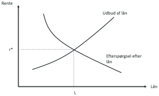
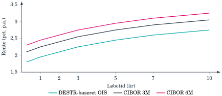

## Hvad koster det at vente med at bruge pengene? {#ch01-s001}

Renten forbinder forbrug i dag med forbrug senere.

- Købekraft og inflation.
- Nutidsværdi og rentekurve.
- Danske referencerenter og kontraktvilkår.

::: {.notes}
Lad de studerende tænke på en opsparing eller et lån. Samme rente er indtægt for långiver og udgift for låntager. Kapitlets værktøjer bruges på obligationer i kapitel 2 og på rentekurven i kapitel 3.
:::

## Et år uden cykel giver 100 kr. i rente {#ch01-s002}

En cykel koster 5.000 kr. i dag. Pengene kan i stedet stå et år til 2%.

$$5.000\cdot1{,}02=5.100\text{ kr.}$$

De 100 kr. kompenserer opspareren for at vente.

Låntager betaler for at kunne bruge købekraft tidligere.

::: {.notes}
Brug de to parter til at forklare, hvorfor renten er en pris på tid. Formlen beskriver saldoen i kroner. Købekraften afhænger også af cyklens pris om et år.
:::

## Kreditmarkedets ligevægtsrente {#ch01-s003}

{.chapter-figure}
Ved højere rente vil flere låne ud, mens færre vil låne. Skæringen bestemmer $r^*$ og lånemængden $L$.

::: {.notes}
Peg på rente på den lodrette akse og lån på den vandrette. Over ligevægten presser konkurrencen mellem långivere renten ned. Under ligevægten byder låntagere renten op. I kurset aflæser vi normalt renten direkte i markedet.
:::

## Saldo og købekraft kan bevæge sig forskelligt {#ch01-s004}

**Nominel rente $R$:** beløbets vækst i kroner.

**Realrente $r$:** købekraftens vækst.

**Forventet inflation $\pi$:** prisstigningen, der udhuler købekraften.

En høj nominel rente kan afspejle høj forventet inflation.

::: {.notes}
Når en placering vurderes på forhånd, beregnes realrenten med den forventede inflation.
:::

## Fisher-relationen binder renterne sammen {#ch01-s005}

$$1+R=(1+r)(1+\pi)$$

$$r=\frac{R-\pi}{1+\pi}$$

$$R=r+\pi+r\pi\approx r+\pi$$

Tilnærmelsen er god ved moderate rente- og inflationsniveauer.

::: {.notes}
Gang parenteserne ud for at vise krydsleddet. Tilnærmelsen udelader produktet af realrenten og inflationen. Brug satser som decimaltal i beregningen.
:::

## Positiv nominel rente kan give negativ realrente {#ch01-s006}

| Nominel rente | Inflation | Realrente, omtrent |
|---:|---:|---:|
| 0,30% | 3,00% | −2,70% |
| 0,10% | −0,05% | +0,15% |

Under inflationen i 2021–2022 kunne opsparere få negativ realrente trods positiv nominel rente.

Kurset regner overvejende nominelt, fordi kuponer og afdrag aftales i kroner.

::: {.notes}
Spørg, om en voksende saldo gør opspareren rigere. Historieeksemplet skal læses med sin dato, ikke som en beskrivelse af det aktuelle marked.
:::

## 110 kr. om et år kan være 100 kr. værd i dag {#ch01-s007}

Ved en årlig rente på 10% vokser 100 kr. til 110 kr.

Nutidsværdien af en betaling $A$ om $t$ år er

$$PV=\frac{A}{(1+r)^t}.$$

En højere rente mindsker værdien af en given fremtidig betaling.

::: {.notes}
Diskontering vender opskrivningen med rente om. r er her diskonteringsrenten, selv om r i Fisher-afsnittet betegnede realrenten. Betalingen og renten skal bygge på samme nominelle eller reale grundlag.
:::

## Diskonteringsfaktoren er betalingens omregningsfaktor {#ch01-s008}

$$d_t=\frac{1}{(1+r)^t},\qquad PV=A\cdot d_t$$

$$d_1=\frac1{1{,}10}=0{,}9091$$

$$110\cdot0{,}9091\approx100\text{ kr.}$$

Ved positiv rente er $0<d_t<1$. Vi bruger foreløbig samme $r$ på alle tidspunkter.

::: {.notes}
Renten er en sats, mens diskonteringsfaktoren er en pris pr. fremtidig krone. Senere får hvert tidspunkt sin egen rente fra kurven.
:::

## Den samme investering kan skifte fra rentabel til urentabel {#ch01-s009}

Investering i dag: 10 mio. kr. Betaling: 3 mio. kr. årligt i fire år.

$$NPV(r)=-10+\sum_{t=1}^{4}\frac3{(1+r)^t}$$

| Diskonteringsrente | Nettonutidsværdi |
|---:|---:|
| 5% | +0,64 mio. kr. |
| 9% | −0,28 mio. kr. |

Med uændrede betalinger giver et højere afkastkrav en lavere nettonutidsværdi.

::: {.notes}
Sammenlign nettonutidsværdierne, mens betalingerne holdes uændrede. Virksomheders faktiske betalinger kan også reagere på renter, men det sker ikke i dette eksempel.
:::

## En rente kræver en løbetid {#ch01-s010}

4% for hvilken periode: seks måneder, to år eller tredive år?

Rentekurven viser sammenhængen mellem rente og løbetid.

- Lange bindinger giver typisk højere rente og mere usikkerhed.
- Kurven kan også være flad eller invers.
- Et bankindskud med binding kan give mere end et frit indskud.

::: {.notes}
Sammenlign den korte og lange binding frem for blot satsen. Kapitlet introducerer begrebet, mens kapitel 3 forklarer kurvens form og konstruktion.
:::

## Nationalbanken forankrer de korte renter {#ch01-s011}

**Foliorenten:** rente på bankernes helt korte indskud i Nationalbanken.

**Udlånsrenten:** rente på bankernes kortfristede lån mod sikkerhed.

Nationalbanken påvirker likviditet og helt korte pengemarkedsrenter. Den lange ende af kurven dannes i markedet.

::: {.notes}
Skeln mellem bankernes forhold til Nationalbanken og kundernes bankkonti. De pengepolitiske renter påvirker markedet gennem bankernes finansiering og likviditet.
:::

## Fastkurspolitikken binder dansk pengepolitik {#ch01-s012}

Danmark har ført fastkurspolitik siden 1982, først mod D-marken og senere euroen.

- Korte danske renter følger euroområdets tæt, typisk med et mindre spænd.
- Stor efterspørgsel efter kroner kan føre til lavere dansk rente.
- Pres ud af kroner kan føre til højere dansk rente og støtteopkøb.

Målet er kronekursen. På langt sigt påvirkes realrente og lange renter af opsparing, investering og inflationsforventninger.

::: {.notes}
Historiske illustrationer: overvejende negative korte renter i 2012–2022 og renteforhøjelse relativt til euroområdet under uroen i foråret 2020. Den sidste situation omfattede også køb af kroner for valutareserven.
:::

## To historiske retninger for presset på kronen {#ch01-s013}

| Periode | Mekanisme |
|---|---|
| 2012–2022 | Euroområdets lave renter trak danske renter ned. Stor kroneefterspørgsel kunne kræve endnu lavere dansk rente. |
| Foråret 2020 | Investorer solgte danske aktiver og kroner. Nationalbanken hævede relativt til euroområdet og købte kroner. |

Samme mål: at holde kronens kurs stabil.

::: {.notes}
Begge eksempler skal stå med deres historiske dato. De viser, hvorfor dansk rente kan afvige lidt fra euroområdets.
:::

## En variabel rente følger en aftalt reference {#ch01-s014}

$$\text{Betalt rente}=\text{referencerente}+\text{tillæg}$$

**Referencerenten** leverer kontraktens bevægelige del.

**Fixing** er den offentliggjorte værdi på en bestemt dato.

**Rentetillægget** aftales i kontrakten eller ved auktion og ligger som udgangspunkt fast.

::: {.notes}
Kontrakten slipper for genforhandling, hver gang markedsrenten ændrer sig. Tillægget kompenserer for egenskaber og risici ud over selve referencen.
:::

## DESTR og CIBOR beskriver forskellige perioder {#ch01-s015}

| Reference | Finansiering og grundlag |
|---|---|
| DESTR | Faktiske usikrede indskud fra én bankdag til den næste. Nationalbanken beregner og offentliggør renten. |
| CIBOR 3M | Panelbankers rente for usikret udlån til en kreditværdig bank i tre måneder. |
| CIBOR 6M | Samme princip over seks måneder. |

CIBOR kan indeholde større løbetids-, kredit- og likviditetspræmier.

::: {.notes}
En længere periode giver en anden finansieringsrisiko. Derfor kan referencerne ikke udskiftes alene ved at bruge den seneste fixing.
:::

## Hvornår kendes periodens rente? {#ch01-s016}

**CIBOR:** en terminsrente fastsættes normalt før periodens begyndelse.

**DESTR:** daglige renter akkumuleres gennem perioden. Den endelige rente kendes først nær periodens afslutning.

Kontrakten skal angive, hvordan daglige renter samles til en betaling.

I bogens status for 2026 bruges CIBOR fortsat. En arbejdsgruppe undersøger en mulig overgang til transaktionsbaserede referencer.

::: {.notes}
Kilde til status: Danmarks Nationalbank, Working Group on CIBOR Transition, 2026. Beskriv mekanismerne uden at foregribe resultatet af arbejdet.
:::

## En rentesats bliver til en betaling {#ch01-s017}

$$CF_i^{\mathrm{rente}}=H(r_i^{\mathrm{ref}}+q)\Delta_i$$

| Symbol | Betydning |
|---|---|
| $H$ | Hovedstol i kroner |
| $r_i^{\mathrm{ref}}$ | Periodens årlige referencerente |
| $q$ | Aftalt årligt tillæg |
| $\Delta_i$ | Renteperiodens årsbrøk efter kontraktens dagtælling |

::: {.notes}
Indsæt rentesatser som decimaltal. Årsbrøken skalerer den årlige sats til den periode, som faktisk optjener rente.
:::

## 182 rentedage giver 15.166,67 kr. {#ch01-s018}

Hovedstol 1.000.000 kr., CIBOR 6M 2,50%, tillæg 0,50 procentpoint.

ACT/360 giver $\Delta_i=182/360$.

$$CF_i^{\mathrm{rente}}=1.000.000(0{,}025+0{,}005)\frac{182}{360}$$

$$=15.166{,}67\text{ kr.}$$

$\Delta_i$ er renteperiodens længde. $t_i$ er tiden fra værdiansættelsen til betalingen.

::: {.notes}
To perioder med samme antal kalenderdage kan få forskellige årsbrøker efter deres konvention. Betalingen fastlægges af renteperioden, mens nutidsværdien afhænger af betalingsdagen.
:::

## En fixing og et kurvepunkt har forskellige tidsangivelser {#ch01-s019}

**CIBOR 3M** angiver tre måneder pr. renteperiode.

**Étårspunktet på CIBOR 3M-kurven** sammenfatter prisfastsættelsen over det næste år med successive tremånedersperioder.

Punktet er hverken en officiel CIBOR 1Y-fixing eller én fremtidig CIBOR 3M-fixing.

::: {.notes}
I den følgende tabel angiver kolonnen referenceperioden, mens rækken angiver kurvepunktets horisont.
:::

## En daglig reference kan bære en lang kurve {#ch01-s020}

En renteswap bytter fast rente mod variabel rente.

I en **OIS** følger den variable betaling de akkumulerede daglige renter.

Priser på DESTR-baserede OIS-kontrakter giver kurvepunkter fra korte horisonter til fx 30 år.

Et langt kurvepunkt sammenfatter prisfastsættelsen over hele horisonten.

::: {.notes}
OIS står for Overnight Indexed Swap. Selv om den underliggende rente gælder én dag, kan aftalen udveksle betalinger over mange år.
:::

## Referencekurvens navn og punktets horisont {#ch01-s021}

Stiliserede årlige kurverenter. Kilde: bogens egen illustration.

| Horisont | DESTR-baseret | CIBOR 3M | CIBOR 6M |
|---|---:|---:|---:|
| 3 måneder | 1,80% | 2,10% | 2,30% |
| 6 måneder | 1,85% | 2,15% | 2,35% |
| 9 måneder | 1,90% | 2,20% | 2,40% |
| 1 år | 1,95% | 2,25% | 2,45% |

Tallene er antagne kurvepunkter, ikke officielle fixinger.

::: {.notes}
De 1,80% i øverste række gælder den årlige kurverente knyttet til hele tremånedersperioden. Det er ikke en forudsigelse af DESTR på en bestemt dag om tre måneder.
:::

## Både horisont og reference påvirker kurverenten {#ch01-s022}

{.chapter-figure}
Følg én kurve langs løbetiden. Sammenlign derefter kurver ved samme løbetid. Niveauer og afstande er illustrative.

::: {.notes}
Alle tre kurver stiger i dette eksempel. Rækkefølgen og de konstante afstande er ikke generelle regler. Markedets kurver afspejler også præmier og må ikke læses som sikre punktprognoser.
:::

## CITA er en reference for korte renteswaps {#ch01-s023}

CITA fastsættes for kommende perioder og bygger på DESTR-baserede OIS-kontrakter.

Fra 1. januar 2026 lægger DFBF ikke længere det tidligere faste spread til panelbankernes DESTR-OIS-tilbud.

CITA vender tilbage i vilkårene for floaters i kapitel 5.

Kilde: DFBF, *CITA Reformation* og benchmarkbeskrivelsen, som gengivet i final-bogen.

::: {.notes}
Hold CITA knyttet til swapmekanismen. Det er tilstrækkeligt at kunne genkende betegnelsen i kontraktvilkårene.
:::

## Kuponvilkår og diskontering løser hver sin opgave {#ch01-s024}

$$\mathrm{Kupon}_t=\mathrm{CIBOR\ 6M}_t+0{,}50\%$$

Referencerenten og tillægget bestemmer betalingen.

Diskonteringskurven bestemmer betalingens værdi i dag.

Tillæg på forskellige referencer kan ikke sammenlignes alene: samlet rente og kontraktvilkår skal med.

::: {.notes}
Ved refinansieringsauktioner byder investorer på tillægget. I kapitel 7 bruges DESTR-baseret OIS som prisningsgrundlag. Det er forskellige roller for renterne.
:::

## Pålydende rente beskriver kontrakten {#ch01-s025}

En 30-årig statsobligation med 5% kupon betaler 5 kr. om året pr. 100 kr. hovedstol.

Et banklån kan fx oplyse en nominel rente på 8,75%.

Den effektive rente samler købskurs, betalingstidspunkter og rente på rente i en årlig forrentning.

::: {.notes}
En kupon på fem procent siger endnu ikke, hvad investor forrenter sin faktiske investering med. Investor kan betale en anden pris end 100.
:::

## Halvårlig tilskrivning gør 6% til 6,09% {#ch01-s026}

Nominel årlig rente $r$, med $m$ tilskrivninger:

$$r_{\mathrm{eff}}=\left(1+\frac rm\right)^m-1$$

$$\left(1+\frac{0{,}06}{2}\right)^2-1=6{,}09\%$$

Første halvårs rente når selv at blive forrentet.

I lånedokumenter kaldes effektiv årlig rente også debitorrenten.

::: {.notes}
Tilskrivningsfrekvensen skal være kendt, før satser sammenlignes. Kapitlet bruger effektiv rente intuitivt. Kapitel 2 bestemmer den ud fra en hel obligations betalingsrække.
:::

## Tre renter med tre funktioner {#ch01-s027}

| Rente | Funktion | Videre i kurset |
|---|---|---|
| Kuponrente | Aftalte betalinger | Kapitel 2 |
| Reference + tillæg | Variable kuponer | Kapitel 5 |
| Diskonteringsrente og kurve | Priser og risikomål | Kapitel 2, 3, 6 og 7 |

Sammenlign altid renter på samme periode og tilskrivningsgrundlag.

::: {.notes}
Bed de studerende afgøre, om en oplyst rente beskriver kuponbetalinger, variable betalinger eller diskontering.
:::

## Opgaver: beregning og økonomisk forklaring {#ch01-s028}

Brug lommeregner eller Excel.

Skriv rentesatser som decimaltal i formlerne, og angiv enheder på resultaterne.

Begrund retningen af pris- og risikoændringer med betalingernes størrelse og tidspunkt.

::: {.notes}
Giv først tid til selvstændigt arbejde og derefter til sammenligning af fremgangsmåder. Bed de studerende koble hvert tal til den økonomiske mekanisme.
:::

## Opgave 1.1: spørgsmål {#ch01-s029}

Et bankindskud giver en nominel rente på 4,00%, og den forventede inflation er 2,50%.

**(a)** Beregn realrenten med den præcise Fisher-relation.

**(b)** Beregn realrenten med tilnærmelsen $r\approx R-\pi$.

::: {.notes}
Giv tid til beregning og begrundelse. Bed om eksplicitte enheder og relevante forudsætninger. Sammenlign fremgangsmåder i plenum.
:::

## Opgave 1.1: fortsat {#ch01-s030}

Et bankindskud giver en nominel rente på 4,00%, og den forventede inflation er 2,50%.

**(c)** Forklar, hvorfor forskellen mellem de to svar er lille her, men vokser ved høje rente- og inflationsniveauer.

::: {.notes}
Giv tid til beregning og begrundelse. Bed om eksplicitte enheder og relevante forudsætninger. Sammenlign fremgangsmåder i plenum.
:::

## Opgave 1.2: spørgsmål {#ch01-s031}

En betaling på 250.000 kr. falder om tre år, og den årlige diskonteringsrente er 5%.

**(a)** Beregn diskonteringsfaktoren $d_3$.

**(b)** Beregn betalingens nutidsværdi.

::: {.notes}
Giv tid til beregning og begrundelse. Bed om eksplicitte enheder og relevante forudsætninger. Sammenlign fremgangsmåder i plenum.
:::

## Opgave 1.2: fortsat {#ch01-s032}

En betaling på 250.000 kr. falder om tre år, og den årlige diskonteringsrente er 5%.

**(c)** Gentag beregningen ved en rente på 7%, og forklar forskellen økonomisk.

::: {.notes}
Giv tid til beregning og begrundelse. Bed om eksplicitte enheder og relevante forudsætninger. Sammenlign fremgangsmåder i plenum.
:::

## Opgave 1.3: udgangspunkt {#ch01-s033}

Et variabelt forrentet lån har en hovedstol på 2.000.000 kr. Renten for den kommende periode er CIBOR 3M plus et fast tillæg på 0,80 procentpoint. CIBOR-fixingen er 2,20%, og perioden er 91 dage efter ACT/360.

::: {.notes}
Læs forudsætningerne sammen. Hold styr på tidspunkter, enheder og hvilke størrelser opgaven lader ændre sig.
:::

## Opgave 1.3: spørgsmål {#ch01-s034}

Opgave 1.3: Fixing, tillæg og dagtælling

**(a)** Beregn den samlede årlige rentesats for perioden.

**(b)** Beregn rentebetalingen med kapitlets formel for rentebetalingen.

::: {.notes}
Giv tid til beregning og begrundelse. Bed om eksplicitte enheder og relevante forudsætninger. Sammenlign fremgangsmåder i plenum.
:::

## Opgave 1.3: fortsat {#ch01-s035}

Opgave 1.3: Fixing, tillæg og dagtælling

**(c)** Forklar, hvad der ændrer sig ved næste rentefastsættelse, og hvad der som udgangspunkt ligger fast.

**(d)** Forklar forskellen på periodens årsbrøk $\Delta_i$ og betalingstidspunktet $t_i$.

::: {.notes}
Giv tid til beregning og begrundelse. Bed om eksplicitte enheder og relevante forudsætninger. Sammenlign fremgangsmåder i plenum.
:::

## Opgave 1.4: udgangspunkt {#ch01-s036}

Tag stilling til hvert udsagn, og begrund svaret kort.

::: {.notes}
Læs forudsætningerne sammen. Hold styr på tidspunkter, enheder og hvilke størrelser opgaven lader ændre sig.
:::

## Opgave 1.4: spørgsmål {#ch01-s037}

Opgave 1.4: Fixing eller kurvepunkt?

**(a)** “CIBOR 3M” er en rente med tre års løbetid.

**(b)** Et étårigt punkt på en CIBOR 3M-kurve er det samme som en officiel CIBOR 1Y-fixing.

::: {.notes}
Giv tid til beregning og begrundelse. Bed om eksplicitte enheder og relevante forudsætninger. Sammenlign fremgangsmåder i plenum.
:::

## Opgave 1.4: fortsat {#ch01-s038}

Opgave 1.4: Fixing eller kurvepunkt?

**(c)** En DESTR-baseret kurve kan godt have et tiårigt punkt, selv om DESTR er en dag-til-dag-rente.

**(d)** Referencerenten i kuponvilkårene og diskonteringskurven har altid samme funktion.

::: {.notes}
Giv tid til beregning og begrundelse. Bed om eksplicitte enheder og relevante forudsætninger. Sammenlign fremgangsmåder i plenum.
:::

## Opgave 1.5: spørgsmål {#ch01-s039}

Et lån har en nominel årlig rente på 6% med halvårlig rentetilskrivning.

**(a)** Beregn renten pr. halvår.

**(b)** Beregn den effektive årlige rente.

::: {.notes}
Giv tid til beregning og begrundelse. Bed om eksplicitte enheder og relevante forudsætninger. Sammenlign fremgangsmåder i plenum.
:::

## Opgave 1.5: fortsat {#ch01-s040}

Et lån har en nominel årlig rente på 6% med halvårlig rentetilskrivning.

**(c)** Forklar, hvorfor lånets oplyste 6% ikke kan sammenlignes direkte med en rente på 6% med én årlig tilskrivning.

::: {.notes}
Giv tid til beregning og begrundelse. Bed om eksplicitte enheder og relevante forudsætninger. Sammenlign fremgangsmåder i plenum.
:::

