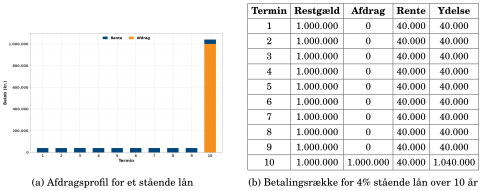
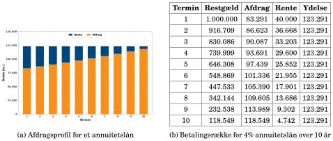
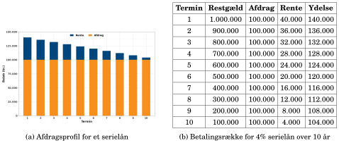
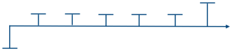
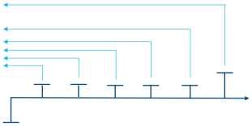
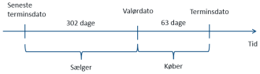
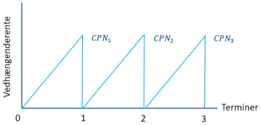
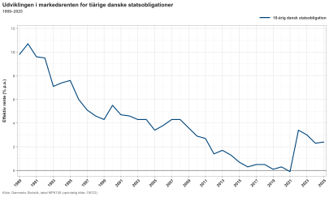
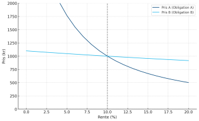
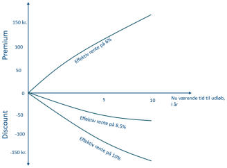

## Hvad køber en obligationsinvestor? {#ch02-s001}

Investor betaler i dag for en kontrakt om fremtidige renter og afdrag.

Vi arbejder med simple fastforrentede obligationer uden konverteringsret.

Kapitlet følger obligationsinvestoren fra betalingsprofil og nutidsværdi til handel og afkastets risiko.

::: {.notes}
En obligation er en betalingsrække. Variabel rente og konverteringsret kommer senere. Hold debitors betalinger og investors modtagne beløb sammen gennem kapitlet.
:::

## Afdragsprofilen bestemmer betalingernes timing {#ch02-s002}

| Profil | Hvad er konstant? |
|---|---|
| Stående lån | Hovedstolen indtil udløb |
| Annuitetslån | Ydelsen pr. termin |
| Serielån | Afdraget pr. termin |

Hovedstol er gælden. Kupon er rentebetalingen. Ydelse er rente plus afdrag.

Udsteder, valuta, løbetid, kupon, terminer og rettigheder beskriver resten af kontrakten.

::: {.notes}
Samme hovedstol og kupon kan give forskellige betalingsrækker. Timing påvirker både prisfølsomhed og muligheden for at genplacere betalingerne.
:::

## Et stående lån har én stor slutbetaling {#ch02-s003}

10 år, 4% årlig kupon og hovedstol 1.000.000 kr.

$$C=0{,}04\cdot1.000.000=40.000\text{ kr.}$$

- År 1–9: 40.000 kr. i rente.
- År 10: 40.000 kr. plus 1.000.000 kr.

Profilen bruges på mange statsobligationer og som funding bag rentetilpasningslån.

::: {.notes}
Debitor betaler renter løbende, men afdrager først ved udløb. Den store slutbetaling bliver senere central for varighed.
:::

## Stående lån: rente undervejs og hovedstol til sidst {#ch02-s004}

{.chapter-figure}
Følg restgælden i tabellen: den forbliver 1.000.000 kr. frem til sidste termin.

::: {.notes}
Begge paneler viser samme lån. Grafen giver mønstret, tabellen viser alle ti betalinger. Fremhæv den sidste ydelse på 1.040.000 kr.
:::

## Stående lån: betalingsrækken i kroner {#ch02-s005}

| Termin | Restgæld før betaling | Afdrag | Rente | Ydelse |
|---:|---:|---:|---:|---:|
| 1 | 1.000.000 | 0 | 40.000 | 40.000 |
| 2 | 1.000.000 | 0 | 40.000 | 40.000 |
| 3 | 1.000.000 | 0 | 40.000 | 40.000 |
| 4 | 1.000.000 | 0 | 40.000 | 40.000 |
| 5 | 1.000.000 | 0 | 40.000 | 40.000 |

10 år, hovedstol 1.000.000 kr. og 4% årlig rente.

::: {.notes}
Restgælden er 1.000.000 kr. i alle fem terminer, fordi låntager først afdrager i år 10. Hver betaling på 40.000 kr. er derfor rente.
:::

## Stående lån: betalingsrækken i kroner, fortsat {#ch02-s006}

| Termin | Restgæld før betaling | Afdrag | Rente | Ydelse |
|---:|---:|---:|---:|---:|
| 6 | 1.000.000 | 0 | 40.000 | 40.000 |
| 7 | 1.000.000 | 0 | 40.000 | 40.000 |
| 8 | 1.000.000 | 0 | 40.000 | 40.000 |
| 9 | 1.000.000 | 0 | 40.000 | 40.000 |
| 10 | 1.000.000 | 1.000.000 | 40.000 | 1.040.000 |

10 år, hovedstol 1.000.000 kr. og 4% årlig rente.

::: {.notes}
I år 10 betaler låntager 1.000.000 kr. i hovedstol og 40.000 kr. i rente. Derefter er restgælden nul.
:::

## Annuitetslånet har konstant ydelse {#ch02-s007}

Samme lån: 1.000.000 kr., 10 år og 4%.

Den årlige ydelse er **123.291 kr.**

Når restgælden falder, falder rentedelen. En større del af den faste ydelse bliver derfor afdrag.

Låntager får en stabil betaling over tid.

::: {.notes}
Annuitetsformlen er ikke hovedpointen her. Betalingssammensætningen ændres selv om ydelsen er stabil. Det forklarer profilens anvendelse i realkredit.
:::

## Annuitetslån: afdraget fylder mere år for år {#ch02-s008}

{.chapter-figure}
Sammenlign første og sidste termin: samme ydelse, men rente og afdrag bytter vægt. Beløb afrundet til hele kroner.

::: {.notes}
Investor modtager hovedstol tidligere end ved det stående lån. Det reducerer typisk renterisikoen, mens flere beløb skal genplaceres undervejs.
:::

## Annuitetslån: betalingsrækken i kroner {#ch02-s009}

| Termin | Restgæld før betaling | Afdrag | Rente | Ydelse |
|---:|---:|---:|---:|---:|
| 1 | 1.000.000 | 83.291 | 40.000 | 123.291 |
| 2 | 916.709 | 86.623 | 36.668 | 123.291 |
| 3 | 830.086 | 90.087 | 33.203 | 123.291 |
| 4 | 739.999 | 93.691 | 29.600 | 123.291 |
| 5 | 646.308 | 97.439 | 25.852 | 123.291 |

10 år, hovedstol 1.000.000 kr. og 4% årlig rente.

::: {.notes}
I annuitetslånets første fem terminer falder restgælden, mens ydelsen bliver på 123.291 kr. Rentedelen falder derfor, og afdraget vokser.
:::

## Annuitetslån: betalingsrækken i kroner, fortsat {#ch02-s010}

| Termin | Restgæld før betaling | Afdrag | Rente | Ydelse |
|---:|---:|---:|---:|---:|
| 6 | 548.869 | 101.336 | 21.955 | 123.291 |
| 7 | 447.533 | 105.390 | 17.901 | 123.291 |
| 8 | 342.144 | 109.605 | 13.686 | 123.291 |
| 9 | 232.538 | 113.989 | 9.302 | 123.291 |
| 10 | 118.549 | 118.549 | 4.742 | 123.291 |

10 år, hovedstol 1.000.000 kr. og 4% årlig rente.

::: {.notes}
I år 10 er restgælden før betaling og årets afdrag begge 118.549 kr. Den faste ydelse består næsten helt af afdrag.
:::

## Serielånet har konstant afdrag {#ch02-s011}

$$\text{Afdrag pr. år}=\frac{1.000.000}{10}=100.000\text{ kr.}$$

Rentebetalingen falder med restgælden.

Ydelsen falder derfor fra 140.000 kr. i år 1 til 104.000 kr. i år 10.

::: {.notes}
Konstante afdrag skal holdes adskilt fra annuitetens konstante ydelse. Spørg, hvilken profil der kræver mest likviditet tidligt.
:::

## Serielån: høj betaling i begyndelsen {#ch02-s012}

{.chapter-figure}
Se den jævne nedbringelse af restgælden og de faldende renter. Profilen kan passe til erhverv med ønske om hurtig gældsafvikling.

::: {.notes}
Høje tidlige ydelser gør serielån mindre udbredte blandt private boliglån. Sammenlign figuren med de to andre profiler uden at ændre hovedstol og kupon.
:::

## Serielån: betalingsrækken i kroner {#ch02-s013}

| Termin | Restgæld før betaling | Afdrag | Rente | Ydelse |
|---:|---:|---:|---:|---:|
| 1 | 1.000.000 | 100.000 | 40.000 | 140.000 |
| 2 | 900.000 | 100.000 | 36.000 | 136.000 |
| 3 | 800.000 | 100.000 | 32.000 | 132.000 |
| 4 | 700.000 | 100.000 | 28.000 | 128.000 |
| 5 | 600.000 | 100.000 | 24.000 | 124.000 |

10 år, hovedstol 1.000.000 kr. og 4% årlig rente.

::: {.notes}
Serielånet afdrager 100.000 kr. i hver af de første fem terminer. Renten falder med 4.000 kr. pr. år, fordi restgælden falder med 100.000 kr.
:::

## Serielån: betalingsrækken i kroner, fortsat {#ch02-s014}

| Termin | Restgæld før betaling | Afdrag | Rente | Ydelse |
|---:|---:|---:|---:|---:|
| 6 | 500.000 | 100.000 | 20.000 | 120.000 |
| 7 | 400.000 | 100.000 | 16.000 | 116.000 |
| 8 | 300.000 | 100.000 | 12.000 | 112.000 |
| 9 | 200.000 | 100.000 | 8.000 | 108.000 |
| 10 | 100.000 | 100.000 | 4.000 | 104.000 |

10 år, hovedstol 1.000.000 kr. og 4% årlig rente.

::: {.notes}
I de sidste fem terminer falder restgælden med 100.000 kr. pr. år og når nul i år 10. Ydelsen falder fra 120.000 til 104.000 kr.
:::

## Hver betaling har sit eget tidspunkt {#ch02-s015}

{.chapter-figure}
Hver lodret streg viser en betaling. Den samlede værdi kræver, at alle betalinger føres tilbage til samme dato.

::: {.notes}
En betaling om flere år kan ikke lægges sammen med en betaling i dag, før de er diskonteret til samme dato.
:::

## Nutidsværdi tager højde for tiden {#ch02-s016}

$$PV=\frac A{(1+r)^t},\qquad d_t=(1+r)^{-t}$$

Med nominel årlig rente $r$ og $m$ tilskrivninger:

$$d(t)=\left(1+\frac rm\right)^{-mt}$$

$A$ er betalingen, og $t$ er tiden i år. Ved 10% er 110 kr. om ét år 100 kr. værd i dag.

::: {.notes}
Den generelle formel kræver en nominel årlig sats med den anførte tilskrivning. I de følgende eksempler bruger vi normalt årlig effektiv rente.
:::

## Effektiv rente rammer den observerede pris {#ch02-s017}

$$P=\sum_{t=1}^{N}\frac{CF_t}{(1+y)^t}$$

$y$ er den ene effektive rente, som får nutidsværdien til at svare til markedsprisen $P$.

Betalinger $CF_t$ og pris skal have samme enhed.

Den effektive rente opsummerer hele betalingsrækken i ét tal.

::: {.notes}
Man kan enten kende renten og finde prisen eller kende prisen og løse for renten. Den samme rente bruges på alle betalinger i denne opsummering.
:::

## Én rente diskonterer hele betalingsrækken {#ch02-s018}

{.chapter-figure}
Diskonter hver betaling med samme $y$, og læg nutidsværdierne sammen. Summen skal ramme den betalte pris.

::: {.notes}
Den effektive rente er knyttet til denne obligations pris og profil. I næste kapitel får forskellige betalingstidspunkter hver sin nulkuponrente.
:::

## En kursliste forbinder kontrakt og markedspris {#ch02-s019}

Statsobligationer, 10. september 2024. Kilde: Vitec Scanrate.

| Obligation | ISIN | Kurs | Kupon |
|---|---|---:|---:|
| 0 STA GOV 2024 | DK0009819666 | 99,33 | 0,00% |
| 4,5 STA GOV 2039 | DK0009922320 | 127,80 | 4,50% |

Begge har én årlig termin. Cirkulerende mængde: henholdsvis 2.660 og 104.250 mio. kr.

::: {.notes}
Navnet fortæller kupon, udsteder og udløbsår. ISIN identificerer serien entydigt. Kursen er en pris pr. 100 nominel, mens cirkulerende mængde måler markedets størrelse.
:::

## Flere terminer ændrer rentens sammenligningsgrundlag {#ch02-s020}

$$r_{\mathrm{termin}}=\frac rm,\qquad r_{\mathrm{eff}}=\left(1+\frac rm\right)^m-1$$

4% nominel rente med fire terminer giver 1% pr. termin og 4,06% effektivt årligt.

4,5% kupon med to terminer giver 2,25% pr. termin.

Mange danske realkreditobligationer har termin 1/1, 1/4, 1/7 og 1/10.

::: {.notes}
En termin er selve betalingstidspunktet. Omregn til samme effektive årsrente før sammenligning. I lånedokumenter kaldes den effektive årlige rente ofte debitorrenten.
:::

## Kurs 127,80 er en pris pr. 100 nominel {#ch02-s021}

$$KV=H\frac K{100}$$

$$100.000\cdot\frac{127{,}80}{100}=127.800\text{ kr.}$$

Investor betaler mere end den hovedstol, der tilbagebetales ved udløb, fordi kuponen er høj relativt til markedsrenten.

::: {.notes}
Hovedstol og kursværdi er forskellige størrelser. KV betegner her kursværdi. Kapitel 7 bruger samme bogstaver om kronevarighed, så læs symbolerne i deres sammenhæng.
:::

## Valørdagen er afregningsdagen {#ch02-s022}

**Handelsdag:** parterne aftaler handlen.

**Valørdag:** obligationen og pengene udveksles.

Bogeksempel: handel tirsdag 10. september 2024, valør torsdag 12. september 2024.

Køber ejer obligationen fra valør. Det er denne dato, beregningerne tager udgangspunkt i.

::: {.notes}
Bogen bruger normalt to bankdages afvikling. Det historiske eksempel bevares med sine datoer. Undgå at tælle almindelige kalenderdage i stedet for bankdage til valør.
:::

## Sælger skal have sin del af næste kupon {#ch02-s023}

{.chapter-figure}
Køber får hele kuponen 15. november 2024. Vedhængende rente kompenserer sælger frem til valør 12. september.

Datoerne giver 64 dage frem til kupon; originalfiguren viser 63.

::: {.notes}
Køber har kun ejet obligationen i sidste del af perioden, men modtager hele kuponen. Kompensationen ved handel fordeler økonomisk kuponen mellem parterne.
:::

## Dagtællingen er en del af kontrakten {#ch02-s024}

$$v=\frac{rHD}{nDT}$$

$D$: dage fra seneste termin til valør. $DT$: dage i kuponperioden. $n$: terminer pr. år.

| Konvention | Årsbrøk |
|---|---|
| ACT/ACT | Faktiske dage i forhold til faktisk kuponperiode, med faktor $1/n$ |
| ACT/360 | Faktiske dage / 360 |
| 30/360 | 30 dage pr. måned og 360 pr. år |

::: {.notes}
r er årlig kuponrente og H hovedstol. ACT/ACT er bogens markedskonvention for danske stats- og realkreditobligationer. ACT/360 mødes i pengemarkedet. Danmark skiftede fra 30/360 i 2001, jf. Nationalbankens Central Government Borrowing and Debt 2000.
:::

## Danmark skiftede dagtælling i 2001 {#ch02-s025}

Danske stats- og realkreditobligationer følger i bogens markedskonvention ACT/ACT.

Danmark gik fra 30/360 til ACT/ACT i 2001.

30/360 forekommer fortsat i ældre materiale, andre kontrakter og stiliserede eksempler. Kontrakten afgør konventionen.

Kilde: Danmarks Nationalbank, *Central Government Borrowing and Debt 2000*.

::: {.notes}
En gammel beregningsmetode kan være korrekt for sin egen kontrakt, men give forkert afregning på en anden. Dagtælling skal fastlægges før beregningen.
:::

## Skudåret indgår i vedhængende rente {#ch02-s026}

Statsobligationen har 4,5% kupon og hovedstol 100.000 kr.

15. november 2023 til 12. september 2024: 302 dage.

Hele kuponperioden: 366 dage. Én årlig termin.

$$v=\frac{0{,}045\cdot100.000\cdot302}{366}=3.713{,}11\text{ kr.}$$

::: {.notes}
Brug faktiske dage i begge led. En standardnævner på 365 ville anvende en anden konvention og give et andet afregningsbeløb.
:::

## Clean og dirty price skal måles i samme enhed {#ch02-s027}

| | Kroner ved 100.000 nominel | Kurspoint |
|---|---:|---:|
| Clean | 127.800,00 | 127,800 |
| Vedhængende rente | 3.713,11 | 3,713 |
| Dirty | 131.513,11 | 131,513 |

$$\text{Dirty price}=\text{Clean price}+v$$

::: {.notes}
Samme handel er vist i kroner og pr. 100 nominel. Bland ikke kurs 127,80 med rente 3.713,11 kr. i den samme addition.
:::

## Vedhængende rente vokser mellem terminer {#ch02-s028}

{.chapter-figure}
Den optjente rente falder til nul, når kuponen betales. Markedet viser normalt clean price uden dette mekaniske savtaksmønster.

::: {.notes}
Faldet omkring terminen modsvares af den modtagne kupon. Et lavere dirty-tal efter termin giver derfor ikke i sig selv en billigere investering.
:::

## Prisligningen bruger dirty price fra valørdagen {#ch02-s029}

Før effektiv rente beregnes:

1. Læg vedhængende rente til clean price.
2. Mål tiden fra valør til hver betaling.
3. Brug samme enhed for pris og betalinger.

Mellem terminer er tiderne typisk brøkdele af terminer. På terminsdagen er vedhængende rente nul.

::: {.notes}
Denne praktiske kontrol bliver afgørende, når vi regner varighed mellem terminer. Clean price kan ikke uden videre sættes ind som P.
:::

## Nulkuponobligationen har én betaling {#ch02-s030}

$$P=\frac{FV}{(1+y)^N}$$

100 kr. om tre år ved 5%:

$$P=\frac{100}{1{,}05^3}=86{,}38$$

Pris 80 for 100 kr. om fire år:

$$y=\left(\frac{100}{80}\right)^{1/4}-1=5{,}74\%$$

::: {.notes}
N er løbetiden i år og FV udløbsbetalingen. Pris og rente bevæger sig modsat. Nulkuponrenter bliver byggesten i næste kapitel.
:::

## En nulkuponobligation kan koste over pari {#ch02-s031}

Ved positiv rente er prisen under udløbsbetalingen. Ved negativ rente kan prisen ligge over pari, som i Danmark omkring 2020.

Bogeksempel: 10 år, 1.000.000 kr. nominel, kurs 98.

$$980.000=\frac{1.000.000}{(1+y)^{10}}$$

$$y=(1.000.000/980.000)^{1/10}-1=0{,}2022\%$$

::: {.notes}
Hele afkastet kommer her fra forskellen mellem købspris og udløbsbetaling. En lav kursgevinst fordelt på ti år giver en meget lav årlig rente.
:::

## Kuponobligationens pris er to summer {#ch02-s032}

$$P=\sum_{t=1}^{N}\frac C{(1+y)^t}+\frac H{(1+y)^N}$$

For ens årlige kuponer kan samme pris skrives:

$$P=C\frac{1-(1+y)^{-N}}y+\frac H{(1+y)^N}$$

$C$: årlig kuponbetaling. $H$: hovedstol. $N$: antal år.

::: {.notes}
Første led er nutidsværdien af kuponerne, andet led hovedstolen. Annuitetsformen er blot en kort måde at skrive summen på. Effektiv rente findes normalt numerisk.
:::

## Kurs 98 løfter effektiv rente over kuponen {#ch02-s033}

10-årig obligation, 4% kupon, 1.000.000 kr. nominel.

$$980.000=\sum_{t=1}^{10}\frac{40.000}{(1+y)^t}+\frac{1.000.000}{(1+y)^{10}}$$

Numerisk løsning: $y\approx4{,}25\%$.

Investor får både kuponer og forskellen mellem 980.000 og 1.000.000 kr.

::: {.notes}
Det er et gennemregnet undervisningseksempel. Den afrundede rente på 4,25 procent bruges også i genplaceringsregningen.
:::

## Effektiv rente bliver kun afkast under bestemte vilkår {#ch02-s034}

Investor kan realisere et andet afkast, fordi:

- Kuponerne genplaceres til andre renter.
- Obligationen sælges før udløb til en anden kurs.

I eksemplet skal de årlige 40.000 kr. genplaceres til 4,25%, hvis afkastet skal følge den effektive rente.

::: {.notes}
Hold forudsætningen om de aftalte betalinger fast. Reinvesteringsrisiko kaldes også genplaceringsrisiko. Det er en anden mekanisme end kursrisiko ved salg.
:::

## Genplacerede kuponer får selv rente: år 1–5 {#ch02-s035}

Genplaceringsrente 4,25%, kupon 40.000 kr. pr. år.

| År | Ny betaling | Akkumuleret værdi |
|---:|---:|---:|
| 1 | 40.000 | 40.000 |
| 2 | 40.000 | 81.700 |
| 3 | 40.000 | 125.172 |
| 4 | 40.000 | 170.492 |
| 5 | 40.000 | 217.738 |

År 2: $40.000\cdot1{,}0425+40.000=81.700$ kr.

::: {.notes}
Hvert år forrentes den samlede opsparede kuponbeholdning, før årets nye kupon lægges til. Tallene er bogens afrundede kronebeløb.
:::

## I år 10 kommer hovedstolen oveni {#ch02-s036}

| År | Ny betaling | Akkumuleret værdi |
|---:|---:|---:|
| 6 | 40.000 | 266.992 |
| 7 | 40.000 | 318.339 |
| 8 | 40.000 | 371.868 |
| 9 | 40.000 | 427.673 |
| 10 | 1.040.000 | 1.485.849 |

Slutværdi: 1.000.000 kr. hovedstol + 400.000 kr. kuponer + 85.849 kr. rente på kuponer.

::: {.notes}
Tabellen bruger den afrundede effektive rente. Med den præcise rente svarer slutværdien præcist til købsprisen forrentet i ti år.
:::

## Store tidlige betalinger giver genplaceringsrisiko {#ch02-s037}

Lavere genplaceringsrente giver lavere slutværdi. Højere genplaceringsrente giver højere slutværdi.

Risikoen vokser med store løbende betalinger og lang tid til udløb.

Den er derfor særlig relevant ved høj kupon og løbende afdrag, fx annuitets- og serieobligationer.

::: {.notes}
En tidligt modtaget krone er mindre udsat for obligationskursen, men skal måske genplaceres i mange år. Det forbereder immunisering i kapitel 4.
:::

## Den faste betaling skal konkurrere med markedet {#ch02-s038}

Når nye sammenlignelige obligationer giver højere rente, må prisen på den gamle faste betalingsrække falde.

| Markedsrente mod kupon | Kurs |
|---|---|
| Højere | Under 100 |
| Omtrent ens | Omkring 100 |
| Lavere | Over 100 |

Ved udstedelsen sættes kuponen ofte tæt på markedsrenten, så kursen bliver nær 100.

::: {.notes}
Sammenlign obligationer med tilsvarende løbetid og risiko. I et likvidt marked er den effektive rente markedsrenten for den relevante type obligation.
:::

## Renteniveauet ændrer gamle obligationers værdi {#ch02-s039}

{.chapter-figure}
Tiårig dansk statsobligationsrente, 1989–2025, i % p.a. En fast kupon ændres ikke med markedsrenten.

Kilde: Danmarks Statistik, MPK100 (oprindeligt OECD), gengivet i final-bogen.

::: {.notes}
Aflæs den historiske tidsakse i figuren. De skiftende markedsrenter forklarer, hvorfor tidligere udstedte obligationer kan handle langt fra pari.
:::

## Discount og præmie indgår i den effektive rente {#ch02-s040}

| Kurs | Betegnelse | Ved indfrielse til pari |
|---|---|---|
| Under 100 | Discount | Kursgevinst, $y>$ kupon |
| Omkring 100 | Pari | $y\approx$ kupon |
| Over 100 | Præmie | Kurstab, $y<$ kupon |

I konverterbar realkredit kan debitor indfri til 100. Det gør præmiekurser særligt følsomme over for konvertering.

::: {.notes}
Tabellen gælder den simple faste betalingsrække med tilbagebetaling til pari og sammenlignelige rentekonventioner. Konverteringsretten behandles særskilt senere.
:::

## Samme kupon, men 30 år mod ét år {#ch02-s041}

| | Obligation A | Obligation B |
|---|---:|---:|
| Hovedstol | 1.000 kr. | 1.000 kr. |
| Kuponrente | 10% | 10% |
| Tid til udløb | 30 år | 1 år |

Betalinger langt ude i tiden påvirkes af diskonteringen i flere perioder.

Derfor har A større prisfølsomhed.

::: {.notes}
Denne sammenligning holder hovedstol og kupon fast. Løbetiden er variationen. Tal i den næste tabel er priser i kroner pr. 1.000 nominel.
:::

## Den lange obligation reagerer mest: renter 5–10% {#ch02-s042}

Priser i kroner pr. 1.000 kr. nominel.

| Effektiv rente | A, 30 år | B, 1 år |
|---:|---:|---:|
| 5% | 1.768,62 | 1.047,62 |
| 6% | 1.550,59 | 1.037,74 |
| 7% | 1.372,27 | 1.028,04 |
| 8% | 1.225,16 | 1.018,52 |
| 9% | 1.102,74 | 1.009,17 |
| 10% | 1.000,00 | 1.000,00 |

::: {.notes}
Tabellen reproducerer bogens tal. Beløbene er kronepriser, selv om bogens tabeloverskrift bruger kurs. Kurs pr. 100 fås ved at dividere med ti.
:::

## Den lange obligation reagerer mest: renter 11–15% {#ch02-s043}

Priser i kroner pr. 1.000 kr. nominel.

| Effektiv rente | A, 30 år | B, 1 år |
|---:|---:|---:|
| 11% | 913,06 | 990,99 |
| 12% | 838,90 | 982,14 |
| 13% | 775,13 | 973,45 |
| 14% | 719,89 | 964,91 |
| 15% | 671,70 | 956,52 |

Begge er under pari, når markedsrenten overstiger kuponen på 10%.

::: {.notes}
Sammenhold prisniveauerne med de foregående rækker. Følsomheden aftager, når renten stiger. Det er synligt som mindre absolutte prisfald mellem rækkerne.
:::

## Pris-rente-kurven har både hældning og krumning {#ch02-s044}

{.chapter-figure}
A har stejlere kurve end B. Begge kurver er krumme, så prisfølsomheden ændrer sig med renteniveauet.

::: {.notes}
Grafen viser samme sammenligning som tabellen. Følg én kurve og undersøg, om lige store vandrette skridt giver lige store lodrette ændringer.
:::

## Et rentefald giver større gevinst end et tilsvarende tab {#ch02-s045}

$$PV(CF_t)=\frac{CF_t}{(1+y)^t}$$

Ved høje renter er fjerne betalinger allerede kraftigt diskonteret. Yderligere stigninger tager derfor mindre værdi fra dem.

For A omkring 10% rente:

- Fald til 9%: prisgevinst 102,74 kr.
- Stigning til 11%: pristab 86,94 kr.

Varighed måler lokal hældning. Konveksitet måler krumning.

::: {.notes}
Beløbene gælder 1.000 kr. nominel. Ved faldende rente får de fjerne betalinger større vægt. Krumningen er derfor særlig tydelig for lange obligationer.
:::

## Tiden kan løfte prisen ved uændret rente {#ch02-s046}

Nulkuponobligation: 100 kr. ved udløb og rente 5%.

$$P_0=\frac{100}{1{,}05^{30}}=23{,}14$$

Fem år senere, stadig 5%:

$$P_5=\frac{100}{1{,}05^{25}}=29{,}53$$

Betalingen er kommet tættere på. Dette er pull-to-par.

::: {.notes}
Der er ingen renteændring i eksemplet. Udviklingen kommer alene fra kortere resterende løbetid. For en kuponobligation skrumper også præmie eller discount over tid ved uændret rente.
:::

## Præmie og discount skrumper mod udløb {#ch02-s047}

{.chapter-figure}
8% kupon ved markedsrenter på 6%, 8,5% og 10%. Hver kurve holder sin rente fast, mens tiden til udløb falder.

::: {.notes}
Adskil bevægelse langs én kurve over tid fra et spring mellem kurver ved en renteændring. Begge kan påvirke investorens afkast.
:::

## Næste skridt: hver betaling får sin egen rente {#ch02-s048}

Afdragsprofilen bestemmer betalingerne. Diskonteringen bestemmer prisen.

Dirty price er afregningsprisen. Effektiv rente opsummerer den i ét tal.

Det realiserede afkast afhænger også af genplacering og salgskurs.

Kapitel 3 erstatter én fælles diskonteringsrente med en rentekurve.

::: {.notes}
Bed de studerende forklare, hvorfor to obligationer med samme udløb kan have forskellige betalingsprofiler og dermed forskellig kursfølsomhed.
:::

## Opgaver: beregning og økonomisk forklaring {#ch02-s049}

Brug lommeregner eller Excel.

Skriv rentesatser som decimaltal i formlerne, og angiv enheder på resultaterne.

Begrund retningen af pris- og risikoændringer med betalingernes størrelse og tidspunkt.

::: {.notes}
Giv først tid til selvstændigt arbejde og derefter til sammenligning af fremgangsmåder. Bed de studerende koble hvert tal til den økonomiske mekanisme.
:::

## Opgave 2.1: udgangspunkt {#ch02-s050}

Et 4-årigt lån har hovedstol 2.000.000 kr., en årlig rente på 5% og én årlig termin.

::: {.notes}
Læs forudsætningerne sammen. Hold styr på tidspunkter, enheder og hvilke størrelser opgaven lader ændre sig.
:::

## Opgave 2.1: spørgsmål {#ch02-s051}

Opgave 2.1: Tre afdragsprofiler på det samme lån

**(a)** Lånet er et *annuitetslån*. Vis, at den faste årlige ydelse er 564.024 kr., og opstil betalingsrækken (restgæld, afdrag, rente, ydelse pr. termin).

**(b)** Lånet er i stedet et *serielån*. Opstil betalingsrækken.

::: {.notes}
Giv tid til beregning og begrundelse. Bed om eksplicitte enheder og relevante forudsætninger. Sammenlign fremgangsmåder i plenum.
:::

## Opgave 2.1: fortsat {#ch02-s052}

Opgave 2.1: Tre afdragsprofiler på det samme lån

**(c)** Lånet er i stedet et *stående lån*. Angiv ydelsen i hver af de fire terminer – her behøver du ingen tabel.

**(d)** Sammenlign de tre profiler: I hvilken rækkefølge får investor hovedstolen tilbage? Forklar med udgangspunkt i kapitlets begreber, hvorfor profilvalget har betydning for både prisfølsomhed og reinvesteringsrisiko, selv om hovedstol og rente er ens.

::: {.notes}
Giv tid til beregning og begrundelse. Bed om eksplicitte enheder og relevante forudsætninger. Sammenlign fremgangsmåder i plenum.
:::

## Opgave 2.2: udgangspunkt {#ch02-s053}

En 5-årig nulkuponobligation med hovedstol 100 handles til kurs 90,57.

::: {.notes}
Læs forudsætningerne sammen. Hold styr på tidspunkter, enheder og hvilke størrelser opgaven lader ændre sig.
:::

## Opgave 2.2: spørgsmål {#ch02-s054}

Opgave 2.2: Nulkuponobligation: pris, effektiv rente og kursværdi

**(a)** Beregn den effektive rente.

**(b)** En investor køber nominelt 250.000 kr. af obligationen. Beregn kursværdien. Hvorfor er der her ingen forskel på clean og dirty price?

::: {.notes}
Giv tid til beregning og begrundelse. Bed om eksplicitte enheder og relevante forudsætninger. Sammenlign fremgangsmåder i plenum.
:::

## Opgave 2.2: fortsat {#ch02-s055}

Opgave 2.2: Nulkuponobligation: pris, effektiv rente og kursværdi

**(c)** Markedsrenten for tilsvarende obligationer stiger nu til 3%. Beregn den nye kurs, og forklar retningen af kursændringen uden at henvise til formlen.

**(d)** Antag i stedet, at renten forbliver på niveauet fra (a). Beregn kursen, når der er 3 år til udløb, og forklar, hvilket fænomen fra kapitel 2 beregningen illustrerer.

::: {.notes}
Giv tid til beregning og begrundelse. Bed om eksplicitte enheder og relevante forudsætninger. Sammenlign fremgangsmåder i plenum.
:::

## Opgave 2.3: spørgsmål {#ch02-s056}

En 4-årig stående obligation med hovedstol 100 og 3% i årlig kupon handles til kurs 96,37.

**(a)** Opskriv den ligning, den effektive rente $y$ skal løse, og verificér ved indsættelse, at $y = 4{,}00\%$ opfylder den. (I Excel kan $y$ findes direkte med fx RATE- eller IRR-funktionen.)

**(b)** Forklar uden beregning, hvorfor den effektive rente må være *højere* end kuponrenten.

::: {.notes}
Giv tid til beregning og begrundelse. Bed om eksplicitte enheder og relevante forudsætninger. Sammenlign fremgangsmåder i plenum.
:::

## Opgave 2.3: fortsat {#ch02-s057}

En 4-årig stående obligation med hovedstol 100 og 3% i årlig kupon handles til kurs 96,37.

**(c)** En anden obligation er angivet med den samme rentesats, 4%, men som en *nominel årlig rente* med *fire* terminer om året. Beregn renten pr. termin og den effektive årlige rente (debitorrenten). Kan de to oplyste 4%-satser sammenlignes direkte? Begrund med reglen fra kapitel 1 og 2.

::: {.notes}
Giv tid til beregning og begrundelse. Bed om eksplicitte enheder og relevante forudsætninger. Sammenlign fremgangsmåder i plenum.
:::

## Opgave 2.4: udgangspunkt {#ch02-s058}

En dansk realkreditobligation har 2% i årlig kuponrente og *fire* terminer om året (1. januar, 1. april, 1. juli og 1. oktober). Du køber nominelt 1.000.000 kr. til clean kurs 98,45. På valørdagen er der gået $D = 50$ dage af den aktuelle terminsperiode, som har $DT = 90$ dage.

::: {.notes}
Læs forudsætningerne sammen. Hold styr på tidspunkter, enheder og hvilke størrelser opgaven lader ændre sig.
:::

## Opgave 2.4: spørgsmål {#ch02-s059}

Opgave 2.4: Handelscase: valør, vedhængende rente og afregning

**(a)** Forklar forskellen på handelsdag og valørdag, og hvorfor det er valørdagen, der indgår i beregningen af vedhængende rente.

**(b)** Beregn den vedhængende rente i kroner og i kurspoint.

::: {.notes}
Giv tid til beregning og begrundelse. Bed om eksplicitte enheder og relevante forudsætninger. Sammenlign fremgangsmåder i plenum.
:::

## Opgave 2.4: fortsat {#ch02-s060}

Opgave 2.4: Handelscase: valør, vedhængende rente og afregning

**(c)** Beregn kursværdien og det samlede afregningsbeløb. Hvad er dirty price?

**(d)** En medstuderende siger: *“Dirty price er højest lige før en termin, så dér er obligationen dyrest – man bør altid vente med at købe til lige efter terminen.”* Hvad er rigtigt, og hvad er forkert i udsagnet?

::: {.notes}
Giv tid til beregning og begrundelse. Bed om eksplicitte enheder og relevante forudsætninger. Sammenlign fremgangsmåder i plenum.
:::

## Opgave 2.5: udgangspunkt {#ch02-s061}

En 6-årig stående obligation har hovedstol 100 og 5% i årlig kupon.

::: {.notes}
Læs forudsætningerne sammen. Hold styr på tidspunkter, enheder og hvilke størrelser opgaven lader ændre sig.
:::

## Opgave 2.5: spørgsmål {#ch02-s062}

Opgave 2.5: Discount, pari, præmie og pull-to-par

**(a)** Beregn kursen ved en effektiv rente på henholdsvis 4%, 5% og 6%, og klassificér hvert tilfælde som discount, pari eller præmie.

**(b)** Formulér den generelle sammenhæng mellem kuponrente, effektiv rente og kurs, som (a) illustrerer – og forklar den økonomisk med, hvordan markedet reagerer på nye renteniveauer.

::: {.notes}
Giv tid til beregning og begrundelse. Bed om eksplicitte enheder og relevante forudsætninger. Sammenlign fremgangsmåder i plenum.
:::

## Opgave 2.5: fortsat {#ch02-s063}

Opgave 2.5: Discount, pari, præmie og pull-to-par

**(c)** Antag, at den effektive rente forbliver 6%. Beregn kursen, når der er 3 år til udløb. Hvad hedder fænomenet, og hvorfor opstår det?

**(d)** En investor konkluderer: *“Obligationen til kurs 95 er en bedre handel end den samme obligation til kurs 105 – man køber jo billigere ind.”* Diskutér udsagnet.

::: {.notes}
Giv tid til beregning og begrundelse. Bed om eksplicitte enheder og relevante forudsætninger. Sammenlign fremgangsmåder i plenum.
:::

## Opgave 2.6: udgangspunkt {#ch02-s064}

En investor køber nominelt 1.000.000 kr. af en 3-årig stående obligation med 6% i årlig kupon til kurs 100 (pari). Den effektive rente er derfor 6%. Investor holder obligationen til udløb og genplacerer alle kuponer.

::: {.notes}
Læs forudsætningerne sammen. Hold styr på tidspunkter, enheder og hvilke størrelser opgaven lader ændre sig.
:::

## Opgave 2.6: spørgsmål {#ch02-s065}

Opgave 2.6: Case: effektiv rente er ikke et garanteret afkast

**(a)** Beregn slutværdien efter 3 år, hvis kuponerne kan genplaceres til 6%, og vis, at den svarer til $1.000.000\cdot 1{,}06^{3}$.

**(b)** Umiddelbart efter købet falder genplaceringsrenten til 2% og bliver dér. Beregn den nye slutværdi.

::: {.notes}
Giv tid til beregning og begrundelse. Bed om eksplicitte enheder og relevante forudsætninger. Sammenlign fremgangsmåder i plenum.
:::

## Opgave 2.6: fortsat {#ch02-s066}

Opgave 2.6: Case: effektiv rente er ikke et garanteret afkast

**(c)** Beregn det realiserede årlige afkast i (b), og sammenlign med den effektive rente på købstidspunktet.

**(d)** Hvilke to forudsætninger skal være opfyldt, for at effektiv rente og realiseret afkast falder sammen? For hvilke obligationstyper fra kapitel 2 er reinvesteringsrisikoen størst?

::: {.notes}
Giv tid til beregning og begrundelse. Bed om eksplicitte enheder og relevante forudsætninger. Sammenlign fremgangsmåder i plenum.
:::

## Opgave 2.7: udgangspunkt {#ch02-s067}

To nulkuponobligationer har begge hovedstol 100 og en effektiv rente på 4%: obligation K har 2 år til udløb, obligation L har 20 år til udløb.

::: {.notes}
Læs forudsætningerne sammen. Hold styr på tidspunkter, enheder og hvilke størrelser opgaven lader ændre sig.
:::

## Opgave 2.7: spørgsmål {#ch02-s068}

Opgave 2.7: Kort mod lang -- og hvorfor kurverne er krumme (bro til kapitel 4)

**(a)** Beregn de to kurser ved $y = 4\%$, og derefter ved $y = 6\%$ og $y = 2\%$.

**(b)** Beregn de procentvise kursændringer ved rentestigningen (4% $\to$ 6%) og rentefaldet (4% $\to$ 2%) for begge obligationer. Hvorfor reagerer den lange obligation så meget kraftigere?

::: {.notes}
Giv tid til beregning og begrundelse. Bed om eksplicitte enheder og relevante forudsætninger. Sammenlign fremgangsmåder i plenum.
:::

## Opgave 2.7: fortsat {#ch02-s069}

Opgave 2.7: Kort mod lang -- og hvorfor kurverne er krumme (bro til kapitel 4)

**(c)** For obligation L: sammenlign gevinsten ved rentefaldet med tabet ved rentestigningen. Reaktionen er ikke symmetrisk – forklar hvorfor med udgangspunkt i diskonteringsleddet $CF_t/(1+y)^{t}$.

**(d)** Kapitel 4 indfører to mål, der sætter tal på henholdsvis kurvens hældning og dens krumning. Hvilke, og hvad fortæller de hver især?

::: {.notes}
Giv tid til beregning og begrundelse. Bed om eksplicitte enheder og relevante forudsætninger. Sammenlign fremgangsmåder i plenum.
:::

## Opgave 2.8: udgangspunkt {#ch02-s070}

Et udsnit af en kursliste viser:

| **Obligation** | **Kurs** | **Kupon** | **Terminer pr. år** |
|:---------------|:--------:|:---------:|:-------------------:|
| Obligation X   |  101,20  |   3,0%    |          1          |
| Obligation Y   |  99,10   |   3,0%    |          4          |

::: {.notes}
Læs forudsætningerne sammen. Hold styr på tidspunkter, enheder og hvilke størrelser opgaven lader ændre sig.
:::

## Opgave 2.8: spørgsmål {#ch02-s071}

Opgave 2.8: Kurslisteforståelse

**(a)** Hvad betaler Y pr. termin pr. 100 nominel?

**(b)** Hvilken obligation har en effektiv rente over sin kuponrente? Begrund uden beregning.

::: {.notes}
Giv tid til beregning og begrundelse. Bed om eksplicitte enheder og relevante forudsætninger. Sammenlign fremgangsmåder i plenum.
:::

## Opgave 2.8: fortsat {#ch02-s072}

Opgave 2.8: Kurslisteforståelse

**(c)** En investor køber nominelt 300.000 kr. af X. Beregn kursværdien. Er kursværdien det samme som afregningsbeløbet? Forklar.

::: {.notes}
Giv tid til beregning og begrundelse. Bed om eksplicitte enheder og relevante forudsætninger. Sammenlign fremgangsmåder i plenum.
:::

