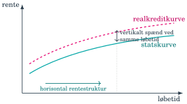
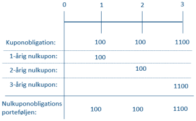
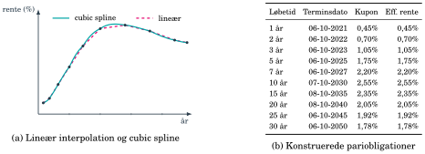
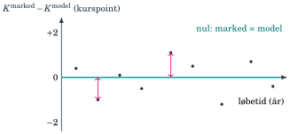
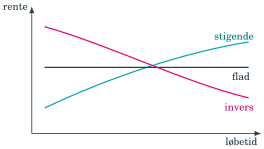
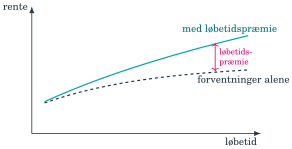
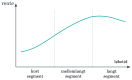
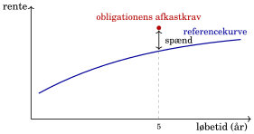

## Hvilken rente skal hver betaling diskonteres med? {#ch03-s001}

Den effektive rente samler en obligations pris i ét tal.

Rentekurven giver en rente for hver betalingshorisont.

Kapitlet går fra nulkuponrenter og bootstrapping til modelpriser og markedets referencekurver.

::: {.notes}
Hver betaling diskonteres med nulkuponrenten for sin betalingsdato. Senere bruges kurven til risikomål og realkreditmodeller.
:::

## Effektiv rente blander renteniveau og betalingsprofil {#ch03-s002}

En femårig nulkuponobligation og en femårig obligation med 2% kupon har samme slutdato.

Deres betalinger ligger forskelligt i tid, så deres effektive renter kan være forskellige på samme kurve.

Effektiv rente svarer kun til realiseret afkast ved hold til udløb og genplacering til samme rente.

::: {.notes}
Den effektive rente er nyttig, men kan ikke isolere kurvens rente ved en bestemt horisont. En forskel i effektiv rente er derfor ikke automatisk et rent risikotillæg.
:::

## Løbetidsforskel og spænd er to dimensioner {#ch03-s003}

{.chapter-figure}
Vandret: renter hen over løbetider for samme obligationstype. Lodret: forskelle mellem typer ved samme løbetid.

::: {.notes}
Eksemplerne er statsobligationer fra seks måneder til 30 år og forskellen mellem en 30-årig stats- og realkreditobligation. Begge dimensioner kræver en klar reference.
:::

## Nulkuponrenten hører til et betalingstidspunkt {#ch03-s004}

**Effektiv rente $y$:** samme rente for alle betalinger i én obligation, men forskellig fra obligation til obligation.

**Nulkuponrente $z_t$:** samme rente for sammenlignelige betalinger på tidspunkt $t$.

Nulkuponrenten kaldes også spotrenten: placeringen starter i dag og slutter på den pågældende termin.

::: {.notes}
Sammenlignelige betalinger skal have samme relevante risiko og prisningsgrundlag. Inden for den valgte kurve har én krone på samme dato én pris.
:::

## Samme betalinger skal have samme pris {#ch03-s005}

En treårig obligation med hovedstol 1.000 kr. og 10% kupon betaler:

| År 1 | År 2 | År 3 |
|---:|---:|---:|
| 100 kr. | 100 kr. | 1.100 kr. |

Tre nulkuponobligationer med netop disse udløbsbetalinger replikerer kontrakten.

Loven om én pris kræver samme samlede pris.

::: {.notes}
Hvis kuponobligationen var dyrere, kunne man sælge den og købe de tre nulkuponbetalinger. De fremtidige betalinger udligner hinanden, mens prisforskellen modtages i dag.
:::

## En kuponobligation kan skilles ad i nulkuponbetalinger {#ch03-s006}

{.chapter-figure}
Match hver kuponbetaling med en nulkuponobligation på samme dato. Sammenlign hele betalingsrækken, ikke kun slutdatoen.

::: {.notes}
Arbitrageargumentet bygger på et præcist match i beløb og tid. Det gør nulkuponpriser til fælles byggesten for obligationerne.
:::

## Bootstrapping finder kurven trin for trin {#ch03-s007}

| Løbetid | Kupon | Kurs | Effektiv rente |
|---|---:|---:|---:|
| 1 år | 5% | 100,96 | 4,00% |
| 2 år | 6% | 101,91 | 4,97% |
| 3 år | 7% | 102,92 | 5,91% |

Start med den korteste betaling. Diskontér derefter kendte tidlige betalinger og løs for den næste ukendte spotrente.

::: {.notes}
Alle lån er stående med årlige terminer og 100 nominel. Kurserne er afrundede, så de udledte spotrenter angives også afrundet.
:::

## Første spotrente kan findes direkte {#ch03-s008}

Den etårige obligation har én resterende betaling på 105.

$$100{,}96=\frac{105}{1+z_1}$$

$$z_1\approx4{,}00\%$$

Den første kuponobligation fungerer derfor som en enkelt nulkuponbetaling.

::: {.notes}
Udløbsbetalingen består af kupon 5 og hovedstol 100. Der er kun én ukendt diskonteringsrente.
:::

## Anden spotrente bruger den første {#ch03-s009}

Første kupon i den toårige obligation diskonteres med $z_1=4\%$.

$$101{,}91=\frac6{1{,}04}+\frac{106}{(1+z_2)^2}$$

$$z_2\approx5{,}00\%$$

Kun værdien af slutbetalingen er nu ukendt.

::: {.notes}
Flyt nutidsværdien af den første kupon over på venstre side. Resten er prisen på 106 om to år; samme trin bruges til næste ukendte spotrente.
:::

## Tredje spotrente bruger de to første {#ch03-s010}

$$102{,}92=\frac7{1{,}04}+\frac7{1{,}05^2}+\frac{107}{(1+z_3)^3}$$

$$z_3\approx6{,}00\%$$

| | 1 år | 2 år | 3 år |
|---|---:|---:|---:|
| Effektiv rente | 4,00% | 4,97% | 5,91% |
| Spotrente | 4,00% | 5,00% | 6,00% |

Effektive renter opsummerer profiler. Spotrenter priser de enkelte terminer.

::: {.notes}
Undgå at fremstille den effektive rente som et simpelt aritmetisk gennemsnit. Den er en samlet rente, der løser prisligningen.
:::

## Diskonteringsfaktoren er prisen på én fremtidig krone {#ch03-s011}

$$d_t=\frac1{(1+z_t)^t}$$

| Termin | Spotrente | Diskonteringsfaktor |
|---|---:|---:|
| 1 | 4% | 0,9615 |
| 2 | 5% | 0,9070 |
| 3 | 6% | 0,8396 |

En krone om tre år koster knap 84 øre i dag. Prisen findes som $\sum_t CF_t d_t$.

::: {.notes}
Diskonteringsfaktorer kaldes også DF i senere kapitler. Her falder de med løbetiden. Rentekurven betegner fremover nulkuponrentestrukturen.
:::

## Markedspriser giver punkter, interpolation giver mellemrum {#ch03-s012}

Egentlige nulkuponpapirer findes især i den korte ende, fx skatkammerbeviser under ét år.

Længere spotrenter udledes fra kuponobligationer eller swaps.

Interpolation forbinder punkterne til en sammenhængende kurve for betalinger mellem de observerede løbetider.

Kurven estimeres på ny, når dagens markedspriser ændres.

::: {.notes}
En faktisk tiårig nulkuponobligation er ikke nødvendig. Dens implicitte rente kan udledes fra længere kuponinstrumenter. Interpolationsmetodernes detaljer ligger uden for pensum.
:::

## Kurvens form mellem observationerne betyder noget {#ch03-s013}

{.chapter-figure}
Venstre: lineær interpolation og cubic spline. Højre: konstruerede pariobligationer med kupon lig effektiv rente.

::: {.notes}
Begge paneler bevares. Bogen efterspørger en glat kurve, fordi hak og ustabilitet kan skabe misvisende priser og arbitragesignaler. Datasamplet er konstrueret og er ikke aktuelle markedsdata.
:::

## Et konstrueret datasample: korte og mellemlange løbetider {#ch03-s014}

Pariobligationer i bogens illustration. Alle har kurs 100.

| Løbetid | Terminsdato | Kupon | Effektiv rente |
|---|---|---:|---:|
| 1 år | 06-10-2021 | 0,45% | 0,45% |
| 2 år | 06-10-2022 | 0,70% | 0,70% |
| 3 år | 06-10-2023 | 1,05% | 1,05% |
| 5 år | 06-10-2025 | 1,75% | 1,75% |
| 7 år | 06-10-2027 | 2,20% | 2,20% |

Tallene er konstruerede, ikke observationer fra en handelsdag.

::: {.notes}
Tabellen forstørrer højre panel i interpolationsfiguren. Lige kupon og effektiv rente giver pari under eksemplets betalings- og rentekonventioner.
:::

## Et konstrueret datasample: lange løbetider {#ch03-s015}

| Løbetid | Terminsdato | Kupon | Effektiv rente |
|---|---|---:|---:|
| 10 år | 07-10-2030 | 2,55% | 2,55% |
| 15 år | 08-10-2035 | 2,35% | 2,35% |
| 20 år | 08-10-2040 | 2,05% | 2,05% |
| 25 år | 06-10-2045 | 1,92% | 1,92% |
| 30 år | 06-10-2050 | 1,78% | 1,78% |

Kurvepunkterne dækker ikke alle betalingsdatoer. Interpolation udfylder mellemrummene.

::: {.notes}
Der er ingen ny markedsdataopdatering i dette eksempel. Renten topper i den mellemlange del af det konstruerede sample og falder derefter.
:::

## Den samme betaling under to kurver: år 1–4 {#ch03-s016}

4% kupon, 1.000 kr. hovedstol, otte års løbetid.

| År | Lav rente | Høj rente | CF, kr. | PV lav | PV høj |
|---:|---:|---:|---:|---:|---:|
| 1 | 1,5% | 4,0% | 40 | 39,4 | 38,5 |
| 2 | 1,8% | 4,5% | 40 | 38,6 | 36,6 |
| 3 | 2,1% | 5,0% | 40 | 37,6 | 34,6 |
| 4 | 2,4% | 5,5% | 40 | 36,4 | 32,3 |

Hver betaling diskonteres med renten for sin egen termin.

::: {.notes}
De to rentekurver er antagne scenarier. Hold kontraktens betalinger fast, når kurvernes effekt sammenlignes.
:::

## Den store slutbetaling gør kurvevalget mærkbart {#ch03-s017}

| År | Lav rente | Høj rente | CF, kr. | PV lav | PV høj |
|---:|---:|---:|---:|---:|---:|
| 5 | 2,7% | 6,0% | 40 | 35,0 | 29,9 |
| 6 | 3,0% | 6,5% | 40 | 33,5 | 27,4 |
| 7 | 3,3% | 7,0% | 40 | 31,9 | 24,9 |
| 8 | 3,6% | 7,5% | 1.040 | 783,7 | 583,1 |

Lav kurve: 1.036,06 kr., kurs 103,61.

Høj kurve: 807,28 kr., kurs 80,73.

::: {.notes}
Beregn totalerne på uafrundede nutidsværdier. Slutbetalingen tegner sig for størstedelen af prisforskellen mellem scenarierne.
:::

## Modelkurven og effektiv rente besvarer forskellige spørgsmål {#ch03-s018}

Teoretisk clean-kurs $K^*$ og vedhængende rente $v$:

$$K^*+v=\sum_{t=1}^{N}\frac{CF_t}{(1+z_t)^t}$$

Observeret clean-kurs $K$ og effektiv rente $y$:

$$K+v=\sum_{t=1}^{N}\frac{CF_t}{(1+y)^t}$$

Her måles betalinger og $v$ pr. 100 nominel. Tider regnes fra valør.

::: {.notes}
Den første ligning bruger en valgt kurve til at danne en modelpris. Den anden finder den effektive rente, som rammer markedets pris på den konkrete obligation, inklusive dens særlige egenskaber.
:::

## Billig eller dyr i forhold til hvilken kurve? {#ch03-s019}

$$NPV=K^*-K$$

- $NPV>0$: markedskursen er lavere end modellens kurs.
- $NPV<0$: markedskursen er højere end modellens kurs.

Ordene billig og dyr angiver her en sammenligning med den valgte kurve.

::: {.notes}
Forskellen er et relativt værdimål. Det kræver en vurdering af model, kredit, likviditet og øvrige præmier, før man kan konkludere noget om en handel.
:::

## Dansk statsobligation vurderet på swapkurven {#ch03-s020}

2,25% statsobligation DK0009924961, udløb 2035.

- Åbnings- og handelsdag: 5. februar 2025.
- Valør: 7. februar 2025.
- Årlig termin: 15. november.
- Diskontering på en estimeret swapbaseret nulkuponkurve.

Kilder: Vitec Scanrate og Danmarks Nationalbank, som gengivet i final-bogen.

::: {.notes}
Følg alle betalinger fra valørdagen, og træk derefter vedhængende rente fra dirty-værdien for at få clean-kursen.
:::

## Statsobligationens nutidsværdier: 2025–2030 {#ch03-s021}

Beløb pr. 100 nominel. Kurve og marked pr. 5. februar 2025.

| Termin 15/11 | Tid, år | CF | Spotrente | PV |
|---|---:|---:|---:|---:|
| 2025 | 0,77 | 2,25 | 2,24% | 2,212 |
| 2026 | 1,77 | 2,25 | 2,03% | 2,171 |
| 2027 | 2,77 | 2,25 | 2,04% | 2,128 |
| 2028 | 3,77 | 2,25 | 2,14% | 2,077 |
| 2029 | 4,77 | 2,25 | 2,25% | 2,023 |
| 2030 | 5,77 | 2,25 | 2,35% | 1,968 |

::: {.notes}
Tabellen følger bogens angivne afrundede tider og værdier. Den første kupon falder mindre end ét år efter valør, så eksponenten er en brøkdel.
:::

## Statsobligationens nutidsværdier: 2031–2035 {#ch03-s022}

| Termin 15/11 | Tid, år | CF | Spotrente | PV |
|---|---:|---:|---:|---:|
| 2031 | 6,77 | 2,25 | 2,44% | 1,911 |
| 2032 | 7,78 | 2,25 | 2,52% | 1,854 |
| 2033 | 8,78 | 2,25 | 2,60% | 1,796 |
| 2034 | 9,78 | 2,25 | 2,67% | 1,739 |
| 2035 | 10,78 | 102,25 | 2,72% | 76,564 |

Samlet teoretisk dirty-værdi: **96,44**.

Betalingstider måles fra valørdagen. Små tidsforskelle ændrer diskonteringen.

::: {.notes}
Den store hovedstol i 2035 fylder langt mest i prisen. Kurvens lange ende får derfor stor betydning for værdien.
:::

## Markedet betaler en præmie for statsobligationen {#ch03-s023}

$$v=2{,}25\frac{84}{365}=0{,}52$$

$$K^*=96{,}44-0{,}52=95{,}92$$

Markedets clean-kurs er 100,63, altså 4,71 kurspoint højere.

Gabet kan afspejle statspapirers sikkerhed, likviditet og regulatoriske egenskaber.

::: {.notes}
Et vedvarende gab er ikke automatisk fejlpris eller arbitrage. Statsobligationer kan handle med lavere rente end swapkurven. I kapitel 7 udtrykkes model-marked-gabet som et spænd, OAS.
:::

## Under modelkurven betyder billig i prisrummet {#ch03-s024}

{.chapter-figure}
Trekanter under den teoretiske kurslinje har lavere markedskurs. I renterummet vender sammenligningen om: lav pris giver høj effektiv rente.

::: {.notes}
Forklar, hvorfor retningen vender mellem pris og rente. Mindre afvigelser kan skyldes handelsstøj, likviditet og begrænsninger i modellen.
:::

## Rentekurven kan stige, være flad eller falde {#ch03-s025}

{.chapter-figure}
Ved en invers kurve ligger korte renter over lange. Formen kan afspejle forventninger om rentefald og svagere aktivitet.

::: {.notes}
En invers kurve er et muligt signal, ikke en sikker prognose. De følgende forklaringer kan virke samtidig.
:::

## Forventninger til korte renter påvirker lange renter {#ch03-s026}

Forventningshypotesen forbinder lange renter med forventede fremtidige korte renter.

Forventet stærkere efterspørgsel og inflation kan løfte forventede nominelle renter og gøre kurven stigende.

Forventede rentefald kan give en invers kurve.

::: {.notes}
Knyt den nominelle renteforventning til Fisher-relationen. Kurven er stadig markedspriser, og forventninger er kun én del af forklaringen.
:::

## Længere binding kan kræve en løbetidspræmie {#ch03-s027}

{.chapter-figure}
Afstanden mellem kurverne viser præmien ud over forventningerne. I illustrationen vokser præmien med løbetiden.

::: {.notes}
Lange obligationer er mere rentefølsomme. En investor kan derfor kræve kompensation for at bære risikoen. Figuren er stiliseret.
:::

## Investorernes behov kan forme bestemte segmenter {#ch03-s028}

{.chapter-figure}
Banker efterspørger typisk kort likviditet. Pension og forsikring kan efterspørge lange betalinger, der matcher deres forpligtelser.

::: {.notes}
I det viste lange segment dæmper efterspørgsel og likviditet den ekstra rente. Segmentering gør det muligt, at dele af kurven flytter sig forskelligt.
:::

## Flere mekanismer kan flytte kurven samtidig {#ch03-s029}

| Mekanisme | Hvad kan ændres? |
|---|---|
| Forventninger | Fremtidige korte renter |
| Løbetidspræmie | Kompensation for lang renterisiko |
| Segmentering | Udbud og efterspørgsel ved bestemte løbetider |

Derfor er et parallelt skift kun én mulig kurvebevægelse.

::: {.notes}
Et samlet varighedstal viser ikke nødvendigvis, om renterisikoen ligger i den korte eller lange ende. Kapitel 4 fordeler risikoen på kurven.
:::

## Statskurven har få punkter og særlige præmier {#ch03-s030}

Statskurven udledes af statsobligationer og er tæt på risikofri.

Det danske marked har relativt få serier og dermed få kurvepunkter.

Sikkerheds- og likviditetspræmier kan gøre statsrenter til en særlig målestok, som andre obligationer ikke følger direkte.

::: {.notes}
Knyt begrænsningen til gabet på 4,71 kurspoint. Et sikkert instrument er ikke nødvendigvis den mest komplette fælles reference for alle markedets priser.
:::

## Swapmarkedet giver mange løbetider hver dag {#ch03-s031}

En renteswap bytter fast rente mod variabel rente.

DESTR-baserede OIS-swaps bruger akkumulerede daglige renter på det variable ben.

Likvide swappriser over mange løbetider giver grundlag for en glat nulkuponkurve med færre særheder fra enkelte obligationsserier.

::: {.notes}
Den faste rente i en parswap kan behandles som kuponen på en obligation til kurs 100. Kendte korte diskonteringsfaktorer bruges til at finde den næste, som i bootstrapping.
:::

## Swapkurven bliver kursets prisningsgrundlag {#ch03-s032}

Parswapens faste ben kan opfattes som en kuponobligation til kurs 100.

Bootstrapping udleder de swapbaserede nulkuponrenter.

- Kapitel 6 kalibrerer rentemodellen til den initielle kurve.
- Kapitel 7 bruger $z_t^{\mathrm{swap}}$ og lægger OAS ovenpå.

::: {.notes}
Swaprenter og swapbaserede nulkuponrenter er forskellige størrelser. Det er den udledte nulkuponkurve, der diskonterer de enkelte betalinger.
:::

## Et spænd kræver en referencekurve {#ch03-s033}

$$\text{Afkastkrav}\approx\text{referencekurve}+\text{spænd}$$

1 basispunkt = 0,01 procentpoint. Et spænd på 20 bp betyder 0,20 procentpoint over en bestemt målestok.

Spændet kan afspejle kredit, likviditet, regulering, konverteringsret og udbud eller efterspørgsel.

::: {.notes}
Spændets fortolkning afhænger af, hvad referencekurven allerede indeholder. Angiv altid kurven sammen med tallet.
:::

## Spændet er en afstand over den valgte kurve {#ch03-s034}

{.chapter-figure}
Ved samme løbetid sammenlignes obligationens afkastkrav med referencekurven. Afstanden kan ændre sig, når markedskursen flytter sig.

::: {.notes}
Figuren vender tilbage til den vertikale dimension fra kapitlets begyndelse. Et fast kontrakttillæg er noget andet end en observeret markedsafstand.
:::

## Målestokken afhænger af produktet {#ch03-s035}

| Reference | Typisk rolle i kurset |
|---|---|
| Statskurve | Sammenligning af sikre obligationer |
| DESTR-baseret OIS-/swapkurve | Prisfastsættelse, risiko og kapitel 7 |
| RTL-/flekskurve | Sammenligning af danske realkreditprodukter |
| CIBOR 3M/6M | Kuponreference i variabelt forrentede produkter |

::: {.notes}
CIBOR-kolonnen handler her om de korte pengemarkedsreferencer. En kurve af instrumenter knyttet til dem kan have mange horisonter, som i kapitel 1.
:::

## Tillæg er et kontraktvilkår, spænd er et markedsmål {#ch03-s036}

$$\text{Kupon}=\mathrm{CIBOR\ 6M}+q$$

$q$ er det faste tillæg i kuponformlen.

Spændet viser det aktuelle afkastkrav relativt til en valgt kurve og kan ændres med kursen.

Et attraktivt tillæg skal vurderes mod investorens øvrige placeringsmuligheder.

::: {.notes}
Tillæg og spænd kan have samme tal i et enkelt stiliseret tilfælde uden at være samme begreb. Kurs, afdrag og referencens niveau påvirker sammenhængen.
:::

## Et ønsket spænd skal oversættes til kuponvilkår {#ch03-s037}

1. Vælg relevant referencekurve.
2. Fastlæg ønsket kompensation som spænd.
3. Find det rentetillæg, der giver den kompensation i kontrakten.

Oversættelsen afhænger bl.a. af fixing-reference, afdrag, auktionskurs og rentekonventioner.

De konkrete korrektioner ligger uden for dette kapitels pensum.

::: {.notes}
Denne rækkefølge forklarer, hvordan investorer tænker, når de kræver et tillæg ved en floaterauktion. Tilføj ikke en ny spreadformel, som bogen ikke har indført.
:::

## Rentekurven forbinder værdi og risiko {#ch03-s038}

Spotrenter og diskonteringsfaktorer priser betalinger på deres egne tidspunkter.

Gabet til markedskursen skal forstås i forhold til den valgte reference og dens præmier.

Når kurven flytter sig, ændres priserne. Næste kapitel måler både den samlede renterisiko og dens placering på kurven.

::: {.notes}
Spørg, hvilken nulkuponrente der priser en betaling på dens betalingsdato, hvad effektiv rente opsummerer for en obligationspris, og hvilken reference et spænd måles mod.
:::

## Opgaver: beregning og økonomisk forklaring {#ch03-s039}

Brug lommeregner eller Excel.

Skriv rentesatser som decimaltal i formlerne, og angiv enheder på resultaterne.

Begrund retningen af pris- og risikoændringer med betalingernes størrelse og tidspunkt.

::: {.notes}
Giv først tid til selvstændigt arbejde og derefter til sammenligning af fremgangsmåder. Bed de studerende koble hvert tal til den økonomiske mekanisme.
:::

## Opgave 3.1: udgangspunkt {#ch03-s040}

Nulkuponrenterne er $z_1 = 1{,}0\%$ og $z_2 = 3{,}0\%$. Betragt to 2-årige stående obligationer med hovedstol 100: en nulkuponobligation og en kuponobligation med 8% i årlig kupon.

::: {.notes}
Læs forudsætningerne sammen. Hold styr på tidspunkter, enheder og hvilke størrelser opgaven lader ændre sig.
:::

## Opgave 3.1: spørgsmål {#ch03-s041}

Opgave 3.1: Samme løbetid, forskellig effektiv rente

**(a)** Beregn den teoretiske kurs på begge obligationer ud fra nulkuponkurven.

**(b)** Angiv nulkuponobligationens effektive rente, og verificér ved indsættelse, at kuponobligationens effektive rente er ca. 2,93%.

::: {.notes}
Giv tid til beregning og begrundelse. Bed om eksplicitte enheder og relevante forudsætninger. Sammenlign fremgangsmåder i plenum.
:::

## Opgave 3.1: fortsat {#ch03-s042}

Opgave 3.1: Samme løbetid, forskellig effektiv rente

**(c)** De to obligationer har samme løbetid, men forskellige effektive renter. Forklar hvorfor, og forklar i forlængelse heraf, hvorfor nulkuponrenten, ikke den effektive rente, er kurvens “byggesten”.

**(d)** Er sammenligningen i denne opgave et rent eksempel på den *horisontale* rentestruktur, den *vertikale* rentestruktur eller ingen af delene? Begrund svaret, og giv et eksempel på hver af de to dimensioner.

::: {.notes}
Giv tid til beregning og begrundelse. Bed om eksplicitte enheder og relevante forudsætninger. Sammenlign fremgangsmåder i plenum.
:::

## Opgave 3.2: udgangspunkt {#ch03-s043}

Du observerer følgende marked med årlige terminer og hovedstol 100:

| **Obligation**             | **Løbetid** | **Kupon** | **Kurs** |
|:---------------------------|:-----------:|:---------:|:--------:|
| Skatkammerbevis (nulkupon) |    1 år     |    0%     |  98,04   |
| Kuponobligation A          |    2 år     |    3%     |  100,03  |
| Kuponobligation B          |    3 år     |    4%     |  100,15  |

::: {.notes}
Læs forudsætningerne sammen. Hold styr på tidspunkter, enheder og hvilke størrelser opgaven lader ændre sig.
:::

## Opgave 3.2: spørgsmål {#ch03-s044}

Opgave 3.2: Bootstrapping med en nulkupon som startpunkt

**(a)** Udled nulkuponrenterne $z_1$, $z_2$ og $z_3$ med bootstrap-metoden. Forklar undervejs, hvorfor metoden er tilladt, og hvilken økonomisk lov den hviler på.

**(b)** Beregn diskonteringsfaktorerne $d_1$, $d_2$ og $d_3$, og giv den konkrete fortolkning af $d_2$.

::: {.notes}
Giv tid til beregning og begrundelse. Bed om eksplicitte enheder og relevante forudsætninger. Sammenlign fremgangsmåder i plenum.
:::

## Opgave 3.2: fortsat {#ch03-s045}

Opgave 3.2: Bootstrapping med en nulkupon som startpunkt

**(c)** Brug diskonteringsfaktorerne til at prisfastsætte en 3-årig stående obligation med 2% kupon.

**(d)** Hvordan ville du i praksis skaffe kurvepunkter for løbetider, hvor der ikke findes en nulkuponobligation, fx 10 år? Og hvorfor skal punkterne bagefter forbindes til en *glat* kurve?

::: {.notes}
Giv tid til beregning og begrundelse. Bed om eksplicitte enheder og relevante forudsætninger. Sammenlign fremgangsmåder i plenum.
:::

## Opgave 3.3: udgangspunkt {#ch03-s046}

En swapbaseret nulkuponkurve er estimeret til:

| **Løbetid (år)**  |  1   |  2   |  3   |  4   |
|:-----------------:|:----:|:----:|:----:|:----:|
| **Nulkuponrente** | 2,0% | 2,4% | 2,8% | 3,0% |

En 4-årig stående obligation med 3% i årlig kupon og hovedstol 100 handles til markedskursen $K = 99{,}20$ (ingen vedhængende rente).

::: {.notes}
Læs forudsætningerne sammen. Hold styr på tidspunkter, enheder og hvilke størrelser opgaven lader ændre sig.
:::

## Opgave 3.3: spørgsmål {#ch03-s047}

Opgave 3.3: Teoretisk kurs på swapkurven

**(a)** Beregn de fire diskonteringsfaktorer og obligationens teoretiske kurs $K^{*}$.

**(b)** Beregn nettonutidsværdien $K^{*}-K$. Handles obligationen billigt eller dyrt relativt til kurven?

::: {.notes}
Giv tid til beregning og begrundelse. Bed om eksplicitte enheder og relevante forudsætninger. Sammenlign fremgangsmåder i plenum.
:::

## Opgave 3.3: fortsat {#ch03-s048}

Opgave 3.3: Teoretisk kurs på swapkurven

**(c)** Er obligationen dermed et sikkert godt køb? Diskutér, hvad gabet kan afspejle, og hvordan kapitel 7 systematiserer netop denne tanke.

**(d)** I kapitlets statsobligationseksempel havde gabet det modsatte fortegn: markedskursen lå *over* den teoretiske kurs på swapkurven. Hvad fortæller det om statsobligationer, og hvorfor foretrækker professionelle alligevel swapkurven som prisningsfundament?

::: {.notes}
Giv tid til beregning og begrundelse. Bed om eksplicitte enheder og relevante forudsætninger. Sammenlign fremgangsmåder i plenum.
:::

## Opgave 3.4: udgangspunkt {#ch03-s049}

En morgen observeres følgende: den danske rentekurve er *invers* i den korte ende (renterne falder fra 3,8% ved 3 måneder til 3,0% ved 2 år) og derefter *svagt stigende* ud til 30 år (op til 3,4%).

::: {.notes}
Læs forudsætningerne sammen. Hold styr på tidspunkter, enheder og hvilke størrelser opgaven lader ændre sig.
:::

## Opgave 3.4: spørgsmål {#ch03-s050}

Opgave 3.4: Rentekurvens form: mere end én mekanisme

**(a)** Forklar den inverse korte ende med forventningshypotesen. Hvad fortæller kurven om markedets syn på pengepolitikken og konjunktursituationen?

**(b)** Forklar den stigende lange ende med løbetidspræferencehypotesen. Hvorfor kræver investorer normalt en præmie for lange obligationer? (Vink: tænk på, hvad kapitel 4 formaliserer.)

::: {.notes}
Giv tid til beregning og begrundelse. Bed om eksplicitte enheder og relevante forudsætninger. Sammenlign fremgangsmåder i plenum.
:::

## Opgave 3.4: fortsat {#ch03-s051}

Opgave 3.4: Rentekurvens form: mere end én mekanisme

**(c)** En pensionskasse-reform øger pludselig efterspørgslen efter obligationer med 20–30 års løbetid markant. Hvilken hypotese beskriver effekten på kurven, og hvad sker der med den lange ende?

**(d)** Kan de tre forklaringer i (a)–(c) være sande samtidig? Hvad betyder svaret for antagelsen om, at rentekurven flytter sig parallelt?

::: {.notes}
Giv tid til beregning og begrundelse. Bed om eksplicitte enheder og relevante forudsætninger. Sammenlign fremgangsmåder i plenum.
:::

## Opgave 3.5: udgangspunkt {#ch03-s052}

En dansk variabelt forrentet obligation (floater) betaler kuponen

$$
\text{Kupon} = \text{CIBOR 6M} + 45 \text{ basispunkter}
$$

og handles aktuelt til kurs 99,50. En analytiker skriver i et notat: *“Obligationens spænd er 45 basispunkter, og det ligger fast i hele løbetiden.”*

::: {.notes}
Læs forudsætningerne sammen. Hold styr på tidspunkter, enheder og hvilke størrelser opgaven lader ændre sig.
:::

## Opgave 3.5: spørgsmål {#ch03-s053}

Opgave 3.5: Find fejlen: spænd eller tillæg?

**(a)** Hvor mange procentpoint er 45 basispunkter?

**(b)** Identificér fejlen i notatet: hvad er forskellen på et *rentetillæg* og et *spænd*?

::: {.notes}
Giv tid til beregning og begrundelse. Bed om eksplicitte enheder og relevante forudsætninger. Sammenlign fremgangsmåder i plenum.
:::

## Opgave 3.5: fortsat {#ch03-s054}

Opgave 3.5: Find fejlen: spænd eller tillæg?

**(c)** Antag i dette spørgsmål, at CIBOR 6M er den relevante reference, og se bort fra forskelle i rente- og diskonteringskonventioner. Kursen ligger under 100. Ligger obligationens faktiske spænd da over eller under de 45 basispunkter? Forklar intuitionen. En præcis beregning kræves ikke.

**(d)** Beskriv den rækkefølge, en professionel udsteder eller investor typisk arbejder i, når et rentetillæg skal fastlægges ved en udstedelse.

::: {.notes}
Giv tid til beregning og begrundelse. Bed om eksplicitte enheder og relevante forudsætninger. Sammenlign fremgangsmåder i plenum.
:::

## Opgave 3.6: udgangspunkt {#ch03-s055}

Nulkuponrenterne er $z_1 = 1\%$, $z_2 = 2\%$ og $z_3 = 3\%$. Betragt to positioner:

- **Position A**: en 2-årig nulkuponobligation med hovedstol 104,04.

- **Position B**: en 1-årig nulkuponobligation med hovedstol 50,50 *og* en 3-årig nulkuponobligation med hovedstol 54,64.

::: {.notes}
Læs forudsætningerne sammen. Hold styr på tidspunkter, enheder og hvilke størrelser opgaven lader ændre sig.
:::

## Opgave 3.6: spørgsmål {#ch03-s056}

Opgave 3.6: Bro til kapitel 4: når kurven ikke flytter sig parallelt

**(a)** Vis, at begge positioner har en nutidsværdi på 100,00 (afrundet).

**(b)** Beregn for hver position den gennemsnitlige betalingstid, hvor betalingerne vægtes med deres nutidsværdier. Hvad bemærker du?

::: {.notes}
Giv tid til beregning og begrundelse. Bed om eksplicitte enheder og relevante forudsætninger. Sammenlign fremgangsmåder i plenum.
:::

## Opgave 3.6: fortsat {#ch03-s057}

Opgave 3.6: Bro til kapitel 4: når kurven ikke flytter sig parallelt

**(c)** Kurven bliver nu stejlere: $z_3$ stiger til 4%, mens $z_1$ og $z_2$ er uændrede. Beregn værditabet for hver position.

**(d)** Beregn til sammenligning værditabet for begge positioner ved et *parallelt* skift på $+1$ procentpoint. Hvad viser (c) og (d) tilsammen om at sammenfatte renterisiko i ét tal, og hvad har kapitel 4 derfor brug for?

::: {.notes}
Giv tid til beregning og begrundelse. Bed om eksplicitte enheder og relevante forudsætninger. Sammenlign fremgangsmåder i plenum.
:::

