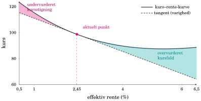
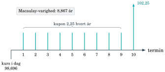
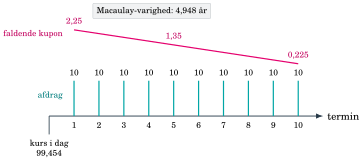
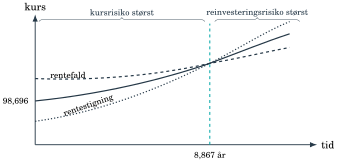
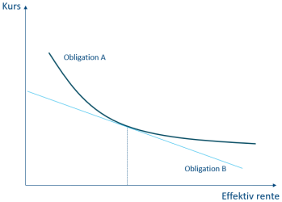
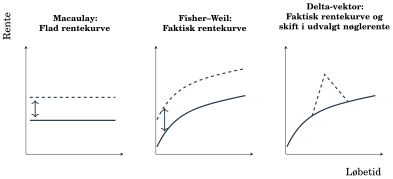
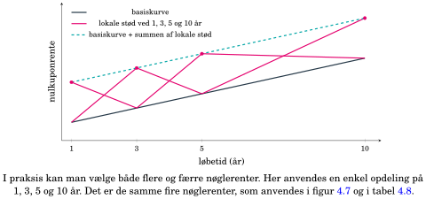
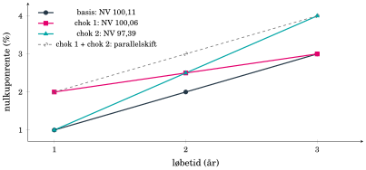

## Hvor meget taber obligationen, når renten stiger? {#ch04-s001}

Selv en næsten kreditrisikofri statsobligation kan få store kurstab.

Renterisiko opstår, når de samme fremtidige betalinger får en ny værdi.

Vi måler følsomhed i procent, kurspoint og kroner og fordeler den på rentekurven.

::: {.notes}
Rentestigningerne i 2022 viste mekanismen for lange sikre obligationer. Kreditrisiko handler om betalingsevne, mens renterisiko også opstår, når alle aftalte betalinger fortsat forventes betalt.
:::

## Investor ser kurstabet, før vi beregner varigheden {#ch04-s023}

{.chapter-figure}

Samme ti betalinger, ny effektiv årlig rente: Når renten stiger, falder kursen. Tangenten viser det lokale estimat, som vi senere beregner med varighed.

::: {.notes}
Grafen skal vise bogens eksakte diskonterede kurs for ni kuponer på 2,25 og en slutbetaling på 102,25. Første termin ligger 296/365 år efter valør. Ved 2,45% er dirty-kursen 98,696. Grafen er flyttet frem, så investorens kurstab kommer før notation og mellemregninger.
:::

## En rentestigning på ét procentpoint koster 8,122 kurspoint {#ch04-s022}

Betalingerne holdes faste; kun obligationens effektive rente ændres.

| Rentestød | Ny rente | Ny dirty-kurs | Kursændring |
|---|---:|---:|---:|
| −1 procentpoint | 1,45% | 107,690 | +8,994 |
| Ingen | 2,45% | 98,696 | 0 |
| +1 procentpoint | 3,45% | 90,574 | −8,122 |

Investor taber markedsværdi ved rentestigning, selv om udsteder betaler som aftalt. Den ulige reaktion i de to retninger skyldes kurvens krumning.

::: {.notes}
Kurserne er bogens afrundede værdier. Kursændringerne er beregnet før afrunding. Ét kurspoint svarer til én krone pr. 100 nominel. Vi måler her et stød til obligationens egen effektive rente, ikke et kurvestød med ændrede betalinger som i kapitel 7.
:::

## Betalingernes placering bestemmer varigheden {#ch04-s002}

To obligationer kan begge udløbe om cirka ti år:

- Stående obligation: hovedstolen kommer til sidst.
- Serieobligation: hovedstolen afdrages løbende.

Tidlige afdrag flytter værdi tættere på i dag og giver typisk lavere renterisiko.

::: {.notes}
Macaulay introducerede varighed i 1938. Begrebet samler hele profilen og tilfører dermed noget ud over den sidste udløbsdato.
:::

## Stående obligation: tyngden ligger i slutbetalingen {#ch04-s003}

{.chapter-figure}
Kuponer på 2,25 og slutbetaling på 102,25. Den store slutbetaling trækker Macaulay-varigheden ud til 8,867 år.

::: {.notes}
Kuponerne er tegnet skematisk høje for at kunne ses. Den angivne kurs er 98,696. Varigheden afhænger af nutidsværdier og kan ikke aflæses alene ved at tælle betalinger.
:::

## Serieobligation: afdrag flytter værdi frem i tid {#ch04-s004}

{.chapter-figure}
Afdrag på 10 pr. termin og faldende kupon giver Macaulay-varighed 4,948 år, selv om slutdatoen omtrent er den samme.

::: {.notes}
Figuren viser konstante afdrag og faldende renter hver for sig. Kursen er 99,454. Den løbende tilbagebetaling gør forskellen til den stående profil.
:::

## Varighed bruger nutidsværdi som vægt {#ch04-s005}

$$PV(CF_i)=\frac{CF_i}{(1+y)^{t_i}}$$

$$P=\sum_iPV(CF_i),\qquad w_i=\frac{PV(CF_i)}P$$

$t_i$ er år fra valør til betaling $i$. $y$ er effektiv årlig rente.

Vægtene viser, hvor obligationens aktuelle værdi ligger i tiden.

::: {.notes}
Nominelle betalinger ville give en krone om ti år samme vægt som en krone om ét år. Først skal beløbene derfor omregnes til dagens værdi.
:::

## Macaulay-varighed er en vægtet gennemsnitstid {#ch04-s006}

$$D=\sum_{i=1}^{N}w_i t_i$$

$D$ måles i år. Vægtene summerer til 1.

Store sene betalinger trækker gennemsnittet op. Tidlige kuponer og afdrag trækker det ned.

Varigheden er et tidsmæssigt tyngdepunkt, ikke et løfte om fuld tilbagebetaling efter $D$ år.

::: {.notes}
Brug vægtstangsintuitionen: placér betalingernes nutidsværdier på tidslinjen. Gennemsnittet ligger, hvor tidslinjen balancerer.
:::

## Varighed beregnes fra den konkrete valørdag {#ch04-s007}

Stående obligation: 2,25% kupon, effektiv rente 2,45%, sidste betaling i 2034.

| Oplysning | Dato eller værdi |
|---|---|
| Handel / valør | 21. / 23. januar 2025 |
| Seneste / næste termin | 15. november 2024 / 2025 |
| Vedhængende rentedage | 69 |
| Vedhængende rente | 0,425 kurspoint |

Alle kurser i beregningen inkluderer vedhængende rente.

::: {.notes}
Hold dirty-kursen fast som grundlag for nutidsværdivægtene. Vedhængende rente er ikke en ekstra fremtidig kupon, som skal lægges til betalingsrækken.
:::

## ACT/ACT giver 0,811 år til første betaling {#ch04-s008}

296 faktiske dage fra valør til næste termin. Kuponperioden har 365 dage.

$$t_1=\frac{296}{365}=0{,}811$$

Ved $n$ ordinære årlige terminer:

$$t_i=t_1+\frac{i-1}{n}$$

Her er $n=1$: tiderne bliver 0,811, 1,811, 2,811, …

::: {.notes}
Betalingsnummer i og årstiden t_i er forskellige. For n årlige terminer skal første periodes brøk også udtrykkes i år, altså med periodens faktor 1/n.
:::

## Et fast 365-dages år er en anden konvention {#ch04-s009}

ACT/ACT i eksemplet kan beregnes i Excel som

`=(næste_termin-valør)/(næste_termin-seneste_termin)`

Derefter lægges ét år til for hver ordinær årlig termin.

Til 15. november 2028 giver ACT/365 Fixed ca. 3,814 år, mens ACT/ACT giver 3,811 år.

Uregelmæssige perioder kræver kontraktens konkrete regler.

::: {.notes}
DATEDIF mellem valør og hver betalingsdato divideret med 365 bruger ACT/365 Fixed. Forskellen bliver synlig ved skuddage. Formlen for regelmæssige kuponer kan ikke ukritisk udvides til særperioder.
:::

## Første kupon udgør kun en lille del af værdien {#ch04-s010}

$$PV(CF_1)=\frac{2{,}25}{1{,}0245^{0{,}811}}=2{,}206$$

Samlet dirty-kurs er 98,696.

$$w_1=\frac{2{,}206}{98{,}696}\approx2{,}24\%$$

Bidrag til varigheden: $w_1t_1\approx0{,}0181$ år.

::: {.notes}
En kupon kan ligge tæt på i tid og stadig bidrage lidt til gennemsnittet, fordi den fylder lidt i prisen. Den sidste betaling får langt større vægt.
:::

## Nutidsværdier og varighedsbidrag: 2025–2029 {#ch04-s011}

Termin er 15. november. Beløb pr. 100 nominel.

| År | $t_i$ | CF | PV | Vægt | $w_it_i$ |
|---|---:|---:|---:|---:|---:|
| 2025 | 0,811 | 2,25 | 2,206 | 2,24% | 0,0181 |
| 2026 | 1,811 | 2,25 | 2,154 | 2,18% | 0,0395 |
| 2027 | 2,811 | 2,25 | 2,102 | 2,13% | 0,0599 |
| 2028 | 3,811 | 2,25 | 2,052 | 2,08% | 0,0792 |
| 2029 | 4,811 | 2,25 | 2,003 | 2,03% | 0,0976 |

::: {.notes}
Samme kupon får faldende nutidsværdi længere ude i tiden. Varighedsbidraget kan alligevel stige, fordi t_i bliver større. Tabellen er delt for læsbarhed.
:::

## Slutbetalingen dominerer varigheden {#ch04-s012}

| År | $t_i$ | CF | PV | Vægt | $w_it_i$ |
|---|---:|---:|---:|---:|---:|
| 2030 | 5,811 | 2,25 | 1,955 | 1,98% | 0,1151 |
| 2031 | 6,811 | 2,25 | 1,908 | 1,93% | 0,1317 |
| 2032 | 7,811 | 2,25 | 1,862 | 1,89% | 0,1474 |
| 2033 | 8,811 | 2,25 | 1,818 | 1,84% | 0,1623 |
| 2034 | 9,811 | 102,25 | 80,636 | 81,70% | 8,0158 |
| Sum | | | 98,696 | 100% | 8,867 |

Slutbetalingen udgør 81,70% af nutidsværdien.

::: {.notes}
Vægten på sidste betaling forklarer, hvorfor varigheden ligger tæt på slutdatoen, selv om der er ti betalinger. Konveksitetskolonnen fra samme bogtabel kommer senere i forløbet.
:::

## Løbetid og varighed giver forskellige oplysninger {#ch04-s013}

| | Stående | Serie |
|---|---:|---:|
| Dirty-kurs | 98,696 | 99,454 |
| Sidste betaling | Ca. 10 år | Ca. 10 år |
| Macaulay-varighed | 8,867 år | 4,948 år |

Serien afdrager 10 hvert år og betaler 2,25% af restgælden.

Samme slutdato kan rumme meget forskellig renterisiko.

::: {.notes}
Sammenlign samme effektiv rente og de forskellige profiler. Løbetiden fortæller om sidste betaling, varighed fortæller om hele værdiens placering.
:::

## Kupon, afdrag og løbetid flytter varigheden {#ch04-s076}

Brug vægtene i $D=\sum_i w_i t_i$ fra bogens ligning 4.1:

| Ændring | Hvorfor ændres varigheden? |
|---|---|
| Tidligere afdrag: lavere varighed | En større del af værdien betales før udløb. Tabel 4.4: serie 4,948 år, stående 8,867 år. |
| Højere kupon: lavere varighed | Betalingerne før udløb får større vægt. I tabel 4.3 ligger 81,70% af værdien i sidste betaling. |
| Længere løbetid: normalt højere varighed | Hovedstolen betales senere og trækker gennemsnitstiden op. |

Sammenlign samme effektive rente. Ved ændret kupon holdes hovedstol og betalingsdatoer faste; ved ændret løbetid holdes kuponrente og afdragsprofil ens.

::: {.notes}
Bogboks Hovedpointe 4.1 fortolker de eksisterende beregninger frem for at introducere en ny prisformel. Tabel 4.4 ændrer afdragsprofilen, ikke løbetiden eller kuponrenten. Længere løbetid er en hovedregel, ikke en universel monoton egenskab for alle kuponobligationer. Kupon- og afdragsforklaringen følger nutidsværdivægtene.
:::

## En renteændring har tre mulige enheder {#ch04-s014}

Fra 2,45% til 3,45%:

$$1\text{ procentpoint}=100\text{ bp}=0{,}01$$

Ét basispunkt:

$$1\text{ bp}=0{,}01\text{ procentpoint}=0{,}0001$$

Forkerte enheder giver let en fejl med faktor 100.

::: {.notes}
Senere skifter formlerne mellem decimaltal og procentpoint. Bed de studerende skrive enheden ud ved hver renteændring, før de indsætter tal.
:::

## Modificeret varighed omsætter tid til procentvis risiko {#ch04-s015}

$$MD=\frac D{1+y}$$

$$MD=\frac{8{,}867}{1{,}0245}=8{,}655$$

$$\frac{\Delta P}{P}\approx-MD\Delta y$$

Ved $\Delta y=0{,}01$ bliver det omtrentlige kursfald 8,655%.

::: {.notes}
y og renteændringen er decimaltal. Tidspunktet ligger i diskonteringens eksponent og forklarer forbindelsen fra tidsmål til følsomhed. Modificeret varighed skalerer denne sammenhæng.
:::

## Varigheden er tangentens lokale hældning {#ch04-s016}

Omkring det aktuelle renteniveau giver små ændringer omtrent proportionale prisændringer.

Et rentefald på 1 procentpoint giver efter den lineære model en stigning på ca. 8,655%.

Ved store renteændringer vokser afstanden mellem tangent og faktisk kurskurve.

Derfor kræver større stød også konveksitet eller genberegning af prisen.

::: {.notes}
Varigheden siger noget om den aktuelle hældning, ikke en konstant hældning for alle renteniveauer. De faktiske ændringer bliver senere asymmetriske.
:::

## Højere effektiv rente sænker modificeret varighed {#ch04-s077}

Hold obligationens betalinger faste. Brug bogens ligning 4.3:

$$MD=\frac{D}{1+y}$$

1. Sene betalinger diskonteres over flere år. En højere rente sænker deres nutidsværdi forholdsvis mere.
2. Tidlige betalinger får større vægt, så $D$ falder for en kuponobligation.
3. Nævneren $1+y$ vokser også, så $MD$ falder yderligere.

Ved lavere rente sker det modsatte. Beregn varigheden på ny ved det nye renteniveau.

::: {.notes}
Bogboks Hovedpointe 4.2 forbinder nutidsværdivægtene med modificeret varighed. For en nulkuponobligation er D lig tiden til den eneste betaling og ændres ikke med renten; MD falder stadig via nævneren. Grafens absolutte hældning er kronefølsomhed, mens MD er relativ til prisen. Kapitel 7 genberegner også betalingerne ved ændrede indfrielsesforventninger og er et andet forsøg.
:::

## Kronevarighed måler kurspoint pr. procentpoint {#ch04-s017}

$$d=MD\frac K{100}$$

$$d=8{,}655\frac{98{,}696}{100}=8{,}542$$

En rentestigning på 1 procentpoint giver omtrent et fald på 8,542 kurspoint pr. 100 nominel.

Her hedder målet $d$. Kapitel 7 kalder det $KV$. Det er forskelligt fra diskonteringsfaktoren $d_t$.

::: {.notes}
Ordet kronevarighed kan snyde: bogens tal er opgjort pr. 100 nominel. For en større position skal der ganges med antallet af nominelle enheder.
:::

## BPV viser effekten af ét basispunkt {#ch04-s018}

$$BPV=\frac d{100}=\frac{8{,}542}{100}=0{,}08542$$

Kursen falder ca. 0,08542 kurspoint ved +1 bp.

For nominelt beløb $H$ er positionens følsomhed i kroner

$$BPV_{\mathrm{kr.}}=\frac H{100}BPV.$$

BPV kaldes også PVBP.

::: {.notes}
BPV opgives normalt som en positiv følsomhed, mens tabet ved rentestigning får negativt fortegn. Angiv altid om tallet er pr. 100 nominel eller for hele positionen.
:::

## Kursrisiko og genplaceringsrisiko trækker modsat {#ch04-s019}

| Rentestigning | Rentefald |
|---|---|
| Kursen falder nu | Kursen stiger nu |
| Kuponer kan genplaceres højere | Kuponer må genplaceres lavere |

På kort horisont dominerer kursændringen. På lang horisont kan genplaceringen få størst betydning.

::: {.notes}
Hold den samme kuponbetaling fast og ændr genplaceringsrenten. Tid er nødvendig, før den højere rente på de modtagne kuponer kan opveje et oprindeligt kurstab.
:::

## Ved varighedshorisonten kan effekterne balancere {#ch04-s020}

{.chapter-figure}
Omkring 8,867 år opvejer kursrisiko og genplaceringsrisiko hinanden under bogens simple antagelser.

::: {.notes}
Figuren er skematisk. Selvom den lodrette akse hedder kurs, viser forløbet den økonomiske balance mellem værdien og genplacerede betalinger over horisonten.
:::

## Immunisering kræver mere end et engangsvalg {#ch04-s021}

En horisont omkring 8–9 år matcher den stående obligations varighed på 8,867 år.

Balancen gælder omtrent for ét enkelt, omtrent parallelt rentestød.

Varigheden ændrer sig med tiden og renten. Positionen skal derfor løbende justeres.

Immunisering fjerner ikke alle risici.

::: {.notes}
Match mellem horisont og Macaulay-varighed er et førsteordensresultat under simple antagelser. Det er ikke en garanti under enhver kurvebevægelse.
:::

## Konveksitet forbedrer den lineære approksimation {#ch04-s024}

$$\Delta K\approx-d\Delta y_{pp}+\frac12\mathrm{Cvx}_{\mathrm{KR}}(\Delta y_{pp})^2$$

Her måles $\Delta y_{pp}$ i **procentpoint**: en stigning på 1 procentpoint indsættes som 1.

For den inkonverterbare obligation med faste betalinger er konveksitetsleddet positivt ved begge rentestød.

::: {.notes}
Varighedsleddet skifter fortegn med renteændringen. Det kvadrerede konveksitetsled gør ikke. Denne enhed er en anden end decimaltallet i MD-formlen.
:::

## Kronekonveksitet bygger på diskonterede betalinger {#ch04-s025}

$$\mathrm{Cvx}_{\mathrm{KR}}=\frac{0{,}01^2}{(1+y)^2}\sum_i t_i(t_i+1)PV(CF_i)$$

Prisen og betalingerne måles pr. 100 nominel.

Faktoren $0{,}01^2$ omregner renteændringer til procentpoint. Formlen gælder eksemplets effektive årlige rente og tid målt i år.

Summen bruger nutidsværdier, ikke de nominelle betalinger alene.

::: {.notes}
Konveksitet vægter sene betalinger kraftigt gennem produktet t_i(t_i+1). Den næste tabel genbruger nutidsværdierne fra Macaulay-beregningen.
:::

## Konveksitetsbidragene fra samme betalingsrække {#ch04-s026}

| Termin 15/11 | $t_i(t_i+1)PV(CF_i)$ | Termin 15/11 | Bidrag |
|---|---:|---|---:|
| 2025 | 3,24 | 2030 | 77,37 |
| 2026 | 10,96 | 2031 | 101,51 |
| 2027 | 22,52 | 2032 | 128,17 |
| 2028 | 37,62 | 2033 | 157,14 |
| 2029 | 55,99 | 2034 | 8.552,77 |

Samlet bidrag: 9.147,28. Slutbetalingen dominerer også krumningen.

::: {.notes}
Tabellen viser konveksitetsbidragene særskilt. Brug uafrundede tal i slutberegningen.
:::

## Konveksiteten bringer estimatet tæt på kursændringen {#ch04-s027}

$$\mathrm{Cvx}_{\mathrm{KR}}=\frac{9.147{,}283}{1{,}0245^2}\cdot0{,}01^2=0{,}872$$

| Stød | Varighed + konveksitet | Faktisk ændring |
|---|---:|---:|
| −1 pp | $8{,}542+0{,}436=8{,}978$ | +8,994 |
| +1 pp | $-8{,}542+0{,}436=-8{,}106$ | −8,122 |

Begge estimater ligger tættere på end varighed alene.

::: {.notes}
Den samme positive korrektion bruges i begge retninger. Approksimationen er fortsat lokal og afskærer led af højere orden.
:::

## Høj konveksitet har mest værdi ved store renteudsving {#ch04-s028}

{.chapter-figure}
Sammenlign afstanden mellem de to obligationers kurver ved små og store renteændringer.

::: {.notes}
Høj konveksitet giver normalt en bedre reaktion i begge retninger ved sammenlignelig varighed. Men investorer kan betale en højere pris for denne egenskab.
:::

## Konveksitet har en pris og kan ændre fortegn {#ch04-s029}

Almindelige inkonverterbare obligationer har typisk positiv konveksitet.

En ellers sammenlignelig obligation med højere konveksitet kan derfor være dyrere.

Konverterbare realkreditobligationer kan få lav eller negativ konveksitet, fordi låntager kan indfri, når det er fordelagtigt. Negativ konveksitet er ikke det samme som negativ varighed.

::: {.notes}
Her ændres den effektive rente, mens betalingerne holdes faste. I kapitel 7 ændres referencekurven, og de forventede betalinger genberegnes, fordi låntager kan konvertere. De to stød måler derfor ikke samme risiko.
:::

## Procentvise risikomål vægtes med markedsværdier {#ch04-s030}

For hver position:

$$\Delta P_i\approx-MD_iP_i\Delta y$$

Når ændringerne summeres og divideres med porteføljens værdi:

$$\frac{\Delta P_p}{P_p}\approx-\left(\sum_i\frac{P_i}{P_p}MD_i\right)\Delta y$$

Derfor er $MD_p$ markedsværdivægtet. Samme vægte bruges for Macaulay-varighed.

::: {.notes}
En position med dobbelt markedsværdi og samme følsomhed bidrager dobbelt til kronerisikoen. Vægtningsreglen følger af enhederne og er ikke en vilkårlig standard.
:::

## Mål pr. 100 nominel skaleres med antal enheder {#ch04-s031}

$$d_i=MD_i\frac{K_i}{100}$$

Positionen indeholder $H_i/100$ enheder. Samlet kronefølsomhed er

$$\sum_i\frac{H_i}{100}d_i.$$

Opdeling pr. 100 nominel giver

$$d_p=\sum_i\frac{H_i}{\sum_jH_j}d_i.$$

::: {.notes}
Total risiko i kroner er en sum. Når totalen normaliseres pr. 100 nominel, fås et nominelt vægtet gennemsnit. Kursen er allerede indbygget i d_i.
:::

## Vægten følger nøgletallets enhed {#ch04-s032}

| Nøgletal | Vægt ved porteføljesammenlægning |
|---|---|
| Macaulay- og modificeret varighed | Markedsværdi |
| Kronevarighed, BPV og kronekonveksitet pr. 100 nominel | Nominelle beløb |

For absolut risiko i kroner skaleres hvert bidrag med $H_i/100$ og lægges sammen.

::: {.notes}
Nominelle vægte er ikke generelt bedre eller dårligere end markedsværdivægte. Vægten bestemmes af, hvad nøgletallet allerede indeholder.
:::

## To positioner med samme nominelle beløb {#ch04-s033}

Beløb i mio. kr., undtagen kurs og nøgletal.

| | Nominel | Kurs | Markedsværdi | MD | $d$ |
|---|---:|---:|---:|---:|---:|
| A | 10 | 90 | 9 | 2,0 | 1,80 |
| B | 10 | 110 | 11 | 6,0 | 6,60 |

B har både større markedsværdi og højere procentvis følsomhed.

::: {.notes}
De nominelle beløb er ens, men hver procentvis kursændring rammer flere kroner i B. Dette er den centrale vægtforskel i eksemplet.
:::

## Begge beregningsveje giver 840.000 kr. {#ch04-s034}

Markedsvægtet modificeret varighed:

$$MD_p=\frac{9\cdot2+11\cdot6}{20}=4{,}2$$

Nominelt vægtet kronevarighed:

$$d_p=\frac{10\cdot1{,}80+10\cdot6{,}60}{20}=4{,}2$$

Ved +1 pp: $0{,}042\cdot20.000.000=200.000\cdot4{,}2=840.000$ kr. i omtrentligt tab.

::: {.notes}
At begge nøgletal bliver 4,2 skyldes porteføljekurs 100. Sammenfaldet gælder ikke alle porteføljer, men de beregnede kroner skal være ens.
:::

## Forkerte vægte undervurderer risikoen {#ch04-s035}

Nominelt vægtet MD ville give

$$\frac{10\cdot2+10\cdot6}{20}=4{,}0.$$

Det giver et estimeret tab på 800.000 kr., altså 40.000 kr. for lidt.

Fejlen undervægter den dyrere obligation B, som har størst renterisiko.

::: {.notes}
Det er et gennemregnet fejl-eksempel fra kapitlet. Lad de studerende identificere, hvilken kapital det procentvise mål faktisk skal virke på.
:::

## En større portefølje: positioner og markedsværdier {#ch04-s036}

| | Nominel, mio. kr. | Kurs | Markedsværdi, mio. kr. |
|---|---:|---:|---:|
| 1 | 10 | 99,3 | 9,930 |
| 2 | 15 | 101,5 | 15,225 |
| 3 | 25 | 102,8 | 25,700 |
| Sum | 50 | | 50,855 |

Den største position har også den længste varighed.

::: {.notes}
Denne tabel giver vægtene til den følgende. Kursen er markedsværdi som andel af nominel hovedstol, ikke et selvstændigt vægtningsvalg.
:::

## Den lange position dominerer porteføljens risiko {#ch04-s037}

| | Macaulay | MD | $d$ | $\mathrm{Cvx}_{KR}$ |
|---|---:|---:|---:|---:|
| 1 | 2,20 | 2,18 | 2,16 | 0,14 |
| 2 | 4,80 | 4,73 | 4,80 | 0,34 |
| 3 | 10,50 | 10,30 | 10,59 | 1,20 |
| Portefølje | 7,17 | 7,05 | 7,17 | 0,73 |

De to første kolonner vægtes med markedsværdi. De sidste to med nominelle beløb.

::: {.notes}
Tallene er afrundede som i bogen. Hold derfor samme afrundingsniveau, når tabellen kontrolleres, og skeln mellem beregnede positionstal og afrundede præsentationstal.
:::

## Porteføljens varigheder med de korrekte vægte {#ch04-s038}

$$D_p=\frac{9{,}930\cdot2{,}20+15{,}225\cdot4{,}80+25{,}700\cdot10{,}50}{50{,}855}=7{,}17$$

$$MD_p=\frac{9{,}930\cdot2{,}18+15{,}225\cdot4{,}73+25{,}700\cdot10{,}30}{50{,}855}=7{,}05$$

$$d_p=\frac{10\cdot2{,}16+15\cdot4{,}80+25\cdot10{,}59}{50}=7{,}17$$

::: {.notes}
Enhederne mio. kr. bortfalder i vægtene. Første resultat er år, andet procentvis følsomhed og tredje kurspoint pr. procentpoint og pr. 100 nominel.
:::

## Porteføljens BPV og konveksitet i kroner {#ch04-s039}

Ved +1 procentpoint:

$$\text{Varighedstab}\approx\frac{7{,}17}{100}\cdot50.000.000=3.585.000\text{ kr.}$$

$$BPV_{\mathrm{kr.}}=3.585.000/100=35.850\text{ kr.}$$

$$\mathrm{Cvx}_{KR,p}=\frac{10\cdot0{,}14+15\cdot0{,}34+25\cdot1{,}20}{50}=0{,}73$$

::: {.notes}
Kronekonveksiteten er stadig pr. 100 nominel. Den skal skaleres til hele porteføljen, før den lægges til ændringen i kroner.
:::

## Konveksitet korrigerer tabet med et positivt bidrag {#ch04-s040}

Ved et stød på ét procentpoint bliver korrektionen

$$\frac12\cdot0{,}73\cdot1^2=0{,}365\text{ kurspoint}.$$

For 50 mio. kr. nominel:

$$\frac{0{,}365}{100}\cdot50.000.000=182.500\text{ kr.}$$

Bidraget lægges positivt til varighedsestimatet for denne inkonverterbare portefølje.

::: {.notes}
Ved rentestigning reducerer den positive korrektion tabet. Ved rentefald øger den gevinsten. Fortegnet kommer fra positiv konveksitet og det kvadrerede stød.
:::

## Porteføljens nøgletal hænger sammen via kursen {#ch04-s041}

$$K_p=100\frac{50{,}855}{50{,}000}=101{,}71$$

$$d_p=MD_p\frac{K_p}{100}$$

$$7{,}05\cdot\frac{101{,}71}{100}\approx7{,}17$$

Procent- og kroneberegningen beskriver samme økonomiske risiko.

::: {.notes}
Sammenhængen er en nyttig enhedskontrol. Små afvigelser kan skyldes afrunding af obligationernes nøgletal.
:::

## Fisher–Weil bruger spotrenten ved hver betaling {#ch04-s042}

Macaulay diskonterer alle betalinger med én effektiv rente.

Fisher–Weil bruger nulkuponrenten for hver løbetid og vægter derefter betalingstiderne med nutidsværdierne.

På en kurve, som ikke er flad, bliver vægtene derfor lidt forskellige.

::: {.notes}
Bogen indfører Fisher–Weil som den gennemsnitlige tid baseret på kurvens nutidsværdier. Følsomhedens præcise skala afhænger fortsat af rentetilskrivningen og det valgte kurvestød.
:::

## Én effektiv rente og en spotkurve kan give samme pris {#ch04-s043}

Treårig stående obligation, 2,25% kupon. Effektiv rente afrundet 2,79%.

| År | CF | Spotrente | PV med $y$ | PV med $z_t$ |
|---|---:|---:|---:|---:|
| 1 | 2,25 | 2,00% | 2,19 | 2,21 |
| 2 | 2,25 | 2,50% | 2,13 | 2,14 |
| 3 | 102,25 | 2,80% | 94,15 | 94,12 |
| Sum | | | 98,47 | 98,47 |

::: {.notes}
Den effektive rente er valgt, så priserne i bogen afrundes ens. De små forskelle i de enkelte nutidsværdier viser mekanismen, selv om totalen er den samme.
:::

## Vægtene ændres med diskonteringsgrundlaget {#ch04-s044}

| År | Vægt Mac. | Vægt F–W | $w_it_i$, Mac. | $w_it_i$, F–W |
|---|---:|---:|---:|---:|
| 1 | 2,22% | 2,24% | 0,0222 | 0,0224 |
| 2 | 2,16% | 2,17% | 0,0433 | 0,0435 |
| 3 | 95,61% | 95,58% | 2,8684 | 2,8675 |
| Varighed | | | 2,9339 | 2,9334 |

Begge mål sammenfatter betalingsprofilen i ét tal. Fisher–Weil bruger spotrenten ved hver betaling, men måler stadig følsomheden ved et parallelt kurveskift.

::: {.notes}
Fisher–Weil bruger spotrenten ved hver betaling; et parallelt stød flytter alle kurvepunkter i samme retning.
:::

## Samlet varighed fortæller ikke, hvor risikoen ligger {#ch04-s045}

En portefølje med kronevarighed 5 taber ca. 5 kurspoint ved +1 procentpoint parallelt.

Tallet siger endnu ikke, om følsomheden ligger ved fem år eller tredive år.

Nøglerentevarighed, også kaldet delta-vektorer, fordeler risikoen på udvalgte punkter på kurven.

::: {.notes}
Pengepolitik, forventninger, løbetidspræmier og segmentefterspørgsel kan flytte forskellige dele af kurven. Derfor kan to porteføljer med samme samlede varighed reagere forskelligt.
:::

## Tre metoder varierer renten på forskellige måder {#ch04-s046}

{.chapter-figure}
Venstre: én effektiv rente. Midten: parallelt skift i faktisk kurve. Højre: lokalt stød til én nøglerente.

::: {.notes}
Vis alle tre paneler. Metoderne beskriver forskellige spørgsmål til samme betalingsrække. De skal ikke blandes uden at angive, hvad der stødes.
:::

## Lokale stød aftager mod nabopunkterne {#ch04-s047}

{.chapter-figure}
Nøglerenterne er 1, 3, 5 og 10 år. Hvert stød er størst ved sit eget punkt og aftager lineært frem mod naboerne.

::: {.notes}
De lokale vægte summerer til én, så summen af stødene giver et parallelt skift. Figurstørrelsen på stødet er valgt for synlighed, ikke som et aktuelt markedsscenarie.
:::

## En delta-vektor viser fordelingen af risikoen {#ch04-s048}

| Nøglerente | 1 år | 3 år | 5 år | 10 år | Samlet |
|---|---:|---:|---:|---:|---:|
| Kronevarighed | 0,5 | 1,5 | 2,0 | 1,0 | 5,0 |

Risikoen ligger især omkring tre og fem år.

Et fald i korte renter og en stigning i lange renter kan derfor give en anden virkning end et parallelt skift.

::: {.notes}
Brug vektoren til at forbinde porteføljens risiko med et konkret kurvescenarie. Det samlede tal alene kan ikke give denne information.
:::

## Samme obligation rammes forskelligt af korte og lange stød {#ch04-s049}

{.chapter-figure}
Treårig stående obligation, 3% kupon. Basisrenter 1%, 2% og 3%. Chok 1 rammer kort, chok 2 rammer langt.

::: {.notes}
De to stød giver hver 0,5 procentpoint ved år 2 og tilsammen ét procentpoint ved alle tre horisonter. Figuren viser også det samlede parallelskift.
:::

## De lokale scenarier og deres nutidsværdier {#ch04-s050}

| År | Basisrente | Chok 1 | Chok 2 | CF |
|---|---:|---:|---:|---:|
| 1 | 1,0% | 2,0% | 1,0% | 3,00 |
| 2 | 2,0% | 2,5% | 2,5% | 3,00 |
| 3 | 3,0% | 3,0% | 4,0% | 103,00 |

Prisen beregnes i hvert scenarie ved at diskontere den samme betalingsrække med scenariets renter.

::: {.notes}
Kun kurven ændres her. Hovedstolen ligger i år 3, så det lange stød bør forventes at have størst betydning før beregningen.
:::

## Slutbetalingen gør det lange stød langt dyrere {#ch04-s051}

| År | PV basis | PV chok 1 | PV chok 2 |
|---|---:|---:|---:|
| 1 | 2,97 | 2,94 | 2,97 |
| 2 | 2,88 | 2,86 | 2,86 |
| 3 | 94,26 | 94,26 | 91,57 |
| Samlet | 100,11 | 100,06 | 97,39 |
| Kursfald | | 0,06 | 2,72 |

Kursfaldene beregnes på uafrundede nutidsværdier.

::: {.notes}
Den lille forskel mellem afrundet total og afrundet kursfald skyldes afrunding. Summen 0,06 + 2,72 giver 2,78, omtrent effekten af et parallelt stød på ét procentpoint.
:::

## Nøglerenter opdeler den samlede førsteordensrisiko {#ch04-s052}

Lokale stød kan tilsammen danne et parallelt skift.

Summen af lokale prisvirkninger svarer omtrent til samlet virkning, når krumningseffekter ses bort fra.

I praksis kan man bruge fx 3 og 6 måneder samt 1, 2, 5, 10, 20 og 30 år.

Modsatrettede eksponeringer kan reducere samlet varighed eller udvalgte nøglerisici.

::: {.notes}
Konkrete derivatstrategier ligger uden for kapitlet. Nu kan vi bruge risikomålene på realkredit, hvor debitors handlinger også kan ændre betalingsrækken.
:::

## Valg af risikomål afhænger af spørgsmålet {#ch04-s053}

| Spørgsmål | Mål |
|---|---|
| Hvor ligger værdien i tid? | Macaulay-varighed |
| Hvor stor er procentændringen? | Modificeret varighed |
| Hvor mange kurspoint eller kroner? | Kronevarighed og BPV/PVBP |
| Hvor meget ændres hældningen? | Konveksitet |
| Hvilket kurvegrundlag og hvilke løbetider? | Fisher–Weil og nøglerentevarighed |

::: {.notes}
Bed de studerende vælge et mål for porteføljeeksemplet med risiko omkring 3 og 5 år. I realkredit kan debitors handlinger ændre de forventede betalinger samtidig med renten.
:::

## Opgaver: beregning og økonomisk forklaring {#ch04-s054}

Brug lommeregner eller Excel.

Skriv rentesatser som decimaltal i formlerne, og angiv enheder på resultaterne.

Begrund retningen af pris- og risikoændringer med betalingernes størrelse og tidspunkt.

::: {.notes}
Giv først tid til selvstændigt arbejde og derefter til sammenligning af fremgangsmåder. Bed de studerende koble hvert tal til den økonomiske mekanisme.
:::

## Opgave 4.1: udgangspunkt {#ch04-s055}

To obligationer har begge hovedstol 100, 6% i årlig kuponrente, 4 år til udløb og en effektiv rente på 5%:

- Obligation S er en *stående* obligation.

- Obligation A er en *serieobligation* med fire lige store afdrag på 25 (betalingsrække: 31,00; 29,50; 28,00; 26,50).

::: {.notes}
Læs forudsætningerne sammen. Hold styr på tidspunkter, enheder og hvilke størrelser opgaven lader ændre sig.
:::

## Opgave 4.1: spørgsmål {#ch04-s056}

Opgave 4.1: Løbetid er ikke varighed

**(a)** Beregn kursen og Macaulay-varigheden for obligation S. Opstil en tabel med nutidsværdier, vægte og vægt$\cdot$tid.

**(b)** Gentag beregningen for obligation A.

::: {.notes}
Giv tid til beregning og begrundelse. Bed om eksplicitte enheder og relevante forudsætninger. Sammenlign fremgangsmåder i plenum.
:::

## Opgave 4.1: fortsat {#ch04-s057}

Opgave 4.1: Løbetid er ikke varighed

**(c)** De to obligationer har samme løbetid, kupon og effektive rente, men forskellig varighed. Forklar forskellen med tyngdepunktsbilledet fra kapitlet.

**(d)** En investor siger: *“Efter 3,68 år har jeg fået alle mine penge tilbage fra obligation S.”* Hvad er der galt med den fortolkning?

::: {.notes}
Giv tid til beregning og begrundelse. Bed om eksplicitte enheder og relevante forudsætninger. Sammenlign fremgangsmåder i plenum.
:::

## Opgave 4.2: udgangspunkt {#ch04-s058}

Tag udgangspunkt i obligation S fra opgave 1: kurs 103,546, Macaulay-varighed 3,679 år og effektiv rente 5%.

::: {.notes}
Læs forudsætningerne sammen. Hold styr på tidspunkter, enheder og hvilke størrelser opgaven lader ændre sig.
:::

## Opgave 4.2: spørgsmål {#ch04-s059}

Opgave 4.2: Fra varighed til kroner: samme følsomhed i tre enheder

**(a)** Beregn den modificerede varighed, kronevarigheden og BPV.

**(b)** Renten stiger med 25 basispunkter. Estimér kursændringen både i procent og i kurspoint. Pas på enhederne, og angiv dem eksplicit.

::: {.notes}
Giv tid til beregning og begrundelse. Bed om eksplicitte enheder og relevante forudsætninger. Sammenlign fremgangsmåder i plenum.
:::

## Opgave 4.2: fortsat {#ch04-s060}

Opgave 4.2: Fra varighed til kroner: samme følsomhed i tre enheder

**(c)** En investor har nominelt 20.000.000 kr. i obligationen. Estimér kronetabet, hvis renten stiger med 50 basispunkter.

**(d)** En medstuderende beregner i (b) kursændringen til $-3{,}504\cdot 25 = -87{,}6$ kurspoint. Hvilken fejl er begået, og hvilken advarsel fra kapitlet handler om præcis dette?

::: {.notes}
Giv tid til beregning og begrundelse. Bed om eksplicitte enheder og relevante forudsætninger. Sammenlign fremgangsmåder i plenum.
:::

## Opgave 4.3: udgangspunkt {#ch04-s061}

Vi fortsætter med obligation S fra opgave 1 og 2 (kurs 103,546, kronevarighed 3,628, effektiv rente 5%).

::: {.notes}
Læs forudsætningerne sammen. Hold styr på tidspunkter, enheder og hvilke størrelser opgaven lader ændre sig.
:::

## Opgave 4.3: spørgsmål {#ch04-s062}

Opgave 4.3: Hvor godt rammer varigheden, og hvad redder konveksiteten?

**(a)** Beregn kronekonveksiteten. (Vink: $\sum_i t_i(t_i+1)\,PV(CF_i)$ kan beregnes som ekstra kolonne i tabellen fra opgave 1 og giver 1.850,41.)

**(b)** Beregn den *faktiske* kurs ved en effektiv rente på 7% og på 3%, og dermed de faktiske kursændringer ved $\pm 2$ procentpoint.

::: {.notes}
Giv tid til beregning og begrundelse. Bed om eksplicitte enheder og relevante forudsætninger. Sammenlign fremgangsmåder i plenum.
:::

## Opgave 4.3: fortsat {#ch04-s063}

Opgave 4.3: Hvor godt rammer varigheden, og hvad redder konveksiteten?

**(c)** Estimér kursændringerne med varighed alene og derefter med varighed plus konveksitet. Sammenlign med de faktiske ændringer fra (b).

**(d)** Forklar ud fra tallene, hvorfor varighedsestimatet altid rammer “til den forsigtige side” for gevinsten og “til den dystre side” for tabet, og hvad det har med kurvens krumning at gøre.

::: {.notes}
Giv tid til beregning og begrundelse. Bed om eksplicitte enheder og relevante forudsætninger. Sammenlign fremgangsmåder i plenum.
:::

## Opgave 4.4: udgangspunkt {#ch04-s064}

En junioranalytiker har fået til opgave at beregne renterisikoen på følgende portefølje:

|              | **Nom. beløb** | **Kurs** | **Markedsværdi** | **Mod. varighed** |
|:-------------|---------------:|---------:|-----------------:|------------------:|
| Obligation 1 |     40.000.000 |       80 |       32.000.000 |               2,0 |
| Obligation 2 |     10.000.000 |      120 |       12.000.000 |               7,0 |
| I alt        |     50.000.000 |          |       44.000.000 |                   |

Junioranalytikeren regner: *“Porteføljens modificerede varighed er $\frac{40\cdot 2{,}0 + 10\cdot 7{,}0}{50} = 3{,}0$.”*

::: {.notes}
Læs forudsætningerne sammen. Hold styr på tidspunkter, enheder og hvilke størrelser opgaven lader ændre sig.
:::

## Opgave 4.4: spørgsmål {#ch04-s065}

Opgave 4.4: Find fejlen: porteføljens varighed

**(a)** Identificér fejlen, og beregn den korrekte modificerede varighed for porteføljen.

**(b)** Beregn de to obligationers kronevarigheder og porteføljens kronevarighed pr. 100 nominel (med korrekt vægtning).

::: {.notes}
Giv tid til beregning og begrundelse. Bed om eksplicitte enheder og relevante forudsætninger. Sammenlign fremgangsmåder i plenum.
:::

## Opgave 4.4: fortsat {#ch04-s066}

Opgave 4.4: Find fejlen: porteføljens varighed

**(c)** Beregn porteføljens kronetab ved en rentestigning på 1 procentpoint ad *begge* veje: via den modificerede varighed og via kronevarigheden. Vis, at de giver samme svar. Angiv også porteføljens BPV i kroner.

**(d)** Vis, at porteføljens nøgletal hænger sammen via $d_p = MD_p\cdot K_p/100$, hvor $K_p$ er porteføljens kursværdi pr. 100 nominel. Hvorfor undervurderer junioranalytikerens tal på 3,0 risikoen?

::: {.notes}
Giv tid til beregning og begrundelse. Bed om eksplicitte enheder og relevante forudsætninger. Sammenlign fremgangsmåder i plenum.
:::

## Opgave 4.5: udgangspunkt {#ch04-s067}

En virksomhed skal betale et fratrædelsesbeløb på 10.000.000 kr. om præcis 7 år. Virksomheden afsætter i dag forpligtelsens nutidsværdi og vil placere beløbet i én af tre stående obligationer, som alle har en effektiv rente på 3%:

|                   | **Obligation X** | **Obligation Y** | **Obligation Z** |
|:------------------|:----------------:|:----------------:|:----------------:|
| Macaulay-varighed |       4 år       |       7 år       |      10 år       |

::: {.notes}
Læs forudsætningerne sammen. Hold styr på tidspunkter, enheder og hvilke størrelser opgaven lader ændre sig.
:::

## Opgave 4.5: spørgsmål {#ch04-s068}

Opgave 4.5: Case: immunisering af en pensionsforpligtelse

**(a)** Hvilken obligation bør virksomheden vælge, hvis målet er at immunisere forpligtelsen? Begrund valget.

**(b)** Forklar, hvad der går galt med obligation X, hvis renten *falder* umiddelbart efter købet, og hvad der går galt med obligation Z, hvis renten *stiger*.

::: {.notes}
Giv tid til beregning og begrundelse. Bed om eksplicitte enheder og relevante forudsætninger. Sammenlign fremgangsmåder i plenum.
:::

## Opgave 4.5: fortsat {#ch04-s069}

Opgave 4.5: Case: immunisering af en pensionsforpligtelse

**(c)** Forklar med tyngdepunktsbilledet, hvorfor netop horisont $=$ varighed skaber balancen.

**(d)** Immuniseringen er ikke en engangsøvelse. Nævn to grunde til, at positionen skal justeres løbende, og én antagelse om rentekurvens bevægelser, som strategien hviler på.

::: {.notes}
Giv tid til beregning og begrundelse. Bed om eksplicitte enheder og relevante forudsætninger. Sammenlign fremgangsmåder i plenum.
:::

## Opgave 4.6: udgangspunkt {#ch04-s070}

En 3-årig stående obligation har 5% i årlig kupon og hovedstol 100. Nulkuponkurven er $z_1 = 1\%$, $z_2 = 2\%$ og $z_3 = 3\%$.

::: {.notes}
Læs forudsætningerne sammen. Hold styr på tidspunkter, enheder og hvilke størrelser opgaven lader ændre sig.
:::

## Opgave 4.6: spørgsmål {#ch04-s071}

Opgave 4.6: Fisher--Weil og nøglerenter: hvor ligger risikoen?

**(a)** Beregn obligationens nutidsværdi på kurven og dens Fisher–Weil-varighed.

**(b)** Hvorfor kan man her ikke uden videre bruge Macaulay-formlen med én af de tre nulkuponrenter?

::: {.notes}
Giv tid til beregning og begrundelse. Bed om eksplicitte enheder og relevante forudsætninger. Sammenlign fremgangsmåder i plenum.
:::

## Opgave 4.6: fortsat {#ch04-s072}

Opgave 4.6: Fisher--Weil og nøglerenter: hvor ligger risikoen?

**(c)** Beregn kursfaldet ved tre *lokale* rentestød på hver $+1$ procentpoint: kun $z_1$, kun $z_2$ og kun $z_3$. Beregn på uafrundede nutidsværdier og afrund til to decimaler.

**(d)** Vis, at summen af de tre lokale kursfald svarer til kursfaldet ved et parallelt skift på $+1$ procentpoint, og forklar, hvorfor det må være sådan. Hvad fortæller fordelingen af de tre tal om, hvor obligationens renterisiko ligger?

::: {.notes}
Giv tid til beregning og begrundelse. Bed om eksplicitte enheder og relevante forudsætninger. Sammenlign fremgangsmåder i plenum.
:::

## Opgave 4.7: udgangspunkt {#ch04-s073}

Tag stilling til hvert udsagn, og begrund svaret kort.

::: {.notes}
Læs forudsætningerne sammen. Hold styr på tidspunkter, enheder og hvilke størrelser opgaven lader ændre sig.
:::

## Opgave 4.7: spørgsmål {#ch04-s074}

Opgave 4.7: Sandt eller falsk: klassiske misforståelser

**(a)** “En obligation med 10 års løbetid har en varighed på 10 år.”

**(b)** “Modificeret varighed angiver den præcise kursændring ved enhver renteændring.”

::: {.notes}
Giv tid til beregning og begrundelse. Bed om eksplicitte enheder og relevante forudsætninger. Sammenlign fremgangsmåder i plenum.
:::

## Opgave 4.7: fortsat {#ch04-s075}

Opgave 4.7: Sandt eller falsk: klassiske misforståelser

**(c)** “Positiv konveksitet er en gratis fordel: man taber mindre og vinder mere, så man bør altid vælge obligationen med højest konveksitet.”

**(d)** “En portefølje med kronevarighed på nul har ingen renterisiko.”

::: {.notes}
Giv tid til beregning og begrundelse. Bed om eksplicitte enheder og relevante forudsætninger. Sammenlign fremgangsmåder i plenum.
:::

