## Hvordan bliver et boliglån til en obligation? {#ch05-s001}

Låntager stiller pant. Instituttet yder lånet og udsteder obligationer. Investor finansierer lånet gennem obligationskøbet.

Systemets rødder går tilbage til genopbygningen efter Københavns brand i 1795.

Standardisering, store serier, gennemsigtighed og ejendomspant forbinder boligfinansiering med et omsætteligt marked.

::: {.notes}
Følg produktdesignet fra låneaftale til betalinger og risici. Kapitel 6 gennemgår låntageradfærd; kapitel 7 pris og risiko.
:::

## Pengene skifter retning efter låneoptagelsen {#ch05-s002}

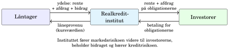{.chapter-figure width="100%" fig-alt="Ved optagelse: investor → institut → låntager. Senere: rente og afdrag tilbage til investor; bidrag til instituttet."}

Ved optagelse: investor → institut → låntager. Senere: rente og afdrag tilbage til investor; bidrag til instituttet. 

::: {.notes}
Låntager låner ikke direkte af investoren. Instituttet håndterer kreditrisiko, administration og juridisk sikkerhed.
:::

## Balanceprincippet placerer risikoen {#ch05-s003}

**Balanceprincippet:** lån og obligationer hænger tæt sammen på betalinger og risici.

**Match-funding:** udstedelsen matcher valuta, løbetid, afdragsprofil og rentetype.

Instituttets finansielle risici begrænses. Kreditrisikoen ligger fortsat hos instituttet og dets kapital; investor bærer markeds-, likviditets- og konverteringsrisiko.

::: {.notes}
Kreditrisikoen ligger hos instituttet, selv om match-funding begrænser instituttets øvrige finansielle risici.
:::

## Få store udstedergrupper dominerer obligationsmassen {#ch05-s004}

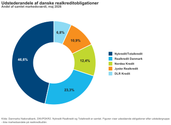{.chapter-figure width="100%" fig-alt="Markedsværdi, maj 2026. Nykredit og Totalkredit er samlet. Kilde: Nationalbanken, DNVPDKR2."}

Markedsværdi, maj 2026. Nykredit og Totalkredit er samlet. Kilde: Nationalbanken, DNVPDKR2. 

::: {.notes}
Målet er udestående obligationer til markedsværdi, ikke andele af nye lån eller realkreditudlån.
:::

## Standardiserede serier konkurrerer på tværs af udstedere {#ch05-s005}

Centrale udstedere: Nykredit/Totalkredit, Realkredit Danmark, Nordea Kredit, Jyske Realkredit og DLR Kredit.

En 4% 30-årig obligation konkurrerer med tilsvarende serier fra andre udstedere.

Likviditet, serie, låntagersammensætning og spænd kan stadig være forskellige.

::: {.notes}
Enhedsmarked betyder sammenlignelige produkter, ikke identiske obligationer. Vi ser senere, hvorfor låntagernes sammensætning betyder noget.
:::

## Instituttet samler mange individuelle lån på balancen {#ch05-s006}

$$H=\sum_{i=1}^{I}H_i,\qquad D=\sum_{j=1}^{J}D_j.$$

Boggrundlagets grove balance: $H=D+E$, hvor $E$ er egenkapitalens tabsbuffer.

| Aktiver | Passiver |
|---|---|
| Pantebreve med ejendomspant | Udstedte realkreditobligationer |
| Andre aktiver | Egenkapital |

Låntager har gæld til instituttet; investor har krav mod instituttet.

::: {.notes}
Identiteten er en grov balanceillustration. Nominelle låne- og obligationsbeløb er ikke en fuldstændig regnskabsmodel med alle aktiver.
:::

## Pant og obligationer mødes i instituttets balance {#ch05-s007}

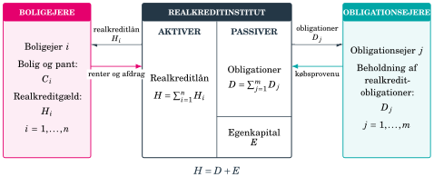{.chapter-figure width="100%" fig-alt="Følg boligejernes krav og gæld til venstre og obligationsejernes krav til højre."}

Følg boligejernes krav og gæld til venstre og obligationsejernes krav til højre. 

::: {.notes}
Instituttet finansierer de lange boliglån med obligationer, der passer til lånene, ikke med korte indlån.
:::

## Mange lån finansieres i samme obligationsserie {#ch05-s008}

Store serier giver volumen, likviditet og gennemsigtighed.

To slags lukning:

- Midlertidigt lukket for nye tilbud, fordi kursen er for høj.
- Permanent lukket for udstedelse ved årgangens lukkedato.

Låntager vælger et lån i en konkret serie til en konkret kurs. Lav kurs giver mindre provenu pr. nominel krone.

::: {.notes}
Udstedelseshistorikken afgør, hvilke låntagere der kommer ind i puljen; skeln mellem kursdrevet tilbudslukning og permanent årgangslukning.
:::

## En konkret serie bestemmer låntagers provenu {#ch05-s009}

Realkredit Danmark, 28. august 2026 kl. 18.30. Nye årgange åbnet i 2026.

| Fastforrentet lån | Årgang | Kurs |
|---|---:|---:|
| 30 år, 4%, med afdrag | 2059 | 96,150 |
| 30 år, 4%, IO10 | 2059 | 95,000 |
| 20 år, 3%, med afdrag | 2049 | 91,845 |
| 10 år, 2%, med afdrag | 2039 | 93,463 |

Historiske observationer; kurserne ændrer sig dagligt.

::: {.notes}
Samme kupon er ikke samme pris, når afdragsprofilen ændres. Tallene er bevaret fra final-bogen og opdateres ikke til dagens marked.
:::

## Kupon, tillæg og bidrag har forskellige modtagere {#ch05-s010}

$$\text{Ydelse}=\underbrace{\text{rente+afdrag}}_{\text{investor}}+\underbrace{\text{bidrag}}_{\text{institut}}.$$

- Kuponen er fastlagt ved udstedelse eller fixing.
- Floaterens obligationstillæg er en del af kuponen.
- Bidrag dækker administration, kapital og kreditrisiko.

Høj LTV, afdragsfrihed og kort rentebinding giver typisk højere bidrag.

::: {.notes}
Bidrag indgår ikke direkte i obligationens cash flow, men påvirker låntagers samlede omkostning og beslutning om omlægning. Obligationstillæg og rentetillæg er samme begreb her.
:::

## LTV begrænser realkreditfinansieringen {#ch05-s011}

$$LTV=\frac{\text{restgæld}}{\text{estimeret ejendomsværdi}}.$$

Bolig 4 mio. kr., lån 3,2 mio. kr. → LTV 80%.

| Ejendomstype | Bogens hovedgrænse |
|---|---:|
| Helårsboliger | 80% |
| Sommerhuse | 75% |
| Erhverv | 60% |
| Landbrug | 60% |

Resten finansieres typisk med egenbetaling/banklån. Grænserne begrænser gearing og dæmper virkningen af ejendomsprisfald.

::: {.notes}
Tabellen gengiver bogens hovedgrænser. Knyt grænsen til sikkerhedsmarginen ved en lavere ejendomsværdi.
:::

## Pant og supplerende sikkerhed beskytter investor {#ch05-s012}

Tinglysning sikrer pant og prioritetsrækkefølge ved misligholdelse og tvangsauktion.

RO, SDRO og SDO adskiller sig især ved sikkerhed og krav til cover poolen. SDRO/SDO blev standard for nye udstedelser efter 2007.

Ved stigende LTV over grænserne skal SDRO/SDO have supplerende sikkerhed. Det binder kapital og påvirker fundingomkostninger, spænd og produktudbud.

::: {.notes}
Løbende sikkerhed har en værdi for investor og en omkostning for instituttet. Skeln låneproduktets betalingsprofil fra den juridiske obligationstype.
:::

## Tilsynsdiamanten sætter grænser for sårbar udlånsstruktur {#ch05-s013}

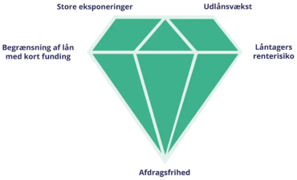{.chapter-figure width="100%" fig-alt="Læs de fem pejlemærker som begrænsninger på koncentration, vækst, renterisiko, afdragsfrihed og refinansiering. Kilde: Finanstilsynet."}

Læs de fem pejlemærker som begrænsninger på koncentration, vækst, renterisiko, afdragsfrihed og refinansiering. Kilde: Finanstilsynet. 

::: {.notes}
Grænserne gælder instituttets samlede risikostruktur, ikke kun et individuelt lån.
:::

## Fem pejlemærker påvirker lånebogens kvalitet {#ch05-s014}

1. Begræns udlånsvækst i de enkelte segmenter.
2. Begræns høj LTV kombineret med kort rentebinding.
3. Begræns høj LTV kombineret med afdragsfrihed.
4. Spred refinansieringsomfanget.
5. Begræns store eksponeringer relativt til kapitalen.

Investor vurderer lånebogens kvalitet; låntager møder begrænsninger i produktudbuddet.

::: {.notes}
Forbind høj LTV, afdragsfrihed og kort rentebinding med bidragssatsen. Fokusér på mekanismerne bag grænserne.
:::

## Realkredit fylder meget i det danske obligationsmarked {#ch05-s015}

{.chapter-figure width="100%" fig-alt="Markedsoverblik pr. 14. juli 2025: sammenlign realkredit og statsobligationer."}

Markedsoverblik pr. 14. juli 2025: sammenlign realkredit og statsobligationer. Kilde: Vitec Scanrate (angivet i selve figuren).

::: {.notes}
Store serier giver investor likviditet, kreditkvalitet og et spænd. Obligationsfunding giver typisk låntager gennemsigtige og lave finansieringsomkostninger.
:::

## Kurslisten rummer tre produktfamilier {#ch05-s016}

- **MTG:** lange fastforrentede, typisk konverterbare obligationer.
- **FLT:** kupon justeres løbende efter en reference.
- **RTL:** lånet refinansieres med faste mellemrum.

De næste tabeller er bogens udsnit fra Nasdaq Nordic, 28. august 2026. Cirkulerende mængde er i mia. kr.

::: {.notes}
Produktfamilierne har forskellige rente-, funding- og konverteringsrisici. Sammenlign egenskaberne i tabellerne før kursniveauerne.
:::

## Kursliste: de korte RTL-obligationer {#ch05-s017}

| | 1 RD T RTL 2027 Jan | 1 NYK H RTL 2027 Jan |
|---|---:|---:|
| ISIN | DK0009299729 | DK0009511297 |
| Kurs | 99,756 | 99,540 |
| Kupon | 1,000% | 1,000% |
| Cirkulerende, mia. | 49,994 | 52,085 |
| Terminer pr. år | 1 | 1 |

Begge: udløb 2027, stående amortisering, ikke konverterbare, ikke afdragsfri. Nasdaq Nordic, 28. august 2026.

::: {.notes}
Hold obligationens korte løbetid adskilt fra det boliglån, den finansierer. Lånet kan fortsætte gennem refinansiering.
:::

## Kursliste: fire lange MTG-serier {#ch05-s018}

| Serie | ISIN | Kurs | Cirk., mia. |
|---|---|---:|---:|
| 5 NYK E 2053 | DK0009539116 | 103,700 | 27,082 |
| 4 NYK E 2056 | DK0009541872 | 97,180 | 107,998 |
| 3,5 NYK E 2056 | DK0009548372 | 94,420 | 21,699 |
| 5 NYK E 2053 IO10 | DK0009539389 | 103,350 | 8,537 |

Kupon svarer til navnet. Alle har fire terminer, konverteringsret og annuitetsprofil; kun sidste række er afdragsfri. Nasdaq Nordic, 28. august 2026.

::: {.notes}
Navnets år er udløbsåret. Brug både pris og afdragsprofil til at skelne de to 5-procentserier.
:::

## Kursliste: variable kuponer tæt ved pari {#ch05-s019}

| | NYK H FLT 2028 | RD T FLT 2027 |
|---|---:|---:|
| ISIN | DK0009549347 | DK0004626595 |
| Kurs | 100,257 | 100,530 |
| Aktuel kupon | 2,506% | 2,850% |
| Cirkulerende, mia. | 19,762 | 17,972 |
| Udløb | 2028 | 2027 |

Begge: fire terminer, ikke konverterbare, afdragsfri, amortisering betegnet »ydelse«. Nasdaq Nordic, 28. august 2026.

::: {.notes}
Den aktuelle kupon siger ikke, hvad alle fremtidige kuponer bliver. Kursen kan stadig bevæge sig med spænd og likviditet.
:::

## Hvem finansierer realkreditmarkedet? {#ch05-s020}

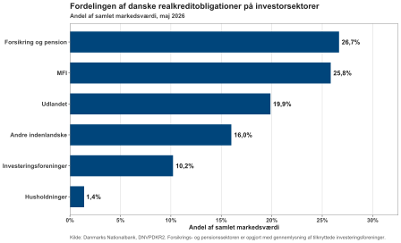{.chapter-figure width="100%" fig-alt="Investorsektorer efter markedsværdi, maj 2026. Pension og forsikring er gennemlyst gennem danske fonde. Kilde: Nationalbanken, DNVPDKR2."}

Investorsektorer efter markedsværdi, maj 2026. Pension og forsikring er gennemlyst gennem danske fonde. Kilde: Nationalbanken, DNVPDKR2. 

::: {.notes}
Gennemlysning betyder, at de underliggende fondsbeholdninger placeres hos pensions- og forsikringssektoren. Fondssøjlen er derfor ikke al indirekte fondsinvestering.
:::

## Investorernes behov former produktvalget {#ch05-s021}

Forsikring/pension og MFI ejer hver omtrent en fjerdedel; udlandet knap en femtedel. Husholdninger ejer 1,4% direkte, men også indirekte gennem pension og fonde.

Pension/forsikring: lange konverterbare og RTL. Banker: korte variable til likviditetsstyring. Udlandet: stor andel af lange konverterbare.

Korte obligationer har stadig spænds- og likviditetsrisiko.

::: {.notes}
MFI er monetære finansielle institutioner, især penge- og realkreditinstitutter. Kilder: Nationalbanken DNVPDKR2 (2026) og Få aktører (2024), s. 12–13.
:::

## Den marginale investor kan flytte kurs og spænd {#ch05-s022}

Mere efterspørgsel → højere kurs → lavere krævet afkast/spænd, alt andet lige.

En bred investorbase kan absorbere modsatrettede handler. Få dominerende sælgere kan presse kurs og likviditet.

Den marginale investor er den, hvis næste køb eller salg afgør den markedsbalancerende pris.

::: {.notes}
OAS viser kompensationen efter håndtering af optionen; kapitel 7 opstiller modellen.
:::

## Japan-eksemplet viser skiftende relativt afkast {#ch05-s023}

2016–2020: store nettokøb af lange danske realkreditobligationer. Lave japanske renter, dansk kreditkvalitet og afkast efter valutaafdækning trak efterspørgslen op.

2021: første samlede reduktion af konverterbare beholdninger siden 2014. I 2022 solgtes danske obligationer for cirka 35 mia. kr. til markedsværdi.

Rentestigninger, kurstab og dyrere valutaafdækning kan have bidraget.

::: {.notes}
Kilder: Nationalbankens Monetære og finansielle tendenser 2020, 2021 og 2023. Valutaafdækket afkast er efter begrænsning af yen/kroner-risikoen. Japan forklarer ikke alene det danske renteniveau.
:::

## Udlandets beholdning og nettokøb er forskellige mål {#ch05-s024}

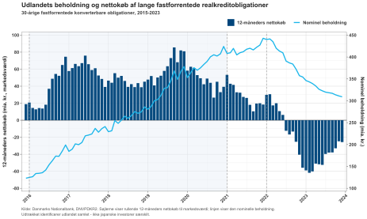{.chapter-figure width="100%" fig-alt="2015–2023: linjen er nominel beholdning; søjler er rullende 12-måneders nettokøb til markedsværdi. Kilde: Nationalbanken."}

2015–2023: linjen er nominel beholdning; søjler er rullende 12-måneders nettokøb til markedsværdi. Kilde: Nationalbanken. 

::: {.notes}
Figuren viser udlandet samlet, ikke Japan særskilt. Eurolande og andre udenlandske investorer reagerede forskelligt i 2022.
:::

## En stor serie kan have få villige sælgere {#ch05-s025}

Begrænset handlebar mængde kan gøre den marginale sælger afgørende.

Eksempel: 1% NYK 2050 IO10, DK0009524431. Økonomisk Ugebrev beskrev i maj 2026 kurs cirka 82,5 mod 74–75 i sammenlignelige serier.

7,5 kurspoint på 2 mio. kr. er 150.000 kr. mindre gældsreduktion ved indfrielse.

::: {.notes}
Låntager under pari vil normalt købe obligationer tilbage. Eksemplet vedrører en konkret historisk observation og en omdiskuteret forklaring, ikke en dom om ulovlighed.
:::

## En vedvarende kursskævhed kræver en forklaring {#ch05-s026}

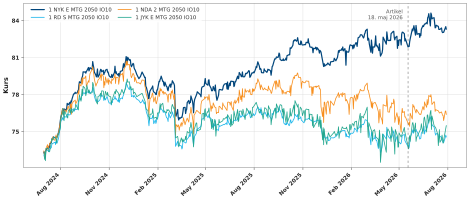{.chapter-figure width="100%" fig-alt="Fire 1% 2050 IO10-serier, juli 2024–juli 2026. Stiplet linje: artiklen 18. maj 2026. Kilde: Nasdaq Nordic."}

Fire 1% 2050 IO10-serier, juli 2024–juli 2026. Stiplet linje: artiklen 18. maj 2026. Kilde: Nasdaq Nordic. 

::: {.notes}
Serierne begyndte tæt; Nykredit skilte sig gradvist ud fra efteråret 2024. Kurven dokumenterer forskellen, men afgør ikke dens årsag.
:::

## Indlåsning er en økonomisk mekanisme {#ch05-s027}

Få ejere → få obligationer til salg → dyrere markedstilbagekøb kan begrænse låntagers gevinst.

En investor kan afdække generel renterisiko med en swap og stadig være eksponeret mod seriens relative pris, spænd, likviditet og indfrielser.

Koncentration og høj kurs beviser ikke markedsmanipulation. Økonomisk Ugebrevs artikel rejser mistanke; Nykredit afviser kritikken.

::: {.notes}
MAR artikel 12 kræver konkret adfærd, eksempelvis vildledende signaler eller kunstigt kursniveau. Nationalbankens DNVPEJER viser investorkoncentration. Bevar skellet mellem økonomisk markedsmagt og juridisk overtrædelse.
:::

## Afdragsfrihedens udløb er ikke automatisk en omlægning {#ch05-s028}

Når IO10 udløber, fortsætter det eksisterende lån normalt med afdrag.

Nogle ønsker ny afdragsfrihed; andre indfrier ved salg, skilsmisse eller almindelig omlægning.

Ved markedstilbagekøb bestemmer kursen, hvor stor gældsreduktion låntager får. Investorfordelingen kan derfor påvirke låntagers indfrielsesvilkår.

::: {.notes}
Næste blok viser, hvordan kursen påvirker provenuet allerede ved låneoptagelsen.
:::

## Nominel gæld er ikke det samme som kontantprovenu {#ch05-s029}

$$\text{Kursværdi}=\frac K{100}H.$$

$H$: nominel hovedstol i kroner. $K$: kurs pr. 100 nominel.

Ved $H=1.000.000$ kr. og $K=98$:

$$\text{Kursværdi}=980.000\text{ kr.}$$

Låntager skylder 1 mio. kr., men får 980.000 kr. før omkostninger.

::: {.notes}
Et obligationslån har både nominel restgæld og markedsværdi. Kursfradrag og øvrige omkostninger er ikke medtaget i det simple regnestykke.
:::

## Tilbudskurs og udbetalingskurs kan være forskellige {#ch05-s030}

Nye tilbud gives som udgangspunkt under pari. I bogens eksempel er Totalkredits tilbudsgrænse 99,80.

Et allerede gyldigt tilbud kan udbetales til en højere kurs. Der er ikke en generel øvre kursgrænse på udbetalingsdagen.

Udbetaling over 100 kan påvirke skat og senere indfrielse; de konkrete lånevilkår er afgørende.

::: {.notes}
Hjemtagning betyder udbetaling. Kilde: Totalkredit 2026-kurser som refereret i final-bogen. Næste slide bevarer bogens konkrete RD-vilkår.
:::

## Bogens RD-vilkår har konkrete undtagelser {#ch05-s031}

For privat låntager kan kursgevinst ved udbetaling over 100 være skattepligtig. Ifølge de citerede RD-vilkår gælder undtagelse ved tilbud under 100 og udbetaling senest seks måneder efter tilbuddet.

Oprindelig hovedstol over 3 mio. kr., udbetalt over 100: som udgangspunkt ingen opsigelse til pari i første år. Undtagelser omfatter ejerskifte og tvangsauktion.

Kildegrundlag: Realkredit Danmarks lånetyper for private, 2025.

::: {.notes}
Dette er en kildebunden gengivelse af bogens vilkår, som skal kontrolleres for det konkrete lån. Undgå at generalisere til alle institutter og lånetyper.
:::

## Fast rente giver budgetsikkerhed og en indfrielsesret {#ch05-s032}

Typisk op til 30 år, fast kupon og annuitetsafdrag.

Låntager kan normalt:

- købe bagvedliggende obligationer til markedskurs og aflevere dem,
- opsige til kurs 100 på en termin med frist.

Ved rentestigning er markedstilbagekøb relevant; ved rentefald bliver retten til pari værdifuld.

::: {.notes}
Budgetsikkerhed betyder forholdsvis stabil ydelse, ikke at alle øvrige låneomkostninger er uforanderlige.
:::

## Op- og nedkonvertering bruger hver sin indfrielsesvej {#ch05-s033}

Restgæld 2.898.000 kr., kurs 60:

$$\frac{60}{100}\cdot2.898.000=1.738.800\text{ kr.}$$

Tilbagekøb og nyt lån med højere kupon kaldes opkonvertering.

Ved rentefald kan låntager opsige til pari og optage en lavere kupon: nedkonvertering. Investor mister den høje kupon og må genplacere til lavere rente.

::: {.notes}
Restgældsreduktionen skal holdes adskilt fra den nye højere rentebetaling. Konverteringsretten begrænser kursstigningen og skaber lav eller negativ konveksitet, uden at kurs 100 er et mekanisk loft.
:::

## Udtræk består af ordinære og ekstraordinære betalinger {#ch05-s034}

Kreditorterminer: 1. januar, 1. april, 1. juli og 1. oktober.

Indfrielse 1. oktober kræver typisk opsigelse inden udgangen af juli. CK95 offentliggør senere det endelige udtræk før betalingsdagen.

Ordinært udtræk er planlagte afdrag; ekstraordinært udtræk kommer fra konvertering. Efter CK95 er næste termin kendt, men senere terminer kræver fortsat modeller.

::: {.notes}
Kalenderen påvirker, hvornår investor kender cash flowet. Kapitel 6 viser publicering og ex-draw mere detaljeret.
:::

## En høj kupon kan forsvinde ved næste udtræk {#ch05-s035}

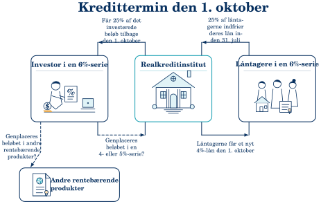{.chapter-figure width="100%" fig-alt="Illustration: 25% af en 6%-serie indfries. Den tilbagebetalte hovedstol skal måske placeres til 4% eller lavere."}

Illustration: 25% af en 6%-serie indfries. Den tilbagebetalte hovedstol skal måske placeres til 4% eller lavere. Læs juli som opsigelse og oktober som betaling; 25% skal her gælde hovedstolen, ikke antallet af låntagere.

::: {.notes}
Investorens reinvesteringsrisiko kaldes også genplaceringsrisiko. Ens kuponer kan give meget forskellige udtræk, når låntagerne er koncentreret forskelligt.
:::

## Låntagerkoncentration kan give et pludseligt stort udtræk {#ch05-s036}

Aprilterminen 2024: RD 6% 2053 IO10 havde ekstraordinært udtræk på **57,2%**.

Andre 6%-serier lå mellem 6,6% og 10,2%. NYK med/uden IO10 lå begge omkring 7,8%; Jyske omkring 6,6% og 8,6%.

Afdragsfrihed eller kupon alene forklarer derfor ikke RD-observationen.

::: {.notes}
Retningen er nu vendt: koncentration blandt låntagere gør investors betalinger usikre. Kilde: Vitec Scanrate.
:::

## RD-serien skiller sig ud i hele markedsoversigten {#ch05-s037}

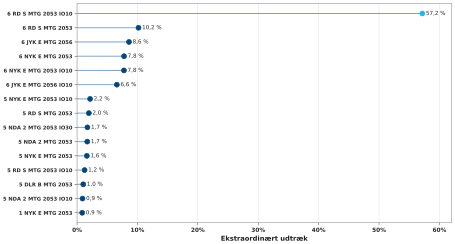{.chapter-figure width="100%" fig-alt="De 15 største ekstraordinære udtræk, april 2024. Næststørste udtræk var 10,2%. Kilde: Vitec Scanrate."}

De 15 største ekstraordinære udtræk, april 2024. Næststørste udtræk var 10,2%. Kilde: Vitec Scanrate. 

::: {.notes}
Oversigten indeholder både lån med afdrag og IO-serier. Brug den til at teste, om en udvalgt sammenligning er repræsentativ.
:::

## Kurs og Gain lå tæt, men udtrækket blev forskelligt {#ch05-s038}

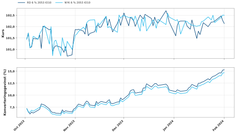{.chapter-figure width="100%" fig-alt="RD og NYK 6% 2053 IO10, oktober 2023–februar 2024. Begge paneler har samme tidsakse."}

RD og NYK 6% 2053 IO10, oktober 2023–februar 2024. Begge paneler har samme tidsakse. Kilder: Vitec Scanrate og Nasdaq Nordic.

::: {.notes}
Kilder: Vitec Scanrate og Nasdaq Nordic. Hverken kurs eller beregnet gevinst alene giver en nærliggende forklaring på forskellen i apriludtrækket.
:::

## De største RD-lån forsvandt før aprilterminen {#ch05-s039}

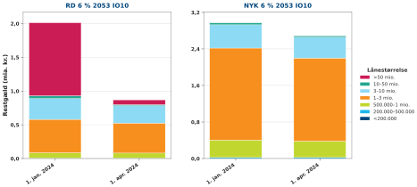{.chapter-figure width="100%" fig-alt="RD og NYK før januar/april 2024. Januar: 27. december 2023; april: RD 27. marts og NYK 25. marts. Kilde: Nasdaq Nordic."}

RD og NYK før januar/april 2024. Januar: 27. december 2023; april: RD 27. marts og NYK 25. marts. Kilde: Nasdaq Nordic. Lån over 50 mio. kr. i RD faldt fra cirka 1,08 til 0,07 mia. kr.

::: {.notes}
RD havde over halvdelen i lån over 50 mio. kr.; denne blok faldt fra cirka 1,08 til 0,07 mia. kr. NYK lå hovedsageligt i intervallet 1–3 mio. kr.
:::

## To fordelinger giver to koncentrationsrisici {#ch05-s040}

| Koncentration | Mekanisme | Særligt udsat |
|---|---|---|
| Få store investorer | Få sælgere og høj indfrielseskurs | Låntager |
| Få store låntagere | Store pludselige udtræk | Investor |

En prepaymentmodel må tage højde for låntagersammensætningen. En miksturmodel vægter grupper med forskellige reaktionsmønstre efter restgæld.

::: {.notes}
Den store låntager behøver ikke opføre sig mærkeligt for at gøre hele seriens cash flow vanskeligt at forudsige. Kapitel 6 formaliserer grupperne.
:::

## F-kort er låneproduktet; FLT er obligationen {#ch05-s041}

Kuponen følger en kort referencerente plus et obligationstillæg:

$$\text{Næste kupon}=\text{reference ved fixing}+q.$$

F-kort/FlexKort kan finansieres med forskellige floaterkonstruktioner. RenteMax har renteloft.

Reference kan være CIBOR, CITA eller DESTR. De endelige vilkår bestemmer dagtælling, afrunding og eventuelt gulv.

::: {.notes}
Balanceprincippet kræver sammenhæng mellem lån og funding, men ikke én universel konstruktion. Fremtidige forventede fixinger påvirker prisen, ikke kun seneste kupon.
:::

## To fixinger kan bestemme fire terminsbetalinger {#ch05-s042}

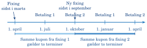{.chapter-figure width="100%" fig-alt="Martsfixingen gælder april–september og betalingerne 1. juli/1. oktober. Septemberfixingen gælder de næste to betalinger."}

Martsfixingen gælder april–september og betalingerne 1. juli/1. oktober. Septemberfixingen gælder de næste to betalinger. 

::: {.notes}
Datoerne er et almindeligt forløb; den konkrete obligations vilkår bestemmer præcist. Fixing og betaling er forskellige hændelser.
:::

## Lav varighed er ikke fravær af risiko {#ch05-s043}

Låntager: korte rentestigninger løfter ydelsen hurtigt og giver mindre budgetsikkerhed.

Investor: kuponen følger referencerenten, så kursen ofte ligger tættere på 100 end en lang fastforrentet obligation.

Spænd, likviditet, kreditforhold og regulering kan stadig ændre kursen. Cap, floor og eventuel pariret giver optionselementer.

::: {.notes}
En simpel inkonverterbar floater uden cap og floor er det klareste udgangspunkt. Tilføj derefter de konkrete kontraktvilkår.
:::

## På floaterauktionen byder investor på marginen {#ch05-s044}

Fastforrentet: kupon fast → markedet finder kurs.

Floaterauktion: udbudskurs tæt på 100, fx 100,20 → markedet finder $q$.

Efter auktionen ligger $q$ fast gennem obligationens løbetid:

$$\text{Kupon}_t=\text{referencerente ved fixing}_t+q.$$

Derefter flytter markedet kursen, når det krævede spænd ændres.

::: {.notes}
Auktionen flytter prisjusteringen ind i kuponen. Låntager får et eksplicit rentetillæg frem for primært en ny kursgevinst eller et kurstab.
:::

## Negative tillæg kan ledsage en positiv samlet rente {#ch05-s045}

Historiske auktionsresultater fra boggrundlaget:

| Obligation | Reference | Tillæg | Auktionskurs |
|---|---|---:|---:|
| RD grøn FRN Jul-2030 | CIBOR 6M | −15 bp | 100,300 |
| RD FRN Jul-2030 | CITA 6M | +50 bp | 100,300 |

CIBOR-referencen lå højere. Sammenlign tillæg med samme reference og observationsdato. »Fwd price« er auktionskursen ved afregning frem mod terminstart.

::: {.notes}
Negativ margin betyder ikke, at investor betaler for at eje obligationen. Auktionsdatoen er ikke angivet i bogtabellen; præsentér den som et historisk eksempel uden at opfinde en dato.
:::

## Et fast tillæg giver skiftende rentebetalinger {#ch05-s046}

Illustration uden dagtællingskorrektion og afrunding: $q=0{,}50$ procentpoint.

Reference 2,25% → kupon 2,75% p.a.:

$$100\cdot\frac{0{,}0275}{4}=0{,}6875$$

pr. 100 nominel i hver af de næste to lige lange terminer.

Næste reference 1,90% → kupon 2,40% → betaling 0,60. Tillægget er uændret.

::: {.notes}
Det er referencen, der fixes igen. Den samme kupon anvendes her ved to betalinger, fordi fixing er halvårlig og betaling kvartalsvis.
:::

## Én fixingdag og et gennemsnit reagerer forskelligt {#ch05-s047}

Endagsfixing er enkel, men en usædvanlig dag slår fuldt igennem.

Et flerdagesgennemsnit dæmper udsvinget og reagerer langsommere.

RD har CIBOR 6M-serier med én bankdag. Nykredit brugte i 2026 endagsfixing for CITA 6M og korrigeret femdagesgennemsnit for CIBOR 6M.

Metoden ligger fast i den enkelte obligations vilkår.

::: {.notes}
Kilder: RD serie 12R (2024), Nykredits auktionsvilkår (2026). Sammenlign ikke to satser, før fixingkonventionen er kontrolleret.
:::

## Hvad betaler investor for at overtage? {#ch05-s048}

Det krævede tillæg afhænger af reference, løbetid, udsteder og kreditkvalitet.

Derudover: likviditet/seriestørrelse, LCR-værdi, cap/floor/pariret, udbud/efterspørgsel og relativ pris mod RTL.

Grøn efterspørgsel kan give en *greenium* på få bp. Den forklarer ikke alene forskellen på 65 bp i auktionsparret.

::: {.notes}
En ønsket margin mod referencekurven må oversættes til kuponmargin med korrektioner for kurs, afdrag, konventioner og optioner. De tekniske korrektioner ligger uden for kapitlets pensum.
:::

## Hvorfor købe en floater? {#ch05-s049}

Låntagers rente = reference + obligationstillæg til investor + bidrag til institut.

Investor kan ønske:

- lav varighed i en kort portefølje,
- højere fixinger end markedet har indregnet, fx færre/senere rentenedsættelser,
- relativ værdi ved midlertidigt stort udbud og forventet senere fald i spændet.

::: {.notes}
Et floaterkøb behøver ikke bygge på en forventning om stigende renter. Spænd og markedspriser i forhold til andre korte obligationer kan være afgørende.
:::

## Quoted margin og discount margin har hver sin plads {#ch05-s050}

Stiliseret stående floater med nominel 100:

$$P=\sum_{i=1}^{n}\frac{100(\widehat r_i^{\text{ref}}+q)\Delta_i}{(1+z_{t_i}+s)^{t_i}}+\frac{100}{(1+z_{t_n}+s)^{t_n}}.$$

$q$: quoted margin i kuponen. $s$: implicit discount margin i diskonteringen.

$\widehat r_i^{\text{ref}}$: fremskrevet reference, $\Delta_i$: periodens længde, $t_i$: betalingstid, $z_{t_i}$: nulkuponrente.

::: {.notes}
Fremtidige referencerenter fremskrives fra forwardkurven. Formlen forklarer sammenhængen; de tekniske beregninger er ikke pensumkrav.
:::

## Kursen forbinder de to marginer {#ch05-s051}

I den stiliserede én-kurve-model:

| Kurs | Forhold mellem marginer |
|---|---|
| Omkring 100 | $q$ og $s$ omtrent ens |
| Over 100 | Effektivt spænd $s$ lavere end $q$ |
| Under 100 | Effektivt spænd $s$ højere end $q$ |

Efter auktionen er $q$ fast. Højere krævet $s$ sænker kursen. Ved overkurs skal $q$ være højere for at give samme effektive spænd.

::: {.notes}
Investor betaler en overkurs, men får 100 tilbage ved udløb. Almindelig effektiv rente er mindre egnet til floaters, fordi den afhænger af antagelser om fremtidige fixinger.
:::

## En asset swap gør fast rente sammenlignelig med variabel rente {#ch05-s052}

Fastforrentet obligation + renteswap → syntetisk floater.

Floaterens discount margin kan sammenlignes med en fast obligations asset-swap-spænd (ASW).

Bredere spænd kan indikere billigere pris, når referencekurver og risici er sammenlignelige.

Kontrollér udsteder, løbetid, likviditet, afdrag, regulatorisk værdi og optioner. CIBOR-, CITA- og OIS-spænd er ikke direkte ens.

::: {.notes}
Formålet er forståelsen af relativ værdi, ikke en teknisk ASW-beregning. Kapitel 7 indfører OAS som det modelbaserede investorspænd.
:::

## RTL binder renten frem til næste refinansiering {#ch05-s053}

F1: typisk ét år. F3: tre år. F5: fem år.

Korte obligationer udløber og erstattes af nye. Låntager har et langt lån, men funding er kortere.

Auktion nogle uger før termin bestemmer markedskurs og ny lånerente. Svag efterspørgsel eller stort samtidigt udbud kan gøre finansieringen dyrere.

::: {.notes}
RTL er forskelligt fra F-kort, hvor kuponen justeres efter en reference under samme obligation. Tilsynsdiamanten begrænser koncentreret kort funding.
:::

## Uden triggers ligner RTL en stående kuponobligation {#ch05-s054}

Nominel 1, årlig kupon $c$, effektiv rente $y_i$, udløb om $i$ år:

$$k_0^i=\sum_{t=1}^{i}\frac{c}{(1+y_i)^t}+\frac1{(1+y_i)^i}.$$

Der ses bort fra vedhængende rente og triggers. Investor får kuponer og hovedstol ved planlagt udløb.

En trigger kan ændre udløbet og dermed betalingsrækken.

::: {.notes}
Det er grundformen fra kapitel 2; kapitel 3 giver kurvebaseret prisfastsættelse. Brug den kun som udgangspunkt, når kontrakten har forlængelsesvilkår.
:::

## Ét afdragsfrit F3-lån kan kræve tre obligationer {#ch05-s055}

Bogeksempel efter Astrup Jensen (2020), eksempel 11.4.

Hovedstol $RG_0=1.000.000$ kr.; første periode tre år uden afdrag. Tre stående obligationer med kupon 1% og udløb efter ét, to og tre år.

$N_1,N_2,N_3$ er nominelle beløb i kroner; $\bar R$ er låntagers årlige rente.

Decimalpriser $k_0^i=K_0^i/100$ er givne markedsinput.

::: {.notes}
Eksemplet beregner mængder og lånerente, ikke obligationskurserne. Sørg for, at N ikke misforstås som en rentesats.
:::

## Funding skal passe både ved start og i hvert år {#ch05-s056}

$$\begin{aligned}
\text{År 0: }&k_0^1N_1+k_0^2N_2+k_0^3N_3=RG_0,\\
\text{År 1: }&1{,}01N_1+0{,}01N_2+0{,}01N_3=\bar RRG_0,\\
\text{År 2: }&1{,}01N_2+0{,}01N_3=\bar RRG_0,\\
\text{År 3: }&1{,}01N_3=(1+\bar R)RG_0.
\end{aligned}$$

Ved år 3 skaffer refinansieringen hovedstolen til at indfri den gamle funding. Låntager skylder fortsat $RG_0$.

::: {.notes}
Fire ligninger bestemmer fire ukendte. År 1 og 2 finansieres af låntagers renter; år 3 får også provenu fra den nye funding.
:::

## Små hjælpeudstedelser matcher de første års betalinger {#ch05-s057}

Ved $k_0^1=0{,}99$, $k_0^2=0{,}975$ og $k_0^3=0{,}96$:

$$\begin{aligned}
N_1&=13.540{,}75\text{ kr.},\\
N_2&=13.676{,}16\text{ kr.},\\
N_3&=1.013.812{,}92\text{ kr.},\\
\bar R&=2{,}39510\%.
\end{aligned}$$

Treårsudstedelsen finansierer det meste. De små udstedelser får de årlige betalinger til at passe.

::: {.notes}
Match-funding forklarer mængderne. Bed deltagerne følge, hvilke betalinger de to små obligationer hjælper med at dække.
:::

## Alle tre obligationer udstedes ved lånets start {#ch05-s058}

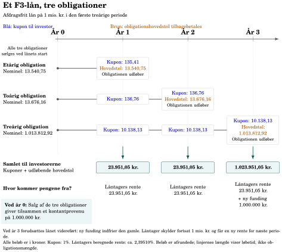{.chapter-figure width="100%" fig-alt="De små obligationer udløber i år 1 og 2. Den store treårige obligation indfries ved refinansieringen."}

De små obligationer udløber i år 1 og 2. Den store treårige obligation indfries ved refinansieringen. 

::: {.notes}
Med et annuitetslån ville afdragene reducere beløbet, der skal refinansieres i år 3. Afdragsfriheden isolerer fundingbehovet i eksemplet.
:::

## F3-eksemplet: kuponer og hovedstol i kroner {#ch05-s059}

| Betaling til investor | År 1 | År 2 | År 3 |
|---|---:|---:|---:|
| Kupon, etårig | 135,41 | – | – |
| Hovedstol, etårig | 13.540,75 | – | – |
| Kupon, toårig | 136,76 | 136,76 | – |
| Hovedstol, toårig | – | 13.676,16 | – |
| Kupon, treårig | 10.138,13 | 10.138,13 | 10.138,13 |
| Hovedstol, treårig | – | – | 1.013.812,92 |
| **Samlet** | **23.951,05** | **23.951,05** | **1.023.951,05** |

År 3: låntagers rente 23.951,05 kr. + ny funding 1 mio. kr. Alle beløb er afrundede.

::: {.notes}
Betalingerne er figurens oprindelige tal, nu vist som tabel. Ved år 0 giver salget 1 mio. kr.; figurens linjelængder viser løbetid, ikke mængder.
:::

## Afdrag reducerer beløbet ved næste refinansiering {#ch05-s060}

Et 30-årigt annuitetslån med F3-rentebinding finansieres heller ikke 30 år ad gangen.

Afdrag i de første tre år reducerer restgælden. Ved refinansiering skal instituttet derfor kun skaffe $RG_3$.

Det ændrer obligationsmængderne og kan også ændre låntagers gennemsnitsrente. Bogens afdragsfrie eksempel isolerer funding i første periode.

::: {.notes}
Kilde til den fulde annuitetsberegning: Astrup Jensen (2020), eksempel 11.5, s. 211–212.
:::

## Triggers kan gøre obligationen længere end planlagt {#ch05-s061}

- Auktionstrigger: forlængelse, når auktionen fejler på grund af utilstrækkelig efterspørgsel.
- Rentetrigger: forlængelse ved et tilstrækkeligt stort rentespring.

Låntager beskyttes mod akut refinansieringspres; investor får forlængelsesrisiko.

Vilkårene bestemmer den konkrete trigger. Prisningen skal vægte betalinger i flere scenarier.

::: {.notes}
På en floater kan kuponen falde, når korte renter falder. På RTL er de ekstraordinære refinansieringsvilkår et særskilt risikoelement.
:::

## Fejlet auktion og rentetrigger følger forskellige forløb {#ch05-s062}

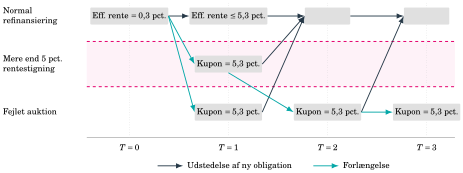{.chapter-figure width="100%" fig-alt="Skematisk eksempel: 0,3% til 5,3% svarer til 5 procentpoint. Følg pile for nyudstedelse og forlængelse."}

Skematisk eksempel: 0,3% til 5,3% svarer til 5 procentpoint. Følg pile for nyudstedelse og forlængelse. 

::: {.notes}
Originalens rækkelabel siger 5 pct.; de viste renteniveauer adskilles med 5 procentpoint. Den præcise kontrakt og triggergrænse skal aflæses i vilkårene.
:::

## Volatilitet påvirker sandsynligheden for forlængelse {#ch05-s063}

Samme forventede rente kan give forskellige triggerudfald ved forskellig volatilitet.

RTL-triggeren er indlejret optionalitet, selv om den udløses automatisk.

Konvertering kan forkorte betalinger ved rentefald; RTL-trigger kan forlænge dem ved stress. Investor kan få både længere løbetid og rente, der ikke følger markedet fuldt.

::: {.notes}
Sammenlignet med en ellers tilsvarende obligation uden trigger giver det typisk lavere pris eller højere krævet spænd. Effekten afhænger af vilkår og triggersandsynlighed.
:::

## Tre produkter giver forskellig rentebinding {#ch05-s064}

| | Fast konverterbart | Floater/F-kort | RTL |
|---|---|---|---|
| Rentebinding | Op til 30 år | Kort, løbende fixing | F1/F3/F5-vindue |
| Renten sættes af | Lang kupon | Reference + tillæg | Auktion |
| Funding | Lang MTG | Variabel FLT | Kort stående RTL |
| Pariret | Ja | Muligt | Nej |

Tabellens pariret vedrører den generelle konverteringsret; konkrete indfrielsesvilkår følger kontrakten.

::: {.notes}
Sammenlign først binding og rentefastsættelse. Den næste slide viser, hvem der bærer risikoen.
:::

## Samme produktnavn rummer forskellige risici for de to parter {#ch05-s065}

| Produkt | Låntager | Investor |
|---|---|---|
| Fast konverterbart | Betaler for budgetsikkerhed | Konvertering og genplacering |
| Floater/F-kort | Hurtigt stigende ydelse | Faldende kupon og ændret spænd |
| RTL | Ny rente ved refinansiering | Refinansieringsmekanik og forlængelse |

F-kort kan stige midt i F3-vinduet, hvor F3-renten fortsat er fast.

::: {.notes}
Sammenlign altid samme part: lav renterisiko for investor kan betyde høj risiko for låntagers løbende ydelse.
:::

## Kort fixing kan ramme længe før næste refinansiering {#ch05-s066}

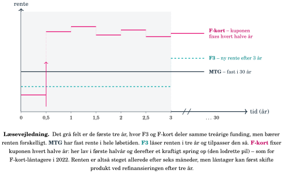{.chapter-figure width="100%" fig-alt="Ét illustrativt forløb: F-kort fixes halvårligt, F3 efter tre år og MTG er fast. Figuren antager treårig funding."}

Ét illustrativt forløb: F-kort fixes halvårligt, F3 efter tre år og MTG er fast. Figuren antager treårig funding. Figurens udsagn om produktskift ved refinansiering kræver kontrol af det konkrete låns indfrielsesvilkår.

::: {.notes}
Bogens figur siger, at produktskift først kan ske ved refinansiering. Det er en forenkling, som kræver de konkrete indfrielsesvilkår; figuren bør primært bruges til at vise forskellen i rentebinding.
:::

## Tilbudslukning og årgangsskifte er forskellige hændelser {#ch05-s067}

**Kursdrevet:** rentestigning gør lavkuponer mindre attraktive som ny funding; rentefald kan sende højkuponen over tilbudsgrænsen. Serien kan blive relevant igen senere.

**Årgang:** permanent udstedelseslukning på en fastlagt dato. RD’s 2056-årgang lukker 31. august 2026; 2059-årgangen overtager.

En årgang kan være åben i tre år, mens den enkelte kupon først åbner, når renten gør den relevant.

::: {.notes}
Gamle gyldige tilbud kan fortsat give adgang til udbetaling ved en kursdrevet tilbudslukning. Udstedelseshistorikken bestemmer, hvilke låntagere der kommer ind hvornår.
:::

## Rentestigninger gjorde højere kuponer relevante i 2022 {#ch05-s068}

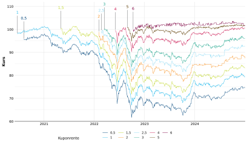{.chapter-figure width="100%" fig-alt="Følg åbningen af nye RD-serier gennem markedsbevægelsen. Kilde: Nasdaq Nordic."}

Følg åbningen af nye RD-serier gennem markedsbevægelsen. Kilde: Nasdaq Nordic. 

::: {.notes}
Figuren er historisk og illustrerer kursdrevet produktvalg. Den planlagte årgangsmekanik er en separat årsag til nye serier.
:::

## Udstedelseshistorikken følger med ind i modellen {#ch05-s069}

Åbne serier får nye lån. Lukkede serier ændres gennem afdrag og indfrielser.

CK95: næste offentliggjorte udtræk. CK92: låntagergrupper. Prepaymentmodel: fremtidig konvertering. Prisningsmodel: kurs, varighed og konveksitet.

Debitorspænd (LYS i kapitel 5) vedrører låntagers refinansiering; OAS vedrører investors modelpris. Begge adskilles fra bidrag.

::: {.notes}
Floaters og RTL har hovedsageligt mekanisk usikkerhed om fixing og auktion. Fastforrentede konverterbare kræver derudover modellering af låntagernes aktive beslutninger.
:::

## Produktdesignet bestemmer, hvilke betalinger der er usikre {#ch05-s070}

Balanceprincippet og match-funding reducerer instituttets markedsrisiko, mens risikoen fordeles mellem parterne.

Investorfordeling påvirker pris og likviditet. Låntagerfordeling påvirker udtræk og betalingstidspunkter.

Kupon og afdrag til investor; bidrag til institut. Kapitel 6 omsætter låntagers adfærd til betalingsrækker.

::: {.notes}
Afslut med at få deltagerne til at nævne en risiko for hver af de tre parter. Det binder markedet og produkterne sammen.
:::

## Opgaver: LTV og kontantprovenu {#ch05-s071}

**Balanceprincip og LTV:** En helårsbolig koster 4.000.000 kr.; ønsket realkreditlån 3.200.000 kr. Beregn LTV, vurder bogens grænse og forklar dens betydning for investor.

**Kursværdi:** Nominelt lån 2.500.000 kr. til kurs 97,20. Beregn provenu og kurstab. Hvorfor kan ønsket kontantprovenu kræve en større nominel hovedstol?

::: {.notes}
Lad deltagerne angive enhederne før beregningen og forklare, hvilken værdi der står i hver nævner.
:::

## Opgave: koncentration på begge sider af serien {#ch05-s072}

- Hvorfor kan pension og banker efterspørge forskellige produkter?
- Hvordan påvirker udenlandsk efterspørgsel kurs og krævet afkast?
- Hvorfor kan én stor investor påvirke markedet uden at forklare hele renteniveauet?
- Hvem bærer risikoen ved investor- henholdsvis låntagerkoncentration?
- Hvorfor kan samme kurs og Gain give forskellige udtræk?

::: {.notes}
Lad deltagerne bruge de synlige figurer og selv skelne dokumenteret observation fra mulig årsag.
:::

## Opgaver: konvertering og betalingernes modtagere {#ch05-s073}

**Konvertering:** Et 5%-lån handler efter rentefald til 104, og en ny 3%-serie er åbnet. Forklar låntagers interesse, investors problem og de to indfrielsesveje.

**Betalinger:** Et variabelt lån har reference, obligationstillæg, bidrag og afdrag. Hvem modtager hvad? Hvorfor er bidrag ikke obligationscash flow? Hvorfor er bidrag typisk højere ved høj LTV og afdragsfrihed?

::: {.notes}
Spørg til forskellen mellem rentetillæg og bidrag. Scenariet giver ikke en fuld anbefaling om omlægning.
:::

## Opgaver: F-kort, RTL og F3-funding {#ch05-s074}

- Forklar forskellen på løbende fixing og refinansiering.
- Hvorfor handler floaters ofte nærmere 100 end lange faste obligationer?
- Hvad betyder reference plus tillæg, og hvordan påvirker auktionen lånerenten?
- Forklar $N_1,N_2,N_3,RG_0$ og $\bar R$ i F3-eksemplet.
- Hvorfor kræves år 0-ligningen, og hvordan kan ét lån have flere fundingobligationer?

::: {.notes}
De afsluttende opgaver genbruger kapitlets formler og input. 
:::
