## Hvilke betalinger får investor faktisk? {#ch06-s001}

Låntager kan indfri til kurs 100. Investorens fremtidige betalinger afhænger derfor af låntagernes beslutninger.

Forløbet går fra observerede indfrielser og låntagergrupper til refinansieringsgevinst, CPR og betalinger på rentestier.

Resultatet er betalingsrækker. Kapitel 7 finder deres pris og risiko.

::: {.notes}
Den samme kupon og løbetid sikrer ikke samme cash flow. Start med at sammenligne de to betalingsfigurer.
:::

## Uden konvertering følger betalingerne kontrakten {#ch06-s002}

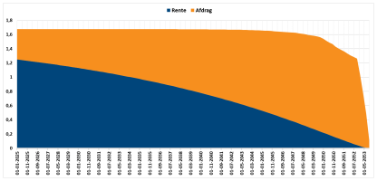{.chapter-figure width="100%" fig-alt="5% NYK 2053, pr. 100 kr. nominel fra 1. januar 2025. Renter og ordinære afdrag fortsætter til 2053. Kilde: Vitec Scanrate."}

5% NYK 2053, pr. 100 kr. nominel fra 1. januar 2025. Renter og ordinære afdrag fortsætter til 2053. Kilde: Vitec Scanrate. 

::: {.notes}
Vis den lange hale af betalinger og brug den som reference for næste figur.
:::

## Konvertering flytter hovedstol frem i tid {#ch06-s003}

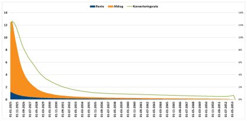{.chapter-figure width="100%" fig-alt="Samme obligation og startdato. Venstre skala er anderledes end før; den grønne rates periode er ikke dokumenteret. Kilde: Vitec Scanrate."}

Samme obligation og startdato. Venstre skala er anderledes end før; den grønne rates periode er ikke dokumenteret. Kilde: Vitec Scanrate. 

::: {.notes}
Sammenlign tidspunkterne, ikke søjlehøjderne direkte. Den viste leverandørrate skal ikke læses som dokumenteret kvartals-CPR.
:::

## Fremrykket hovedstol skal geninvesteres {#ch06-s004}

Når renten falder, bliver det gamle lån dyrere relativt til ny finansiering.

Låntager indfrier → investor får hovedstolen tidligere → færre fremtidige kuponer.

Pengene skal ofte geninvesteres i et marked med lavere renter. Det er reinvesteringsrisiko.

::: {.notes}
Låntagers fordel og investors ulempe er to sider af samme ret. Før adfærden modelleres, skal indfrielserne måles korrekt.
:::

## CPR har en anden nævner end de øvrige udtræksrater {#ch06-s005}

| Rate | Betydning | Grundlag |
|---|---|---|
| ORD | Ordinært udtræk | Restgæld før ordinært afdrag |
| EXT | Ekstraordinært udtræk | Samme begyndelsesrestgæld |
| UDT | Samlet udtræk | Samme begyndelsesrestgæld |
| CPR | Conditional Prepayment Rate | Restgæld **efter** ordinært afdrag |

Alle kapitlets egne rater er pr. kvartalsvis termin og bruges som decimaltal i formler.

::: {.notes}
Afklar både periode og nævner. En CPR på 3 procent bliver 0,03 i beregningen.
:::

## En kvartalsrate er ikke en årsrate {#ch06-s006}

$$CPR^{\text{år}}=1-(1-CPR)^4.$$

Ved konstant kvartalsvis CPR på 3%:

$$1-(1-0{,}03)^4\approx11{,}5\%.$$

Den overlevende restgæld skal overleve fire kvartaler. Historiske leverandørfigurer kan bruge andre konventioner.

::: {.notes}
Den effektive årsækvivalent forudsætter samme betingede rate i alle fire kvartaler. Multiplikation med fire er kun en tilnærmelse.
:::

## Fra CPR til samlet udtræk {#ch06-s007}

$$EXT_t=CPR_t(1-ORD_t),$$
$$UDT_t=ORD_t+CPR_t(1-ORD_t)=ORD_t+EXT_t.$$

Omvendt:

$$CPR_t=\frac{EXT_t}{1-ORD_t}.$$

De ekstraordinære indfrielser beregnes efter det ordinære afdrag.

::: {.notes}
Med en begyndelsesrestgæld på 100 ses, hvorfor CPR beregnes efter det ordinære afdrag. De konkrete tal står på næste slide.
:::

## 3% CPR giver 3,388% samlet udtræk {#ch06-s008}

Undervisningseksempel: $ORD=0{,}004$, $CPR=0{,}030$, restgæld 100 og rente 1,25.

$$UDT=0{,}004+0{,}030(1-0{,}004)=0{,}03388.$$

Ordinært afdrag: 0,400. Ekstraordinært: $0{,}030\cdot99{,}6=2{,}988$.

$$CF=1{,}25+0{,}400+2{,}988=4{,}638.$$

Restgæld bagefter: $100-0{,}400-2{,}988=96{,}612$.

::: {.notes}
Beløbene er pr. 100 i begyndelsesrestgæld. CPR og samlet udtræk er forskellige rater, selv om forskellen kan være lille.
:::

## Udtræk er betaling nu og færre betalinger senere {#ch06-s009}

$$CF_t=I_t+N_{t-1}UDT_t,$$
$$N_t=N_{t-1}(1-UDT_t).$$

$N_{t-1}$ er restgælden før ordinært afdrag; $I_t$ er terminens rente.

Det udtrukne beløb betales nu. Den mindre restgæld reducerer senere renter og afdrag.

::: {.notes}
Hovedstolsregnskabet forbinder CPR med investorens betalinger.
:::

## Historisk CPR følger både kupon og renteniveau {#ch06-s010}

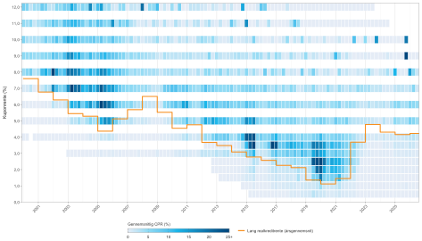{.chapter-figure width="100%" fig-alt="2000–2026: mørke felter viser høj aktivitet, orange linje den lange realkreditrente. Rateperiode og vægtning er ikke dokumenteret."}

2000–2026: mørke felter viser høj aktivitet, orange linje den lange realkreditrente. Rateperiode og vægtning er ikke dokumenteret. Kilder: Vitec Scanrate og Finans Danmark.

::: {.notes}
Kilder: Vitec Scanrate og Finans Danmark. Brug figuren til det relative mønster, ikke til direkte sammenligning med kvartalsrater.
:::

## Tre datatyper løser forskellige opgaver {#ch06-s011}

- **Stamdata:** kupon, udløb, cirkulerende nominel og ordinær ydelsesrække.
- **CK95:** offentliggjort endeligt udtræk for næste termin.
- **CK92:** fordeling af restgæld på låntagergrupper.

Konvertering afhænger også af omkostninger og tidligere indfrielser. En fast CPR for hele levetiden er utilstrækkelig.

::: {.notes}
Den kontraktlige betalingsplan er modellens startpunkt. CK95 og CK92 skal læses sammen med den.
:::

## Næste udtræk bliver kendt før betalingsterminen {#ch06-s012}

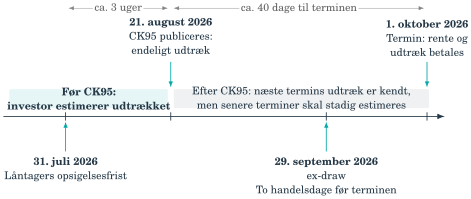{.chapter-figure width="100%" fig-alt="Tidslinjen gælder 1. oktober 2026: opsigelse, CK95-publicering, ex-draw og betaling."}

Tidslinjen gælder 1. oktober 2026: opsigelse, CK95-publicering, ex-draw og betaling. Opsigelse cirka to måneder før; publicering typisk cirka 40 dage før; ex-draw to handelsdage før.

::: {.notes}
Efter publicering er senere terminer stadig usikre.
:::

## CK95 viser stor forskel mellem 4% og 5% {#ch06-s013}

Termin 1. oktober 2024. Kilde: Vitec Scanrate.

| | NYK 5% 2053 | NYK 4% 2053 |
|---|---:|---:|
| Cirkulerende, mio. kr. | 62.096,027 | 43.832,959 |
| Udtrukket, mio. kr. | 2.155,258 | 148,166 |
| UDT | 3,47% | 0,34% |
| EXT | 3,06% | 0,01% |
| ORD, beregnet | 0,41% | 0,33% |
| CPR, beregnet | 3,07% | 0,01% |

::: {.notes}
Tabellen er et særskilt historisk eksempel, ikke data fra tidslinjen i 2026. Beregnet CPR er leverandørens tal.
:::

## CK95 kan kontrollere et tidligere modelskøn {#ch06-s014}

$$CPR=\frac{EXT}{1-ORD}.$$

Et skøn lavet før publicering sammenholdes med CK95 for samme termin og ratekonvention.

Højere CPR i 5%-serien er foreneligt med et større incitament; tabellen fastslår ikke årsagen alene.

Under kurs 100 kan tilbagekøb reducere restgælden uden ekstraordinært **pariudtræk** i CK95.

::: {.notes}
Ved kurs 85 er markedstilbagekøb normalt billigere end pari. Retten til pari kan stadig have værdi, hvis renterne senere falder. Dette gælder også flytning og opkonvertering.
:::

## CK92 viser restgældens fordeling, ikke hele låntageren {#ch06-s015}

Samme serie kan indeholde små privatlån, store privatlån og erhvervslån.

CK92 viser restgæld og låntype. Data viser ikke rådgiver, geografi eller personlige renteforventninger.

Eksempel: 5% NYK 2053, 23. september 2024. Kilde: Vitec Scanrate. De næste slides bevarer alle syv intervaller.

::: {.notes}
Intervallerne bruges som observerbare grupper. Reaktionshastigheden kan ikke aflæses direkte af CK92.
:::

## CK92: de små låneintervaller {#ch06-s016}

Restgæld i kroner, 23. september 2024.

| Interval | Privat | Privatandel | Erhverv | Erhvervsandel |
|---|---:|---:|---:|---:|
| 1 | 11.183.652 | 0,0% | 196.996 | 0,0% |
| 2 | 723.731.274 | 1,2% | 3.989.296 | 0,0% |
| 3 | 8.921.275.859 | 14,9% | 32.911.710 | 0,1% |

Total pr. interval: 11.380.648; 727.720.570; 8.954.187.569 kr.

Andele er af hele seriens restgæld. Interval 1–3: op til 1 mio. kr.

::: {.notes}
Kilde: Vitec Scanrate. Små viste procentandele er afrundede; et beløb kan godt være positivt, selv om den viste andel er 0,0 procent.
:::

## CK92: mellemstore og store låneintervaller {#ch06-s017}

Restgæld i kroner, 23. september 2024.

| Interval | Privat | Privatandel | Erhverv | Erhvervsandel |
|---|---:|---:|---:|---:|
| 4 | 41.113.552.151 | 68,8% | 304.093.077 | 0,5% |
| 5 | 7.338.187.525 | 12,3% | 429.406.809 | 0,7% |
| 6 | 44.698.729 | 0,1% | 506.186.999 | 0,8% |
| 7 | – | 0,0% | 331.326.781 | 0,6% |

Interval 4–5: 1–10 mio. kr. Interval 6–7: over 10 mio. kr.

::: {.notes}
Kilde: Vitec Scanrate. De store intervaller domineres her af erhverv. Fortsæt til totalerne, før der dannes gruppevægte.
:::

## CK92: kontrollér totalerne før vægtningen {#ch06-s018}

| Interval | Samlet restgæld, kr. |
|---|---:|
| 4 | 41.417.645.228 |
| 5 | 7.767.594.334 |
| 6 | 550.885.728 |
| 7 | 331.326.781 |

Privat: 58.152.629.190 kr. (97,3%). Erhverv: 1.608.111.668 kr. (2,7%).

Samlet: **59.760.740.858 kr.**

::: {.notes}
Alle tal kommer fra råtabellen for 23. september 2024. Totalen er nævner, når privat og erhverv samles i lånestørrelsesgrupper.
:::

## Låntagersammensætningen varierer mellem sammenlignelige serier {#ch06-s019}

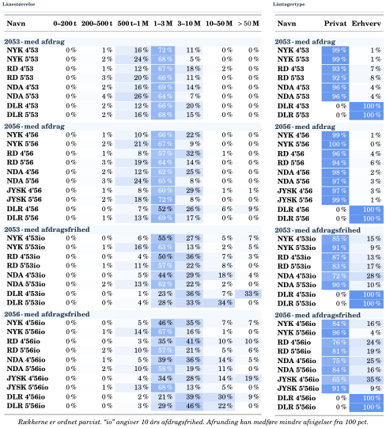{.chapter-figure width="100%" fig-alt="Tværsnit juli 2026: sammenlign kupon, udsteder, udløb og afdragsprofil."}

Tværsnit juli 2026: sammenlign kupon, udsteder, udløb og afdragsprofil. Kilde: Vitec Scanrate, juli 2026.

::: {.notes}
Figuren er nyere end CK92-råtabellen. Sammenlign panelerne med samme lånestørrelsesgrupper.
:::

## 2053 med afdrag (1/2): lånestørrelser {#ch06-s020}

Juli 2026. Andele af obligationsrestgælden i %. Lånestørrelse i mio. kr.

| Serie | 0–0,2 | 0,2–0,5 | 0,5–1 | 1–3 | 3–10 | 10–50 | >50 |
|---|---:|---:|---:|---:|---:|---:|---:|
| NYK 4'53 | 0 | 1 | 16 | 72 | 11 | 0 | 0 |
| NYK 5'53 | 0 | 2 | 24 | 68 | 5 | 0 | 0 |
| RD 4'53 | 0 | 1 | 12 | 67 | 18 | 2 | 0 |
| RD 5'53 | 0 | 3 | 20 | 66 | 11 | 0 | 0 |
| NDA 4'53 | 0 | 2 | 16 | 69 | 14 | 0 | 0 |
| NDA 5'53 | 0 | 4 | 26 | 64 | 7 | 0 | 0 |

Sammenlign 4% og 5% inden for samme udsteder. Kilde: Vitec Scanrate. Afrunding kan give summer lidt over eller under 100%.

::: {.notes}
Tabellen bevarer alle syv intervaller fra oversigtsfiguren. Læs parvist før sammenligning på tværs af udstedere. io betegner ti års afdragsfrihed.
:::

## 2053 med afdrag (1/2): privat og erhverv {#ch06-s021}

Juli 2026. Andele af obligationsrestgælden i %.

| Serie | Privat | Erhverv |
|---|---:|---:|
| NYK 4'53 | 99 | 1 |
| NYK 5'53 | 99 | 1 |
| RD 4'53 | 93 | 7 |
| RD 5'53 | 92 | 8 |
| NDA 4'53 | 96 | 4 |
| NDA 5'53 | 96 | 4 |

Kilde: Vitec Scanrate. Afrundede andele; io betyder 10 års afdragsfrihed. Sammenhold låntagertype med lånestørrelserne på forrige slide.

::: {.notes}
Fordelingen mellem privat og erhverv er en anden opdeling af samme restgæld, ikke en ekstra lånestørrelsesgruppe. DLR-rækkerne viser kun erhvervslån i dette tværsnit.
:::

## 2053 med afdrag (2/2): lånestørrelser {#ch06-s022}

Juli 2026. Andele af obligationsrestgælden i %. Lånestørrelse i mio. kr.

| Serie | 0–0,2 | 0,2–0,5 | 0,5–1 | 1–3 | 3–10 | 10–50 | >50 |
|---|---:|---:|---:|---:|---:|---:|---:|
| DLR 4'53 | 0 | 2 | 12 | 66 | 20 | 0 | 0 |
| DLR 5'53 | 0 | 2 | 16 | 68 | 15 | 0 | 0 |

Sammenlign 4% og 5% inden for samme udsteder. Kilde: Vitec Scanrate. Afrunding kan give summer lidt over eller under 100%.

::: {.notes}
Tabellen bevarer alle syv intervaller fra oversigtsfiguren. Læs parvist før sammenligning på tværs af udstedere. io betegner ti års afdragsfrihed.
:::

## 2053 med afdrag (2/2): privat og erhverv {#ch06-s023}

Juli 2026. Andele af obligationsrestgælden i %.

| Serie | Privat | Erhverv |
|---|---:|---:|
| DLR 4'53 | 0 | 100 |
| DLR 5'53 | 0 | 100 |

Kilde: Vitec Scanrate. Afrundede andele; io betyder 10 års afdragsfrihed. Sammenhold låntagertype med lånestørrelserne på forrige slide.

::: {.notes}
Fordelingen mellem privat og erhverv er en anden opdeling af samme restgæld, ikke en ekstra lånestørrelsesgruppe. DLR-rækkerne viser kun erhvervslån i dette tværsnit.
:::

## 2056 med afdrag (1/2): lånestørrelser {#ch06-s024}

Juli 2026. Andele af obligationsrestgælden i %. Lånestørrelse i mio. kr.

| Serie | 0–0,2 | 0,2–0,5 | 0,5–1 | 1–3 | 3–10 | 10–50 | >50 |
|---|---:|---:|---:|---:|---:|---:|---:|
| NYK 4'56 | 0 | 1 | 10 | 66 | 22 | 0 | 0 |
| NYK 5'56 | 0 | 2 | 21 | 67 | 9 | 0 | 0 |
| RD 4'56 | 0 | 1 | 8 | 57 | 32 | 1 | 0 |
| RD 5'56 | 0 | 3 | 19 | 64 | 14 | 0 | 0 |
| NDA 4'56 | 0 | 2 | 12 | 62 | 25 | 0 | 0 |
| NDA 5'56 | 0 | 3 | 24 | 65 | 8 | 0 | 0 |

Sammenlign 4% og 5% inden for samme udsteder. Kilde: Vitec Scanrate. Afrunding kan give summer lidt over eller under 100%.

::: {.notes}
Tabellen bevarer alle syv intervaller fra oversigtsfiguren. Læs parvist før sammenligning på tværs af udstedere. io betegner ti års afdragsfrihed.
:::

## 2056 med afdrag (1/2): privat og erhverv {#ch06-s025}

Juli 2026. Andele af obligationsrestgælden i %.

| Serie | Privat | Erhverv |
|---|---:|---:|
| NYK 4'56 | 99 | 1 |
| NYK 5'56 | 100 | 0 |
| RD 4'56 | 96 | 4 |
| RD 5'56 | 94 | 6 |
| NDA 4'56 | 98 | 2 |
| NDA 5'56 | 97 | 3 |

Kilde: Vitec Scanrate. Afrundede andele; io betyder 10 års afdragsfrihed. Sammenhold låntagertype med lånestørrelserne på forrige slide.

::: {.notes}
Fordelingen mellem privat og erhverv er en anden opdeling af samme restgæld, ikke en ekstra lånestørrelsesgruppe. DLR-rækkerne viser kun erhvervslån i dette tværsnit.
:::

## 2056 med afdrag (2/2): lånestørrelser {#ch06-s026}

Juli 2026. Andele af obligationsrestgælden i %. Lånestørrelse i mio. kr.

| Serie | 0–0,2 | 0,2–0,5 | 0,5–1 | 1–3 | 3–10 | 10–50 | >50 |
|---|---:|---:|---:|---:|---:|---:|---:|
| JYSK 4'56 | 0 | 1 | 8 | 60 | 29 | 1 | 1 |
| JYSK 5'56 | 0 | 2 | 18 | 72 | 8 | 0 | 0 |
| DLR 4'56 | 0 | 0 | 7 | 52 | 26 | 6 | 9 |
| DLR 5'56 | 0 | 1 | 13 | 69 | 17 | 0 | 0 |

Sammenlign 4% og 5% inden for samme udsteder. Kilde: Vitec Scanrate. Afrunding kan give summer lidt over eller under 100%.

::: {.notes}
Tabellen bevarer alle syv intervaller fra oversigtsfiguren. Læs parvist før sammenligning på tværs af udstedere. io betegner ti års afdragsfrihed.
:::

## 2056 med afdrag (2/2): privat og erhverv {#ch06-s027}

Juli 2026. Andele af obligationsrestgælden i %.

| Serie | Privat | Erhverv |
|---|---:|---:|
| JYSK 4'56 | 97 | 3 |
| JYSK 5'56 | 99 | 1 |
| DLR 4'56 | 0 | 100 |
| DLR 5'56 | 0 | 100 |

Kilde: Vitec Scanrate. Afrundede andele; io betyder 10 års afdragsfrihed. Sammenhold låntagertype med lånestørrelserne på forrige slide.

::: {.notes}
Fordelingen mellem privat og erhverv er en anden opdeling af samme restgæld, ikke en ekstra lånestørrelsesgruppe. DLR-rækkerne viser kun erhvervslån i dette tværsnit.
:::

## 2053 med afdragsfrihed (1/2): lånestørrelser {#ch06-s028}

Juli 2026. Andele af obligationsrestgælden i %. Lånestørrelse i mio. kr.

| Serie | 0–0,2 | 0,2–0,5 | 0,5–1 | 1–3 | 3–10 | 10–50 | >50 |
|---|---:|---:|---:|---:|---:|---:|---:|
| NYK 4'53io | 0 | 0 | 6 | 55 | 27 | 5 | 7 |
| NYK 5'53io | 0 | 1 | 16 | 63 | 13 | 2 | 5 |
| RD 4'53io | 0 | 0 | 4 | 50 | 36 | 7 | 3 |
| RD 5'53io | 0 | 1 | 11 | 57 | 22 | 8 | 0 |
| NDA 4'53io | 0 | 0 | 5 | 44 | 29 | 18 | 4 |
| NDA 5'53io | 0 | 2 | 13 | 62 | 22 | 2 | 0 |

Sammenlign 4% og 5% inden for samme udsteder. Kilde: Vitec Scanrate. Afrunding kan give summer lidt over eller under 100%.

::: {.notes}
Tabellen bevarer alle syv intervaller fra oversigtsfiguren. Læs parvist før sammenligning på tværs af udstedere. io betegner ti års afdragsfrihed.
:::

## 2053 med afdragsfrihed (1/2): privat og erhverv {#ch06-s029}

Juli 2026. Andele af obligationsrestgælden i %.

| Serie | Privat | Erhverv |
|---|---:|---:|
| NYK 4'53io | 85 | 15 |
| NYK 5'53io | 91 | 9 |
| RD 4'53io | 87 | 13 |
| RD 5'53io | 83 | 17 |
| NDA 4'53io | 72 | 28 |
| NDA 5'53io | 90 | 10 |

Kilde: Vitec Scanrate. Afrundede andele; io betyder 10 års afdragsfrihed. Sammenhold låntagertype med lånestørrelserne på forrige slide.

::: {.notes}
Fordelingen mellem privat og erhverv er en anden opdeling af samme restgæld, ikke en ekstra lånestørrelsesgruppe. DLR-rækkerne viser kun erhvervslån i dette tværsnit.
:::

## 2053 med afdragsfrihed (2/2): lånestørrelser {#ch06-s030}

Juli 2026. Andele af obligationsrestgælden i %. Lånestørrelse i mio. kr.

| Serie | 0–0,2 | 0,2–0,5 | 0,5–1 | 1–3 | 3–10 | 10–50 | >50 |
|---|---:|---:|---:|---:|---:|---:|---:|
| DLR 4'53io | 0 | 0 | 1 | 23 | 36 | 7 | 33 |
| DLR 5'53io | 0 | 0 | 4 | 28 | 33 | 34 | 0 |

Sammenlign 4% og 5% inden for samme udsteder. Kilde: Vitec Scanrate. Afrunding kan give summer lidt over eller under 100%.

::: {.notes}
Tabellen bevarer alle syv intervaller fra oversigtsfiguren. Læs parvist før sammenligning på tværs af udstedere. io betegner ti års afdragsfrihed.
:::

## 2053 med afdragsfrihed (2/2): privat og erhverv {#ch06-s031}

Juli 2026. Andele af obligationsrestgælden i %.

| Serie | Privat | Erhverv |
|---|---:|---:|
| DLR 4'53io | 0 | 100 |
| DLR 5'53io | 0 | 100 |

Kilde: Vitec Scanrate. Afrundede andele; io betyder 10 års afdragsfrihed. Sammenhold låntagertype med lånestørrelserne på forrige slide.

::: {.notes}
Fordelingen mellem privat og erhverv er en anden opdeling af samme restgæld, ikke en ekstra lånestørrelsesgruppe. DLR-rækkerne viser kun erhvervslån i dette tværsnit.
:::

## 2056 med afdragsfrihed (1/2): lånestørrelser {#ch06-s032}

Juli 2026. Andele af obligationsrestgælden i %. Lånestørrelse i mio. kr.

| Serie | 0–0,2 | 0,2–0,5 | 0,5–1 | 1–3 | 3–10 | 10–50 | >50 |
|---|---:|---:|---:|---:|---:|---:|---:|
| NYK 4'56io | 0 | 0 | 5 | 46 | 35 | 7 | 7 |
| NYK 5'56io | 0 | 1 | 14 | 67 | 16 | 1 | 0 |
| RD 4'56io | 0 | 0 | 3 | 35 | 41 | 10 | 10 |
| RD 5'56io | 0 | 2 | 10 | 57 | 21 | 5 | 6 |
| NDA 4'56io | 0 | 1 | 5 | 39 | 36 | 14 | 5 |
| NDA 5'56io | 0 | 2 | 10 | 58 | 19 | 11 | 0 |

Sammenlign 4% og 5% inden for samme udsteder. Kilde: Vitec Scanrate. Afrunding kan give summer lidt over eller under 100%.

::: {.notes}
Tabellen bevarer alle syv intervaller fra oversigtsfiguren. Læs parvist før sammenligning på tværs af udstedere. io betegner ti års afdragsfrihed.
:::

## 2056 med afdragsfrihed (1/2): privat og erhverv {#ch06-s033}

Juli 2026. Andele af obligationsrestgælden i %.

| Serie | Privat | Erhverv |
|---|---:|---:|
| NYK 4'56io | 84 | 16 |
| NYK 5'56io | 96 | 4 |
| RD 4'56io | 76 | 24 |
| RD 5'56io | 81 | 19 |
| NDA 4'56io | 75 | 25 |
| NDA 5'56io | 84 | 16 |

Kilde: Vitec Scanrate. Afrundede andele; io betyder 10 års afdragsfrihed. Sammenhold låntagertype med lånestørrelserne på forrige slide.

::: {.notes}
Fordelingen mellem privat og erhverv er en anden opdeling af samme restgæld, ikke en ekstra lånestørrelsesgruppe. DLR-rækkerne viser kun erhvervslån i dette tværsnit.
:::

## 2056 med afdragsfrihed (2/2): lånestørrelser {#ch06-s034}

Juli 2026. Andele af obligationsrestgælden i %. Lånestørrelse i mio. kr.

| Serie | 0–0,2 | 0,2–0,5 | 0,5–1 | 1–3 | 3–10 | 10–50 | >50 |
|---|---:|---:|---:|---:|---:|---:|---:|
| JYSK 4'56io | 0 | 0 | 4 | 34 | 28 | 14 | 19 |
| JYSK 5'56io | 0 | 1 | 13 | 68 | 13 | 5 | 0 |
| DLR 4'56io | 0 | 0 | 2 | 21 | 39 | 30 | 9 |
| DLR 5'56io | 0 | 0 | 3 | 29 | 46 | 22 | 0 |

Sammenlign 4% og 5% inden for samme udsteder. Kilde: Vitec Scanrate. Afrunding kan give summer lidt over eller under 100%.

::: {.notes}
Tabellen bevarer alle syv intervaller fra oversigtsfiguren. Læs parvist før sammenligning på tværs af udstedere. io betegner ti års afdragsfrihed.
:::

## 2056 med afdragsfrihed (2/2): privat og erhverv {#ch06-s035}

Juli 2026. Andele af obligationsrestgælden i %.

| Serie | Privat | Erhverv |
|---|---:|---:|
| JYSK 4'56io | 65 | 35 |
| JYSK 5'56io | 91 | 9 |
| DLR 4'56io | 0 | 100 |
| DLR 5'56io | 0 | 100 |

Kilde: Vitec Scanrate. Afrundede andele; io betyder 10 års afdragsfrihed. Sammenhold låntagertype med lånestørrelserne på forrige slide.

::: {.notes}
Fordelingen mellem privat og erhverv er en anden opdeling af samme restgæld, ikke en ekstra lånestørrelsesgruppe. DLR-rækkerne viser kun erhvervslån i dette tværsnit.
:::

## Kuponen forklarer ikke sammensætningen alene {#ch06-s036}

I det viste tværsnit ligger 4%-serierne generelt tungere i store lån end tilsvarende 5%-serier.

JYSK 4’56io: 32,9% over 10 mio. kr.; JYSK 5’56io: 4,6%. DLR-serierne består her af erhvervslån.

Sammensætningen afspejler oprindelige lån, udstedelser, afdrag og indfrielser. CK92 alene kan ikke vise, hvor enkelte lån er flyttet hen.

::: {.notes}
Undgå at gøre kupon til en årsag til lånestørrelse. De observerede forskelle giver grundlag for en gruppeopdelt model.
:::

## En model kan samle syv intervaller i tre grupper {#ch06-s037}

| Gruppe | Intervaller | Lånestørrelse | Andel i råeksemplet |
|---|---|---|---:|
| Små | 1–3 | Op til 1 mio. kr. | 16,22% |
| Mellemstore | 4–5 | 1–10 mio. kr. | 82,30% |
| Store | 6–7 | Over 10 mio. kr. | 1,48% |

Grupperingen er et modelvalg. Privat/erhverv kan holdes adskilt. Store lån kan reagere hurtigere, fordi faste omkostninger fylder mindre relativt til gevinsten.

::: {.notes}
Det er en gennemsnitlig forskel, ikke identisk adfærd inden for hver gruppe. Antallet af grupper kan variere med modellens formål.
:::

## Gruppevægtene ændrer sig, når lån forlader serien {#ch06-s038}

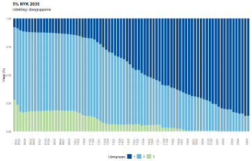{.chapter-figure width="100%" fig-alt="Ældre 5% NYK 2035: gruppe 1 små, 2 mellemstore, 3 store. 0,8 på aksen er 80%. Kilde: Vitec Scanrate."}

Ældre 5% NYK 2035: gruppe 1 små, 2 mellemstore, 3 store. 0,8 på aksen er 80%. Kilde: Vitec Scanrate. 

::: {.notes}
De store låns andel falder hurtigere. Ordinære afdrag, intervalskift og andre indfrielser kan også ændre andelene; figuren isolerer ikke én årsag.
:::

## Serie-CPR er et restgældsvægtet gennemsnit {#ch06-s039}

$$CPR=\sum_{j=1}^{J}w_jc_j,\qquad\sum_jw_j=1.$$

$c_j$: gruppens CPR. $w_j$: andel af restgælden **efter ordinært afdrag**.

Vægte og rater skal gælde samme tidspunkt og periode. Forskellige ordinære afdragsrater kræver opdaterede vægte.

::: {.notes}
Et simpelt gennemsnit af gruppernes rater ville give små og store grupper samme betydning. Regneeksemplet antager nul ordinært afdrag i alle grupper.
:::

## To 5%-serier kan få forskellig samlet CPR {#ch06-s040}

Illustration fra tværsnittet juli 2026. Vægtene er normaliseret efter afrunding.

| Gruppe | Antaget CPR | NYK 5’56io | RD 5’56io |
|---|---:|---:|---:|
| Små | 2% | 15,15% | 11,88% |
| Mellemstore | 6% | 83,84% | 77,23% |
| Store | 12% | 1,01% | 10,89% |
| Sum af vægte | | 100% | 100% |

Begge serier har kupon 5%, udløb 2056 og afdragsfrihed.

::: {.notes}
Gruppe-CPR er antaget og ens på tværs af de to serier. Forsøget isolerer låntagernes fordeling.
:::

## Miksturmodellen bevarer forskellen mellem låntagergrupper {#ch06-s041}

$$CPR_{NYK}=0{,}1515\cdot2\%+0{,}8384\cdot6\%+0{,}0101\cdot12\%=5{,}45\%.$$

$$CPR_{RD}=0{,}1188\cdot2\%+0{,}7723\cdot6\%+0{,}1089\cdot12\%=6{,}18\%.$$

RD har større vægt i de hurtigt reagerende store lån.

CK92 leverer vægte. Gruppernes CPR skal estimeres eller bestemmes af en adfærdsmodel.

::: {.notes}
Kilde til modelidé: Jakobsen, Svenstrup og Willemann (2005). I en egentlig model kan privat/erhverv også have betydning.
:::

## Fire tilgange til konverteringsadfærd {#ch06-s042}

| Tilgang | Hvordan fastlægges CPR? |
|---|---|
| Empirisk | Estimeres på indfrielser og forklarende variable |
| Rationel | Sammenligner fortsættelse og indfrielse |
| Gevinstkrav | Låntagere reagerer ved forskellige gevinstgrænser |
| Markedsimplicit | Udledes af markedskurser under en prisningsmodel |

Betegnelserne kan overlappe. Beregningsmetoden til prisfastsættelse er et særskilt valg.

::: {.notes}
Empiriske variable omfatter gevinst, alder, restløbetid, historik og sammensætning; specifikation og estimeringsperiode betyder noget. Rationelle modeller kan inkludere skat, omkostninger og værdien af at vente. Kilder: Richard og Roll (1989), Rom (2025), Jakobsen og Svenstrup (1999), Cheyette (1996).
:::

## Økonomisk logik og observeret adfærd skal mødes {#ch06-s043}

En skarp rationel regel kan få alle ens låntagere til at indfri samtidig.

En serie reagerer normalt gradvist, fordi vilkår, opmærksomhed og gevinstkrav varierer.

En gevinstkravsmodel kan derfor samtidig være empirisk: gevinsten har økonomisk mening, mens reaktionen estimeres på data.

::: {.notes}
Gevinstkrav forbinder den økonomiske begrundelse med den observerede, gradvise reaktion. Gevinsten driver flere modeltyper.
:::

## Modelvalg omfatter både variable og beslutningsregler {#ch06-s044}

Empiriske modeller kan bruge gevinst, lånets alder, restløbetid, tidligere indfrielser og låntagersammensætning. Både specifikation og estimeringsperiode påvirker resultatet.

Rationelle modeller kan indregne omkostninger, skat og værdien af at vente.

Richard og Roll (1989) og Rom (2025, kapitel 4) er eksempler på empiriske tilgange; Jakobsen, Svenstrup og Willemann (2005) behandler modelvalgene.

::: {.notes}
Forklar, hvorfor økonomisk velbegrundede variable ikke gør en estimeret sammenhæng universel. Derefter kan refinansieringsgevinsten defineres præcist.
:::

## Refinansieringskurven beskriver låntagers alternativ {#ch06-s045}

$$z^{\mathrm{refi}}_{t,\tau}=z^{\mathrm{swap}}_{t,\tau}+s_t^{\mathrm{debitor}}.$$

- $t$: tidspunkt; $\tau$: løbetid.
- $s_t^{\mathrm{debitor}}$: beregnet tillæg til swapkurven.
- Samme tillæg antages her på alle løbetider.

Spændet udledes af relevante realkreditkurser. Det er hverken en direkte observation eller renten på ét bestemt lån.

::: {.notes}
Arp, Hansen og Myrup (1999) bruger statsrente som reference; bogen bruger swap. Spændet opsamler forskellen uden at identificere hver præmie særskilt.
:::

## Højere debitorspænd gør refinansiering dyrere {#ch06-s046}

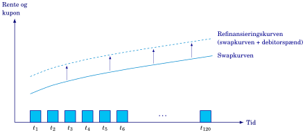{.chapter-figure width="100%" fig-alt="Et løft i refinansieringskurven sænker nutidsværdien af det gamle låns betalinger og dermed Gain."}

Et løft i refinansieringskurven sænker nutidsværdien af det gamle låns betalinger og dermed Gain. Søjlerne viser en annuitet uden førtidig indfrielse. Kurvernes form er skematisk.

::: {.notes}
Boligejeren låner gennem realkreditobligationer, ikke direkte til swaprenten. Det er forskellen mellem de to kurver, figuren viser.
:::

## Debitorspændet har varieret kraftigt {#ch06-s047}

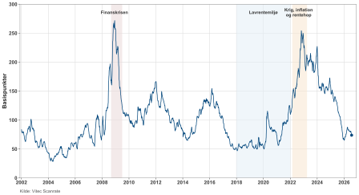{.chapter-figure width="100%" fig-alt="2. januar 2002–24. juli 2026, basispunkter. Kilde: Vitec Scanrate."}

2. januar 2002–24. juli 2026, basispunkter. Kilde: Vitec Scanrate. 

::: {.notes}
Figuren er en leverandørberegnet historisk serie. Den åbner ikke den underliggende model eller fordeler spændet på årsager.
:::

## Spændets bevægelse er ikke det samme som swaprentens {#ch06-s048}

- December 2008: omkring 272 bp.
- 2018–2021: ofte 50–90 bp; kort spring i foråret 2020.
- Oktober 2022: omkring 254 bp; fortsat højt i 2023.
- Markant fald i 2024–2025; omkring 74 bp den 24. juli 2026.

Figuren kan ikke isolere efterspørgsel, likviditet, optionsværdi eller ændret obligationssammensætning.

::: {.notes}
Et højt spænd i 2008 betyder stor afstand mellem kurverne og siger ikke i sig selv, at swaprenten var høj.
:::

## Gain måler fordelen ved at indfri og refinansiere {#ch06-s049}

$$Gain_t=\frac{PV_{\text{continue},t}-PV_{\text{call},t}(1+cost_t)}{PV_{\text{continue},t}}.$$

- Fortsættelsesværdi: gamle betalinger diskonteret på refinansieringskurven.
- Indfrielsesbeløb ved pari: $PV_{\text{call},t}=100$.
- $cost_t$: omkostninger som andel af indfrielsesbeløbet.

Alle værdier er pr. 100 kr. restgæld.

::: {.notes}
Den konkrete version erstatter call-værdien med 100. Eksemplet ser bort fra ændret bidrag, skat og låneprofil; disse forhold kan have betydning i praksis.
:::

## Pariindfrielse giver den konkrete Gain-formel {#ch06-s050}

$$Gain_t=\frac{PV_{\text{continue},t}-100(1+cost_t)}{PV_{\text{continue},t}}.$$

Eksemplet ser bort fra ændringer i bidragssats, skat og låneprofil ved omlægningen.

Sådanne forskelle kan være relevante i praksis. Fortsættelsesværdien beregnes med låntagers refinansieringskurve.

::: {.notes}
Sammenhold den konkrete formel med den generelle, før tallene indsættes. Det er samme omkostningskonvention.
:::

## En besparelse på 8 giver Gain på 7,27% {#ch06-s051}

Undervisningsantagelser: fortsættelsesværdi 110, pari 100 og omkostningssats 2%.

$$Gain=\frac{110-100(1+0{,}02)}{110}=\frac8{110}\approx7{,}27\%.$$

Nævneren er det gamle låns nutidsværdi. Gain er hverken 8% af restgælden eller investors optionsværdi.

Højere debitorspænd → lavere fortsættelsesværdi → lavere Gain.

::: {.notes}
Positiv Gain giver et økonomisk incitament. Det fastlægger ikke automatisk, om låntager handler nu.
:::

## Positiv gevinst er ikke altid tilstrækkelig {#ch06-s052}

En enkel regel er:

$$\text{Låntager }i\text{ konverterer, hvis }Gain_t\geq Gain_i^*.$$

Gevinstkravet kan afspejle værdien af at vente, besvær og opmærksomhed.

Hver omkostning skal medregnes enten i Gain eller i gevinstkravet. Den må ikke tælles to gange.

::: {.notes}
Ved én europæisk udnyttelsesdato er ventemuligheden væk. Den danske ret kan bruges på flere terminer, så restløbetid og renteusikkerhed kan påvirke kravet.
:::

## Knyt gevinsten til det rigtige beslutningsvindue {#ch06-s053}

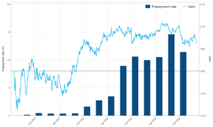{.chapter-figure width="100%" fig-alt="DK0009539116: CPR på venstre akse og leverandørens Gain på højre. Definitioner og rateperiode er ikke dokumenteret."}

DK0009539116: CPR på venstre akse og leverandørens Gain på højre. Definitioner og rateperiode er ikke dokumenteret. Kilde: Vitec Scanrate.

::: {.notes}
Kilde: Vitec Scanrate. Beslutningen ligger før betalingsterminen. Figuren er en kvalitativ sammenstilling og identificerer ikke i sig selv en reaktionsfunktion.
:::

## At vente kan spare en omlægningsrunde {#ch06-s054}

Et 4%-lån kan omlægges til 3% nu. Ved at vente kan låntager måske gå direkte til 2% med én omkostningsrunde.

Mens låntager venter, fortsætter den gamle ydelse. Ved rentestigning kan muligheden forsvinde.

Forskellige gevinstkrav giver gradvis serie-CPR; en normalfordelingsfunktion eller logistisk funktion kan beskrive overgangen.

::: {.notes}
Ventemuligheden har både værdi og omkostning. Hverken vent eller konvertér straks er en universel regel.
:::

## Samme Gain kan give forskellig gruppe-CPR {#ch06-s055}

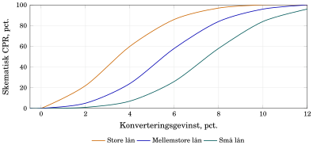{.chapter-figure width="100%" fig-alt="Aflæs én rate for hver gruppe ved samme gevinst, og vægt dem med restgældsandelene."}

Aflæs én rate for hver gruppe ved samme gevinst, og vægt dem med restgældsandelene. Skematisk kvartals-CPR; illustrative modelantagelser, ikke estimeret fra CK92 alene.

::: {.notes}
Store lån har i illustrationen lavere krav. Kurvernes placering er en modelantagelse og kan ikke udledes af CK92 alene.
:::

## Den tilbageværende pulje er en udvalgt del af den oprindelige {#ch06-s056}

- Mellem grupper: hurtigere indfrielser ændrer gruppevægtene.
- Inden for grupper: de mest opmærksomme eller laveste gevinstkrav kan forlade gruppen først.

En gruppe-CPR gælder den **tilbageværende** restgæld efter ordinært afdrag.

En uændret fordeling af oprindelige krav kan ikke bruges igen og igen: indfriede lån kan ikke konvertere én gang til.

::: {.notes}
Opdaterede gruppevægte beskriver kun den første selektionsvirkning. Gruppens adfærd skal også kunne afhænge af historikken.
:::

## Poolfaktor måler seriens tilbageværende størrelse {#ch06-s057}

$$\mathrm{Poolfaktor}_t=\frac{\text{aktuel cirkulerende restgæld}}{\max_{0\leq u\leq t}\{\text{cirkulerende restgæld på }u\}}.$$

0,70 betyder 70% af den hidtil største observerede restgæld.

Dette er bogens enkle proxy, ikke en universel markedskonvention. Ordinære afdrag kan også sænke faktoren; lav poolfaktor beviser ikke burnout.

::: {.notes}
En åben serie kan få nye lån og ligge tæt på én. En lukket serie nedbringes via ordinære og førtidige indfrielser.
:::

## Burnout opsummerer tidligere konverteringer {#ch06-s058}

For en lukket pulje:

$$\mathrm{Burnout}_0=1,\qquad \mathrm{Burnout}_t=\mathrm{Burnout}_{t-1}(1-CPR_t).$$

Lav værdi betyder omfattende konverteringshistorik. Først beregnes CPR; bagefter opdateres indikatoren.

Det er en bogføringsregel for historik, ikke en model for beslutningen, faktisk restgæld eller antal låntagere.

Ordinære afdrag og nye lån indgår ikke. Åbne serier kræver en justering.

::: {.notes}
Der er ingen cirkularitet, fordi CPR bruger historikken ved terminens begyndelse. Indikatoren opdateres først bagefter.
:::

## Udestående og burnout er forskellige størrelser {#ch06-s059}

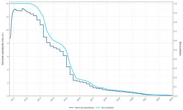{.chapter-figure width="100%" fig-alt="RD 4% 2041: forskellige akser. Leverandørens burnoutfelt kan ikke uden feltdefinition sættes lig bogens simple indikator."}

RD 4% 2041: forskellige akser. Leverandørens burnoutfelt kan ikke uden feltdefinition sættes lig bogens simple indikator. Kilde: Vitec Scanrate.

::: {.notes}
Kilde: Vitec Scanrate. Udstedelser gør først serien større; senere falder begge serier. Figuren isolerer ikke selektion, og udestående falder også ved ordinære afdrag.
:::

## Samme aktuelle Gain kan møde forskellige låntagere {#ch06-s060}

| Tidligere renteforløb | Puljen nu | CPR ved samme Gain |
|---|---|---|
| Tidligt rentefald | Mange hurtige lån er væk | Lavere |
| Intet tidligt rentefald | Flere hurtige lån er tilbage | Højere |

Poolfaktor måler størrelse; CK92-vægte måler sammensætning; burnoutindikatoren måler konverteringshistorik.

Ingen af dem tæller aktive låntagere.

::: {.notes}
Burnout betyder ikke nødvendigvis, at den enkelte låntager ændrede adfærd. Det er sammensætningen af de tilbageværende lån, der kan være ændret.
:::

## Rentemodellen leverer mulige fremtidige renter {#ch06-s061}

Modellen kalibreres til dagens rentekurve og bruger antagelser om rentebevægelser, herunder volatilitet.

Parametre kan antages eller kalibreres til renteoptioner.

Risikoneutrale sandsynligheder bruges til prisfastsættelse; de er ikke prognoser for faktisk hyppighed. Gitter, scenarietræ og simulerede stier er mulige fremstillinger.

::: {.notes}
Rentestrukturmodellen bestemmer scenarierne. Adfærdsmodellen bestemmer, hvordan låntagerne reagerer på dem.
:::

## To stier kan ende ved samme rente med forskellig historik {#ch06-s062}

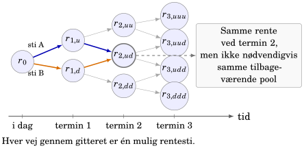{.chapter-figure width="100%" fig-alt="Punkterne viser korte renter. Pilene er mulige overgange; overgangssandsynligheder er udeladt."}

Punkterne viser korte renter. Pilene er mulige overgange; overgangssandsynligheder er udeladt. Modellen giver også løbetidsrenter; r₀ er ikke hele dagens kurve.

::: {.notes}
r0 er ikke hele dagens rentekurve. Modellen leverer også løbetidsrenter, der er nødvendige for refinansieringsvilkårene.
:::

## Før historikken videre termin for termin {#ch06-s063}

Rente på stien + debitorspænd → refinansieringskurve → Gain → CPR.

CPR → betaling, restgæld og opdateret burnout → næste termin.

Allerede offentliggjort udtræk for nærmeste termin er et kendt fælles input på alle stier. Skitsen udelader forskellen mellem beslutningsvindue og betalingstermin.

::: {.notes}
Tidligt rentefald kan tømme én sti for hurtigt reagerende lån. Senere fælles rente giver derfor ikke nødvendigvis fælles betalinger.
:::

## Prepaymentfunktionen samler adfærdens input {#ch06-s064}

$$CPR_t=g(Gain_t,\ \text{restløbetid},\ \mathrm{Burnout}_{t-1},\ \text{sammensætning}_{t-1},\ldots).$$

Større Gain og flere grupper med lave gevinstkrav trækker typisk CPR op. Mere burnout trækker typisk reaktionen ned.

Kort restløbetid giver mindre tid til at tjene omkostninger hjem. Noget er indbygget i Gain; resten kan påvirke gevinstkravet.

::: {.notes}
Funktionen beskriver puljens betingede adfærd, ikke den enkelte beslutning. Retningerne er forventede sammenhænge og afhænger af model og markedsforhold.
:::

## Resultatet er én betalingsrække for hver rentesti {#ch06-s065}

$$CF_1^{(m)},\ CF_2^{(m)},\ldots,\ CF_T^{(m)}.$$

Hver sti har sit forløb for Gain, CPR, udtræk og burnout.

CK95 giver kendte indfrielser, CK92 giver vægte, og modellen skønner fremtidig adfærd.

$CF_t^{(m)}$ er et betinget modelskøn. Kapitel 7 diskonterer og sammenvejer disse betalinger.

::: {.notes}
Afslut med spørgsmålet: Hvad er en høj kupon værd, hvis den kan forsvinde? Det åbner prisningskapitlet.
:::

## Opgave 6.1: beregn udtræk og CPR {#ch06-s066}

CK95, termin 1. juli 2024. Beløb i mio. kr.; EXT er af nominel før ordinært afdrag.

| | 1,5% RD 2043 | 5% NYK 2053 |
|---|---:|---:|
| Cirkulerende | 21.371,745 | 63.871,157 |
| Udtrukket | 263,450 | 1.751,177 |
| EXT | 0,00% | 2,34% |

Beregn UDT, ORD og CPR. Forklar nævnerne, og hvad CK95 gør kendt. Sammenlign separat indfrielsesvalg ved kurs 85 og 102.

::: {.notes}
Spørg også, om pariudtræk på nul udelukker indfrielser. 
:::

## Opgave 6.2: fra CK92 til serie-CPR {#ch06-s067}

Brug 5% NYK 2053-tabellen fra 23. september 2024. Saml privat og erhverv i interval 1–3, 4–5 og 6–7.

Antag kvartalsvis gruppe-CPR på henholdsvis 1,43%, 3,27% og 7,64% samt samme ordinære afdragsrate.

Beregn restgæld, gruppevægte og serie-CPR. Forklar vægtningen, effekten af forskellige ordinære afdrag, og hvilke input der er observerede henholdsvis antagne.

::: {.notes}
Lad deltagerne kontrollere, at vægtene summerer til én. Diskutér også, hvorfor store lån kan reagere hurtigere ved samme procentvise besparelse.
:::

## Opgave 6.3: Gain og gevinstkrav {#ch06-s068}

Pariindfrielse. Omkostninger som andel af indfrielsesbeløbet; alle værdier pr. 100 restgæld.

Beregn Gain ved:

1. Fortsættelsesværdi 110,28 og omkostninger 5%.
2. Fortsættelsesværdi 101,00 og omkostninger 5%.
3. Fortsættelsesværdi 101,00 og omkostninger 2%.

Hvorfor giver positiv Gain ikke øjeblikkelig konvertering hos alle? Forklar effekten af højere debitorspænd ved fast swapkurve.

::: {.notes}
Hold økonomisk gevinst og adfærdsregel adskilt. 
:::

## Opgave 6.4: historik på to rentestier {#ch06-s069}

Lukket serie med burnoutindikator 0,95 før terminen.

Beregn den nye indikator ved henholdsvis 3% og 15% kvartalsvis CPR. Det er alternative scenarier.

- Hvilken pulje er mest udbrændt?
- Hvorfor kan samme senere rente og Gain give forskellig CPR?
- Er burnoutindikatoren automatisk lig poolfaktoren?

::: {.notes}
Brug bogføringsreglen fra kapitlet. Lad fortolkningen handle om selektion og historik.
:::

## Opgave 6.5: beregn betalinger på to stier {#ch06-s070}

Restgæld 100, to kvartaler. Rente 1,25% af begyndelsesrestgælden pr. kvartal. Første termin: ordinært afdrag 2% af oprindelig restgæld, derefter CPR. Anden termin: hele restgælden og sidste rente.

Sti A: CPR 10%. Sti B: CPR 2%. Se bort fra omkostninger, varsler og markedstilbagekøb.

Beregn første rente, ordinært afdrag, ekstraordinært beløb og EXT. Find begge betalinger og restgælden mellem dem. Forklar CPR's virkning og forskellen mellem skøn og sikre udfald.

::: {.notes}
Begge rater er kvartalsvise. Opgaven forbinder hovedstolsregnskabet med de stiafhængige betalinger, som bruges i næste kapitel.
:::
