## Hvad er de usikre betalinger værd? {#ch07-s001}

Kapitel 6 beregnede en betalingsrække for hver rentesti. Her diskonterer vi betalingerne på hver sti og samler dem til en modelpris.

1. Betalinger på rentestier → modelpris.
2. Konverteringsret → optionsværdi og OAS.
3. Fire forskellige stød → pris og renterisiko.

Renteudviklingen ændrer både låntagers indfrielser og investorens diskontering.

::: {.notes}
En høj kupon er kun værdifuld for investor, så længe den bliver betalt. Brug kapitel 6's CPR og udtræksregnskab som forudsætning. Den numeriske produktionsmodel ligger uden for kurset.
:::

## Renten påvirker både betaling og diskontering {#ch07-s002}

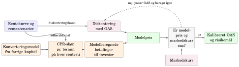{.chapter-figure width="100%" fig-alt="Følg rentens to veje frem til modelprisen og derefter OAS-kalibreringen."}

Følg rentens to veje frem til modelprisen og derefter OAS-kalibreringen. 

::: {.notes}
Renten ændrer både låntagerens konverteringsadfærd og investorens diskonteringsfaktorer.
:::

## Værdiansæt hver rentesti for sig {#ch07-s003}

På sti $m$ modtager investor $CF_t^{(m)}$ ved termin $t$:

$$P^{(m)}=\sum_{t=1}^{T}DF_t^{(m)}CF_t^{(m)}.$$

- $DF_t^{(m)}$: diskonteringsfaktor fra termin $t$ til i dag.
- $T$: antal fremtidige terminer; $M$: antal rentestier.
- Betaling og diskonteringsfaktor skal høre til **samme sti**.

::: {.notes}
Rentemodellen beskriver også renter for forskellige løbetider på hver fremtidig termin. De bruges til refinansiering; de korte renter undervejs bruges til diskontering.
:::

## Prisningsvægte samler stiernes værdier {#ch07-s004}

$$P_{\text{model}}=\sum_{m=1}^{M}\pi_m P^{(m)},\qquad \pi_m\geq0,\quad\sum_m\pi_m=1.$$

Vægte og diskonteringsfaktorer kommer fra samme prisningsmodel.

I en arbitragefri model kan vægtene fortolkes som risikoneutrale sandsynligheder. De er ikke nødvendigvis prognoser for faktiske renteforløb.

::: {.notes}
En vægt på 50 procent er en prisningsvægt, ikke en observeret hyppighed eller renteprognose.
:::

## To kvartaler og to mulige betalingsrækker {#ch07-s005}

Undervisningsantagelser: restgæld 100, kvartalskupon 1,25 og udløb efter to kvartaler. Ingen varsler, omkostninger eller ekstra diskonteringsspænd.

| Sti | Vægt | $CF_1$ | $CF_2$ | $DF_1$ | $DF_2$ |
|---|---:|---:|---:|---:|---:|
| A: tidlig indfrielse | 0,50 | 101,25 | 0 | 0,990 | 0,985 |
| B: ordinært udløb | 0,50 | 1,25 | 101,25 | 0,990 | 0,975 |

På A falder renten og lånet indfries; på B stiger renten og lånet fortsætter.

::: {.notes}
Tabellen er et gennemregnet undervisningseksempel fra bogen. Lad først de studerende forklare, hvorfor anden betaling på sti A er nul.
:::

## Modelprisen bliver 100,10 {#ch07-s006}

$$\begin{aligned}
P^{(A)}&=0{,}990\cdot101{,}25=100{,}2375,\\
P^{(B)}&=0{,}990\cdot1{,}25+0{,}975\cdot101{,}25\\
&=99{,}95625.
\end{aligned}$$

$$P_{\text{model}}=0{,}50P^{(A)}+0{,}50P^{(B)}=100{,}096875.$$

Prisen er pr. 100 nominel.

::: {.notes}
Betalingen på anden termin er kun til stede på den sti, der har den laveste diskonteringsfaktor. Den sammenhæng skal bevares i prisberegningen.
:::

## Fra to stiværdier til én pris {#ch07-s007}

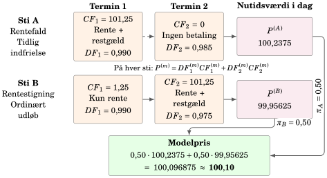{.chapter-figure width="100%" fig-alt="Beregn langs hver sti, før stiværdierne vægtes sammen."}

Beregn langs hver sti, før stiværdierne vægtes sammen. 

::: {.notes}
Læs figuren fra venstre mod højre. Lad betalingstidspunktet og diskonteringsfaktoren følges ad.
:::

## Gennemsnit hver for sig giver den forkerte pris {#ch07-s008}

Gennemsnitlig betaling × gennemsnitlig diskonteringsfaktor giver her

$$0{,}990\cdot51{,}25+0{,}980\cdot50{,}625=100{,}35.$$

Den korrekte modelpris er 100,10: betalingernes samvariation med renterne betyder noget.

Gitter/PDE kan beregne baglæns; Monte Carlo samler mange simulerede stiværdier. Begge skal bevare historikkens betydning for betalingerne.

::: {.notes}
Baglæns beregning håndterer ikke automatisk burnout. To stier kan ende ved samme rente med forskellige låntagerpuljer. Kilde: Jakobsen og Rasmussen (1999); Jakobsen, Svenstrup og Willemann (2005).
:::

## Låntager er lang en call-option; investor er kort {#ch07-s009}

Låntager kan indfri til kurs 100 på bestemte terminer.

- Rentefald gør den gamle kupon mere attraktiv for investor.
- Samtidig bliver indfrielse mere attraktiv for låntager.
- Køb over 100 kan give tab ved pariindfrielse.
- Pengene skal ofte geninvesteres til en lavere rente.

::: {.notes}
Skeln mellem tabet på den udtrukne del og reinvesteringsrisikoen. Begge følger af, at låntager vælger tidspunktet.
:::

## Kurs 100 er ikke et mekanisk loft {#ch07-s010}

Konverterbare obligationer kan handle over pari, fordi konvertering kan blive forsinket af:

- omkostninger, skat og opsigelsesvarsler,
- rådgivning, træghed og forskellige låntagergrupper,
- værdien af at vente med at bruge retten.

Kurven flader gradvist ud, når konvertering bliver mere sandsynlig.

::: {.notes}
En ret til at indfri er ikke det samme som sikker, øjeblikkelig indfrielse. Det forklarer, hvorfor priser over 100 er mulige.
:::

## Konverteringsretten begrænser kursstigningen {#ch07-s011}

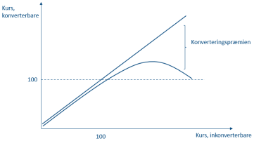{.chapter-figure width="100%" fig-alt="Vandret: inkonverterbar kurs. Lodret: konverterbar kurs. Afstanden viser optionsværdien."}

Vandret: inkonverterbar kurs. Lodret: konverterbar kurs. Afstanden viser optionsværdien. 

::: {.notes}
Begge akser er kurser. Figuren er illustrativ og skal ikke læses som en renteakse.
:::

## Optionsværdien er forskellen mellem to sammenlignelige priser {#ch07-s012}

$$V_{\text{call}}=P_{\text{inkonv}}-P_{\text{konv}},\qquad
P_{\text{konv}}=P_{\text{inkonv}}-V_{\text{call}}.$$

Sammenlign samme kupon, ordinære afdrag og udløb, med samme referencekurve, spænd og kurskonvention.

Optionsværdien måles i **kurspoint**. Modellen beregner betalingerne direkte; værdiforskellen fortolkes bagefter som optionens værdi.

::: {.notes}
Konverteringspræmie bruges ofte som navn for forskellen. Man skal ikke først gætte en optionsværdi og derpå konstruere prisen.
:::

## Høje kuponer giver større optionsværdi {#ch07-s013}

Nykredit, 11. oktober 2024. Kilde: Vitec Scanrate.

| Serie | Konv. | Inkonv. | Call, point | Call/konv. |
|---|---:|---:|---:|---:|
| 6% 2053 | 103,07 | 145,35 | 42,28 | 41,0% |
| 5% 2053 | 102,09 | 131,74 | 29,65 | 29,0% |
| 1% 2053 | 79,91 | 85,25 | 5,34 | 6,7% |

Lavkuponoptionen er længere ude af pengene: der kræves typisk et større rentefald.

::: {.notes}
Den relative værdi er optionsværdien divideret med den konverterbare kurs. Optionen kan have værdi, selv når umiddelbar pariindfrielse er uattraktiv.
:::

## 5% NYK 2053: et særskilt modelgrundlag {#ch07-s014}

11. oktober 2024, Vitec Scanrate. Begge værdier inkluderer vedhængende rente.

$$V_{\text{call}}=131{,}01-102{,}09=28{,}92.$$

| | Konverterbar | Inkonverterbar |
|---|---:|---:|
| Kronevarighed | 1,43 | 15,50 |
| Kronekonveksitet | −2,92 | 2,79 |

131,01 her og 131,74 før er **separate modeludtræk**. Optionsværdierne 28,92 og 29,65 skal holdes adskilt.

::: {.notes}
Uden oplysninger om modelversion, kurve, spænd og betalingsprofil kan forskellen på 0,73 kurspoint ikke forklares. Ingen af optionsværdierne er en uafhængigt observeret markedspris på retten.
:::

## Tre kurver har tre roller {#ch07-s015}

| Kurve | Notation | Rolle |
|---|---|---|
| Prisningskurve | $z^{\text{swap}}_{t,\tau}$ | Reference for model og diskontering |
| Refinansieringskurve | $z^{\text{refi}}_{t,\tau}$ | Låntagers alternative finansiering |
| Diskontering med OAS | $z^{\text{swap}}_{t,\tau}+OAS$ | Tilpasning til markedskurs |

$t$ er tidspunkt; $\tau$ er løbetid. Kurvevalget skal oplyses, før spænd sammenlignes.

::: {.notes}
Bogens forenkling bruger samme swapbaserede nulkuponkurve som udgangspunkt for prisning og refinansiering. Leverandørmodeller kan bruge forskellige referencekurver.
:::

## Debitorspænd ændrer låntagers alternativ {#ch07-s016}

$$z^{\text{refi}}_{t,\tau}=z^{\text{swap}}_{t,\tau}+s_t^{\mathrm{debitor}}.$$

Samme debitorspænd lægges her til alle løbetider på tidspunkt $t$.

$$s^{\mathrm{debitor}}\uparrow\ \Rightarrow\ Gain\downarrow\ \Rightarrow\ CPR\downarrow.$$

Låntager refinansierer gennem realkreditobligationer og kan normalt ikke låne direkte til swaprenten.

::: {.notes}
Forklar faldet i Gain gennem lavere nutidsværdi af det gamle låns betalinger på den højere refinansieringskurve. OAS har en anden funktion.
:::

## OAS får modelprisen til at ramme markedskursen {#ch07-s017}

$$P_{\text{model}}(OAS)=\sum_m\pi_m\sum_t DF_t^{(m)}(OAS)CF_t^{(m)}.$$

Find det konstante spænd, der opfylder

$$P_{\text{model}}(OAS)=P_{\text{market}}.$$

Konverteringsretten er allerede indarbejdet i betalingerne. Modelpris og markedskurs skal have samme prisgrundlag.

::: {.notes}
Hvis modellen giver 103 og markedet 101, skal diskonteringen øges. Det er kalibrering af et spænd, ikke fjernelse af konverteringsretten.
:::

## Kalibrér OAS med betalingerne fastholdt {#ch07-s018}

1. Fastlæg referencekurve, rentestier og øvrige modelinput.
2. Beregn forventede betalinger på hver sti.
3. Læg et foreløbigt OAS til diskonteringen.
4. Justér, til modelpris og markedskurs er ens.

For høj modelpris → højere OAS. For lav modelpris → lavere OAS.

Betalinger, rentestier og øvrige forudsætninger ændres ikke under kalibreringen.

::: {.notes}
Et lavere eller negativt OAS øger modelprisen, fordi diskonteringen falder.
:::

## OAS flytter diskonteringskurven {#ch07-s019}

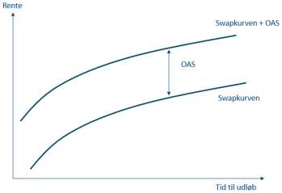{.chapter-figure width="100%" fig-alt="Et konstant spænd lægges til alle løbetider. Højere OAS giver lavere nutidsværdi."}

Et konstant spænd lægges til alle løbetider. Højere OAS giver lavere nutidsværdi. 

::: {.notes}
Kurvernes form er skematisk; OAS lægges som et konstant tillæg til renten ved alle løbetider.
:::

## OAS er modelafhængigt {#ch07-s020}

Debitorspænd → refinansiering → Gain → CPR.

OAS → diskonteringsfaktorer → modelpris.

OAS kan afspejle kreditrisiko, likviditet, udbud, efterspørgsel og modelfejl. Fortolkningen som ekstra kompensation gælder **givet modellen og referencekurven**.

Et almindeligt PV-spænd fra kapitel 3 lægges på en fast betalingsrække. Her beregnes betalingerne på rentestier med låntagernes indfrielser; derfor afhænger OAS også af rente- og konverteringsmodellen.

::: {.notes}
Markedet viser kursen; OAS beregnes ud fra kurs og model. En forkert konverteringsantagelse kan blive opsamlet i det kalibrerede spænd.
:::

## Én pris bestemmer ikke både CPR og OAS {#ch07-s021}

Illustrativ premium-obligation: modelpris 105, markedskurs 101.

| Fasthold | Justér | Mulig vej til kurs 101 |
|---|---|---|
| CPR | OAS | Højere diskonteringsspænd |
| OAS | Prepayment | Mere pariindfrielse |

En prisningskonsistent konverteringsantagelse er ikke i sig selv en prognose for faktiske indfrielser.

::: {.notes}
Markedsimplicit prepayment udleder adfærd fra prisen under fastholdte øvrige antagelser. Kilde: Cheyette (1996).
:::

## OAS-indekset følger et marked i forandring {#ch07-s022}

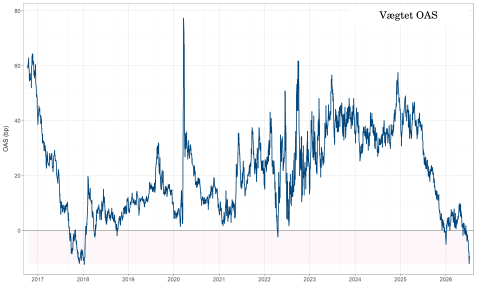{.chapter-figure width="100%" fig-alt="Vægtet OAS, 2017–medio 2026. Store serier får større vægt; sammensætningen ændres. Kilde: Vitec Scanrate."}

Vægtet OAS, 2017–medio 2026. Store serier får større vægt; sammensætningen ændres. Kilde: Vitec Scanrate. 

::: {.notes}
Indekset følger ikke samme obligation gennem hele perioden. Læs niveauerne som modelrelative priser under skiftende markedsvilkår.
:::

## 2017–2020: OAS falder og springer kortvarigt op {#ch07-s023}

**2017–2019:** Indekset falder og ligger periodevis under nul. Det viser høje kurser relativt til modellen ved OAS nul; figuren viser ikke, hvad der drev bevægelsen.

Negativt OAS betyder en høj pris relativt til modellen ved OAS = 0; risikoen er stadig til stede.

**Foråret 2020:** Indekset springer op og falder igen senere på året. Nationalbanken beskriver samtidig kortvarigt svagere likviditet i dansk realkredit. Det kan forklare en del af bevægelsen.

::: {.notes}
Nationalbankens Analyse nr. 22, 10. november 2020, dokumenterer likviditetsforholdene. Hverken analysen eller figuren opdeler netop dette OAS-indeks i årsagsbidrag.
:::

## 2021–første halvår 2025: lavkuponer bliver længere {#ch07-s024}

Stigende renter → lavkuponer langt under 100 → mindre sandsynlig pariindfrielse → længere forventet løbetid.

Investor får mere renterisiko i den eksisterende beholdning.

Indekset stiger fra 2021 med store udsving. Ændret volatilitet, likviditet og efterspørgsel kan også spille ind; figuren fordeler ikke virkningerne.

::: {.notes}
Undgå at læse hele OAS-bevægelsen som kreditforværring. Indeksets sammensætning og modellens forudsætninger spiller også ind.
:::

## Fra sommeren 2025: OAS falder igen {#ch07-s025}

Indekset falder og ligger omkring eller under nul i dele af 2026. Det viser, at de omfattede obligationer blev dyrere relativt til leverandørens model.

Udbud og efterspørgsel kan have bidraget, men figuren indeholder ikke mængdedata, der dokumenterer årsagen.

::: {.notes}
Indeksets obligationer og modelinput kan ændre sig over tid. De næste forsøg isolerer virkningen af forskellige modelstød.
:::

## Fire stød flytter forskellige dele af modellen {#ch07-s026}

| Stød | Det ændrede input | Kanal |
|---|---|---|
| Rente | Reference- og refinansieringskurve | Betalinger og diskontering |
| CPR | Indfrielsesrate direkte | Betalinger |
| Debitorspænd | Kun refinansieringskurve | Gain → CPR → betalinger |
| OAS | Kun investors spænd | Diskontering |

Startpulje og øvrige parametre fastholdes. OAS er fast undtagen ved OAS-stød.

::: {.notes}
Ved CPR-stødet fastholdes begge kurver. Ved rentestødet følger refinansieringskurven med, fordi debitorspændet er fast.
:::

## Varighed kræver genberegnede betalinger {#ch07-s027}

Ved rentestød beregnes CPR og betalinger igen. Det kalibrerede OAS holdes fast.

Det er et stød til reference- og refinansieringskurven. En ændring i obligationens egen effektive rente med faste betalinger er et andet regnestykke.

$$KV\approx-\frac{P_0(+\Delta y)-P_0(-\Delta y)}{2\Delta y\cdot100},\qquad PVBP=\frac{KV}{100}.$$

- $\Delta y$ er decimalrente; 15 bp = 0,0015.
- KV: kurspoint pr. procentpoint; PVBP: kurspoint pr. bp.
- KV svarer til $d$ og PVBP til BPV i kapitel 4.

::: {.notes}
Genkalibrering af OAS til den gamle kurs ville skjule prisfølsomheden. En klassisk Macaulay-varighed på en fast betalingsrække overser adfærdskanalen.
:::

## Et parallelt rentestød bevarer kurvens form {#ch07-s028}

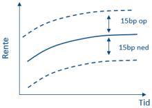{.chapter-figure width="100%" fig-alt="Hele swapkurven flyttes 15 bp op eller ned."}

Hele swapkurven flyttes 15 bp op eller ned. 

::: {.notes}
Stødet ændrer niveauet, mens formen er fast. De to nye modelpriser bruges til at beregne KV.
:::

## 5% NYK 2053 har KV omkring 1,43 {#ch07-s029}

| 15 bp stød | Modelpris |
|---|---:|
| Op | 101,84 |
| Ned | 102,27 |

$$KV\approx-\frac{101{,}84-102{,}27}{2\cdot0{,}0015\cdot100}=1{,}43.$$

PVBP ≈ 0,0143. Den inkonverterbare række har KV = 15,50.

Lav KV skyldes ændrede betalinger; renterisikoen er ikke forsvundet.

::: {.notes}
Ved rentefald forsvinder attraktive betalinger tidligere. Ved rentestigning falder konverteringsrisikoen, og serien kan komme til at ligne en lang inkonverterbar obligation.
:::

## Prisens hældning kan vende ved lave renter {#ch07-s030}

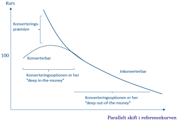{.chapter-figure width="100%" fig-alt="Vandret akse: parallelskift i referencekurven, ikke obligationens effektive rente."}

Vandret akse: parallelskift i referencekurven, ikke obligationens effektive rente. 

::: {.notes}
Fast OAS og debitorspænd; konverteringsadfærden genberegnes. Kurven angiver ikke en konkret rentegrænse for en bestemt serie.
:::

## Negativ varighed og negativ konveksitet er forskellige {#ch07-s031}

**Negativ varighed:** Et lille rentefald sænker prisen. Fremrykket pariindfrielse dominerer den gunstigere diskontering.

**Negativ konveksitet:** Kurven krummer nedad. Gevinsten ved rentefald begrænses, mens tabet ved rentestigning kan være større.

En obligation kan have positiv varighed og negativ konveksitet samtidig.

::: {.notes}
Brug hældningen til varighed og ændringen i hældning til konveksitet.
:::

## Samme rentestød kan give forskellig gevinst og tab {#ch07-s032}

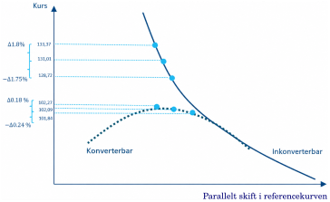{.chapter-figure width="100%" fig-alt="Skematisk kurve med eksemplets kursniveauer ved ±15 bp. De præcise ændringer beregnes særskilt."}

Skematisk kurve med eksemplets kursniveauer ved ±15 bp. De præcise ændringer beregnes særskilt. 

::: {.notes}
Vandrette placeringer og kurveformen er illustrative. Læs asymmetrien, men udled ikke yderligere tal af tegningen.
:::

## Konveksitet korrigerer varighedsapproksimationen {#ch07-s033}

$$\Delta P\approx-KV\,\Delta y_{\text{pp}}+\tfrac12\mathrm{Cvx}_{\mathrm{KR}}(\Delta y_{\text{pp}})^2.$$

Her er 15 bp = **0,15 procentpoint**.

| Betalingsrække | KV | Kronekonveksitet | 15 bp ned | 15 bp op |
|---|---:|---:|---:|---:|
| Konverterbar | 1,43 | −2,92 | +0,18 | −0,25 |
| Inkonverterbar | 15,50 | 2,79 | +2,36 | −2,29 |

De sidste to kolonner er kurspoint.

::: {.notes}
Kontrollér enheden før indsættelse. Decimalrenten 0,0015 hører til differensformlen for KV; her bruges procentpoint.
:::

## Kurspoint bliver procent ved at dividere med startkursen {#ch07-s034}

$$\text{Relativ ændring}=100\frac{\Delta P}{P_0}.$$

| | Startkurs | 15 bp ned | 15 bp op |
|---|---:|---:|---:|
| Inkonverterbar | 131,01 | +1,80% | −1,75% |
| Konverterbar | 102,09 | +0,18% | −0,24% |

Eksempel: $100\cdot2{,}3564/131{,}01\approx1{,}80\%$. Brug uafrundede mellemregninger.

::: {.notes}
Den konverterbare obligation får langt mindre gevinst ved rentefald. Bogens afrundede ændringer i point skal ikke bruges til at genskabe alle decimaler i procenttabellen.
:::

## CPR-forsøget erstatter modellens adfærd med faste rater {#ch07-s035}

Beregningsdato: 4. september 2026. Manuelt indlæste kalibreringskurser, ekskl. vedhængende rente:

| Serie | ISIN | Kurs |
|---|---|---:|
| NYK 6% 2053 | DK0009540122 | 105,825 |
| NYK 1% 2050 | DK0009522815 | 76,750 |

Efter kalibreringen pålægges konstante **årlige** CPR-rater. Kurver og OAS er faste; OAS genkalibreres ikke.

::: {.notes}
Kalibreringskurserne er input og er ikke nødvendigvis priserne ved nogen af de pålagte CPR-rater.
:::

## Årlig CPR skal omregnes til kvartaler {#ch07-s036}

$$CPR_{\text{kvartal}}=1-(1-CPR_{\text{år}})^{1/4}.$$

Årlig CPR på 10% svarer til cirka 2,60% pr. kvartal.

Forsøgets årlige satser er 0%, 2%, 5%, 10% og 20%. De kan ikke indsættes direkte som kvartalsrater fra kapitel 6.

::: {.notes}
Omregningen bygger på den overlevende andel af restgælden. Division med fire er kun en tilnærmelse.
:::

## Højere CPR sænker KV i begge serier {#ch07-s037}

Modelberegning 4. september 2026.

| Årlig CPR | 6%: kurs | 6%: KV | 1%: kurs | 1%: KV |
|---|---:|---:|---:|---:|
| 0% | 123,44 | 11,45 | 77,14 | 7,41 |
| 2% | 114,00 | 6,75 | 85,92 | 5,00 |
| 5% | 108,41 | 3,99 | 91,63 | 3,26 |
| 10% | 105,06 | 2,34 | 95,20 | 2,03 |
| 20% | 102,91 | 1,27 | 97,48 | 1,16 |

KV er kurspoint pr. procentpoint med **CPR og OAS fastholdt under rentestødet**.

::: {.notes}
Denne KV inkluderer ikke en CPR-reaktion på rentestødet. Betalingstidspunktet bliver kortere i begge serier.
:::

## Samme CPR-stød giver modsatte priseffekter {#ch07-s038}

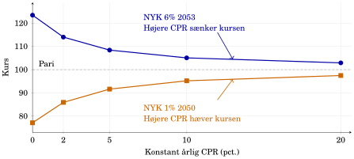{.chapter-figure width="100%" fig-alt="Mere pariindfrielse sænker højkuponens kurs og løfter lavkuponens kurs."}

Mere pariindfrielse sænker højkuponens kurs og løfter lavkuponens kurs. Modelberegning 4. september 2026.

::: {.notes}
Sammenhold 0 og 10 procent årlig CPR: 123,44 til 105,06 for højkuponen; 77,14 til 95,20 for lavkuponen. Rentekurven er uændret.
:::

## Underpariresultatet forudsætter indfrielse til pari {#ch07-s039}

For højkuponen mister investor attraktive fremtidige kuponer.

For lavkuponen er tidligere betaling af 100 mere værd end de betalinger, den erstatter.

NYK 1% 2050 har **delivery option slået fra**, så forsøget isolerer pariindfrielse. I praksis kan låntager købe obligationer tilbage under pari. NYK 6% bruger standardindstillingen.

::: {.notes}
Dette er et kontrolleret følsomhedsforsøg og ikke en prognose om irrationel pariindfrielse under kurs 100.
:::

## Et højere debitorspænd kan hæve højkuponens pris {#ch07-s040}

Fast swapkurve og OAS; refinansieringskurven flyttes. CPR beregnes igen.

$$s^{\mathrm{debitor}}\uparrow\Rightarrow Gain\downarrow\Rightarrow CPR\downarrow.$$

Investor får større sandsynlighed for at beholde den høje kupon.

For en lavkupon langt under pari kan effekten være lille: billigere refinansiering kan stadig være uattraktiv.

::: {.notes}
Investors diskonteringsrente ændres ikke direkte. Debitorspændsstødet er derfor forskelligt fra at pålægge en vilkårlig CPR.
:::

## Debitorspænd: store stød giver asymmetriske kursændringer {#ch07-s041}

NYK 6% 2053, 4. september 2026. Startkurs 105,825.

| Stød | CPR, fire terminer | Kurs | Ændring, point |
|---|---:|---:|---:|
| −100 bp | 53,56% | 103,92 | −1,90 |
| 0 bp | 32,08% | 105,83 | 0,00 |
| +100 bp | 13,87% | 108,90 | +3,08 |

CPR er her modellens samlede rate over de første fire fremtidige terminer.

::: {.notes}
Lige store stød giver forskellige prisændringer. De afrundede tabelkurser og kursændringer er bevaret fra beregningen.
:::

## Dyrere refinansiering mindsker konverteringen {#ch07-s042}

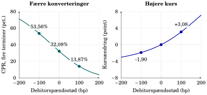{.chapter-figure width="100%" fig-alt="Fra 0 til +100 bp: CPR falder til 13,87%, og kursen stiger 3,08 point."}

Fra 0 til +100 bp: CPR falder til 13,87%, og kursen stiger 3,08 point. Modelberegning 4. september 2026.

::: {.notes}
Et højere debitorspænd gør refinansiering dyrere. CPR falder, flere kuponer bevares, og kursen stiger.
:::

## OAS-forsøget har sin egen kalibrering {#ch07-s043}

Rentestier, refinansiering og betalinger fastholdes. Kun investors diskonteringsspænd ændres.

NYK 6% 2053 kalibreres igen til 105,825 med indfrielse via markedskursopkøb slået fra.

Forsøget kan derfor ikke behandles som endnu en kolonne i debitorspændsforsøget. Inden for forsøget er højere OAS → lavere pris.

::: {.notes}
Den særskilte kalibrering er nødvendig for at isolere diskonteringen. Uændret CPR i de første fire terminer dokumenterer ikke alene alle senere cash flows.
:::

## OAS: samme betalinger får en anden nutidsværdi {#ch07-s044}

NYK 6% 2053, 4. september 2026.

| Stød | CPR, fire terminer | Kurs | Ændring, point |
|---|---:|---:|---:|
| −100 bp | 32,11% | 109,23 | +3,40 |
| 0 bp | 32,11% | 105,83 | 0,00 |
| +100 bp | 32,11% | 102,73 | −3,09 |

OAS-risk/spread-risk her er samlede ændringer ved store stød, ikke en lokal varighed eller ændring pr. bp.

::: {.notes}
CPR står stille, mens priserne ændres. Sammenlign retningen med debitorspændets effekt, men respekter de forskellige kalibreringer.
:::

## OAS ændrer prisen gennem diskontering {#ch07-s045}

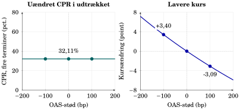{.chapter-figure width="100%" fig-alt="Samme akser som debitorspændsfiguren: CPR er konstant, og prisen falder med OAS."}

Samme akser som debitorspændsfiguren: CPR er konstant, og prisen falder med OAS. Modelberegning 4. september 2026.

::: {.notes}
Brug de ens akser til at sammenligne kanalerne. OAS er ikke en ændring i låntagers refinansieringsvilkår.
:::

## Spørg altid, hvor ændringen sættes ind {#ch07-s046}

- Rente: nye betalinger **og** ny diskontering.
- CPR: indfrielse ændres direkte.
- Debitorspænd: låntagers alternativ ændres, så CPR genberegnes.
- OAS: samme betalinger diskonteres anderledes.

Kapitel 8 undersøger investorens faktisk opnåede afkast over en horisont.

::: {.notes}
Bed deltagerne forklare én kanal præcist: hvilket spænd ændres, og hvilke betalinger påvirkes?
:::

## Opgave 7.1: beregn modelprisen {#ch07-s047}

| Sti | Vægt | Betaling 1 | Betaling 2 | DF 1 | DF 2 |
|---|---:|---:|---:|---:|---:|
| A | 0,40 | 13,05 | 89,3025 | 0,990 | 0,985 |
| B | 0,60 | 5,21 | 97,2405 | 0,990 | 0,975 |

Beregn stiværdier og modelpris med mindst fire decimaler i mellemregningerne. Sammenlign med metoden, der først gennemsnitsberegner betalinger og faktorer hver for sig.

Hvorfor skal betaling og faktor høre til samme sti? Er 0,40 en prognosesandsynlighed?

::: {.notes}
Undervisningsantagelser. Lad grupperne forklare deres metode før beregningen. 
:::

## Opgave 7.2: konverteringsretten i tre scenarier {#ch07-s048}

Næste termin: rente 4 pr. 100 oprindelig nominel, ingen ordinære afdrag; diskonteringsrente 2%.

| Scenarie | Vægt | CPR | Værdi pr. 100 fortsættende nominel |
|---|---:|---:|---:|
| Højere rente | 0,30 | 0% | 94 |
| Mellemste | 0,40 | 0% | 100 |
| Lavere rente | 0,30 | 30% | 108 |

Beregn betaling og fortsættende værdi ved lavere rente. Beregn priser med og uden den ekstraordinære pariindfrielse og forskellen. Alle øvrige input fastholdes.

::: {.notes}
De oplyste fortsættelsesværdier er modeloutput og skal ikke genberegnes. Bed deltagerne forklare, hvorfor forskellen opstår ved lavere rente.
:::

## Opgave 7.3: find et OAS-interval {#ch07-s049}

Årlige betalinger er 6, 6 og 106; årlige nulkuponrenter er 2,0%, 2,2% og 2,4%.

$$P(s)=\frac6{1{,}020+s}+\frac6{(1{,}022+s)^2}+\frac{106}{(1{,}024+s)^3}.$$

Beregn $P(0)$ og $P(0{,}005)$. Indkreds OAS ved markedskurs 109,50, og beskriv en mere præcis kalibrering.

Hvorfor kan ændret CPR give et nyt OAS? Forklar forskellen til debitorspænd, kreditrisiko og negativt OAS.

::: {.notes}
Betalingerne er faste i denne opgave. Alle renter har årlig rentetilskrivning; der kræves ingen numerisk rodsolver.
:::

## Opgave 7.4: mål risiko fra modelpriser {#ch07-s050}

Flad 3%-kurve, OAS = 0, poolfaktor 1; adfærdsbestemt CPR og øvrige input faste.

| | NYK 6% 2053 | NYK 1% 2050 |
|---|---:|---:|
| $P_0$ | 104,91238 | 78,00841 |
| −15 bp | 104,97581 | 78,97836 |
| +15 bp | 104,80074 | 77,04093 |

Beregn KV og PVBP. Brug $h=0{,}15$ procentpoint til

$$\mathrm{Cvx}_{\mathrm{KR}}=\frac{P_0(-h)+P_0(+h)-2P_0}{h^2}.$$

::: {.notes}
ISIN er DK0009540122 og DK0009522815. Hold decimalrente og procentpoint adskilt.
:::

## Opgave 7.4: fortolk risikoen {#ch07-s051}

- Forklar valget af $h=0{,}15$ frem for 0,0015.
- Sammenlign de to obligationers renterisiko.
- Forklar lavere varighed og negativ konveksitet for højkuponen.
- Er negativ konveksitet det samme som negativ varighed?

Frivilligt: Approksimér kursændringen ved ±50 bp. Hvorfor kan en fuld modelkørsel give et andet resultat?

::: {.notes}
Bed om økonomiske forklaringer efter regningen. Hold diskussionen til forskellen mellem en lokal approksimation og et fuldt scenarie.
:::

## Opgave 7.5: CPR, pari og KV {#ch07-s052}

Brug CPR-tabellen fra 4. september 2026.

1. Omregn 10% årlig CPR til kvartal og 5% kvartalsvis CPR til år.
2. Beregn begge kursændringer fra 2% til 10% årlig CPR.
3. Forklar fortegnene og faldet i KV.
4. Hvad betyder fast CPR under KV-beregningen?
5. Hvorfor er delivery option slået fra for lavkuponen? Er pariindfrielse under 100 en adfærdsprognose?

::: {.notes}
Henvis deltagerne til de synlige tabeller med input. Opgaven skal skelne mellem et kontrolleret scenarie og en prognose.
:::

## Opgave 7.6: adfærd eller diskontering? {#ch07-s053}

Brug tabellerne for debitorspænd og OAS.

- Sammenlign CPR og kursændring ved +100 bp i hvert forsøg.
- Forklar, hvad der ændres, og hvad der holdes fast.
- Hvorfor kan debitorspænd have lille effekt på en lavkupon?
- Sammenlign +100 og −100 bp: symmetri og lokal varighed?
- Dokumenterer uændret CPR over fire terminer uændrede betalinger over hele løbetiden? Hvilket output kræver kontrollen?

::: {.notes}
Lad de studerende efterspørge dokumentation for modelantagelserne. 
:::
