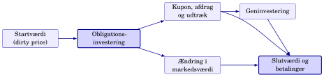
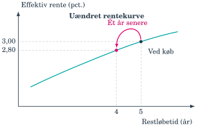
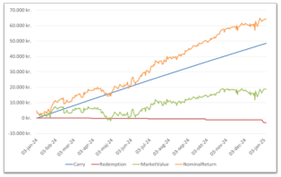
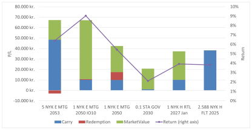
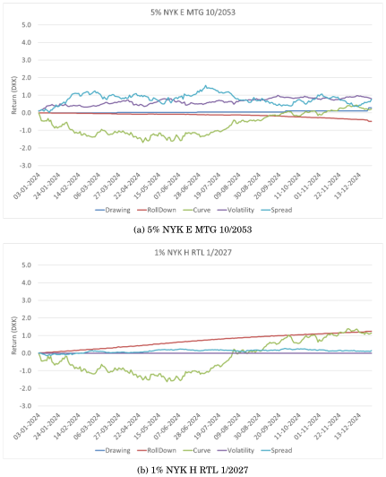
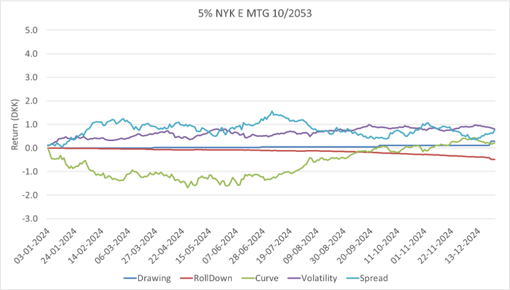
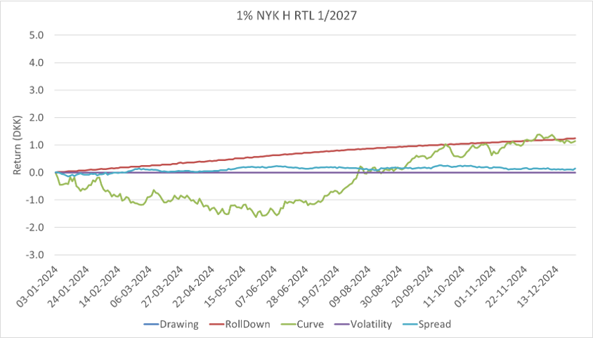

## Afkast kræver både kroner og kapital {#ch08-s001}

Kroneafkastet er slutværdi plus betalinger minus startværdi:

$$\Delta V=V_h+\text{betalinger}-V_0.$$

Det relative afkast sætter resultatet i forhold til den investerede kapital:

$$HPR_{0,h}=\frac{V_h+\text{betalinger}-V_0}{V_0}.$$

$h$ er horisonten i år; seks måneder er omtrent $0{,}5$. Vi måler absolut afkast på én investering. Benchmark og fuld porteføljeattribution ligger uden for kapitlet.

::: {.notes}
Sammenlign en gevinst på 1 mio. kr. på henholdsvis 10 mio. og 1 mia. kr. Dernæst skal obligationens betalinger placeres på tidslinjen.
:::

## Følg pengene fra køb til horisont {#ch08-s002}

{fig-alt="Startværdi, obligationsinvestering, betalinger, geninvestering og slutværdi"}

Følg begge veje til slutværdien: betalingerne undervejs og værdien af den tilbageværende obligation.

::: {.notes}
Peg på geninvestering som et selvstændigt led. For konverterbare obligationer kan både betalingerne og slutværdien ændres, når indfrielserne ændres.
:::

## Dirty price er den faktiske handelsværdi {#ch08-s003}

$$K_t^{dirty}=K_t^{clean}+v_t.$$

- $K_t^{clean}$ er den noterede kurs.
- $v_t$ er vedhængende rente i **kurspoint pr. 100 nominel**.
- Køber betaler dirty kurs; sælger modtager dirty kurs.

$K$ betegner markedskurs. $P$ betegner modelpris eller nutidsværdi.

Afkastmåling med clean kurs alene overser en faktisk betaling.

::: {.notes}
Køberen kompenserer sælgeren for allerede optjent rente. Samme princip gælder ved salg; ellers bliver kuponbetalingen fejlagtigt en ren gevinst.
:::

## Betalinger og slutværdi skal på samme tidspunkt {#ch08-s004}

$$HPR_{0,h}=\frac{K_h^{dirty}+FV_h(CF)-K_0^{dirty}}{K_0^{dirty}}.$$

| Tidspunkt | Værdi i regnskabet |
|---|---|
| Køb | Dirty startkurs |
| Undervejs | Kupon, afdrag og udtræk, $CF_t$ |
| Horisont | Dirty slutkurs og betalingernes horisontværdi |

$FV_h(CF)$ er summen af betalingerne uden geninvestering, eller deres opskrevne værdi med geninvestering.

Indskud og udtræk af ny kapital kræver et penge- eller tidsvægtet afkastmål.

::: {.notes}
Skeln tilbagebetalt hovedstol fra ny kapital, som investor skyder ind. Førstnævnte er en betaling fra investeringen; sidstnævnte ændrer afkastmålingens grundlag.
:::

## Et halvårsafkast er ikke et årsafkast {#ch08-s005}

$$HPR^{ann}_{0,h}=(1+HPR_{0,h})^{1/h}-1.$$

For $h=0{,}5$ opløftes vækstfaktoren i anden potens.

Brug afkast som decimaltal: $5\%=0{,}05$.

**Arbejdsgang:** dirty køb → betalinger og geninvestering → dirty slutværdi → HPR → eventuel annualisering.

::: {.notes}
Annualisering er en sammenligningskonvention med rentes rente. Det er ikke et løfte om, at det observerede halvår gentages.
:::

## Eksempel: samme clean kurs ved køb og salg {#ch08-s006}

Årlig kupon: 4 kurspoint. Horisont: et halvt år. Dagkonvention: 30/360.

| | Køb | Salg |
|---|---:|---:|
| Tid siden seneste kupon | 270 dage | 90 dage |
| Clean kurs | 102,50 | 102,50 |
| Vedhængende rente | $4\cdot270/360=3$ | $4\cdot90/360=1$ |
| Dirty kurs | 105,50 | 103,50 |

Investor modtager kuponen på 4 efter tre måneder og sælger tre måneder senere.

::: {.notes}
Tegn kupondagen mellem køb og salg. Den uændrede clean kurs betyder ikke uændret dirty kurs.
:::

## Kuponen er større end ejerperiodens indtjening {#ch08-s007}

Kuponen geninvesteres ikke:

$$HPR_{0,h}=\frac{103{,}50+4-105{,}50}{105{,}50}=1{,}90\%.$$

$$HPR^{ann}_{0,h}=\left(1+\frac{2}{105{,}50}\right)^2-1=3{,}83\%.$$

Investor modtager 4, men tjener netto 2 kurspoint i ejerperioden. Resten af kuponen modsvares af ændringen i vedhængende rente.

::: {.notes}
Beregn med uafrundede tal, og afrund først resultatet.
:::

## Et forventet afkast kræver en exit-antagelse {#ch08-s008}

Et forventet horisontafkast kræver antagelser om:

1. Betalinger frem til horisonten.
2. Genplaceringsrenten på betalingerne.
3. Exit-kursen ved salg.

For en inkonverterbar obligation:

$$K_h^{dirty}=P_h(CF_{h+1},\ldots,CF_T;y_h),\qquad K_h^{clean}=K_h^{dirty}-v_h.$$

For konverterbare obligationer afhænger betalingerne også af $CPR$, $UDT$, $Gain$, $Burnout$, debitorspænd og $OAS$.

En valgt horisont før udløb kræver en antagelse om salgskursen netop dér; købsdagens effektive rente bestemmer den ikke.

::: {.notes}
Exit-yield er en antagelse om fremtidig prisning. I realkredit skal de forventede indfrielser samtidig beregnes med modellen fra kapitel 6–7.
:::

## Statsobligationen sælges på kupondagen {#ch08-s009}

Stiliseret statsobligation med årlig kupon på 4 procent:

- ACT/ACT: 273 dage til næste termin i en kuponperiode på 365 dage.
- $h=273/365$ år; restløbetid ved køb $10+273/365$ år.
- Dirty købskurs: 105,25.
- Kuponen på 4 udbetales på horisontdagen.
- Efter kuponen resterer 10 årlige betalinger; $v_h=0$.
- Antaget exit-yield: $y_h=3{,}35\%$.

De resterende betalinger diskonteres med $d_t=(1+y_h)^{-t}$.

::: {.notes}
Hold kuponen på horisontdagen uden for exit-prisen, så den ikke tælles to gange.
:::

## De første fem betalinger ved horisonten {#ch08-s010}

Ved horisonten: $y_h=3{,}35\%$. Alle beløb er pr. 100 nominel.

| År efter horisont, $t$ | $CF_t$ | $d_t$ | Nutidsværdi |
|---:|---:|---:|---:|
| 1 | 4 | 0,968 | 3,870 |
| 2 | 4 | 0,936 | 3,745 |
| 3 | 4 | 0,906 | 3,624 |
| 4 | 4 | 0,877 | 3,506 |
| 5 | 4 | 0,848 | 3,392 |

Nutidsværdierne beregnes med uafrundede diskonteringsfaktorer.

::: {.notes}
Forklar, at alle t-værdier regnes fra salgsdagen. Faktoren 0,968 er afrundet og skal ikke bruges til kontrol af sidste decimal i nutidsværdien.
:::

## De sidste fem betalinger og exit-kursen {#ch08-s011}

| År efter horisont, $t$ | $CF_t$ | $d_t$ | Nutidsværdi |
|---:|---:|---:|---:|
| 6 | 4 | 0,821 | 3,282 |
| 7 | 4 | 0,794 | 3,176 |
| 8 | 4 | 0,768 | 3,073 |
| 9 | 4 | 0,743 | 2,973 |
| 10 | 104 | 0,719 | 74,805 |

$$K_h^{clean}=K_h^{dirty}=\sum_{t=1}^{10}CF_td_t=105{,}447.$$

Den effektive rente ved horisonten er antaget til 3,35 procent.

::: {.notes}
Sidste betaling indeholder både kupon og hovedstol. At clean og dirty er ens skyldes den valgte horisont umiddelbart efter kuponbetalingen.
:::

## Horisontafkastet bliver 5,37 procent om året {#ch08-s012}

Ingen geninvestering; kuponen på 4 betales ved horisonten.

$$HPR_{0,h}=\frac{105{,}447+4-105{,}25}{105{,}25}\approx3{,}99\%.$$

$$HPR^{ann}_{0,h}=(1+HPR_{0,h})^{365/273}-1\approx5{,}37\%.$$

Resultatet afhænger af **exit-renten**, fordi den bestemmer salgsprisen på de resterende betalinger.

::: {.notes}
De 3,35 procent er en exit-rente; 5,37 procent er et forventet annualiseret afkast. De måler forskellige størrelser.
:::

## Tre afkastbegreber besvarer tre spørgsmål {#ch08-s013}

| Begreb | Spørgsmål |
|---|---|
| Effektiv rente, $y$ (YTM/IRR) | Hvilken fælles diskonteringsrente passer en given betalingsrække til dagens pris? |
| Forventet horisontafkast | Hvad bliver afkastet under vores exit- og geninvesteringsantagelser? |
| Realiseret afkast | Hvad tjente investor faktisk? |

YTM er en intern rente for betalingsrækken. Geninvesteres betalingerne til YTM og holdes obligationen til udløb, vokser slutformuen med denne rente. Ved en kortere horisont indgår også slutkursen.

Høj købsrente kan følges af lavt kort afkast, hvis markedsrenterne stiger kraftigt.

::: {.notes}
Kapitel 2 viser slutformueregningen. Vend også eksemplet ved rentefald: lav købsrente kan følges af stort kort afkast. Brug derefter varigheden til en hurtig tilnærmelse.
:::

## Babcock kobler købsrente, varighed og horisont {#ch08-s014}

$$HPR^{ann}_{0,h}\approx y_0+\left(1-\frac{D_{\mathrm{Mac},0}}{h}\right)\Delta y.$$

- $y_0$: effektiv rente ved køb.
- $D_{\mathrm{Mac},0}$: Macaulay-varighed i år.
- $h$: investeringshorisont i år.
- $\Delta y$: renteændring umiddelbart efter købet, i decimaltal.

10 bp svarer til $0{,}0010$. Formlen er en hurtig approksimation for inkonverterbare obligationer. Kilde: Babcock (1984).

::: {.notes}
Macaulay-varighed er D fra kapitel 4. Undgå at indsætte modificeret varighed i netop denne formel; den kommer fra samspillet mellem kurs og geninvestering.
:::

## Horisonten afgør renteændringens nettovirkning {#ch08-s015}

| Forhold | Hvad dominerer efter en rentestigning? |
|---|---|
| $D_{\mathrm{Mac}}>h$ | Kurstabet: geninvestering når ikke at indhente det |
| $D_{\mathrm{Mac}}=h$ | Kurs- og geninvesteringseffekt balancerer omtrent |
| $D_{\mathrm{Mac}}<h$ | Den højere genplaceringsrente får mest vægt |

Ved immuniseringshorisonten bliver $1-D_{\mathrm{Mac}}/h=0$.

Lange obligationer på korte horisonter har derfor normalt negativ renteeksponering.

::: {.notes}
Bed holdet forudsige fortegnet, før tal indsættes. Tilnærmelsen ophæver ikke risikoen ved store skift eller ændrede forudsætninger.
:::

## Ti basispoint reducerer det korte horisontafkast {#ch08-s016}

Selvstændig case: $y_0=3{,}00\%$, $D_{\mathrm{Mac},0}=9{,}05$ år og $h=273/365$ år.

Ved en stigning på 10 bp:

$$HPR^{ann}_{0,h}\approx0{,}0300+\left(1-\frac{9{,}05}{0{,}748}\right)0{,}0010=1{,}89\%.$$

Kuponen ændres ikke. Den lange betalingsrække falder i værdi.

For konverterbare obligationer bruges modelbaseret varighed fra kapitel 7, fordi renteændringen også ændrer option og cash flows.

::: {.notes}
Denne case bruger 3,00 procent som købsrente. Den må ikke blandes med den tidligere cases exit-rente på 3,35 procent.
:::

## Hvornår giver to obligationer samme afkast? {#ch08-s017}

Samme horisont og samme parallelle renteskift for A og B:

$$HPR_A^{ann}\approx y_A+\left(1-\frac{D_A}{h}\right)\Delta y,$$
$$HPR_B^{ann}\approx y_B+\left(1-\frac{D_B}{h}\right)\Delta y.$$

Sæt afkastene lig hinanden:

$$\Delta y^*=\frac{h(y_A-y_B)}{D_A-D_B}.$$

Positivt fortegn kræver en rentestigning til lighed; negativt fortegn kræver et rentefald. $D_A,D_B$ er Macaulay-varigheder.

::: {.notes}
Vis, at de fælles plus-Δy-led udgår. Ved ens varighed kan denne brøk ikke bruges; samme renterisiko kan ikke opveje forskellige købsrenter i tilnærmelsen.
:::

## Fire obligationer med forskellig varighed {#ch08-s018}

Stiliserede tal; **ikke markedsdata**. Horisont: seks måneder.

| Obligation | Effektiv rente | $D_{\mathrm{Mac}}$, år | Break-even mod A |
|---|---:|---:|---:|
| A | 2,10% | 1,20 | — |
| B | 2,25% | 4,90 | +2 bp |
| C | 2,85% | 6,80 | +7 bp |
| D | 3,30% | 9,80 | +7 bp |

Break-even er afrundet. En højere købsrente købes her med større varighed.

::: {.notes}
Sammenlign A og C. Den ekstra rente på C er ikke stor i forhold til forskellen i varighed over blot et halvt år.
:::

## Renteforventningen kan måles mod break-even {#ch08-s019}

Annualiserede afkast med Babcock, $h=0{,}5$:

| Obligation | −50 bp | 0 bp | +50 bp |
|---|---:|---:|---:|
| A | 2,80% | 2,10% | 1,40% |
| B | 6,65% | 2,25% | −2,15% |
| C | 9,15% | 2,85% | −3,45% |
| D | 12,60% | 3,30% | −6,00% |

C slår A ved uændret rente og indtil en stigning på omtrent 7 bp. Et større skift favoriserer A i denne lineære model.

::: {.notes}
Break-even oversætter investeringsidéen til et konkret rentekrav. Tabellen er et scenarie, ikke en prognose.
:::

## Carry og pull-to-par har forskellig oprindelse {#ch08-s020}

**Carry:** kuponindtjening, ændring i vedhængende rente og eventuel geninvestering.

**Pull-to-par:** clean kurs bevæger sig mod 100, når restløbetiden falder ved uændret effektiv rente:

- Premium-obligation: kursbidraget er negativt.
- Discountobligation: kursbidraget er positivt.

Udgangspunkt: inkonverterbar stående obligation med faste betalinger og indfrielse til 100.

Lånefinansiering skal trækkes fra, hvis nettoafkast ønskes. Kapitlets HPR er før finansiering. Nogle rapporter medregner pull-to-par i carry.

::: {.notes}
Hele næste kupon er ikke carry for en køber mellem kupondatoer. Den allerede optjente del er betalt til sælger.
:::

## Obligationen ruller langs en uændret kurve {#ch08-s021}

{fig-alt="Roll-down fra fem til fire års restløbetid: effektiv rente fra 3,00 til 2,80 procent"}

På en stigende kurve falder obligationens rente, når løbetiden forkortes. Ren roll-down er nul på en flad kurve og negativ på en faldende kurve.

::: {.notes}
Kurven flytter sig ikke. Følg pilen mod kortere restløbetid; pull-to-par kan stadig findes, selv hvis kurven er flad.
:::

## Isolér roll-down på samme horisontdag {#ch08-s022}

Begge priser gælder samme obligation med **fire år tilbage**:

$$\frac{K_h(2{,}80\%)-K_h(3{,}00\%)}{K_h(3{,}00\%)}\approx-3{,}7(0{,}028-0{,}030)=0{,}74\%.$$

3,7 er modificeret varighed ved horisonten og 3,00 procent rente. Begge priser er dirty priser.

0,74 procent er et ekstra kursbidrag relativt til horisontprisen. Bidraget til HPR fås ved at dividere kursforskellen med **dirty startkurs**.

::: {.notes}
Dette er hverken hele årets afkast eller automatisk 0,74 procentpoint til HPR. Nævneren bestemmer fortolkningen.
:::

## Rolling yield bygger på et scenarie {#ch08-s023}

**Rolling yield:** etårigt horisontafkast ved uændret rentekurve, inklusive carry, pull-to-par og roll-down.

**Riding the yield curve:** køb på en stigende del af kurven for at søge dette afkast.

Forudsætninger:

- Kurvens obligationer skal være sammenlignelige i kupon og betalingsprofil.
- Uændret kurve er et scenarie; fremtidige renter behøver ikke følge det.
- Uændret kurve er heller ikke det samme som dagens forwardrenter.
- Konverterbare obligationer kræver modelberegning af ændrede indfrielser.

::: {.notes}
En vilkårlig fireårig obligations rente kan ikke indsættes som fremtidig rente for en femårig. Kupon og betalingsprofil kan være forskellige.
:::

## Hovedstol tilbage er ikke i sig selv indtjening {#ch08-s024}

$$HPR_{0,h}=HPR^{\mathrm{carry}}_{0,h}+HPR^{\mathrm{markedsværdi}}_{0,h}.$$

Carry måler løbende indtjening. Markedsværdi måler virkningen af kursændringer.

Afdrag og udtræk skal afstemmes med værdifaldet på den tilbageværende beholdning. En tilbagebetaling af 100 er ikke en gevinst på 100.

Opdelingen skal samlet ramme holding-period return.

::: {.notes}
Brug hovedstol som en flytning fra obligation til kontanter. Først derefter kan man se, om der er tjent eller tabt på tilbagebetalingen.
:::

## 5 procent NYK 2053: indtjening eller kursændring? {#ch08-s025}

{fig-alt="Vitec Scanrates kumulative afkast for 5 procent NYK 2053 i 2024"}

2024, kroner. Carry = løbende indtjening; Redemption = udtræk; MarketValue = markedsværdi; NominalReturn = samlet nominelt afkast. Udtræk er ikke i sig selv carry. Leverandørens afgrænsning kan afvige fra vores. Kilde: Vitec Scanrate.

::: {.notes}
Læs udtræk sammen med den tilbageværende beholdning. Leverandørens komponentafgrænsning kan afvige fra kapitlets forenklede carry/markedsværdi-opdeling.
:::

## FIPA forklarer, hvad der skabte afkastet {#ch08-s026}

Fixed Income Performance Attribution forklarer afkastets kilder.

$$P_t=P(t,z_t,OAS,\text{volatilitet},\text{prepayment}).$$

$z_t$ er spot- eller nulkuponkurven. Prepayment omfatter kæden fra $Gain$ til $CPR$, $UDT$ og $Burnout$.

Et positivt totalafkast beviser ikke, at investeringsidéen var rigtig: en OAS-position kan tjene på et uventet rentefald.

Samlet fremstilling: Colin (2005).

::: {.notes}
Spørg hvilken risiko investoren mente at blive betalt for. Attribution adskiller efterfølgende resultat fra begrundelsen for købet.
:::

## Ændr én prisfaktor ad gangen {#ch08-s027}

$$\Delta P\approx\Delta P^{\mathrm{tid}}+\Delta P^{\mathrm{kurve}}+\Delta P^{\mathrm{OAS}}+\Delta P^{\mathrm{vol}}+\Delta P^{\mathrm{prepayment}}.$$

Skift én faktor ad gangen og mål prisvirkningen.

Tidsbidraget samler kortere restløbetid, pull-to-par og roll-down. Et prisbidrag bliver et afkastbidrag, når det divideres med startværdien.

FIPA er modelbaseret afkastbogføring. Komponenternes præcise afgrænsning afhænger af attributionen.

::: {.notes}
Hold fast i afstemningen. Modellen beregner prisbidrag; det faktisk observerede afkast findes fra dirty start- og slutværdi og betalinger. Et komponentnavn fortæller ikke alene, hvilke effekter leverandøren har lagt i det.
:::

## Tidsbidrag og kurvebidrag skal holdes adskilt {#ch08-s028}

| Komponent | Hvad ændres? |
|---|---|
| Carry | Løbende renteindtjening; afklar finansiering og pull-to-par |
| Tid | Kortere restløbetid under fastholdte markedsforudsætninger |
| Kurve | Selve rentekurvens niveau og form |

Små parallelle skift kan forstås med kronevarighed og BPV/PVBP. De to forkortelser betegner samme følsomhed pr. bp.

Ved drejning af kurven bruges nøglerentevarigheder og delta-vektorer. På konverterbare obligationer ændrer renten også $Gain$, $CPR$ og cash flows.

::: {.notes}
En leverandørkomponent kaldet RollDown kan indeholde flere tidseffekter. Adskil dette fra en faktisk bevægelse i referencekurven.
:::

## Lavere OAS løfter prisen relativt til kurven {#ch08-s029}

$OAS$ er diskonteringsspændet, der får modelprisen til at ramme markedskursen.

$$OAS\uparrow\ \Rightarrow\ P\downarrow,\qquad OAS\downarrow\ \Rightarrow\ P\uparrow$$

Alt andet lige tjener investor på spændindsnævring og taber på spændudvidelse.

OAS kan afspejle kredit, likviditet, teknisk efterspørgsel, relativ værdi og modelusikkerhed. Det er ikke én ren økonomisk risikofaktor.

::: {.notes}
Relativt til kurven betyder, at referencekurven holdes fast i denne delberegning. Et positivt OAS-bidrag betyder normalt et fald i OAS.
:::

## Investor er kort låntagers konverteringsoption {#ch08-s030}

Låntager ejer retten til at indfri til kurs 100. Investor har solgt denne ret.

Højere markedsvolatilitet gør normalt optionen mere værd for låntager.

For en konverterbar premium-obligation er det ofte negativt for investor: rentefald kan udløse konvertering og begrænse kursgevinsten.

Volatilitetsbidraget forklarer derfor en effekt ud over almindelig rente- og OAS-effekt.

::: {.notes}
Optionens værdi kan ændre sig, selv om kurven står stille. Knyt tilbage til kapitel 7's opdeling af inkonverterbar værdi og option.
:::

## Prepayment skal fortolkes ud fra kursniveauet {#ch08-s031}

| Kursniveau | Højere forventet prepayment kan betyde |
|---|---|
| Over 100 | Hovedstol tilbage til 100 og tidligere tab af en attraktiv kupon |
| Langt under 100 | Hurtigere tilbagebetaling til pari, over markedskursen |

Komponenten spørger: **Hvad skete der, fordi de forventede cash flows ændrede sig?**

Carry forklarer indtjening; tid forklarer kortere løbetid; kurve, OAS og volatilitet forklarer hver deres markedsændring.

::: {.notes}
Prepayment har ikke ét fast fortegn. Start med kursen og spørg, om investor ønsker at få hovedstolen tilbage nu.
:::

## Carry, varighed og konveksitet virker sammen {#ch08-s032}

- Før 2022 var renterne lave. De kraftige rentestigninger i 2022 gav store kurstab, som kort tids carry ikke kunne opveje.
- Højere købsrente forbedrer afkastudgangspunktet; positiv carry kan absorbere en del af et moderat kurstab.
- Babcock er lineær og behandler lige store renteskift symmetrisk.
- Positiv konveksitet giver typisk en lidt større gevinst ved rentefald end tab ved samme rentestigning.
- Konvertering kan begrænse gevinsten og give negativ konveksitet. Tidsbidrag kan også være negative, fx pull-to-par fra premium.

::: {.notes}
En højere rente er ingen garanti for positivt afkast. Kildens afsluttende boks bruger roll-down bredt om tidseffekter; her bruges den præcise sondring fra kapitlets begrebsafsnit.
:::

## FIPA-eksemplet skal stemme med totalafkastet {#ch08-s033}

Dirty køb 102; dirty slutværdi 103; carry 2. Ingen finansiering eller geninvestering.

| Bidrag | Kurspoint |
|---|---:|
| Carry | 2,00 |
| Roll-down | 0,30 |
| Kurve | −0,80 |
| OAS | 1,20 |
| Volatilitet | −0,20 |
| Prepayment | 0,50 |

$$HPR=\frac{103+2-102}{102}=\frac{3}{102}=2{,}94\%.$$

De fem markedsværdibidrag summer til 1. Et positivt totalafkast kan rumme et negativt kurvebidrag.

::: {.notes}
Afstem først kurspoint, derefter procent.
:::

## 2024: samme marked, forskellige afkast {#ch08-s034}

{fig-alt="Afkastdekomponering for et udsnit af obligationer i 2024"}

Venstre akse: kroner. Højre: procent. IO10 = 10 års afdragsfrihed; STA GOV = statsobligation; FLT = variabel rente. Kilde: Vitec Scanrate, 2024.

::: {.notes}
Sammenlign bidragenes sammensætning, ikke blot totalerne. Renterne steg og faldt i forskellige dele af 2024.
:::

## Lang konverterbar og kort RTL har forskellig risiko {#ch08-s035}

| | 5% NYK 2053 | 1% NYK RTL 2027 |
|---|---|---|
| Produkt | Lang, fastforrentet og konverterbar | Kort, inkonverterbar RTL |
| Risici | Rente, OAS, volatilitet, prepayment | Korte renter, carry, roll-down, spænd |
| Nøglespørgsmål | Betaling for at være kort låntagers option? | Betaling for kort realkrediteksponering? |

2053 kobler til kapitel 6–7's indfrielsesmodel. RTL kobler til kapitel 5's refinansiering; den har ingen konverteringsoption.

::: {.notes}
Lang løbetid alene forklarer ikke 2053-obligationens afkast. Den indbyggede option skal med.
:::

## To realkreditobligationer i 2024 {#ch08-s036}

{fig-alt="To paneler: markedsværdidekomponering for 5 procent NYK 2053 og 1 procent NYK RTL 2027 i 2024"}

Kroner pr. 100 nominel, 2024. Drawing = udtræk/prepayment; Curve = kurve; Spread = OAS/spænd. **Carry er ikke med.** Kilde: Vitec Scanrate.

::: {.notes}
Begge paneler skal læses. RollDown og Volatility er tidseffekt og volatilitet; sammenhold med carry-figuren, før totalafkast vurderes.
:::

## 5 procent NYK 2053: kurve, spænd og option {#ch08-s043}

{fig-alt="Øverste panel: 5 procent NYK 2053, markedsværdibidrag i 2024"}

Læs bidrag fra kurve, OAS/spænd, volatilitet og udtræk. Kroner pr. 100 nominel, 2024; carry er udeladt. Kilde: Vitec Scanrate.

::: {.notes}
Sammenhold optionens bidrag med kurvens og spændets. Bevar fortegnet i hver komponent; et positivt totalbidrag kan dække over negative delbidrag.
:::

## 1 procent NYK RTL 2027: kort rente og roll-down {#ch08-s044}

{fig-alt="Nederste panel: 1 procent NYK RTL 2027, markedsværdibidrag i 2024"}

Læs roll-down mod udløb, korte renter og spænd. Kroner pr. 100 nominel, 2024; carry er udeladt. RTL-obligationen er inkonverterbar. Kilde: Vitec Scanrate.

::: {.notes}
Sammenlign med den lange konverterbare obligation. Den kortere RTL har ingen låntageroption; dens afkastmekanisme må derfor forklares anderledes.
:::

## Passer afkastet til den risiko, investor valgte? {#ch08-s037}

For 5% NYK 2053: se på kurve, OAS, option, volatilitet og prepayment.

For 1% NYK RTL 2027: se på korte renter, roll-down mod udløb og markedets spændkrav.

**Afkastregnskabet:** dirty værdier → cash flows → horisont → risikofaktorernes bidrag.

Under stress kan markedsværdibidrag dominere den løbende indtjening. Det forbinder afkastanalysen med finanskrisens balancer.

::: {.notes}
Spørg, om afkastkilden stemmer med den risiko, investor valgte positionen for.
:::

## Opgave: et halvt år med uændret clean kurs {#ch08-s038}

Årlig kupon 4 kurspoint. Køb 90 dage før kupondagen til clean kurs 101,40. Salg 90 dage efter kupondagen til samme clean kurs. Ingen geninvestering.

Brug 30/360 og $h=0{,}5$.

1. Beregn vedhængende rente og dirty kurs ved køb.
2. Beregn vedhængende rente og dirty kurs ved salg.
3. Beregn HPR og annualiseret afkast.

::: {.notes}
Lad de studerende tegne de tre datoer før beregningen. Bed dem kontrollere enheden i hvert led uden at udlevere talfacit.
:::

## Opgave: vedhængende rente i kroner og kurspoint {#ch08-s039}

En 4% dansk statsobligation har én årlig termin. Investor køber nominelt 1.000.000 kr.

Valør er 120 faktiske dage efter seneste termin; terminsperioden har 365 faktiske dage. Brug ACT/ACT.

1. Beregn vedhængende rente i kroner.
2. Omregn til kurspoint pr. 100 nominel.
3. Forklar, hvorfor afkastmålingen skal bruge dirty price.

::: {.notes}
Insistér på at skelne kurs fra kroner. Opgaven kan løses ved at starte i enten nominel beholdning eller pr. 100, men enhederne skal passe.
:::

## Opgave: forventet exit-kurs og horisontafkast {#ch08-s040}

Dirty købskurs: 98,50. Forventet kupon: 2,00. Forventet dirty slutkurs efter ét år: 99,20.

1. Beregn forventet $HPR_{0,1}$.
2. Forklar de antagelser, der ligger bag slutkursen.
3. Beregn afkastet igen, hvis slutkursen bliver 97,80.

::: {.notes}
Spørg hvilke størrelser der er kendt ved køb, og hvilke der først kendes ved horisonten. Ingen nye prisningsdata er nødvendige til regnestykket.
:::

## Opgave: Babcock og break-even {#ch08-s041}

Horisont: seks måneder, $h=0{,}5$.

| | Effektiv rente | Macaulay-varighed |
|---|---:|---:|
| A | 2,20% | 1,50 år |
| B | 2,70% | 6,50 år |

1. Beregn Babcock-afkast for begge ved uændret rente.
2. Gentag ved en rentestigning på 25 bp.
3. Beregn og fortolk break-even-renteskiftet.

::: {.notes}
Bed de studerende skrive 25 basispoint som decimaltal, før de regner. Sammenlign den kvalitative forventning med deres resultater.
:::

## Opgave: fortolk FIPA-rapporten {#ch08-s042}

En konverterbar obligation har positiv carry, negativ kurveeffekt, positiv OAS-effekt og negativ prepayment-effekt.

1. Forklar hver komponent.
2. Hvilken passer med stigende renter ved positiv varighed og omtrent parallelt skift?
3. Hvilken tyder på en dyrere obligation relativt til referencekurven?
4. Hvorfor kan prepayment være negativ for en premium-obligation?
5. Afstem det tidligere FIPA-eksempel og omregn hvert bidrag til procent af startværdien 102.

::: {.notes}
Kræv at fortegnsfortolkningen ledsages af de nødvendige antagelser. Lad gruppen forklare logikken før talberegningen.
:::
