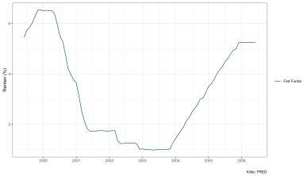
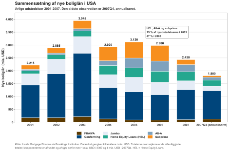
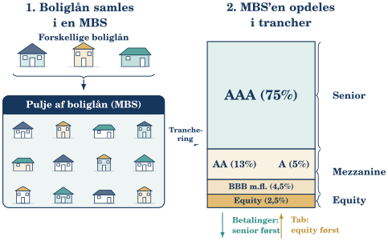
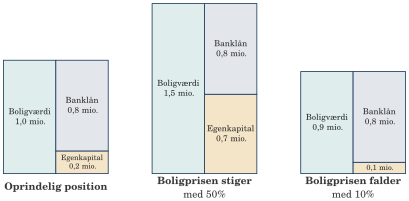
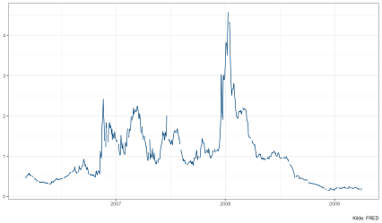
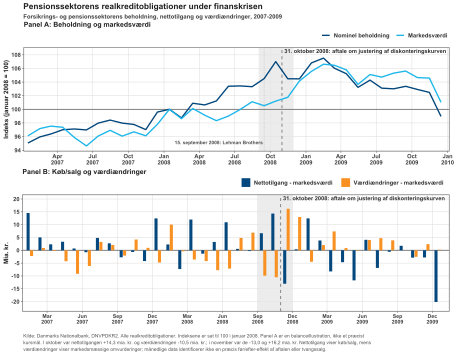
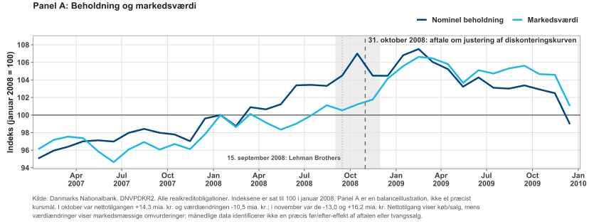
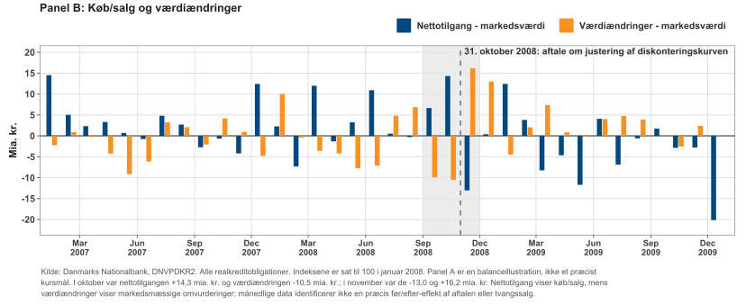
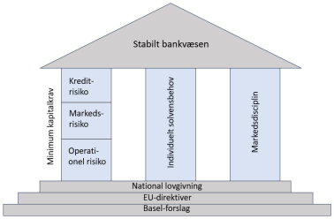
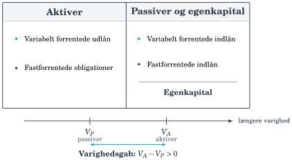

## Hvordan blev boligtab til en global krise? {#ch09-s001}

Kapitlet følger finanskrisen 2007–2009 gennem renter, kreditgivning, obligationsstrukturer, gearing og funding.

Boligtab → lavere aktivværdier → svækket kapital → forsvindende funding → tvungne salg.

Den amerikanske kæde fra boliglån til RMBS og CDO sammenholdes med dansk realkredit. Til sidst genfindes balancemekanismerne i SVB i 2023.

CDO'er var ikke en del af dansk realkredits kernefinansiering. Kilder: Rangvid (2021) og Rangvid-udvalget (2013).

::: {.notes}
Følg, hvem der bærer hvilke risici, og hvordan de flytter sig mellem balancerne.
:::

## Lav rente og let kredit øgede sårbarheden {#ch09-s002}

Efter recessionen i 2001 sænkede Federal Reserve renten kraftigt. Arbejdsløsheden var steget fra omkring 4 til knap 6 procent.

I midten af 2000'erne mødtes:

- Lav rente og let adgang til kredit.
- Økonomisk vækst og høj optimisme.
- Stigende bolig- og aktiepriser.
- Finansiel innovation og større risikoappetit.

Mere kredit understøttede priserne; højere priser gjorde større lån mulige.

::: {.notes}
En enkelt årsag kan ikke bære hele forklaringen. Følg samspillet mellem renter, sikkerhedsværdier og kreditgivning.
:::

## Federal funds-renten nåede 1 procent i 2003 {#ch09-s003}

{fig-alt="Federal Funds Rate 2000–2007"}

Følg faldet til 1 procent i 2003 og den efterfølgende rentestigning. Den lave rente medvirkede til kreditekspansionen. Kilde: FRED, historiske data 2000–2007.

::: {.notes}
Læs renteændringerne før kreditproblemerne. Den senere ydelsesstigning afhænger af lånets rentetilpasning.
:::

## Boligpriserne steg omkring 40 procent på syv år {#ch09-s004}

{fig-alt="Reale amerikanske huspriser 1970–2010"}

De reale huspriser steg omkring 40 procent fra 2000 til 2007 efter årtier med langt mere stabile realpriser. Bogens billedtekst: Robert Shiller; grafikken: OECD.

::: {.notes}
Reale priser er korrigeret for inflation. Spørg hvad prisstigningen gør ved eksisterende boligejeres mulighed for at låne mere.
:::

## Aktieopturen forstærkede oplevelsen af velstand {#ch09-s005}

{fig-alt="S&P Composite før, under og efter recessionen i 2001"}

Aktiemarkedet steg omkring 70 procent fra bunden i 2003 frem mod 2007. Stigende bolig- og aktieværdier gav indtryk af stabilitet. Bogens billedtekst: Robert Shiller; grafikken: egen beregning på baggrund af S&P.

::: {.notes}
Oplevet velstand kan stige samtidig med balancefølsomheden. Markedsopturen er baggrund for øget risikotagning, ikke dokumentation for lav risiko.
:::

## Kreditkvalitet, låneprogram og kontrakt er tre ting {#ch09-s006}

| Spørgsmål | Amerikanske betegnelser |
|---|---|
| Kreditkvalitet og dokumentation | Prime, Alt-A, subprime |
| Program, størrelse eller formål | Conforming, jumbo, FHA/VA, Home Equity Loans |
| Kontraktvilkår | Fast/variabel rente, LTV, afdrag eller negativ amortisering |

Conforming følger Fannie Mae/Freddie Macs rammer; jumbo overstiger størrelsesgrænsen. FHA/VA er støttede programmer; HEL belåner friværdi.

Subprime voksede fra under 10 til omkring 20 procent af nye lån i begyndelsen til midten af 2000'erne.

::: {.notes}
Kategorierne krydser hinanden. Undgå at definere alle jumbo- eller HEL-lån som dårlig kreditkvalitet.
:::

## Refinansiering kunne være den skjulte forudsætning {#ch09-s007}

Mange subprime-lån var 2/28- eller 3/27-ARM med lav indledende rente og senere rentetilpasning.

ARM betyder variabel rente; ikke alle ARM havde teaser-rente.

- **100% LTV:** ingen egenbetaling som tabsbuffer.
- **Negativ amortisering:** ydelsen dækker ikke renterne, så restgælden vokser.

Sårbarheden var størst, når betalingsevnen krævede salg eller omlægning før dyrere vilkår. Faldende huspriser kunne lukke begge udveje. Kilde: FCIC (2011).

::: {.notes}
Det er kombinationen af kundens økonomi, belåning og vilkår, der er afgørende. Ikke alle lån krævede fortsatte prisstigninger.
:::

## Nye lån skiftede sammensætning {#ch09-s008}

{fig-alt="Nye amerikanske boliglån fordelt på markedskategorier 2001–2007"}

Kategorierne er kildens markedsgrupper, ikke en ren kreditklassifikation. Sidste observation: fjerde kvartal 2007 opregnet til årsniveau. Kilde: Inside Mortgage Finance via Brookings.

::: {.notes}
Læs både gruppestørrelse og andel. Undgå at sidestille diagrammets opdeling med prime over for subprime alene.
:::

## Friværdien finansierede mere end boligen {#ch09-s009}

Conforming, FHA/VA og jumbo faldt samlet fra omkring 85 procent af nye lån i 2001 til 52 procent i 2006.

Subprime, Alt-A og HEL steg tilsvarende fra omkring 15 procent til næsten halvdelen. Figurens annotation angiver 2003 for 15 procent; bogteksten angiver 2001.

I 2005 trak amerikanske boligejere næsten **744 mia. USD** ud af friværdien, over tre gange niveauet i 2000.

Boligpriserne understøttede dermed både låntagning og forbrug. Kilde: Greenspan og Kennedy (2007).

::: {.notes}
Friværdiudtræk er låntagning med sikkerhed i boligen, ikke en lønindtægt. Det kobler boligmarkedet til husholdningernes løbende efterspørgsel.
:::

## Betalinger og tab løber hver sin vej {#ch09-s010}

{fig-alt="Boliglån samles i MBS og trancheres med senior, mezzanine og equity"}

Betalinger går først til senior. Tab rammer først equity. Trancheandelene er stiliserede. Figuren viser MBS-leddet; en CDO kan tilføje endnu et lag. Kilde: Brookings.

::: {.notes}
Følg betalingspilen og tabspilen hver for sig. De underordnede trancher er seniorinvestorens tabsbuffer.
:::

## CDO lagde endnu et tranchevandfald oven på RMBS {#ch09-s011}

Boliglån → RMBS-pulje → senior, mezzanine og equity.

En boligrelateret CDO kunne samle især lavere ratede RMBS-trancher og udstede nye trancher.

En CDO-squared samlede trancher fra andre CDO'er.

Høje seniorratings byggede på tabsbuffer, tranchering og modeller for misligholdelsernes korrelation. Flere lag gjorde forbindelsen til de oprindelige lån sværere at gennemskue.

::: {.notes}
Securitisering omfordeler risiko. At blande papirer eller give dem et nyt navn fjerner ikke puljens samlede kreditrisiko.
:::

## Høj rating fjernede ikke korrelerede tab {#ch09-s012}

Tre forhold forstærkede hinanden:

1. Lav rente skabte efterspørgsel efter AAA-papirer med lidt merafkast.
2. Modeller undervurderede brede, samtidige boligprisfald og korrelerede misligholdelser.
3. Mange led skjulte, hvem der bar tabene.

83 procent af Aaa-trancherne fra 2006-vintagen blev senere nedgraderet af Moody's. Kilde: FCIC (2011), s. 222.

Originate-to-distribute kunne svække screening, selv om garantier, lager- og omdømmerisiko blev tilbage.

::: {.notes}
En høj rating er en vurdering under modelantagelser. Det fælles boligprischok gjorde de antagelser afgørende.
:::

## USA og Danmark placerer kreditrisiko forskelligt {#ch09-s013}

| Led | Amerikansk krisekæde | Dansk realkredit |
|---|---|---|
| Låntager | Svag kredit, høj LTV og refinansieringsafhængige vilkår i dele af markedet | Kreditvurdering, LTV-grænser og produktregler |
| Kreditbeslutning | Lån og kreditrisiko kunne sælges videre | Instituttet beholder låntagerens kreditrisiko |
| Tab | Fordeles gennem tranchevandfald | Instituttets kapital absorberer låntagers tab først |

Fælles sårbarhed: faldende boligpriser kan svække både låntager og sikkerhed.

::: {.notes}
Den danske struktur fjerner ikke kreditrisiko. Den placerer den hos instituttet og dets kapital frem for direkte at sende låntagers tab gennem et tranchevandfald.
:::

## Finansieringen afgør, om gælden skal fornyes {#ch09-s014}

| | Amerikansk krisekæde | Dansk kernefinansiering |
|---|---|---|
| Funding | RMBS/CDO; nogle beholdninger med kort repo eller ABCP | Obligationer matcher lånets centrale egenskaber |
| Investor | Trancheprioritet og flere risikolag | Især kurs-, rente-, konverterings- og likviditetsrisiko |
| Stress | Tab, uigennemsigtighed og funding-run | Spænd, likviditet og refinansiering kan presse markedet |

**Shadow banking:** kreditformidling uden for traditionelle indlånsbanker. Korte ABCP finansierede lange aktiver med smallere sikkerhedsnet; långivere kunne undlade at forny.

::: {.notes}
Kreditformidlingen lignede bankernes løbetidstransformation, men havde ofte hverken almindelig indskydergaranti eller direkte centralbankadgang.
:::

## Adam køber bolig med 80 procent belåning {#ch09-s015}

Adam køber et hus til 1 mio. USD:

| Finansiering | USD |
|---|---:|
| Egenbetaling | 200.000 |
| Banklån | 800.000 |
| LTV | 80% |

Banken vurderer løn, formue, udgifter og betalingsevne. Adam har 20 års stabilt arbejde.

80 procent er et illustrativt amerikansk niveau; det er også den danske realkreditgrænse for helårsboliger, ikke en amerikansk lovgrænse.

::: {.notes}
Begynd med balanceidentiteten. Pantets værdi kan ikke erstatte vurderingen af, om kunden kan betale renter og afdrag.
:::

## Gælden står fast, egenkapitalen tager udsvinget {#ch09-s016}

{fig-alt="Adams balance ved husværdi 1,0, 1,5 og 0,9 mio. USD med fast gæld på 0,8 mio."}

En prisstigning på 50 procent øger egenkapitalen fra 0,2 til 0,7 mio. USD. Et prisfald på 10 procent halverer den til 0,1 mio.

::: {.notes}
Gælden er uændret i alle tre paneler. Låntagning forstærker både gevinst og tab relativt til egenkapitalen.
:::

## Solvens og likviditet er forskellige sårbarheder {#ch09-s017}

**Solvens:** kan aktivernes værdi dække gælden? Lav egenkapital gør selv små aktivfald alvorlige.

**Likviditet:** kan forpligtelser betales til tiden? Kort funding kan forsvinde, før solvensen er afklaret.

Fundingtab → pressede salg → lavere aktivværdi → mindre egenkapital → svagere tillid.

Hos Adam er 80 procent LTV en buffer, men salgsomkostninger og liggetid kan reducere den. Ved 100 procent LTV giver selv små prisfald negativ egenkapital, selv om ydelsen stadig kan betales.

::: {.notes}
Undgå at sidestille negativ boligegenkapital med øjeblikkelig betalingsstandsning. Betalingsevne og nettoværdi er forskellige spørgsmål.
:::

## Kapitalandel og gearing er hinandens inverse {#ch09-s018}

$$\text{Kapitalandel}=\frac{\text{egenkapital}}{\text{aktiver}},\qquad
\text{Gearing}=\frac{\text{aktiver}}{\text{egenkapital}}.$$

Kapitalandelen viser tabsbufferens størrelse. Gearingen viser, hvor mange kroner i aktiver én krone egenkapital understøtter.

Høj gearing forstærker både gode afkast og dårlige tab på egenkapitalen.

Disse mål bruger hele balancen; de er ikke risikovægtede kapitalkrav.

::: {.notes}
De to brøker er inverse, når samme værdiansættelse bruges. I næste eksempel er grundlaget bogførte bruttobalancetal.
:::

## Lehmans aktiver den 31. maj 2008 {#ch09-s019}

Lehman Brothers, 31. maj 2008. Mio. USD.

| Aktiver | Beløb |
|---|---:|
| Cash og andre | 61.265 |
| Værdipapirer og finansielle instrumenter | 196.997 |
| Reverse repo og lignende | 299.283 |
| Andre aktiver | 81.887 |
| **Aktiver i alt** | **639.432** |

Kilde: Lehmans Form 10-Q, grupperet til undervisningsbrug.

::: {.notes}
Reverse repo er en aktivpost, mens repo-funding står på passivsiden. Det er vigtigt at læse begge sider af den store bruttobalance.
:::

## Lehmans funding og egenkapital {#ch09-s020}

Lehman Brothers, 31. maj 2008. Mio. USD.

| Passiver og egenkapital | Beløb |
|---|---:|
| Kortfristet gæld | 300.917 |
| Værdipapirer solgt m.v. | 61.243 |
| Repos m.v. | 127.846 |
| Langfristet gæld | 123.150 |
| Egenkapital | 26.276 |
| **I alt** | **639.432** |

Den store aktivside var finansieret med en lille egenkapitalbuffer. Kilde: Form 10-Q.

::: {.notes}
Hold kapitalbuffer og kontantberedskab adskilt. De 26.276 er ikke en kasse med likvide midler.
:::

## En buffer på 4,1 procent er hurtigt brugt {#ch09-s021}

$$\text{Kapitalandel}=\frac{26.276}{639.432}\approx4{,}1\%,$$
$$\text{Gearing}=\frac{639.432}{26.276}\approx24.$$

Et ensidigt aktivfald på omkring 4,1 procent kan statisk udhule egenkapitalen.

Det er ikke en præcis konkursgrænse: passiver, afdækning, poster uden for balancen og realiserbare værdier kan også ændres.

Dette er bruttogearing. Lehmans justerede nettogearing var et andet mål. Konkursen forstærkede en allerede alvorlig krise.

::: {.notes}
Brug formuleringen alt andet lige. Historisk var grænsen mellem illikviditet og insolvens omstridt, fordi de illikvide aktivers værdi var usikker.
:::

## Kreditproblemet blev et fundingproblem {#ch09-s022}

Fed begyndte at hæve renten i 2004. ARM-ydelser steg ved rentetilpasning; subprime-misligholdelser accelererede især fra anden halvdel af 2006.

Subprime var kun en del af udlånet. Systemeffekten kom fra kombinationen:

Tab + ukendt risikoplacering + høj gearing + kort funding.

Långiver kunne kræve mere sikkerhed, kortere løbetid eller afvise fornyelse. Usikker kreditkvalitet blev dermed et akut behov for kontanter.

::: {.notes}
Skeln stødets oprindelige størrelse fra systemets evne til at forstærke det. Lange aktiver skulle finansieres igen og igen.
:::

## Et sikret repo kan stadig blive ramt af et run {#ch09-s023}

Repo er et lån mod sikkerhed i værdipapirer.

Højere haircut → mindre lån mod samme sikkerhed → behov for flere kontanter eller flere aktiver.

Manglende fornyelse kan udløse tvangssalg. Salgene presser priser og sikkerhedsværdier og kan skabe nye krav.

Et nødsalg bliver ikke automatisk alle bankers bogførte værdi. Virkningen afhænger af aktivt marked, sammenlignelighed og regnskabsklassifikation, men prisen påvirker økonomisk kapital og tillid.

::: {.notes}
Repo er sikret, men kan løbe ud. Stressen var forskellig på tværs af repo-markedet; undgå at beskrive alle aktører som ens ramt.
:::

## Lehman forstærkede panikken i september 2008 {#ch09-s024}

Lehman mistede afgørende funding, mens usikre aktivværdier gjorde kapitalrejsning og refinansiering sværere.

Konkursen omfattede omkring 600 mia. USD. Modparter, derivater og selskabsstruktur skabte juridisk og finansiel usikkerhed; forventninger til statsstøtte blev revurderet.

Reserve Primary Fund havde Lehman-papirer for 785 mio. USD, cirka 1,2 procent af aktiverne. Fonden modtog milliardstore indløsningskrav og “brød dollaren”.

Direkte tab og systemisk effekt var vidt forskellige størrelser. Kilde: FCIC (2011).

::: {.notes}
Et lille relativt aktivtab kan få stor betydning, hvis mange investorer vil ud samtidig. Det er en konkret netværks- og likviditetsmekanisme.
:::

## TED-spreadet er en bred stressindikator {#ch09-s025}

{fig-alt="TED-spread under finanskrisen"}

TED = 3-måneders USD LIBOR minus 3-måneders Treasury bill-rente. Det kombinerer bankernes kredit- og likviditetspræmie med flugt mod statspapirer. Kilde: FRED, TEDRATE.

::: {.notes}
Spændet måler ikke rent tillid eller mængden af faktiske interbankhandler. Det viser forskellen mellem offentlig og privat kort funding.
:::

## Kreditstramning ramte produktion og beskæftigelse {#ch09-s026}

{fig-alt="Amerikansk BNP-vækst og industriel produktion omkring finanskrisen"}

Strammere kreditvilkår dæmpede forbrug og investeringer; usikkerhed øgede opsparingen. Produktion faldt, arbejdsløshed steg, og statsfinanserne blev svækket. Grafikkens kilder: FRED (GDPC1) og IMF; historisk forløb omkring 2008–2009.

::: {.notes}
Forbind balancerne med realøkonomien: færre lån og mere forsigtighed påvirker virksomhedernes og husholdningernes udgifter.
:::

## Adam med 100 procent belåning mister sin buffer {#ch09-s027}

Alternativt låner Adam hele købsprisen på 1 mio. USD.

Efter et prisfald på 25 procent:

$$\text{Bolig}=750.000,\qquad\text{gæld}=1.000.000,$$
$$\text{egenkapital}=-250.000\ \text{USD}.$$

Han er teknisk insolvent. Mister han samtidig jobbet, kan både ydelsesbetaling og salg blive umulige uden tab.

Mange samtidige misligholdelser → salg af overtagne boliger → yderligere prisfald.

::: {.notes}
Dette gennemregnede eksempel viser forbindelsen mellem husholdningernes og bankernes balancer. Hold det adskilt fra bogens senere opgave med flere prisfald.
:::

## Hvem betaler, når en dansk låntager misligholder? {#ch09-s028}

Balanceprincippet begrænser instituttets rente- og finansieringsmismatch. **Låntagers kreditrisiko bliver hos instituttet.**

Ved en manglende termin:

1. Instituttet skal fortsat betale obligationens aftalte kupon og afdrag.
2. Restancen søges inddrevet; ejendommen kan ende på tvangsauktion.
3. Et underskud dækkes først af instituttet og kapitalen i det relevante kapitalcenter.

Låntagers tab trækkes ikke direkte fra investors næste betaling.

::: {.notes}
Kapitalcenteret er den særskilte pulje af lån, reserver og øvrige aktiver bag obligationerne. Sammenhold med det amerikanske tranchevandfald.
:::

## Investorens kreditbeskyttelse har flere lag {#ch09-s029}

Misligholdelse af boliglån er ikke det samme som misligholdelse af obligationsserien.

Hvis instituttet går konkurs:

- Kapitalcenterets aktiver holdes adskilt.
- Kurator skal så vidt muligt fortsætte renter og afdrag.
- Obligationsejerne har fortrinsstilling i kapitalcenteret og for eventuelle restkrav i boet.
- Utilstrækkelige aktiver kan i yderste fald betyde senere betaling eller tab.

Konkurs udløser ikke automatisk fuld indfrielse. Kilden oplyser, at intet dansk realkreditinstitut hidtil er gået konkurs. Bogens kildegrundlag: realkreditlovens §§ 27–32 og Finans Danmark.

::: {.notes}
Beskriv lagene uden at kalde kreditrisikoen nul. Dette er bogens fremstilling af investorbeskyttelsen og dens meget fjerne restrisiko.
:::

## Matchet funding forhindrede ikke markedsværditab {#ch09-s030}

Efteråret 2008: danske realkreditrenter steg, spænd til stat blev udvidet, og likviditeten faldt. Handlen fortsatte, men kurserne faldt.

Pensionsselskaber ejede mange realkreditobligationer:

- Aktiver: lavere markedsværdi.
- Passiver: pensionsløfter diskonteret med en kurve, som ikke fulgte realkreditspændet.
- Resultat: mindre forskel mellem aktiver og passiver og presset solvensbuffer.

Matchet funding hos udstederen fjernede ikke investorens markedsrisiko.

::: {.notes}
Skift aktør tydeligt: nu følger vi pensionsselskabet, ikke realkreditinstituttet. Begge sider af pensionsbalancen værdiansættes.
:::

## Pensionssektorens beholdning, handel og værdi {#ch09-s031}

{fig-alt="Pensionssektorens nominelle beholdning og markedsværdi samt nettotilgang og værdiændringer 2007–2009"}

Panel A: indeks, januar 2008 = 100; en balanceillustration, ikke kursindeks. Panel B: nettotilgang og markedsmæssige værdiændringer. Kilde: Nationalbanken, DNVPDKR2.

::: {.notes}
Begge paneler er nødvendige. Et fald i markedsværdien siger ikke i sig selv noget om, hvor mange obligationer sektoren solgte.
:::

## Beholdning og markedsværdi kan bevæge sig forskelligt {#ch09-s060}

{fig-alt="Panel A: pensionssektorens nominelle beholdning og markedsværdi af realkreditobligationer 2007–2009"}

Indeks, januar 2008 = 100. Beholdning og markedsværdi beskriver balancen; grafen er ikke et kursindeks. Kilde: Nationalbanken, DNVPDKR2.

::: {.notes}
Følg først de to kurver hver for sig. Markedsværdien afhænger både af beholdningen og priserne; forskellen mellem kurverne kan derfor ikke læses som nettosalg. Næste panel skiller handler fra markedets omvurdering.
:::

## Nettokøb og værdiændringer er to forskellige bevægelser {#ch09-s061}

{fig-alt="Panel B: pensionssektorens nettotilgang og markedsmæssige værdiændringer 2007–2009"}

Sammenlign nettotilgang med værdiændringer, især oktober og november 2008. Figuren dokumenterer ikke tvangssalg eller aftalens kausale effekt. Kilde: Nationalbanken, DNVPDKR2.

::: {.notes}
Vis, hvordan nettokøb kan ledsages af negative værdiændringer og omvendt. Et bogført værditab og en salgsbeslutning er forskellige hændelser.
:::

## Oktober og november viser forskellen på salg og tab {#ch09-s032}

| Pensionssektoren, 2008 | Nettokøb/-salg | Markedsværdiændring |
|---|---:|---:|
| Oktober | +14,3 mia. kr. | −10,5 mia. kr. |
| November | −13,0 mia. kr. | +16,2 mia. kr. |

Negative værdiændringer kan forekomme samtidig med nettokøb, og omvendt.

Figuren dokumenterer markedsstress og porteføljebevægelser. Den beviser hverken tvangssalg eller en kausal effekt af aftalen 31. oktober 2008.

::: {.notes}
Bed holdet forklare forskellen på at eje, at handle og at omvurdere. Det er samme skel som i kapitel 8's afkastregnskab.
:::

## Diskonteringskurven ændrede den målte solvens {#ch09-s033}

Aftalen 31. oktober 2008 inddrog realkreditrenten i pensionsselskabernes diskonteringskurve.

Højere diskonteringsrente → lavere nutidsværdi af fremtidige pensionsløfter → mindre pres på opgjort solvens.

Ændringen skaffede ikke kontanter og fjernede ikke aktivernes kurstab. Hensigten var at dæmpe selvforstærkende salg.

Pensionssektoren havde ikke bankernes korte, flygtige indlån. Fællestrækket er kapitalfølsomme balancer, ikke identisk funding. Kilder: Nationalbanken (2008), Finanstilsynet (2016).

::: {.notes}
Skeln målereglen fra det økonomiske aktivtab. Der kan være mindre regulatorisk pres uden, at markedsrisikoen forsvinder.
:::

## Pengepolitikken brugte både rente og balance {#ch09-s034}

Regeringer stillede garantier og kapital til rådighed. Centralbanker tilførte ekstraordinær likviditet og sænkede renter.

Den 16. december 2008 satte Fed målintervallet til 0–0,25 procent. Det blev fastholdt til december 2015.

Da pladsen til yderligere rentenedsættelser blev lille, fik opkøb og balanceværktøjer større betydning.

Likviditetsstøtte, kapitalstøtte og lavere styringsrente løser forskellige problemer.

::: {.notes}
Relatér værktøjerne til henholdsvis kontantbehov, tabsabsorbering og finansieringsvilkår. Undgå at samle alle tiltag under én etiket.
:::

## Federal funds-renten blev holdt tæt ved nul {#ch09-s035}

{fig-alt="Fed Funds Rate før, under og efter finanskrisen"}

Se både det hurtige rentefald og den lange periode nær nul efter 2008. Kilde: FRED.

::: {.notes}
Den lange horisont hjælper med at forstå, hvorfor investorer og banker senere søgte afkast ved længere løbetid.
:::

## Opkøb, likviditet og finanspolitik havde forskellig timing {#ch09-s036}

| Tiltag | Tid og indhold |
|---|---|
| Fed | Agency-gæld og agency-MBS annonceret november 2008 |
| Fed, marts 2009 | Udvidelse til bl.a. 1.250 mia. USD agency-MBS og 300 mia. USD lange statsobligationer |
| ECB | Tidlig balancevækst især likviditetsoperationer; bredt statsopkøb fra marts 2015 |
| Finanspolitik | Automatiske stabilisatorer, diskretionære tiltag og støtte til finanssektoren |

Centralbankbalancer skal sammenlignes efter instrument og tidspunkt. Kilder: Fed, ECB (2015), CBO (2009).

::: {.notes}
Opkøb af lange papirer og udlån af centralbanklikviditet kan begge udvide balancen, men virker gennem forskellige kanaler.
:::

## USA's underskud nåede 9,9 procent af BNP i 2009 {#ch09-s037}

{fig-alt="USA's statsunderskud som andel af BNP 1947–2018"}

Det føderale underskud var 9,9 procent af BNP i finansåret 2009, det højeste siden 1945. Både recessionens indtægtsfald og aktive tiltag bidrog. Bogens tekst bygger på CBO (2009). Grafikken angiver Sydbank og viser ca. 1955–2025; bogens caption angiver FRED og 1947–2018.

::: {.notes}
Et større underskud er ikke alene et mål for størrelsen af en finanspolitisk hjælpepakke. Skatteindtægter falder også i recessionen.
:::

## Et trendgab er ikke et kausalt kriseestimat {#ch09-s038}

{fig-alt="Globalt BNP i løbende USD og mekanisk forlængelse af førkrisens nominelle vækst"}

Trend: cirka 5,7 procent nominel årlig vækst i 15 år før 2007. Bogen beskriver løbende USD; grafiksignaturen siger “Real GDP”. Inflation, valutakurser og trendvalg påvirker afstanden. Kilde: Verdensbanken; perspektiv: IMF (2018).

::: {.notes}
Figuren er ikke et estimat af BNP uden krisen. Mere systematiske studier finder vedvarende produktionstab, bl.a. via svagere investeringer, men med kontrafaktisk usikkerhed.
:::

## Basel I og II efterlod kapital- og fundinghuller {#ch09-s039}

Før krisen: for lidt kapital af høj kvalitet, ingen fælles globale likviditetskrav og utilstrækkelig dækning af systemiske forbindelser.

- **Basel I, 1988:** mindst 8 procent kapital af RWA; først kreditrisiko, markedsrisiko tilføjet i 1996.
- **Basel II, 2004:** minimumskrav, tilsyn og markedsdisciplin.
- Interne modeller gav mere risikofølsomhed, men også stor variation og mulighed for meget lave risikovægte.

Høje ratings på strukturerede papirer kunne omsættes til små kapitalkrav. Fælles minimummer skal også begrænse konkurrence via svagere regler.

::: {.notes}
Kapitalen skal absorbere uventede tab og skabe tillid. Internationale minimummer skal også begrænse konkurrence på de svageste regler.
:::

## Basel III styrkede kapital og likviditet {#ch09-s040}

Basel III svarede på tre problemer:

| Svaghed | Svar |
|---|---|
| Tynd tabsbuffer | Mere kapital af bedre kvalitet |
| Høj gearing | Ikke-risikovægtet gearingskrav som backstop |
| Kort og ustabil funding | LCR til 30 dages stress og NSFR til strukturel funding |

CET1-minimum: 4,5 procent af RWA. Kapitalbevaringsbuffer: 2,5 procent ovenpå, suppleret af bl.a. kontracykliske og systemiske buffere.

Bufferbrud begrænser bl.a. udlodning; det er ikke automatisk insolvens.

::: {.notes}
Basel III tilfører en makroprudentiel dimension, men fjerner ikke renterisiko i bankbogen, koncentrerede indlån eller governancefejl.
:::

## Output floor begrænser lave modelbaserede RWA {#ch09-s041}

De afsluttende Basel III-reformer fra 2017 kaldes ofte uformelt “Basel IV”.

Fuldt indfaset output floor:

$$RWA_{\mathrm{model}}\geq72{,}5\%\cdot RWA_{\mathrm{standard}}.$$

Gulvet gælder samlet RWA, ikke bogført kapitalandel. Reformerne styrker også standardmetoder og begrænser interne modeller.

Basel er internationale minimumsstandarder. EU gør dem bindende via bl.a. CRR og CRD; timing og dækningskreds kan afvige fra USA.

::: {.notes}
Indfasning er ikke angivet som en aktuel dato her. Placér gulvet i kapitalregnestykket.
:::

## Tre søjler understøtter bankernes robusthed {#ch09-s042}

{fig-alt="Kapitalreguleringens tre søjler: minimumskrav, tilsynsproces og markedsdisciplin"}

Søjle 1: kredit-, markeds- og operationel risiko. Søjle 2: individuelt behov, bl.a. koncentration, bankbogsrente og strategi. Søjle 3: information om risiko, kapital og likviditet. Gearingskrav, LCR og NSFR supplerer på tværs.

::: {.notes}
Danske forhold: Bankpakke I garanterede simple kreditorer og indskydere, ikke SDO; tilsynsdiamanten begrænser bl.a. kort funding. Disse pointer vises også i den efterfølgende supplerende slide ved detailopdeling.
:::

## Dansk regulering supplerer balanceprincippet {#ch09-s059}

Bankpakke I garanterede i 2008 indskydere og øvrige simple kreditorer, men ikke SDO'er.

Efter krisen supplerede danske makroprudentielle værktøjer og tilsynsdiamanter de internationale krav. Realkreditdiamanten begrænser bl.a. koncentrationen af kort funding.

Visse særligt likvide covered bonds kan indgå som Level 1 i LCR efter EU-reglerne.

Balanceprincippet begrænser instituttets direkte mismatch, men fjerner ikke refinansierings-, markeds- eller likviditetsrisiko. Kilder: Nationalbanken (2013), EU's LCR-regler (2015).

::: {.notes}
Kobl reguleringen til de konkrete sårbarheder. LCR-status påvirker også investorernes efterspørgsel efter realkreditobligationer, som kapitel 10 følger op på.
:::

## SVB havde lav kreditrisiko og høj renterisiko {#ch09-s043}

SVB var en nichebank for venturefonde, tech- og life science-selskaber.

Lange stats- og agency-papirer havde lav kreditrisiko, men betydelig renterisiko.

Stigende renter + svag afdækning + koncentreret funding + utilstrækkeligt likviditetsberedskab gjorde banken sårbar.

2008 var især kredit- og spreadtab i komplekse produkter. SVB i 2023 viste en anden vej til samme balanceproblem. Kilder: Fed (2023), SVB Form 10-K.

::: {.notes}
Lav kreditrisiko må aldrig oversættes til lav samlet risiko. Start med hvilke risici papiret har, og fortsæt med hvordan det finansieres.
:::

## SVB's faktiske balance ved udgangen af 2022 {#ch09-s044}

SVB Financial Group, ultimo 2022. Mia. USD.

| Post | Beløb/andel |
|---|---:|
| Aktiver | 211,8 |
| Investeringer | 120,1 |
| Udlån | 74,3 |
| Indlån | 173,1 |
| Uforsikrede indlån | ca. 94% |
| HTM-andel af værdipapirer | ca. 78% |

Bogført egenkapital var cirka 7,6 procent af aktiverne. Kilder: Fed (2023), SVB Form 10-K.

::: {.notes}
Dette er historiske balancetal. Senere stiliserede regneeksempler må ikke blandes med dem.
:::

## Et langt aktivben og et kort passivben skaber et gab {#ch09-s045}

{fig-alt="Bankbalance med aktivvarighed større end passivvarighed"}

$V_A$ og $V_P$ er modificerede varigheder. Et positivt gab betyder større relativ rentefølsomhed på aktivsiden. ALM er styring af aktiver og passiver sammen.

::: {.notes}
Fastforrentede passiver falder også i markedsværdi ved rentestigning. Indlån uden løbetid kræver derimod antagelser om kundeadfærd.
:::

## Koncentrerede indlån finansierede lange obligationer {#ch09-s046}

| Balanceprofil | Klassisk bank, skematisk | SVB |
|---|---|---|
| Udlån | Høj andel | Lavere andel |
| Obligationer | Moderat andel | Meget stor, lang og ofte HTM |
| Likvider | Mindre andel | Begrænset andel |
| Indlån | Bredt fordelt | Koncentreret og uforsikret |
| Ekstern funding | Varierer | Lav |
| Egenkapital/aktiver | Typisk 5–10% | Ca. 7,6% ultimo 2022 |

Billige indlån finansierede merafkast på lange obligationer. Merafkastet indebar varighedsrisiko.

::: {.notes}
Tabellen er en skematisk sammenligning, ikke en universel beskrivelse af alle klassiske banker. SVB havde renterisiko på aktivsiden og runrisiko på passivsiden.
:::

## HTM ændrer regnskabet, ikke den økonomiske renterisiko {#ch09-s047}

HTM måles til **amortiseret kost**, ikke nominel værdi. Fair value oplyses i noterne.

SVB ultimo 2022:

- HTM: kost cirka 91,3 mia. USD; fair value cirka 76,2 mia.
- Samlede urealiserede værdipapirtab inklusive AFS: cirka 17,7 mia. USD.

Tabene var omtrent på størrelse med bogført egenkapital, uden dermed at være realiseret insolvens.

Faldende venturetilførsel reducerede kundernes indlån. Deposit beta måler rentetilpasning; runrisiko måler selve udtrækket.

::: {.notes}
Regnskabsklassifikation giver tid, hvis funding og tillid holder. Et økonomisk tab forsvinder ikke, fordi det ikke indregnes løbende samme sted.
:::

## To dage gjorde likviditetsbehovet akut {#ch09-s048}

**8. marts 2023:** SVB annoncerede salg af cirka 21 mia. USD AFS-papirer, tab efter skat på 1,8 mia. og plan om 2,25 mia. ny kapital.

**9. marts:** mere end 40 mia. USD blev trukket ud. Over 100 mia. yderligere stod til at forlade banken næste dag.

Salget var AFS, ikke et dokumenteret HTM-salg. Digitale kanaler accelererede run'et; koncentration og svagt likviditetsberedskab gjorde banken sårbar.

Kapital alene skaffer ikke kontanter under et run. Kilde: Fed (2023), s. 25–26.

::: {.notes}
Fasthold kronologien. Den konkrete tabsrealisering må ikke fejlagtigt tilskrives HTM-porteføljen.
:::

## Gearing forstærker egenkapitalens varighed {#ch09-s049}

$$V_E=V_P+\frac{MVA}{MVE}(V_A-V_P).$$

- $V_A,V_P$: modificerede aktiv- og passivvarigheder.
- $MVA,MVE$: markedsværdi af aktiver og egenkapital.
- $MVA/MVE$: markedsværdibaseret gearing.

Et stort varighedsgab bliver forstærket af høj gearing.

Førsteorden: samme lille, parallelle renteskift på begge sider. Konveksitet, basisrisiko og optioner er udeladt.

::: {.notes}
Egenkapital er forskellen mellem de to sider. En lille forskel mellem deres rentevirkninger kan blive stor relativt til den lille egenkapital.
:::

## Standardbanken matcher aktiv- og passivvarighed {#ch09-s050}

Stiliseret standardbank; markedsværdier i fælles enhed.

| Post | Værdi | Modificeret varighed, år |
|---|---:|---:|
| Udlån | 70 | 2,0 |
| Obligationer | 20 | 3,0 |
| Likvider | 10 | 0,0 |
| Indlån | 90 | 2,0 |
| Egenkapital | 10 | — |

$$V_A=\frac{70\cdot2+20\cdot3}{100}=2,\quad V_P=\frac{90\cdot2}{90}=2.$$
$$V_E=2+10(2-2)=2.$$

+1 procentpoint giver cirka −2 procent i egenkapitalens markedsværdi.

::: {.notes}
Ens aktiv- og passivvarighed giver ikke nul egenkapitalvarighed. Begge sider ændres proportionelt, og egenkapitalen gør det samme.
:::

## Den SVB-lignende bank har et stort varighedsgab {#ch09-s051}

Stiliseret SVB-lignende bank; ikke et historisk estimat.

| Post | Værdi | Modificeret varighed, år |
|---|---:|---:|
| Obligationer | 70 | 6,0 |
| Udlån | 20 | 2,0 |
| Likvider | 10 | 0,0 |
| Indlån | 82 | 0,25 |
| Egenkapital | 18 | — |

$$V_A=\frac{70\cdot6+20\cdot2}{100}=4{,}6,\quad V_P=0{,}25.$$
$$V_E=0{,}25+\frac{100}{18}(4{,}6-0{,}25)\approx24{,}4.$$

+1 procentpoint giver cirka −24,4 procent i egenkapitalens markedsværdi.

::: {.notes}
Denne bank har mere kapital end standardbanken og er alligevel langt mere rentefølsom. Tallene isolerer betydningen af mismatch.
:::

## Mere kapital kan ikke erstatte styring af varighed {#ch09-s052}

Standardbanken: $V_E=2$. SVB-lignende bank: $V_E\approx24{,}4$.

De hypotetiske markedsværdier må ikke blandes med SVB's bogførte kapitalandel.

Der findes ikke ét universelt “sundt” antal år for egenkapitalens varighed.

IRRBB vurderer både økonomisk egenkapitalværdi, $\Delta EVE$, og nettorenteindtjening. En outlier-test sammenholder bl.a. største negative $\Delta EVE$ med 15 procent af Tier 1-kapitalen.

Det er et tilsynssignal, ikke en anbefalet varighed. Kilde: BCBS (2016).

::: {.notes}
En enkelt varighed opsummerer kun et lokalt, parallelt skift. Styring kræver scenarier for både værdi og indtjening.
:::

## 2008 og 2023: samme balancekæde, forskellige tab {#ch09-s053}

| | 2008 | SVB, 2023 |
|---|---|---|
| Aktivtab | Kredit, spænd og illikviditet | Renterisiko på lange papirer |
| Funding-run | Repo, ABCP og anden wholesale-funding | Koncentrerede, uforsikrede indlån |
| Forstærkning | Gearing og uigennemsigtighed | Gearing, digitale kanaler og tætte netværk |

Fælles kæde: aktivtab → svækket kapital → fundingudtræk → realisationsbehov.

SVB var ikke underlagt fuldt LCR. Fed vurderede, at banken ville have klaret et reduceret krav, men ikke det fulde. Kilde: Fed (2023), s. 84.

::: {.notes}
Bogføring ændrer ikke økonomisk risiko i nogen af episoderne. Skeln fortsat deposit beta fra et egentligt run.
:::

## Kapital, afdækning og likviditet skal styres hver for sig {#ch09-s054}

Tre risikodimensioner kræver tre slags styring:

- **Kapital:** tabsabsorberende buffer.
- **Varighedsgab:** aktiv/passivstyring samt eventuelt swaps eller futures.
- **Likviditet:** beredskab mod koncentrerede og uforsikrede indlånsudtræk.

Afdækning har omkostninger samt basis- og regnskabsrisiko og skal vurderes som risikostyring, ikke kun på periodens resultat.

Næste kapitel omsætter risiko til kapitalbehov, priser og kreditadgang.

::: {.notes}
Dansk pensionsstress viste markedsrisiko uden bank-run; SVB kombinerede markedsrisiko med run. Ingen enkelt ratio dækker begge mekanismer fuldt.
:::

## Opgaver: boligejerens og bankens tabsbuffer {#ch09-s055}

**Boligejeren:** Adam køber for 1 mio. USD med henholdsvis 80 og 100 procent belåning. Beregn egenkapital og LTV ved prisfald på 10, 20 og 30 procent. Hvornår er han teknisk insolvent?

**Banken:** Aktiver 500 mia. kr., egenkapital 15 mia. kr. Beregn kapitalandel, gearing og det statiske aktivfald, som udhuler egenkapitalen. Sammenlign med Lehman.

::: {.notes}
Lad først grupperne vælge fælles enheder. Bed dem formulere forudsætningerne bag en statisk konkursgrænse.
:::

## Opgaver: tranchetab og pensionssektorens bevægelser {#ch09-s056}

**Trancher:** En pulje på 100 mio. kr. har senior 70, mezzanine 20 og equity 10. Fordel tab på 5, 15 og 35 mio. kr. Hvorfor betyder korrelation noget for seniorratingen?

**Pensionssektoren:** Forklar negativ værdiændring, nettosalg og risiko for procykliske salg. Hvad dokumenterer oktober og november 2008? Hvad kan figuren ikke bevise om tvangssalg eller aftalen 31. oktober?

::: {.notes}
Bed grupperne holde betalingernes prioritet og tabenes prioritet adskilt. I pensionsdelen skal deres påstande holdes inden for, hvad figuren faktisk viser.
:::

## Opgaver: rentemarginal og egenkapitalens varighed {#ch09-s057}

**Rentemarginal:** Indlån til 0,25 procent og placering i 10-årige obligationer med løbende rente 1,75 procent. Beregn simpel marginal og forklar risikoen ved +2 procentpoint. Prisfaldet kan ikke beregnes entydigt uden varighed eller cash flows.

**Egenkapital:** $V_A=5$, $V_P=0{,}5$, gearing 8. Beregn $V_E$ og førsteordenseffekten af +2 procentpoint. Hvorfor kræver et stort stød kontrol med konveksitet eller reprissætning? Ændrer HTM den økonomiske konklusion?

::: {.notes}
Opgaven undersøger grænsen mellem en kvalitativ mekanisme og et beregneligt tal. Lad de studerende selv opdage, hvilke data der mangler i første del.
:::

## Opgaver: kriser og regulatoriske svar {#ch09-s058}

Sammenlign 2008 og SVB 2023: risikotype, fundingstruktur og hastighed. Hvilken mekanisme er fælles?

Kobl problemer til CET1/buffere, output floor, LCR og NSFR:

1. Tynd tabsbuffer.
2. Meget lave modelbaserede risikovægte.
3. Store nettoudstrømninger på 30 dage.
4. Strukturelt kort funding.

Hvor passer gearingskravet ind som backstop? Hvorfor gør intet enkelt mål banken robust?

::: {.notes}
Kræv en mekanisme i hver kobling, ikke blot en forkortelse. Brug opgaven som overgang til kredit- og likviditetsmålene i kapitel 10.
:::
