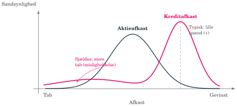
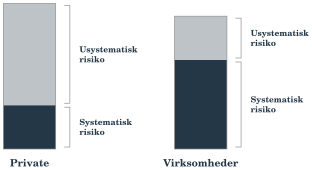
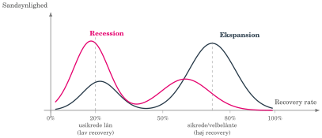
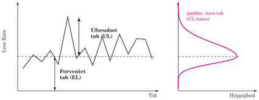
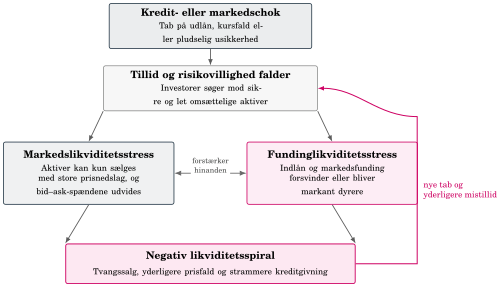

## Banken skal kunne bære den risiko, den tager {#ch10-s001}

Banken formidler kredit og omdanner kort funding til lange udlån.

Sund risikotagning kræver, at risikoen måles, prissættes og bæres med passende kapital og likviditet. Det kan give både bank og kunde en fordel.

Vi følger to kæder:

**Kreditrisiko → forventet tab → pris og kapital.**

**Likviditetsrisiko → buffer og stabil funding.**

Til sidst vender vi kæderne mod husholdningens kreditadgang og valg mellem realkredit- og prioritetslån. Markeds- og operationel risiko behandles ikke særskilt her.

::: {.notes}
Knyt til SVB: en bank kan have en tabsbuffer, men stadig mangle kontanter. Målet er bevidst risikotagning, ikke at fjerne bankens forretning.
:::

## Kreditrisiko giver små gevinster og sjældne store tab {#ch10-s002}

Kreditrisiko er risikoen for, at låntager eller modpart helt eller delvist ikke opfylder sine forpligtelser.

Det kan ramme udlån, garantier og gæld udstedt af stater.

- Typisk udfald: kunden betaler; banken tjener et moderat kreditspænd.
- Sjældent udfald: misligholdelse; renter og hovedstol kan gå tabt.

Kreditrisiko fylder meget i banker og realkreditinstitutter. I pensionskasser dominerer typisk markedsrisikoen. Måling kræver både sandsynlighed og tabsstørrelse.

::: {.notes}
Introducér asymmetrien før forkortelserne. Modeller, processer og organisation er alle dele af bankens forsvar mod tab.
:::

## Kreditafkastets hale gør gennemsnittet utilstrækkeligt {#ch10-s003}

{fig-alt="Skematisk asymmetrisk kreditafkast og næsten symmetrisk aktieafkast"}

Læs formen: en smal top ved et lille positivt spænd og en lang venstre hale med store tab. Sammenligningen med aktier er skematisk.

::: {.notes}
Sammenlign kurvernes asymmetri; figuren fastslår ikke, hvilken der har størst udsving. Gennemsnittet skjuler de sjældne tab.
:::

## Diversifikation virker forskelligt på to risikokilder {#ch10-s004}

| Risiko | Eksempler | Spredning |
|---|---|---|
| Systematisk | Recession, svag efterspørgsel og strammere finansiering | Rammer mange samtidig; kan ikke diversificeres væk |
| Usystematisk | Svag ledelse, regnskabsfusk, skilsmisse, sygdom eller jobtab | Kan reduceres gennem spredning og beredskab |

Husholdninger bruger fx forsikring, opsparing og uddannelse. Virksomheder kan sprede geografi, leverandører og kapitalstruktur.

Banken spreder kundespecifik risiko over mange kunder, men må bære fælles konjunkturstød.

::: {.notes}
Ét jobtab kan spredes i en stor låneportefølje. En recession kan gøre mange jobtab og virksomhedstab samtidige.
:::

## Private og virksomheder har forskellig risikosammensætning {#ch10-s005}

{fig-alt="Skematisk systematisk og usystematisk risiko hos private og virksomheder"}

Private har relativt mere usystematisk risiko; virksomheder relativt mere systematisk risiko. Bogillustrationen viser også større samlet risiko hos private. Det er en skematisk illustration uden estimeret skala.

::: {.notes}
Bogens illustration viser også større samlet risiko hos private. Ratingklasser hjælper banken med pris- og kapitalstyring.
:::

## PD måler misligholdelse inden for ét år {#ch10-s006}

**Probability of Default, PD:** sandsynligheden for misligholdelse inden for ét år.

Banker estimerer PD for segmenter og grupperer kunder i ratingklasser.

PD bruges til:

- Kreditvurdering: skal kunden have lånet, og på hvilke vilkår?
- Kapitalstyring: regulatorisk lovkrav og bankens interne økonomiske kapital.
- Prissætning: kredittillæg for forventet tab.

Økonomisk kapital kan være strengere end minimumskravet.

::: {.notes}
PD er en sandsynlighed, ikke et tabsbeløb. Et default betyder ikke nødvendigvis, at hele eksponeringen går tabt.
:::

## Nordea ultimo 2024: de lave PD-klasser {#ch10-s007}

Nordeas erhvervskunder, ultimo 2024. EAD i mio. EUR; PD-intervaller i procent.

| PD-interval | EAD | Gns. PD | Gns. LGD |
|---|---:|---:|---:|
| 0,00–<0,15 | 56.793 | 0,09% | 29,0% |
| 0,15–<0,25 | 17.365 | 0,27% | 27,6% |
| 0,25–<0,50 | 37.366 | 0,49% | 25,9% |
| 0,50–<0,75 | 2 | 0,65% | 36,6% |

Kilde: Nordea, kapital- og risikorapport 2024, s. 89, som gengivet i bogen. **0,27% ligger uden for det angivne interval; denne kildemodsætning er ikke afklaret.**

::: {.notes}
Tallene gengives uden en stiltiende rettelse. Tabellen bruger AIRB-estimater, og bogens gengivelse udelader underopdeling af intervallerne.
:::

## Nordea ultimo 2024: høje PD-klasser og total {#ch10-s008}

| PD-interval, procent | EAD, mio. EUR | Gns. PD | Gns. LGD |
|---|---:|---:|---:|
| 0,75–<2,50 | 21.042 | 1,21% | 25,4% |
| 2,50–<10,00 | 944 | 4,10% | 26,8% |
| 10,00–<100 | 2.528 | 20,52% | 25,8% |
| 100 (default) | 1.373 | 100,00% | 29,3% |
| **Total** | **137.412** | **1,80%** | **27,3%** |

PD/LGD er eksponeringsvægtede. EAD er efter konverteringsfaktorer og kreditrisikoreduktion. Kilde: Nordea ultimo 2024, s. 89; bogens gengivelse.

::: {.notes}
En lav gennemsnitlig PD udelukker ikke kunder med meget høj PD. Kontrollér altid, om en opgørelse omfatter allerede misligholdte eksponeringer.
:::

## LGD er tabet efter realisering af sikkerheder {#ch10-s009}

**Loss Given Default, LGD:** forventet tabsandel af eksponeringen ved misligholdelse.

$$R=1-LGD.$$

$R$ er recovery rate, den andel som genvindes gennem pant, garantier og inddrivelse.

Lav LTV og gode, omsættelige sikkerheder sænker typisk LGD. I recession kan både priser og likviditet på sikkerheder falde: recovery falder og LGD stiger.

::: {.notes}
LGD er betinget af misligholdelse. En lav PD og en lav LGD er derfor to forskellige former for beskyttelse.
:::

## Recovery falder, når sikkerheder bliver svære at sælge {#ch10-s010}

{fig-alt="Skematisk recoveryfordeling i recession og ekspansion med lave og høje recoveryklynger"}

Usikrede lån ligger typisk i klyngen med lav recovery; sikrede lån med lav LTV i den høje. Recession flytter vægt mod lavere recovery og højere LGD.

::: {.notes}
Bimodal betyder to toppe. Konjunkturen ændrer fordelingen, så LGD bør stresstestes frem for at behandles som en uforanderlig konstant.
:::

## EAD kan være større end dagens udlån {#ch10-s011}

**Exposure at Default, EAD:** den forventede eksponering på misligholdelsestidspunktet.

EAD omfatter eksisterende udestående og forventet ekstra træk på bevilgede faciliteter.

Et lån på 20 mio. kr. med en uudnyttet kassekredit på 10 mio. kr. kan få EAD over 20 mio. kr.

En konverteringsfaktor, CF, beskriver forventet ekstraudnyttelse. Den afhænger af kundeadfærd, facilitet og konjunktur.

::: {.notes}
CF betyder her conversion factor, ikke cash flow som i obligationskapitlerne. Spørg, hvorfor en presset kunde kan trække mere netop før default.
:::

## Forventet tab bliver til et kredittillæg {#ch10-s012}

$$EL=PD\cdot LGD\cdot EAD.$$

EL er forventet tab i kroner. Gennemsnitstabet er en løbende omkostning ved kreditgivning.

Pr. krone eksponering giver en forenklet étårsapproksimation:

$$s=PD(1-R)=PD\cdot LGD.$$

Kredittillægget kompenserer for forventet tab. Det er en komponent i et samlet spænd, som også kan afspejle andet end kreditrisiko.

::: {.notes}
Brug procenter som decimaltal i regnestykket. Forveksl ikke et tab i kroner med en sats, der lægges til renten.
:::

## To kunder giver kredittillæg på 12 og 0,3 procent {#ch10-s013}

| Kunde | PD | Recovery | Kredittillæg |
|---|---:|---:|---:|
| Høj kreditrisiko | 15% | 20% | $0{,}15(1-0{,}20)=12\%$ |
| Lav kreditrisiko | 1% | 70% | $0{,}01(1-0{,}70)=0{,}3\%$ |

Den stærkere kunde har både lavere sandsynlighed for default og bedre sikkerhed ved default.

0,3 procent svarer til 30 basispoint. Sikkerhedens recovery påvirker prisen sammen med PD.

::: {.notes}
Beregningerne er bogens undervisningseksempler. De forenklede satser er ikke færdige lånetilbud med funding, drift, kapital og fortjeneste.
:::

## LTV og afdragsfrihed påvirker bidraget {#ch10-s014}

Pant, LTV-grænser og sikkerhedskrav begrænser kreditrisikoen i dansk realkredit.

- Højere LTV kan øge LGD.
- Afdragsfrihed holder LTV høj i længere tid.
- Kort rentebinding kan øge sårbarheden i kundens betalingsevne.

Bidraget afhænger derfor af belåning og produkt og skal bidrage til både forventede tab og kapitalomkostninger.

Forventet tab forklarer en del af prisen; bidraget er ikke blot $PD\cdot LGD$.

::: {.notes}
Knyt kapitlets risikobegreber til bidragstabellerne fra kapitel 5. Skeln kundens rente- og betalingsrisiko fra instituttets kreditrisiko.
:::

## Kapitalen skal også række i sjældne, hårde år {#ch10-s015}

Et gennemsnitstab dimensionerer ikke banken til et sjældent, hårdt år.

Et pejlemærke er et étårs-konfidensniveau på 99,9 procent: en højere tabsgrænse overskrides med 0,1 procent sandsynlighed under modellen.

Intern økonomisk kapital kan bruge et højere niveau, fx cirka 99,97 procent som et AA-pejlemærke.

Historiske default-rater varierer med rating og horisont. De er et perspektiv på risikoniveau, ikke en garanti for næste år.

::: {.notes}
“Et ud af tusind år” er en sandsynlighedstolkning, ikke en kalender. Modelantagelserne bestemmer, om den beregnede beskyttelse holder.
:::

## Rating og horisont påvirker historisk misligholdelse {#ch10-s016}

Historiske virksomhedskonkurser, S&P 1981–2021. Kumulative sandsynligheder.

| Rating | 1 år | 3 år | 5 år | 7 år |
|---|---:|---:|---:|---:|
| AAA | 0,0% | 0,0% | 0,0% | 0,1% |
| AA | 0,0% | 0,0% | 0,4% | 0,7% |
| A | 0,0% | 0,5% | 1,0% | 2,0% |
| BBB | 0,5% | 2,5% | 3,6% | 4,5% |
| BB | 2,8% | 8,0% | 13,5% | 16,5% |
| B | 7,0% | 16,6% | 20,5% | 26,6% |

Afrundet 0,0 procent betyder ikke, at default er umuligt.

::: {.notes}
Lad holdet sammenligne både ned gennem ratings og hen over horisonter. En syvårig sandsynlighed kan ikke læses som en årlig PD.
:::

## Uforudset tab er tabet ud over gennemsnittet {#ch10-s017}

Worst Case Default Rate, WCDR, er en misligholdelsesrate, som kun overskrides med en valgt lille sandsynlighed, fx 0,1 procent.

$$UL=(WCDR-PD)\cdot LGD\cdot EAD.$$

UL er det ekstra tab ud over forventet tab i denne forenklede model.

**EL dækkes gennem den løbende pris. UL kræver tabsabsorberende kapital.**

::: {.notes}
WCDR er en default-rate, ikke direkte en tabssats. LGD skal stadig anvendes på den del, der misligholder.
:::

## EL dækkes af indtjening, UL kræver kapital {#ch10-s018}

{fig-alt="To paneler viser tabsrate over tid og skæv frekvensfordeling med EL og UL"}

Venstre: tab svinger omkring forventet tab. Højre: sjældne store tab ligger i halen. Afstanden op til det valgte stressniveau kræver kapital.

::: {.notes}
Figuren er skematisk; højre panels top og reference er ikke en statistisk estimeret fordeling. Brug den til arbejdsdelingen mellem indtjening og kapital.
:::

## Et udlån på 100 mio. kræver 6,24 mio. til UL {#ch10-s019}

Udlån: 100 mio. kr. Bevilgede faciliteter løfter EAD til 130 mio. kr.

$PD=2\%$, $WCDR=10\%$, recovery $40\%$, så $LGD=60\%$.

$$WCDR-PD=10\%-2\%=8\text{ procentpoint}.$$

$$UL=0{,}08\cdot0{,}60\cdot130=6{,}24\text{ mio. kr.}$$

Banken skal i dette eksempel have cirka 6,24 mio. kr. til det uforudsete tab.

::: {.notes}
8 procentpoint i forskel indsættes som 0,08. EAD er 130, selv om det aktuelle udlån kun er 100.
:::

## Fra eksponering til risikovægtede aktiver {#ch10-s020}

Standardmetoden oversætter ekstern rating eller en fast kategori til en risikovægt.

$$RWA=\sum_i EAD_i\cdot\text{risikovægt}_i,$$
$$\text{Søjle 1-kapitalkrav}=8\%\cdot RWA.$$

RWA er en risikovægtet balance, ikke det nominelle udlån.

Minimumskravet suppleres af individuelle søjle 2-krav, buffere og krav til kapitalens kvalitet. Interne PD/LGD-modeller hører til IRB, som ikke beregnes her.

::: {.notes}
De 8 procent kan ikke fortolkes som bankens samlede krav til egenkapital i alle situationer. Vi isolerer søjle 1-regnestykket.
:::

## Kapitalens kvalitet afgør, hvordan den tager tab {#ch10-s021}

| Kapitaltype | Hvordan den kan bære tab |
|---|---|
| CET1, egentlig kernekapital | Aktiekapital og opsparet overskud absorberer løbende tab |
| AT1, hybrid kernekapital | Betalinger kan springes over; nedskrivning eller konvertering ved udløsende vilkår |
| Tier 2, supplerende kapital | Lang efterstillet gæld som yderligere tabsbuffer |

Robusthed afhænger både af kapitalens mængde og sammensætning. CET1 er det bærende lag.

::: {.notes}
De forskellige instrumenter har forskellige rettigheder og tabsrækkefølger. Kapitalgrundlag er derfor bredere end almindelig bogført egenkapital.
:::

## Standardmetodens risikovægte afhænger af modparten {#ch10-s022}

Uddrag af bogens standardmetodetabel; kombinerede satser kræver valg af relevant regel.

| Klasse | Ratingeksempel | Virksomhed | Kreditinstitut |
|---|---|---:|---:|
| 1 | AAA–AA− | 20% | 20% |
| 2 | A+–A− | 50% | 50/30% |
| 3 | BBB+–BBB− | 100/75% | 50/30% |
| 4 | BB+–BB− | 100% | 100% |
| 5 | B+–B− | 150% | 100% |
| 6 | Under B− | 150% | 150% |

Brug den udtrykkeligt angivne vægt i regneeksemplerne. Tabellen er et undervisningsuddrag, ikke en fuldstændig regelvejledning.

::: {.notes}
Kilden forklarer ikke alle betingelser bag skråstregssatserne. Undgå at vælge vilkårligt mellem dem eller at kalde dem bankens egne estimater.
:::

## Et B-ratet lån på 30 mio. binder 3,6 mio. i kapital {#ch10-s023}

En bank yder et B-ratet lån med $EAD=30$ mio. kr. Risikovægten er 150 procent.

$$RWA=30\cdot1{,}50=45\text{ mio. kr.},$$
$$\text{kapitalkrav}=45\cdot0{,}08=3{,}6\text{ mio. kr.}$$

Kapitalen skal forrentes. Højere kapitalbinding kan derfor føre til højere udlånsrente eller bidrag.

Regulering bliver til både priser og grænser for kunden.

::: {.notes}
RWA kan godt overstige selve lånet. Det skyldes risikovægten over 100 procent, ikke at banken har udbetalt mere end 30 mio.
:::

## Tre bureauer bruger forskellige ratingskalaer {#ch10-s024}

| Moody's | S&P / Fitch | Betydning |
|---|---|---|
| Aaa | AAA | Bedste rating |
| Aa | AA | Meget høj kreditværdighed |
| A | A | Øvre middel |
| Baa | BBB | Nedre middel |
| Ba | BB | Spekulativ |

Investment grade går til BBB/Baa og bedre. Speculative grade begynder ved BB/Ba.

S&P og Fitch nuancerer med +/−; Moody's med 1/2/3.

::: {.notes}
Skalaerne er vurderinger af kreditværdighed. De beskriver ikke i sig selv obligationens renterisiko eller omsættelighed.
:::

## Et fald under investment grade kan udløse salg {#ch10-s025}

| Moody's | S&P / Fitch | Betydning |
|---|---|---|
| B | B | Meget spekulativ |
| Caa | CCC | Betydelig konkursrisiko |
| Ca | CC | Ekstremt spekulativ |
| C | C | Nær konkurs |
| — | D | Konkurs |

BBB → BB kan udløse salg hos investorer med investment-grade-mandat. Ratings sigter gennem cyklussen, så hvert konjunkturudsving ikke tvinger nye handler.

Dansk realkredit har typisk AAA. Krisen viste risikoen ved modeltillid og interessekonflikten, når udsteder betaler ratingbureauet.

::: {.notes}
Ratingændringer kan skabe prisbevægelser gennem investorernes regler. En stabil rating betyder heller ikke, at den økonomiske risiko er uændret.
:::

## Markedslikviditet og fundinglikviditet kan forstærke hinanden {#ch10-s026}

**Markedslikviditet:** et aktiv kan ikke sælges hurtigt uden stort prisnedslag. Tegn: brede bid–ask-spænd og tynde ordrebøger.

**Fundinglikviditet:** banken kan ikke skaffe kontanter, når forpligtelser forfalder.

Kursfald kan svække tilliden og fundingadgangen. Fundingpres kan igen fremtvinge salg og nye kursfald.

Likviditetsrisiko handler om både tid og pris på kontanter, også før tab på lån er konstateret.

::: {.notes}
Brug spørgsmålene “kan vi sælge?” og “kan vi betale?” til at læse diagrammets spiral.
:::

## Et chok kan udvikle sig til en likviditetsspiral {#ch10-s027}

{fig-alt="Kredit- eller markedschok fører via mistillid til markeds- og fundingstress og negativ likviditetsspiral"}

Følg feedbackpilen: tvangssalg og prisfald kan skabe nye tab og yderligere mistillid.

::: {.notes}
Diagrammet viser begge likviditetsformer og deres gensidige virkning. Ingen af dem bør reduceres til blot et negativt årsresultat.
:::

## En sund bank kan rammes af en systemisk likviditetskrise {#ch10-s028}

| Krise | Udløsende mekanisme |
|---|---|
| Institutspecifik | Kredittab eller skandale → indlånsudløb og dyr funding |
| Systemisk | Fælles flugt mod likvide kvalitetsaktiver → flere markeder lukker |

I realkredit kan RTL-auktioner blive pressede. Auktions- og rentetriggere er en sikkerhedsventil for funding og en forlængelsesrisiko for investor.

LCR ser på en kort stressperiode. NSFR ser på den strukturelle fundingprofil.

::: {.notes}
Tilbagekald kapitel 5's to sider af triggerne. En løsning på systemets refinansieringsproblem kan ændre investors løbetid.
:::

## LCR tester 30 dages stressede nettoudstrømninger {#ch10-s029}

$$LCR=\frac{HQLA}{\text{stresset nettoudstrømning over 30 dage}}\geq100\%.$$

HQLA er High Quality Liquid Assets, aktiver af høj kvalitet som kan bruges til likviditet.

- Level 1: bl.a. kontanter, centralbank og statsobligationer.
- Level 2A: næste gruppe med større haircut.
- Level 2B: mere cykliske eller mindre likvide aktiver.

Haircuts og sammensætningslofter afgør, hvor meget af beholdningen der kan tælles med.

::: {.notes}
Bufferens markedsværdi er ikke nødvendigvis dens LCR-værdi. Forventede udstrømninger er under et stressscenarie, ikke blot næste måneds budget.
:::

## NSFR tester den strukturelle fundingprofil {#ch10-s030}

$$NSFR=\frac{\text{tilgængelig stabil funding (ASF)}}{\text{krævet stabil funding (RSF)}}\geq100\%.$$

ASF vægter egenkapital og lang funding højt. RSF lægger større krav på lange og illikvide aktiver.

NSFR skal begrænse finansiering af eksempelvis 30-årige lån med 3-måneders penge.

LCR dækker kortsigtet stress. NSFR adresserer løbetidsmismatch i den mere langsigtede balance.

::: {.notes}
De to forholdstal har forskellige nævnere. En god LCR alene fortæller ikke, om fundingprofilen er holdbar på længere sigt.
:::

## Haircuts og kvoter bestemmer den brugbare buffer {#ch10-s031}

Bogkapitlets forenklede HQLA-oversigt:

| Niveau | Eksempler | Tælling |
|---|---|---:|
| 1 | Kontanter, centralbank, stat | 100% |
| 1, særlige covered bonds | Kvalificerende særligt dækkede obligationer | Fx 93% |
| 2A | Covered bonds, stærke virksomhedsobligationer | Ca. 85% |
| 2B | Udvalgte indeksaktier, BBB−-virksomhedsobligationer | 50–75% |

Kvoter begrænser sammensætningen. Danske realkreditobligationers HQLA-status skaber regulatorisk efterspørgsel og bidrager til snævre spænd.

::: {.notes}
Ikke alle realkreditobligationer kvalificerer automatisk til samme kategori. Tallene er bogens undervisningsforenkling; den konkrete klassifikation har betingelser.
:::

## Tre buffere justeres først for haircuts {#ch10-s032}

Alle tal i mio. kr. Stresset nettoudstrømning: 250 i hver case.

| Efter haircut | A | B | C |
|---|---:|---:|---:|
| Statsobligationer | 0 | 100 | 100 |
| Særligt dækkede, 7% | $200\cdot0{,}93=186$ | $300\cdot0{,}93=279$ | $200\cdot0{,}93=186$ |
| Level 2A, 15% | $50\cdot0{,}85=42{,}5$ | $100\cdot0{,}85=85$ | $50\cdot0{,}85=42{,}5$ |
| **Sum før kvoter** | **228,5** | **464** | **328,5** |

Næste skridt er at kontrollere sammensætningen.

::: {.notes}
Beregn værdien efter haircut før kvoten. Ellers kan både tæller og loft blive forkerte.
:::

## En stor beholdning er ikke altid en stor LCR-buffer {#ch10-s033}

Bogeksemplets forenklede kvote: mindst 30 procent stats-/centralbankaktiver.

$$\text{Bufferloft}=\frac{\text{statsbeholdning}}{0{,}30}.$$

| | A | B | C |
|---|---:|---:|---:|
| Sum før kvote | 228,5 | 464 | 328,5 |
| Kvote-loft | 0 | 333,3 | 333,3 |
| Tilladt HQLA | 0 | 333,3 | 328,5 |
| LCR, nævner 250 | 0% | 133% | 131% |

B kan ikke bruge hele beholdningen. C ligger under loftet. A mangler helt de aktiver, kvoten kræver.

::: {.notes}
Den forenklede kvote viser, at et større depot ikke nødvendigvis giver en tilsvarende større anvendelig buffer.
:::

## Likviditetspræmien afhænger af handelsomkostning og horisont {#ch10-s034}

Et større bid–ask-spænd er en omkostning ved at komme ind og ud af en position.

$$\text{Likviditetspræmie}\approx\frac{S_b-S_s}{H\cdot P}.$$

- $S_b$: bid–ask-spænd i kurspoint på det illikvide papir.
- $S_s$: spænd på et sammenligneligt likvidt papir.
- $H$: horisont i år.
- $P$: gennemsnitskurs.

Samme handelsomkostning kræver større årlig kompensation ved kort horisont.

::: {.notes}
S er her bid–ask-spænd, ikke OAS eller en obligationsrente. Enhederne skal passe: kurspoint over kurs giver relativ omkostning.
:::

## Et større bid–ask-spænd kræver 1,8 procent ekstra om året {#ch10-s035}

Illikvid obligation: bid–ask 94–95, købskurs 95. Likvidt sammenligningspapir: spænd 0,10.

$H=0{,}5$ år og $P\approx100$ i bogens årlige tilnærmelse:

$$\Delta S=1-0{,}10=0{,}90,$$
$$\frac{0{,}90}{0{,}5\cdot100}=1{,}8\%\text{ p.a.}$$

Med midtkurs 94,5 er meromkostningen $0{,}90/94{,}5\approx0{,}95\%$ af beløbet.

I stress kan spændet udvides, så den faktiske omkostning bliver større.

::: {.notes}
De to nævnere viser forskellige tilnærmelser i bogen: 100 bruges til annualisering, 94,5 til relativ handelsomkostning. Kald ikke 94,5 selve købskursen.
:::

## Kreditvurderingen afgør adgangen til markedsrenten {#ch10-s036}

Husholdningen møder ikke markedsrenten direkte. Den møder en kreditvurdering.

**PD-spørgsmålet:** kan kunden betale? Se på indkomstens størrelse og stabilitet, arbejde og betalingshistorik.

**LGD-spørgsmålet:** hvor stort bliver tabet? Se på pant, LTV og formue.

Svarene bestemmer både adgang til lånet og pris i marginer og bidrag.

Markedslikviditetens præmie er samtidig en del af de spænd, der indgår i funding og OAS.

::: {.notes}
Vend perspektivet fra bankens model til kundens oplevelse. En fælles markedsrente giver ikke fælles lånemuligheder.
:::

## Rådighedsbeløb, gældsfaktor og LTV skal hænge sammen {#ch10-s037}

| Håndtag | Hvad undersøges? |
|---|---|
| Rådighedsbeløb | Månedlig indkomst efter faste udgifter; plads til ydelse og buffer |
| Gældsfaktor | Samlet gæld / årlig bruttoindkomst |
| LTV | Gæld / boligens værdi |

Bogkapitlets tommelfingerregel for gældsfaktor er omkring 3½–4; højere niveau kræver særlig robusthed.

Kunden stresstestes typisk mod fast rente med afdrag, også ved ønske om variabel rente eller afdragsfrihed. Dagens lave ydelse er ikke nok.

::: {.notes}
Gældsfaktoren er her en tommelfingerregel, ikke en universel ret eller grænse. Der foretages en samlet vurdering af betalingsevne.
:::

## Find det største lån, en fast ydelse kan bære {#ch10-s038}

En husholdning kan betale $Y=15.000$ kr. om måneden i 30 år, altså 360 terminer.

Se bort fra skat, bidrag og omkostninger. Med årlig nominelt angivet rente $r$ og månedsrente $r/12$:

$$L_{\max}=Y\frac{1-(1+r/12)^{-360}}{r/12}.$$

Det maksimale lån er nutidsværdien af de ydelser, husholdningen kan betale.

::: {.notes}
Dette er annuitetsformlen fra kapitel 2 løst for hovedstolen. r/12 er den eksplicitte rentekonvention i eksemplet, ikke en omregning af en effektiv årlig rente.
:::

## Renten fra 1 til 5 procent fjerner 40 procent af kapaciteten {#ch10-s039}

Samme 15.000 kr. pr. måned og 360 terminer:

| Årlig rente | Annuitetsfaktor | Maksimalt lån |
|---|---:|---:|
| 1% | 310,9 | 4,66 mio. kr. |
| 5% | 186,3 | 2,79 mio. kr. |

Renteændringen reducerer lånekapaciteten med omkring 40 procent.

Lavere lånekapacitet kan reducere, hvad boligkøbere kan byde, og lægge pres på boligpriserne. Kreditvurdering og boligmarked hænger sammen.

::: {.notes}
Procentfaldet skal måles relativt til det oprindelige lån. Fasthold, at regnestykket udelader bidrag, skat og omkostninger.
:::

## To husholdninger møder samme rente og forskellig adgang {#ch10-s040}

| | Husholdning A | Husholdning B |
|---|---|---|
| Indkomst | Stabil fastansættelse | Nystartet, svingende indkomst |
| Gældsfaktor | 2,5 | 4,5 |
| Samlet LTV | 70% | 95% |
| Rådighedsbeløb | Solidt | Stramt |
| Muligt resultat | Realkredit og lavt bidrag | Afslag eller dyr topfinansiering og højere bidrag |

A har lavere PD og LGD. B skal finansiere belåningen over realkreditgrænsen på andre vilkår. Forskellen forklarer prisen, men afgør ikke fordelingsspørgsmålet.

::: {.notes}
95 procent er samlet belåning, ikke en tilladt realkreditandel. Topfinansiering kan være sikret ved efterstående pant; kald den ikke nødvendigvis usikret.
:::

## Prioritetslånet ligger på bankens balance {#ch10-s041}

Et prioritetslån er et banklån med pant i boligen.

Finanstilsynets afgrænsning i bogens kilde: lån til en husholdning med pant i dansk ejerbolig **uden et foranstående lån af betydning**.

Banken vælger funding på sin samlede passivside, fx indlån eller markedsfunding. Kundens lån er ikke knyttet direkte til én obligationsserie.

Friheden kræver styring af rente-, likviditets- og refinansieringsmismatch. Udsteder banken selv SDO, gælder reglerne for udstedelsen stadig.

::: {.notes}
Knyt forskellen til balanceprincippet fra kapitel 5. Prioritetslånets placering på bankbalancen ændrer finansieringsmekanismen.
:::

## Første prioritet og anden prioritet er forskellige produkter {#ch10-s042}

Banklån med pant kan enten erstatte eller supplere realkredit.

- Prioritetslån i analysen: intet foranstående lån af betydning.
- Andenprioritetslån: banklånet ligger efter et realkreditlån og finansierer en del af resten.

En fleksibel bankkredit oven på realkredit er derfor ikke automatisk samme produkt som det prioritetslån, vi sammenligner her.

Se på funktion og prioritetsrækkefølge. Kilde: Finanstilsynet (2026), s. 2.

::: {.notes}
Produktnavne alene er utilstrækkelige. Pantets rang har betydning for recovery og dermed prissætning.
:::

## Prioritetslån voksede fra 85 til 130 mia. kr. {#ch10-s043}

Finanstilsynets historiske opgørelse:

| | 2020 | 2025 |
|---|---:|---:|
| Prioritetsudlån | Ca. 85 mia. kr. | Ca. 130 mia. kr. |
| Andel af prioritets- og realkreditudlån | Godt 5% | Knap 8% |

Blandt nye lån nåede andelen **18 procent i efteråret 2025**.

Væksten gør det relevant at sammenligne både pris, fleksibilitet og de rettigheder, kunden giver afkald på. Kilde: Finanstilsynet (2026), s. 3.

::: {.notes}
Skeln beholdningsandel fra andel af nye lån. Tallene er daterede observationer fra bogens kilde, ikke en live-markedsopgørelse.
:::

## Prisen og finansieringen følger forskellige modeller {#ch10-s044}

| | Realkreditlån | Prioritetslån |
|---|---|---|
| Finansiering | Obligationer med sikkerhed i lånepulje | Bankens samlede balance |
| Pris | Obligationsrente + bidrag + omkostninger | Typisk reference + individuelt tillæg + tilvalg |
| Kreditvurdering | Adgang og belåningsgruppe | Adgang og individuelt prissat margin |

Realkreditbidrag følger typisk produkt og LTV. Bankens individuelle tillæg kan også afspejle samlet kundeforhold og forhandling.

::: {.notes}
Ingen af produkterne har nødvendigvis samme pris for alle. Forskellen ligger i graden af standardisering og direkte individuel prisfastsættelse.
:::

## Indfrielse, ændringer og opsigelse følger kontrakten {#ch10-s045}

| Vilkår | Realkredit | Prioritetslån |
|---|---|---|
| Renteændring | Ved tilpasning/refinansiering; fast kupon ligger fast, men bidrag/gebyrer kan ændres | Reference følger marked; margin kan ændres efter aftalen |
| Indfrielse | Obligationsvilkår; fastforrentet konverterbart lån har pariindfrielse | Ofte hel/delvis indfrielse til restgæld uden obligationshandel |
| Opsigelse | Korrekt betjent lån kan som udgangspunkt ikke opsiges | Kan række videre end misligholdelse, afhængigt af kontrakt |

Læs den konkrete aftale. Kildegrundlag: Finanstilsynet (2026).

::: {.notes}
Tabellen er en principiel sammenligning. Tidspunkter og procedurer for pariindfrielse følger de konkrete obligationsvilkår.
:::

## Kunderenten består af reference, margin og tilvalg {#ch10-s046}

Prioritetslån er næsten altid variabelt forrentede:

$$r_{\mathrm{kunde},t}=r_{\mathrm{reference},t}+m_{\mathrm{individuel}}+m_{\mathrm{tilvalg}}.$$

- Reference: fx CIBOR 3M.
- Individuel margin: økonomi, pant og samlet kundeforhold.
- Tilvalg: fx afdragsfrihed eller en periode med fastlåst rente.

Danske Bolig Fri er bogens konkrete eksempel på denne opbygning. Kilder: Finanstilsynet (2026), produktvilkår og Pengeinstitutankenævnet (2024).

::: {.notes}
Skeln markedsdelen fra den del banken aftaler med kunden. Samme CIBOR giver ikke samme kunderente.
:::

## Samme reference giver 15.000 kr. forskel om året {#ch10-s047}

Illustrativt lån: 2 mio. kr. til hver kunde. CIBOR 3M: 2,50 procent. Ingen tilvalg.

| | Kunde A | Kunde B |
|---|---:|---:|
| Individuel margin | 0,75 procentpoint | 1,50 procentpoint |
| Samlet rente | 3,25% | 4,00% |

$$2.000.000(0{,}0400-0{,}0325)=15.000\text{ kr. pr. år}.$$

Før skat og afdrag. Stabil indkomst, lav gæld, opsparing og omsætteligt pant kan både sænke risikoen og styrke forhandlingen.

::: {.notes}
Forskellen er 0,75 procentpoint. Den er ikke 0,75 procent af den lavere rente.
:::

## En prioritetskredit kan bevare trækningsretten {#ch10-s048}

Nogle prioritetslån fungerer som kassekredit: der betales rente af det trukne beløb, og indbetalinger kan normalt trækkes ud igen inden for rammen.

Ramme og træk: 2 mio. kr. Indbetaling: 300.000 kr. → rentebærende træk: 1,7 mio. kr.

Ved senere tagudskiftning kan den aftalte trækningsret bruges igen.

Ekstraordinær indfrielse af realkredit nedbringer derimod gælden. Ny adgang til pengene kræver normalt nyt lån, kreditvurdering og mulige omkostninger. Obligationer under 100 kan tilbagekøbes ved indfrielse.

::: {.notes}
Begge konstruktioner kan nedbringe gæld. Undersøg, om aftalen bevarer retten til senere træk.
:::

## En indlånskonto reducerer nettorenten uden at nedbringe lånet {#ch10-s049}

Andre produkter har et lån og en særskilt indlånskonto.

$$\text{Nettorenteudgift}=r_LL-r_II.$$

$L$ er restgæld, $I$ er indlån; $r_L,r_I$ er deres respektive renter.

Lånets restgæld er uændret: banken har lånet som aktiv og indlånet som passiv. Hvis renterne er ens, svarer nettoudgiften til rente af $L-I$.

Lavere indlånsrente, beløbsloft og gebyrer reducerer fordelen. Fleksibiliteten er mest værd for kunder med en likvid buffer.

::: {.notes}
Økonomisk rentemodregning gør ikke de to poster juridisk identiske. Kunden har stadig både gæld og indestående.
:::

## Standardiserede priser og individuelle marginer fordeler forskelligt {#ch10-s050}

Realkredit deler markedsrente i en obligationsserie; bidrag følger normalt offentliggjorte kategorier for produkt og LTV.

Prioritetslån skelner tydeligere efter kreditkvalitet, pant, forretningsomfang og forhandlingsevne.

Stærke kunder kan få lav margin og værdsætte fleksibel indfrielse eller indlånskonto. Pressede kunder har mindre at forhandle med.

Det “solidariske” element i realkredit er mere standardiseret prissætning, ikke ens pris til alle.

::: {.notes}
Skeln risikoens pris fra en normativ vurdering af fordelingen. Begge spørgsmål er relevante, men de er ikke det samme.
:::

## Pantets omsættelighed og kundernes valg kan påvirke systemet {#ch10-s051}

Få handler og usikre salgspriser kan reducere forventet recovery og hæve LGD.

Finanstilsynet finder, at prioritetslån med afdrag oftere gives uden for vækstområder og for det meste har højere gennemsnitsrente end variabel realkredit. Sammenligningen er omtrentlig pga. bl.a. rentebinding, gebyrer og kursskæring.

Det beviser ikke, at postnummer alene bestemmer renten.

Hvis mange stærke kunder forlader realkreditten, kan den tilbageværende kundegruppe svækkes. Tilsynet peger på en mulig følge for den brede model. Kilde: Finanstilsynet (2026), s. 4, 6–7.

::: {.notes}
Dette er en mulig systemisk selektionseffekt, ikke en påstand om, at enhver ny prioritetskunde skader realkreditten.
:::

## Referenceændring og ændring af margin er to mekanismer {#ch10-s052}

En højere CIBOR ændrer markedsdelen. Et højere individuelt tillæg ændrer bankens pris på kunden og kræver aftalegrundlag.

Bogens gennemgang af Danske Bolig Fri skelner mellem:

1. Ændring af variabelt tillæg med seks måneders varsel.
2. Særskilt mulighed for genforhandling efter ti år.

Mekanismerne skal vurderes hver for sig. Kilder: bogens produktvilkår fra 2026 og forretningsbetingelser fra 2025.

::: {.notes}
Gengiv kildens daterede kontrakteksempel, ikke et generelt løfte om alle bankers aktuelle vilkår. Fortsæt med det konkrete pantebrev.
:::

## Et pantebrev kobler genforhandling til opsigelsesret {#ch10-s053}

Anonymiseret pantebrev forelagt bogens forfatter i august 2026:

- Genforhandling tidligst efter ti år, derefter med ti års mellemrum.
- Nyt tillæg kræver enighed og saglig begrundelse i bl.a. indkomst, formue, LTV, betalinger, ejendommens omsættelighed og kundeforhold.
- Uenighed efter seks måneder kan give banken ret til at opsige.
- Kunden skal da betale hele restgælden inden bankens fastsatte frist.

Det er ét kontrakteksempel. Rettighederne følger den enkelte aftale.

::: {.notes}
Banken kan ikke efter klausulen sætte en vilkårlig margin. Men opsigelsesretten ændrer kundens forhandlingsposition væsentligt.
:::

## Kundens alternativ kan blive svagere netop ved genforhandling {#ch10-s054}

Et nej til bankens forslag giver ikke nødvendigvis ret til at fortsætte på gamle vilkår.

Kundens muligheder kan være at acceptere, indfri eller finde en anden långiver.

Svækket økonomi eller faldende boligværdi kan både begrunde genforhandling og gøre refinansiering vanskeligere. Afskedigelse giver ikke automatisk rentehop dagen efter.

Sammenlign derfor marginændringer, genforhandling, opsigelse, indfrielse og refinansieringsomkostninger. Et korrekt betjent realkreditlån har som udgangspunkt en anden opsigelsesbeskyttelse.

::: {.notes}
Kontrakten bliver mest værdifuld at forstå i den situation, hvor kunden har færrest alternativer. Det er den økonomiske mekanisme i klausulen.
:::

## Kreditadgang forbinder låntagerens pris med systemets robusthed {#ch10-s055}

PD, LGD og EAD forbinder kundens økonomi med bankens forventede tab.

UL og RWA forbinder risiko med kapitalbehov. LCR og NSFR forbinder balancen med likviditetsberedskab.

For kunden bliver det til adgang, rente, bidrag og kontraktvilkår. Renteændringer påvirker også selve lånekapaciteten.

Disciplineret kreditgivning bidrager til finansiel stabilitet og lav risiko bag realkreditobligationerne. Produktvalget afgør samtidig, hvilke rettigheder og hvilken fleksibilitet kunden får.

::: {.notes}
Følg kæden fra markedsrente over obligationsmarked og bankbalance til boligkøberen. De lave finansieringsspænd bygger også på, hvem der får adgang til lån.
:::

## Opgave: kredittillæg og forventet tab {#ch10-s056}

1. Beregn kredittillæg ved $PD=3\%$ og recovery 60 procent.
2. Gentag ved $PD=0{,}5\%$ og recovery 80 procent.
3. Forklar realkreditlånets recovery med pant og LTV-grænser.
4. Beregn EL ved $PD=2\%$, $LGD=30\%$ og $EAD=50$ mio. kr.

::: {.notes}
Kræv enhed på alle svar: kredittillæg er en sats; EL er et beløb. Opgaven gives uden facit.
:::

## Opgave: uforudset tab og kapital {#ch10-s057}

En eksponering har $EAD=200$ mio. kr., $PD=1\%$, $WCDR=6\%$ og $LGD=40\%$.

1. Beregn forventet tab, EL.
2. Beregn uforudset tab, UL.
3. Forklar, hvorfor indtjening skal dække EL, mens UL kræver kapital.

::: {.notes}
Lad de studerende forklare forskellen mellem PD og WCDR, før de regner. Begge skal have samme tidshorisont i formlen.
:::

## Opgave: kapitalkrav under standardmetoden {#ch10-s058}

En bank låner 20 mio. kr. til en virksomhed.

1. BBB-rating, risikovægt 100 procent: beregn RWA og søjle 1-kapitalkrav.
2. AA-rating, risikovægt 20 procent: gentag beregningen.
3. Forklar, hvordan forskellig kapitalbinding kan påvirke kundernes lånerenter.

Brug de angivne vægte og 8 procent søjle 1-krav.

::: {.notes}
Hold bufferne uden for dette afgrænsede regnestykke. Spørg bagefter, hvorfor de beregnede minimummer ikke er bankens fulde krav.
:::

## Opgave: LCR med haircuts og kvote {#ch10-s059}

Beholdning i mio. kr.: stat 60, særligt dækkede Level 1-obligationer 150, Level 2A 40. Haircuts: henholdsvis 0, 7 og 15 procent.

Stresset nettoudstrømning over 30 dage: 160. Brug eksemplets kvote på mindst 30 procent stats-/centralbankaktiver.

1. Beregn værdier efter haircut.
2. Find kvoteloft og tilladt HQLA.
3. Beregn LCR og vurder 100-procentkravet.
4. Forklar efterspørgselsvirkningen af realkreditobligationers Level 1-status.

::: {.notes}
Lad holdet vise alle tre trin frem for kun slutratioen. Spørgsmålet om efterspørgsel forbinder reglen med markedspriserne.
:::

## Opgave: rente og lånekapacitet {#ch10-s060}

Ydelse: 12.000 kr. pr. måned. 30-årigt annuitetslån med månedlige terminer. Se bort fra skat, bidrag og omkostninger.

1. Find maksimalt lån ved 2 procent p.a.
2. Gentag ved 6 procent og beregn procentfaldet.
3. Årlig bruttoindkomst er 700.000 kr. Kan gældsfaktoren binde før ydelsesevnen ved 2 procent?
4. Hvorfor kan to husholdninger med samme ønskede lån få forskellige svar?

::: {.notes}
Bed grupperne skelne en beregnet annuitetskapacitet fra en faktisk kreditgodkendelse. Begge perspektiver skal med.
:::

## Opgave: prioritetslån og individuel margin {#ch10-s061}

To kunder låner hver 2 mio. kr. Reference: 2,50 procent. Marginer: A 0,75 og B 1,50 procentpoint. Se bort fra skat, afdrag og gebyrer.

1. Beregn renter og årlig forskel.
2. A har 300.000 kr. på særskilt konto til 2,75 procent. Find renteindtægt og nettorenteudgift. Ændres restgælden?
3. Forklar forskellig margin med PD/LGD og skeln referenceændring fra marginændring.
4. Nævn fire kontraktvilkår ud over startrenten.
5. Diskutér fordeling, pantets omsættelighed og følgerne, hvis stærke kunder forlader realkreditten.

::: {.notes}
Hold bankens samlede pris, kundens nettoudgift og de juridiske poster adskilt. Diskussionen skal anvende mekanismerne fra kapitlet uden et forudgivet facit.
:::
